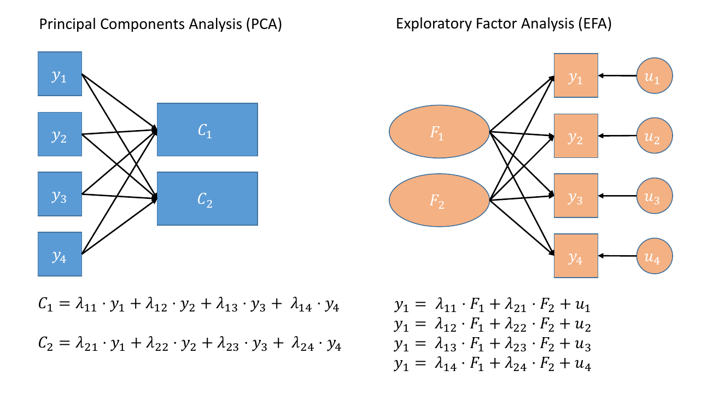
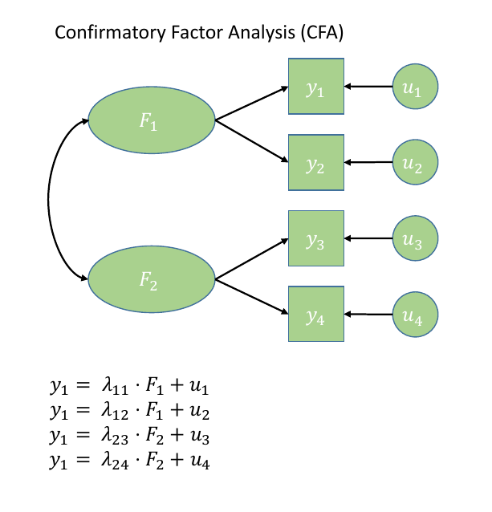
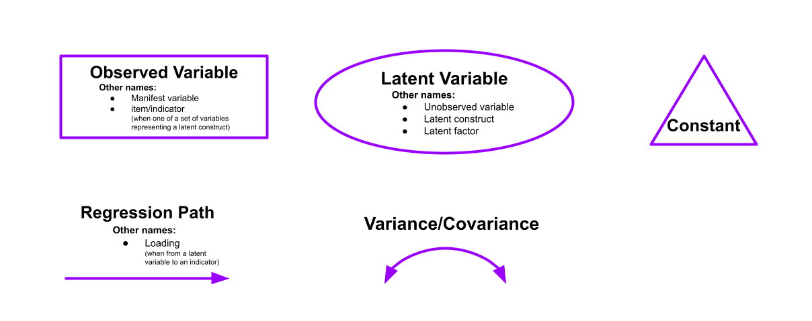
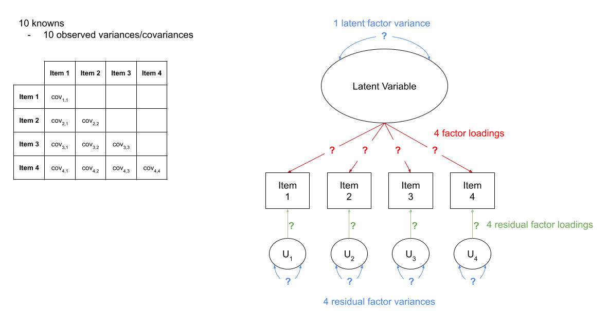

```{r setup, include=FALSE}
source('assets/setup.R')
options(digits=3)
library(pander)
panderOptions('round', 3)
panderOptions('keep.trailing.zeros', TRUE)
```


```{r cfadatasim, echo=F, eval=F}
set.seed(229)
nF=2 #number of factors
nV=10 #number of variables

Psi<-matrix(nrow=nF, ncol=nF,     # the nF by nF factor correlation matrix
            data=c(1.00,0.20,
                   0.20,1.00),byrow=T)


Lambda<-matrix(nrow=nV, ncol=nF,  # the nV by nF factor loading matrix
               #F1    F2
               data=c(0.65, 0.10, # item1
                      0.73, 0.08, # item2
                      0.65, 0.06, # item3
                      0.65, 0.10, # item4
                      0.84, 0.04, # item5
                      0.01, 0.65, # item6
                      0.10, 0.88, # item7
                      0.03, 0.92, #item8
                      0.10, 0.67, #item9
                      0.02, 0.65), #item10
               byrow=T)


Theta<-matrix(nrow=nV, ncol=nV, # the nV by nV residual matrix
              #item1 item2 item3 item4 item5 item6 item7 item8 item9 item10
              data=c(1-0.65^2-0.10^2, 0.00, 0.00, 0.00, 0.00, 0.00, 0.00, 0.00, 0.00, 0.00, #item1
                     0.00, 1-0.73^2-0.08^2, 0.00, 0.00, 0.00, 0.00, 0.00, 0.00, 0.00, 0.00, #item2
                     0.00, 0.00, 1-0.65^2-0.06^2, 0.00, 0.00, 0.00, 0.00, 0.00, 0.00, 0.00, #item3
                     0.00, 0.00, 0.00, 1-0.65^2-0.10^2, 0.00, 0.00, 0.00, 0.00, 0.00, 0.00, #item4
                     0.00, 0.00, 0.00, 0.00, 1-0.84^2-0.04^2, 0.00, 0.00, 0.00, 0.00, 0.00, #item5
                     0.00, 0.00, 0.00, 0.00, 0.00, 1-0.01^2-0.65^2, 0.00, 0.00, 0.00, 0.00, #item6
                     0.00, 0.00, 0.00, 0.00, 0.00, 0.00, 1-0.10^2-0.88^2, 0.00, 0.00, 0.00, #item7
                     0.00, 0.00, 0.00, 0.00, 0.00, 0.00, 0.00, 1-0.03^2-0.92^2, 0.00, 0.00, #item8
                     0.00, 0.00, 0.00, 0.00, 0.00, 0.00, 0.00, 0.00, 1-0.10^2-0.67^2, 0.00, #item9
                     0.00, 0.00, 0.00, 0.00, 0.00, 0.00, 0.00, 0.00, 0.00, 1-0.02^2-0.65^2), #item10
              byrow=T) 


#compute correlation matrix from Psi, Lambda and Theta

Sigma<-Lambda%*%Psi%*%t(Lambda)+Theta
#simulate data
df<-as.data.frame(MASS::mvrnorm(n=600, mu=rep(0,10), Sigma=Sigma))
names(df)<-c('item1','item2','item3','item4','item5','item6','item7','item8','item9','item10')
```


:::lo
__Recap__  

Last week we learned about two methods of data reduction: Principal Components Analysis (PCA) and Factor Analysis. 

In brief, PCA aims to summarise a set of measured variables into a set of uncorrelated (orthogonal) components, which are linear combinations (a weighted average) of the measured variables. Factor analysis, on the other hand, assumes that the relationships between a set of measured variables can be explained by a number of underlying latent factors.  

:::statbox
__PCA vs FA__  

- Principal Component Analysis extracts _composites_ of our observed variables. 
- Factor Analysis is a model that predicts our observed variables from some _theoretical latent variables_ (factors). 
- If you just want to reduce a set of correlated observed variables down to a smaller number, conduct PCA. If you assume some underlying construct(s) is ann underlying cause of your observed variables, and it is these constructs you are interested in, then conduct FA. 

```{r pcafa2, echo=FALSE, fig.cap="Path diagrams for PCA and FA.<br>Note how the directions of the arrows in are different between PCA and FA - in PCA, each component $C_i$ is the weighted combination of the observed variables $y_1, ...,y_n$, whereas in FA, each measured variable $y_i$ is seen as generated by some latent factor $F$ plus some unexplained variance $u_i$", out.width="1000px"}

```

:::

:::


# Introducing CFA  

When we conduct _Exploratory_ Factor Analysis (EFA), we tend to start with no hypothesis about either the number of latent factors or about the specific relationships between latent factors and measured variables (the *factor structure*). All variables load onto all factors, and often a transformation method (e.g., rotation) is applied to make the results more easily interpretable. Often in psychology we use scales that we already consider to be valid measures of some underlying construct, and we have a theoretical model that we wish to test. **Confirmatory Factor Analysis (CFA)** is a more *hypothesis-driven* form of factor analysis, which requires us to prespecfiy all aspects of our model: we need to have some a priori sense of how many factors that exist, which items a related to which factors, etc. 

CFA is almost always used when developing scales, because it allows us to examine the underlying structure of our measure (e.g., questionnaires). It is also useful when investigating the convergent and disciminant validity of a theoretical construct (for instance, we might expect a measure of anxiety to positively relate to ('converge' with) a measure of depression, and to differ ('discriminate') from a measure of general happiness.  

When we have clear _a priori_ hypotheses about relationships between measured variables and latent factors, CFA imposes a specific factor structure on the data, where we pick and choose the paths (arrows) that we want to estimate, and leave out ones which our theory suggests are not present (as in Figure \@ref(fig:figcfa)). It is important to note, that by excluding a specific path, our model is asserting that that specific relationship is 0 (a bit like if we leave out a predictor from our multiple regression model: `y~w+x` assumes that `y~z` is 0). 

```{r figcfa, echo=FALSE, fig.cap="Path diagram for CFA", out.height="500px"}

```
:::yellow  

The purpose of CFA can be seen of as twofold: 

1. To obtain parameter estimates (i.e., factor loadings, variances and covariances of factors, residual variances of measured variables)  
2. To assess whether the model provides a good fit to the data.  

:::

:::frame
__CFA as Structural Equation Modelling__  

CFA is a specific form of a Structural Equation Model (SEM) in which we are defining a (number of) factor structures. SEM is going to be the focus of weeks 10 and 11 of this course. In essence, SEM is a framework in which we can test our theoretical models and hypotheses.   

You might be tempted to think "isn't that what we've been doing already!?" and you would be right. However, SEM offers a huge amount more flexibility in the questions we can ask, and the types of theoretical model we can think about. In the multiple regression world, were restricted to focusing on one outcome variable, and examining the variance explained in that variable by some predictor variables. In SEM, our theoretical model may have multiple outcome variables, mediating paths ("z affects x which in turn affects y"), latent factors etc.  

Sometimes the easiest way into thinking about things in the SEM framework is to draw all your variables on a whiteboard, draw any latent constructs you believe they measure, and then connect them all up with arrows according to your theoretical model. Sound familiar? Figure \@ref(fig:figcfa) shows a CFA model represented as a SEM diagram! 

:::

# Introducing **lavaan**  

For the remaining weeks of the course, we're going to rely heavily on the **lavaan** (**La**tent **Va**riable **An**alysis) package. 
This is the main package in R for fitting structural equation mdoels, and there is a huge scope of what we can do with it.  

:::frame
__operators in lavaan__  
  
The first thing to get to grips with is the various new operators which __lavaan__ allows us to use.   

Our old multiple regression formula in R was specified as `y ~ x1 + x2 + x3 + ... `.  
In lavaan, we continue to fit regressions using the `~` symbol, but we can also specify the construction of latent variables using `=~` and residual variances & covariances using `~~`.  

|  formula type|  operator|  memonic|
|--:|--:|--:|
|  latent variable definition|  `=~`|  "is measured by"|
|  regression|  `~`|  "is regressed on"|
|  (residual) (co)variance |  `~~`|  "is correlated with"|
|  intercept |  `~1`|  "intercept"|

(from https://lavaan.ugent.be/tutorial/syntax1.html) 

:::
:::frame
__Fitting models with lavaan__

In practice, fitting models in lavaan tends to be a little different from things like `lm()` and `(g)lmer()`. Instead of including the model formula *inside* the fit function (e.g., `lm(y ~ x1 + x2, data = df)`), we tend to do it in a step-by-step process. This is because as our models become more complex, our formulas can pretty long!   

In lavaan, it is typical to write the model as a character string (e.g. `model <- "y ~ x1 + x2"`) and then we pass that formula along with the data to the relevant __lavaan__ function such as `cfa()` or `sem()`, giving it the formula and the data: `cfa(model, data = mydata)`.  

1. Specify the model:  
    ```{r eval=F}
    mymodel <- "
      factor1 =~ item1 + item2 + .....
      factor2 =~ item6 + ...... 
      ...
      ..
    "
    ```
2. Estimate the model:
    ```{r eval=F}
    mymodelfit <- cfa(mymodel, data = mydata)
    ```
3. Examine the fitted model: 
    ```{r eval=F}
    summary(mymodelfit)
    ```

:::

`r optbegin("Optional: Fitting a multiple regression model with lavaan",olabel=FALSE,toggle=params$TOGGLE)`  
You can see a multiple regression fitted with lavaan here, we define the model as a character string, and then we pass that to the relevant lavaan function, such as `cfa()` or in this case `sem()` (we'll use `sem()` more in the weeks to come).  

```{r message=FALSE, warning=FALSE}
library(tidyverse)
library(lavaan)
toys_read <- read_csv("https://uoepsy.github.io/data/toyexample.csv") 

# the lm() way
mreg_lm <- lm(R_AGE~hrs_week + age, toys_read)

# setting up the model for SEM
mreg_model <- "
    #regression
    R_AGE ~ 1 + hrs_week + age
"
mreg_sem <- sem(mreg_model, data=toys_read)
```

These are the coefficients from our `lm()` model:
```{r}
coefficients(mreg_lm)
```

And you can see the estimated parameters are the same for our `sem()` model!
```{r}
summary(mreg_sem)
```
`r optend()`

# Thinking in diagrams  

In structural equation modeling, it is common to think about our theories in terms of the connections between variables drawn on a whiteboard. By representing a theory as paths to and from different variables, we open up a whole new way of 'modelling' the world around us.  These path diagrams have different shapes to denote the covariances, regressions, observed variables and latent variables.  

- **Observed variables** are represented by squares or rectangles. These are the named variables of interest which exist in our dataset - i.e. the ones which we have measured directly. 
- **Latent variables** are represented as ovals/ellipses or circles.^[Note two things:  
Firstly, in a diagram of Principal Components Analysis, the components are considered to be a reduced expression of the observed variables, and are represented by squares. The arrows go from the measured variables to the components. In Factor Analysis, the latent factors are represented by circles, and the arrows go from the factor to the measured variables, reflecting the idea that the observations on our measured variables are taken to be the result of some underlying construct.  
Secondly, in some diagrams you will see the uniqueness of measured variables as a circle. Similarly, the error term in a multiple regression model might be represented this way, as it reflects the variance left unexplained by the predictors, and as such is not directly measured.]   
- **Covariances** are represented by double-headed arrows. In many diagrams these are curved. 
- **Regressions** are shown by single headed arrows (e.g., an arrow from $x$ to $y$ for the path $y~x$). **Factor loadings** are also regression paths.   
Recall that specifying a factor structure is simply to say that some measured variables $y_i$ are each regressed onto some unmeasured factor(s) - $y = \lambda \cdot F + u$ looks an awful lot like $y = \beta \cdot x + \epsilon$!!).  

```{r echo=FALSE}

```

<!-- :::yellow -->
<!-- **New terminology!**   -->

<!-- - **Exogenous variables** are a bit like what we have been describing with words like "independent variable" or "predictor". In a SEM diagram, they have no paths coming from other variables in the system, but have paths *going to* other variables.   -->
<!-- - **Endogenous variables** are more like the "outcome"/"dependent"/"response" variables we are used to. They have some path coming from another variable in the system (and may also - but not necessarily - have paths going out from them).   -->

<!-- ::: -->
:::rtip
__Making path diagrams in R__  

There are a couple of packages which can create visual diagrams of structural equation models. **semPlot** and **tidySEM**.  

The **semPlot** package contains the function `semPaths()`, which is well established and works "out of the box" but is harder to edit. Alternatively, you can try your hand at a newer package which promises more customisable features for SEM diagrams called [**tidySEM**](https://cjvanlissa.github.io/tidySEM/articles/Plotting_graphs.html). Often, if we want to include a SEM diagram in a report the raw output from `semPaths()` would not usually meet publication standards, and instead we tend to draw them in programs like powerpoint!  

:::

`r optbegin("Optional: visualising a multiple regression model as a path diagram", olabel=FALSE, toggle=params$TOGGLE)`
```{r}
library(semPlot)
semPaths(mreg_sem, whatLabels = "est", intercepts = F)

library(tidySEM)
graph_sem(mreg_sem, nodes = get_nodes(mreg_sem))
```
`r optend()`

# Exercises: One factor model  

:::frame
__Data: Conduct Problems Dataset2__  

Last week we conducted an exploratory factor analysis of a dataset to try and identify an optimal factor structure for a new measure of conduct (i.e., antisocial behavioural) problems. This week, we'll conduct some confirmatory factor analyses (CFA) of the same inventory, using some new data collected by the researchers from n=600 adolescents.

The questionnaire items referred to the following 10 behaviours:

- item 1-	Stealing
- item 2-	Lying
- item 3-	Skipping school
- item 4-	Vandalism
- item 5-	Breaking curfew
- item 6-	Threatening others
- item 7-	Bullying
- item 8-	Spreading malicious rumours
- item 9-	Using a weapon 
- item 10 - Fighting

The data is available as a **.csv** at [https://uoepsy.github.io/data/conduct_problems_2.csv](https://uoepsy.github.io/data/conduct_problems_2.csv) 

:::


`r qbegin("A1")`
Read in the new data, and construct a correlation matrix. Maybe create a visualisation of the correlation matrix?  

`r qend()` 
`r solbegin(show=params$SHOW_SOLS, toggle=params$TOGGLE)`
```{r}
df <- read.csv("https://uoepsy.github.io/data/conduct_problems_2.csv")
cor(df)
pheatmap::pheatmap(cor(df))
```

`r solend()`

`r qbegin("A2")`
Using lavaan syntax, specify a model in which all 10 items load on one latent variable.  
Do not estimate the model yet, simply specify it in a character string, in preparation to fit it with the `cfa()` function.  

*Hint:* Remember that to specify items loading on a latent variable we use the `=~` operator. The latent variables goes on the left hand side and the list of indicators (i.e., items used to measure the latent variable) go on the right hand side separated by '+'. You can name the latent variable whatever you like. 
`r qend()` 
`r solbegin(show=params$SHOW_SOLS, toggle=params$TOGGLE)`
```{r model specification}
model1<-'CP=~item1+item2+item3+item4+item5+item6+item7+item8+item9+item10'
```
`r solend()`

`r qbegin("A3")`
We're going to use the `cfa()` function to fit our model.  

It is  not necessary to refer to **ALL** of our CFA parameters in your model specification function to estimate our model, as some parameters are estimated or fixed by default when you estimate the model with the `cfa()` function. In this case, the residual variances and latent factor variances are missing because they are estimated by default.  

The default scaling constraint/identification constraints imposed when using the `cfa()` function are to fix the loading of the first item of each latent variable to 1. We can override this by setting `std.lv=TRUE`, which will instead scale the latent variables by fixing them to 1.  

Estimate your model using the `cfa`()` function from the lavaan package. Scale your latent variable by fixing the latent variable variance to 1.   

It is helpful to save the results of `cfa()` to a new object so that we can later inspect that object (to look at the model fit and parameter estimates).  
`r qend()` 
`r solbegin(show=params$SHOW_SOLS, toggle=params$TOGGLE)`
```{r model estimation}
model1.est<-cfa(model1, data=df, std.lv = TRUE)
```
`r solend()`

# Model Fit & Degrees of Freedom

One of the crucial things to realise when you're learning about these methods is that there are certain terms (things like "model fit" and "degrees of freedom") which have quite different meanings to those you are likely used to.  

:::frame
__"Model Fit": Same name, different idea__  

You'll have heard the term "model fit" many times since september. However, there is a crucial difference in what it means when it is used in the SEM framework.  

In things like multiple regression, we have been using "model fit" to be the measure of "how much variance can we explain in y with our set of predictors?".  

In SEM, examining "model fit" is more like asking "how well does our model reproduce the characteristics of the data that we observed?". If you think of the characteristics of our data being represented by a covariance matrix, then we might think of "model fit" as being "how well can our model reproduce our observed covariance matrix?".   

In regression, we could only talk about model fit if we had more than 2 datapoints. This is because there is only one possible line that we can fit between 2 datapoints, and this line explains _all_ of the variance in the outcome variable (it uses up all our 2 degrees of freedom to estimate 1. the intercept and 2. the slope).   

The logic is the same for model fit in SEM (we need more degrees of freedom than we have parameters that are estimated), but we need to remember that we are now concerned with the covariance matrix, rather than with our raw observations. So we need to be estimating fewer paths (e.g. parameters) than there are variances/covariances in our covariance matrix. This is because if we just fit paths between all our variables, then our model would be able to reproduce the data perfectly (just like a regression with 2 datapoints has an $R^2$ of 1).  

:::

:::frame
__Degrees of Freedom in SEM__  

The degrees of freedom for a Structural Equation Model correspond to the number of *knowns* (observed covariances/variances from our sample) minus the number of *unknowns* (parameters to be estimated by the model). A model is only able to be estimated if it has at least 0 degrees of freedom (if there are as many knowns as unknowns). A model with 0 degrees of freedom is termed **just-identified** (sometimes called "saturated").  
**under-** and **over-** identified models correspond to those with $<0$ and $>0$ degrees of freedom respectively. 

An example of a *just-identified* model is the multiple regression model! In multiple regression, everything is allowed to vary with everything else, which means that there is a unique solution for all of the model's parameters because there are *as many paths as there are observed covariances*. This means that _in the SEM world_, a multiple regression model is "just-identified". 

`r optbegin("demonstration", olabel=FALSE, toggle=params$TOGGLE)`

If I have two predictors and one outcome variable, then there are 6 variances and covariances available. For instance: 
```{r}
cov(toys_read %>% select(R_AGE, hrs_week, age))
```
The multiple regression model will estimate the two variances of the predictors, their covariance, the two paths from each predictor to the outcome, and the error variance. This makes up 6 estimated parameters - which is exactly how many known covariances there are.
```{r echo=FALSE, out.width="350px"}
graph_sem(mreg_sem, 
          nodes = get_nodes(mreg_sem))
```

`r optend()`

:::statbox
**How many knowns are there?**   

The number of known covariances in a set of $k$ observed variables is equal to $\frac{k \cdot (k+1)}{2}$. 

:::

Remember, in SEM the visualisations can play a key part - draw all our variables (both observed and latent) on the whiteboard; connect them up according to our theoretical model; we can then count the number of paths (arrows) and determine whether the $\text{number of knowns} > \text{number of unknowns}$. We can reduce the number of unknowns by fixing parameters to be specific values. 

:::statbox

By constraining some estimated parameter to be some specific value, we free-up a degree of freedom! For instance "the correlation between x1 and x2 is equal to 0.7 ($r_{x_1x_2} = .07$)". This would turn a previously estimated parameter into a fixed parameter, and this gains us the prize of a lovely degree of freedom!  

**By removing a path altogether, we are constraining it to be zero.**  

:::

For instance, in Figure \@ref(fig:df1) we can see a the model of a latent factor loading on to 4 items. The number of paths to be estimated here is greater than the number of known covariances. However, we can get around this by *fixing certain parameters to be specific values*. In Figure \@ref(fig:df2), the latent factor variance is set at 1, and the residual factor loadings are also set to 1.  
This has the additional benefit of making our latent factor have some defining features. Because we don't actually measure the latent variable (it is a hypothetical construct), it doesn't really have any intrinsic 'scale'. When we fix the variance to be 1, we are providing some property (its variance) we create a reference from which the other paths to/from the variable are in relation to. A common alternative is to fix the factor loading of the first item to be 1 (see Figure \@ref(fig:df3)).

```{r df1, echo=FALSE, fig.cap="A four item factor structure. There are 10 knowns, but 13 parameters"}

```

```{r df2, echo=FALSE, fig.cap="A four item factor structure. By fixing 5 of these parameters to be equal to 1, we gain back degrees of freedom and make our model identifiable"}
knitr::include_graphics("images/pcaefa/df2.png")
```
```{r df3, echo=FALSE, fig.cap="A four item factor structure. The 'marker method' fixes the first factor loading to be 1, leaving the factor variance free to be estimated."}

```

:::

:::frame  
__Fit indices ~~Rules of Thumb~~ Cut-offs that people often use__

There are too many different metrics that people use to examine model fit in SEM, and there's lots of controversy over the various merits and disadvantages and proposed cutoffs of each method.  

The main four fit indices are RMSEA, SRMR, CFI and TLI. We'll look more into these in a couple of weeks, and we strongly encourage you to take a look at the accompanying reading on CFA which is posted on Learn, as this explains some of the more common measures. Additionally, there are many resources online, for instance [David Kenny's page on measuring model fit](http://www.davidakenny.net/cm/fit.htm).  

Rules of thumb:  

- Smaller values of RMSEA and SRMR mean better fit while larger values of CFI and TLI mean better fit. 
- If $\textrm{RMSEA} < .05$, $\textrm{SRMR} < .05$, $\textrm{TLI} > .95$ and $\textrm{CFI} > .95$ then the model fits well.   

:::

# Exercises: Two factor model  

`r qbegin("B1")`
Examine the global fit of your one factor model. Does it fit well? (To obtain the global fit measures, we can use the `summary()` function to inspect our estimated model, setting `fit.measures=TRUE`).  

`r qend()` 
`r solbegin(show=params$SHOW_SOLS, toggle=params$TOGGLE)`

```{r global fit}
summary(model1.est, fit.measures=TRUE)
```

:::int
According to conventionally accepted criteria for RMSEA, SRMR, TLI and CFI, the model fits poorly. 
:::
`r solend()`

`r qbegin("B2")`
Now let's try a different model. 
Specify a CFA model with two correlated latent factors.  
Consider items 1 to 5 as indicators of the first latent factor and items 6 to 10 as indicators of the second latent factor.  

Specifying models this way requires separating the different (sets of) paths onto new lines.  
So for this model you will want something with 3 lines.  
You can add comments in as well, which will help!  
The first one below is filled in for you: 
```{r eval=FALSE}
model2 <- '
  # latent factor one "is measured by" items 1 to 5
  LV1 =~ item1 + item2 + item3 + item4 + item5
  # latent factor two "is measured by" items 6 to 10
  ...
  # latent factor one is correlated with latent factor two
  ...
'
```

:::rtip
**Strings split over lines making R get stuck?**  

If you have your cursor on the first of a multi-line character string, and you press ctrl+enter in order to run it (i.e., send it down to the console), then R will not automatically run the next line. It will give you a little blue `+` in the console, and force you to run it line by line.  

If you are seeing the little blue `+` then you can press the escape key to cancel the command.  

It might be easier to highlight the entire model and run it all at once. 

```{r echo=FALSE}
knitr::include_graphics("images/pcaefa/chrstrrun.gif")
```

:::

`r qend()` 
`r solbegin(show=params$SHOW_SOLS, toggle=params$TOGGLE)`
We can specify the model as below. 

```{r two factor model specification}
model2<-'
    LV1=~item1+item2+item3+item4+item5
    LV2=~item6+item7+item8+item9+item10
    LV1~~LV2
'
```

We now define two latent variables 'Lv1' and 'Lv2' using the '=~' operator. We also introduce a new operator: '~~' in order to specify the covariance between the two latent variables. 
`r solend()`


`r qbegin("B3")`
Estimate this model using `cfa()`.  
Scale the latent variables using a reference indicator (rather than fixing the variance).  
Does the model fit well?
`r qend()` 
`r solbegin(show=params$SHOW_SOLS, toggle=params$TOGGLE)`
`cfa()` uses a reference indicator to scale the latent variables by default, so we only need to specify the name of the object with the model syntax and the name of the dataset.  

```{r estimate 2-factor model}
model2.est<-cfa(model2, data=df)
summary(model2.est, fit.measures=T)
```

This model fits well according to RMSEA, SRMR, CFI and TLI. The $\chi^2$ value is significant but we don't need to worry about this because the $\chi^2$  test  has a strong tendency to reject even trivially mis-specified models (more on this next week).  
`r solend()`

`r qbegin("B4")`
Are there any areas of __local__ mis-fit?  

By "local" misfit, we mean specific paths in the model that we maybe should have included, but didn't. We can look for these using the `modindices()` function. This will give us the expected improvement in the model fit if a parameter was added, and the expected parameter change associated with the addition of the parameter (an estimate of what the parameter estimate would be if the parameter was included in the model).  
`r qend()` 
`r solbegin(show=params$SHOW_SOLS, toggle=params$TOGGLE)`

```{r modification indices}
modindices(model2.est, sort=T)
```

:::int

While the modification indices suggest that the model could be improved with the addition of parameters, none of the expected parameter changes are very large. If we included any additonal parameters here it is likely we would be capitalising on chance. We would also have to consider whether we could justify their inclusion on substantive grounds, i.e., we would ask ourselves 'does the addition of the parameter makes sense given our background knowledge of the construct?'.

:::

`r solend()`

`r qbegin("B5")`
Take a look at the parameter estimates, are all of your loadings satisfactory? Which items are the best measures of the underlying latent variables?  

**Hint:** It may help to look at the standardised parameter estimates, which we can do by using `summary(model, standardized = TRUE)`.  
Typically we would want standardised loadings to be $>|.3|$ (there is no consensus on this, sometimes you will see $>|.4|$ suggested, other times $>|.6|$!)

`r qend()` 
`r solbegin(show=params$SHOW_SOLS, toggle=params$TOGGLE)`
```{r stand ests}
summary(model2.est, standardized=T)
```

We can see that all loadings are statistically significant and all standardised loadings are >|.3|. This is good as it suggests all our items measure the relevant latent variable reasonably well. We can identify the 'best' indicators of our latent constructs according to those with the highest standardised loadings. We must, however, be aware that item loadings are model-specific: if we changed the model (e.g., the number of factors or which items we included) the loadings could change and so would our interpretation of the latent variables.
`r solend()`

`r qbegin("B6")`
Now it's time to get R to draw some diagrams of our model for us!  
Using R, represent the model, including the standardised parameters as a SEM diagram.  

You can either use the `semPaths()` functions from the **semPlot** package, or you can try your hand at a newer package which promises more customisable features for SEM diagrams called [**tidySEM**](https://cjvanlissa.github.io/tidySEM/articles/Plotting_graphs.html).  

(often, if we want to include a SEM diagram in a report the raw output from `semPaths()` would not usually meet publication standards, and instead we tend to draw them in programs like powerpoint!)

`r qend()` 
`r solbegin(show=params$SHOW_SOLS, toggle=params$TOGGLE)`
In the `semPaths()` function, we can include the unstandardised estimates by setting `what='est'` and the standardised estimates by setting `what='stand'`.

```{r SEM diagram}
library(semPlot)
semPaths(model2.est, what='stand')
```
```{r}
library(tidySEM)
lay = get_layout(rep(NA, 3), "LV1", rep(NA,2),"LV2", rep(NA,3),
           paste0("item",1:10), rows = 2)
graph_sem(model2.est, layout = lay)
```

`r solend()`

`r qbegin("B7")`
Write a short paragraph summarising the method and results of the two factor model.  

**Remember:** The main principle behind reporting any analysis is that you should be as  transparent as possible (e.g., reporting any model modifications made) and a reader should be able to reproduce your analysis based on your description.  

`r qend()` 
`r solbegin(show=params$SHOW_SOLS, toggle=params$TOGGLE)`

:::int 

A two-factor model was tested. Items 1-5 loaded on a 'non-aggressive conduct problems' factor and items 6-10 loaded on an 'aggression' factor and these factors were allowed to correlate. Scaling and identification were achieved by fixing the loading of item 1 on the non-aggressive conduct problems factor and item 6 on the aggression factor to 1. The model was estimated using maximum likelihood estimation. The model fit well with CFI=.99, TLI=0.99,  RMSEA=.04, and SRMR=.04 (Hu & Bentler, 1999).  All loadings were statistically significant and >|.3| on the standardised scale. Modification indices and expected parameter changes were inspected but no modifications were made because no expected parameter changes were judged large enough to merit the inclusion of additional parameters given that there was little theoretical rationale for their inclusion. Overall, therefore, a two-factor oblique model was supported for the conduct problems items. The correlation between the factors was r=.38 (p<.001).

```{r echo=FALSE, message = FALSE, warning=FALSE}
invisible(summary(model2.est)$PE) %>% as_tibble() %>% 
  mutate(parameter = paste0(lhs, op, rhs)) %>%
  mutate_if(is.numeric, ~round(.,3)) %>% 
  dplyr::select(-lhs, -op, -rhs, -exo) %>%
  dplyr::relocate(parameter) %>%
  dplyr::mutate(pvalue = ifelse(pvalue == 0, "<.001",NA)) %>%
  knitr::kable(.)
```

:::

:::frame

When you write up a CFA for a report, you should make sure to include the parameter estimates. This can be in the form of a table with the unstandardised loadings and factor covariances, their standard errors, p-values, and corresponding standardised values. 

Note: according to APA style, you should include a leading zero when a parameter can take values out of the 0-1 range (e.g., SD=0.99) but you should not include a leading zero when a parameter can only take values in the 0-1 range (e.g., r=.5). This is why we have TLI=0.99 but CFI=.99. The former can technically (though rarely does) take values >1 while the latter only takes values between 0 and 1.

:::
`r solend()`

<!-- Formatting -->

<div class="tocify-extend-page" data-unique="tocify-extend-page" style="height: 0;"></div>

