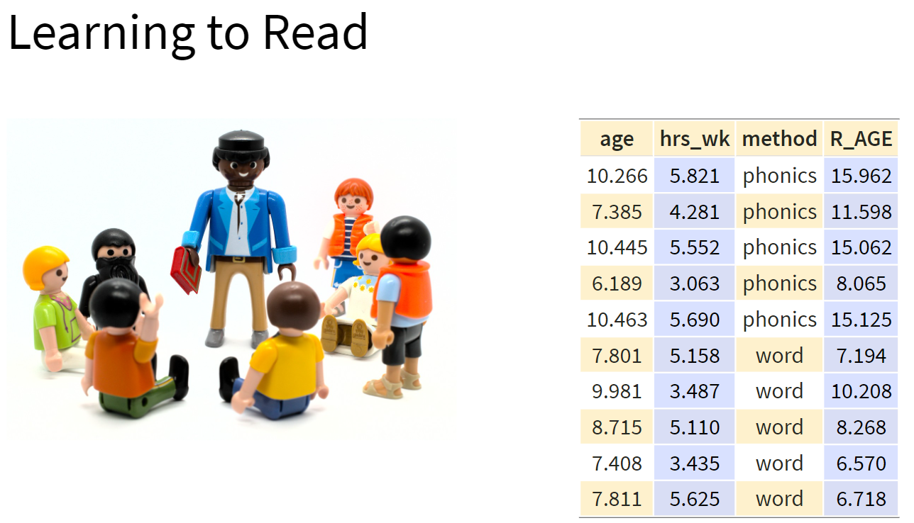
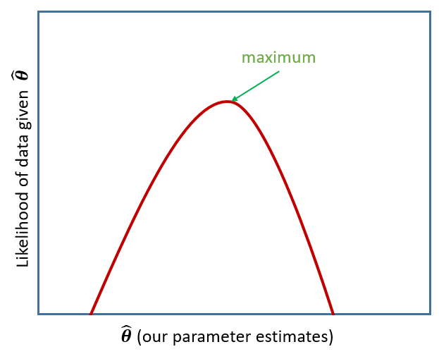
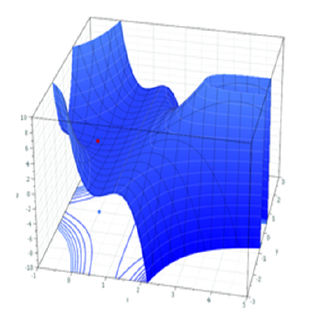
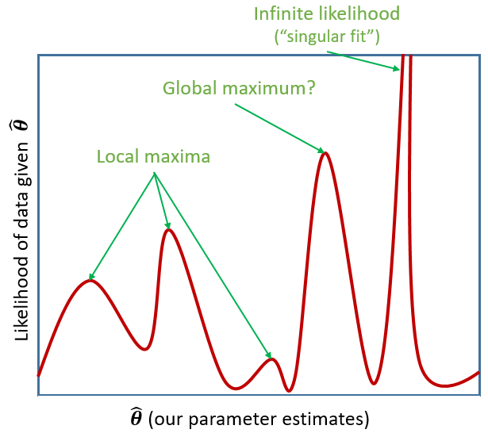

```{r setup, include=FALSE}
source('assets/setup.R')
library(tidyverse)
library(patchwork)
```

:::blue
**Preliminaries**  
 
1. Open Rstudio, and **create a new project for this course!!** 
2. Create a new R Script or RMarkdown document (whichever you prefer working with) and give it a title for this week. 

**Some extra background reading**  

+ [Winter, 2013](https://arxiv.org/abs/1308.5499)  
+ [Brauer & Curtin, 2018](http://dx.doi.org/10.1037/met0000159),  [(pdf)](https://dionysus.psych.wisc.edu/LabPubs/BrauerM2018a.pdf)  
+ [Luke, 2017](https://doi.org/10.3758/s13428-016-0809-y)  
:::

:::frame

**A Note on terminology**

The methods we're going to learn about in the first five weeks of this course are known by lots of different names: "multilevel models"; "hierarchical linear models"; "mixed-effect models"; "mixed models"; "nested data models"; "random coefficient models"; "random-effects models"; "random parameter models"... and so on).   

What the idea boils down to is that **model parameters vary at more than one level.** This week, we're going to explore what that means.  

Throughout this course, we will tend to use the terms "mixed effect model", "linear mixed model (LMM)" and "multilevel model (MLM)" interchangeably. 
:::


# New Packages!  
:::rtip

These are the main packages we're going to use in this block. It might make sense to install them now if you do not have them already (note, the rstudio.ppls.ed.ac.uk server already has `lme4` and `tidyverse` installed for you).  

+ __tidyverse__ : for organising data  
+ __lme4__ : for fitting generalised linear mixed effects models
+ __broom.mixed__ : tidying methods for mixed models
+ __effects__ : for tabulating and graphing effects in linear models
+ __sjPlot__ : for plotting models
+ __lmeresampler__ : for bootstrapping!
+ __ICC__ : for quickly calculating intraclass correlation coefficient
+ __HLMdiag__ : for examining case diagnostics at multiple levels


```{r eval=FALSE}
install.packages(c("tidyverse","ICC","lme4","effects","broom.mixed","sjPlot","HLMdiag"))
# the lmeresampler package has had some recent updates. better to install the most recent version:
install.packages("devtools")
devtools::install_github("aloy/lmeresampler")
```

:::

```{r include=FALSE}
library(tidyverse)
library(lme4)
library(broom.mixed)
library(effects)
```


# Linear model refresh   

:::frame
__Data: New Toys!__  
  
Recall the example from last semesters' USMR course, where the lectures explored linear regression with a toy dataset of how practice influences the reading age of Playmobil characters:  

```{r echo=FALSE, fig.cap = "[USMR Week 8 Lecture](https://uoepsy.github.io/usmr/lectures/lecture_7.html#29)", out.width="300px",fig.align="center"}

```
  
We're going to now broaden our scope to the investigation of how practice affects reading age for **all** toys, (not just Playmobil characters).  
You can find a dataset at https://uoepsy.github.io/data/toyexample.csv containing information on 132 different toy figures. This time, however, they come from a selection of different families/types of toy. You can see the variables in the table below^[Image sources:<br>http://tophatsasquatch.com/2012-tmnt-classics-action-figures/<br>https://www.dezeen.com/2016/02/01/barbie-dolls-fashionista-collection-mattel-new-body-types/<br>https://www.wish.com/product/5da9bc544ab36314cfa7f70c<br>https://www.worldwideshoppingmall.co.uk/toys/jumbo-farm-animals.asp<br>https://www.overstock.com/Sports-Toys/NJ-Croce-Scooby-Doo-5pc.-Bendable-Figure-Set-with-Scooby-Doo-Shaggy-Daphne-Velma-and-Fred/28534567/product.html<br>https://tvtropes.org/pmwiki/pmwiki.php/Toys/Furby<br>https://www.fun.com/toy-story-4-figure-4-pack.html<br>https://www.johnlewis.com/lego-minifigures-71027-series-20-pack/p5079461].
<br>
<div style="display:inline-block; width: 45%;vertical-align: middle;">
```{r echo=FALSE, out.width="300px",fig.align="center"}
knitr::include_graphics("images/intro/toys.png")
```
</div>
<div style="display:inline-block; width: 45%;vertical-align: middle;">
```{r echo=FALSE, message=FALSE,warning=FALSE}
library(gt)
toys_read <- read_csv("https://uoepsy.github.io/data/toyexample.csv")
tibble(variable=names(toys_read),
       description=c("Type of Toy","Character","Hours of practice per week","Age (in years)","Reading Age")
) %>% gt()

```
</div>

:::

:::statbox

Recall that in the course last semester we learned all about the linear regression model: 

$$
\begin{align}\\
& \text{for observation }i \\
& \color{red}{Y_i} = \color{blue}{\beta_0 \cdot{} 1 + \beta_1 \cdot{} X_{1i} \ + \ ... \ + \ \beta_p \cdot{} X_{pi}} + \varepsilon_i \\ 
\end{align}
$$

(You might be more familiar with the notation of $b$ rather than $\beta$, but they're the same thing here).  
If we wanted to write this more simply, we can express $X_1$ to $X_p$ (our predictor variables) as an $n \times p$ matrix (samplesize $\times$ parameters), and $\beta_0$ to $\beta_p$ as a vector of coefficients:

$$
\mathbf{y} = \boldsymbol{X\beta} + \boldsymbol{\varepsilon}
\quad \\
\text{where} \quad \varepsilon \sim N(0, \sigma) \text{ independently}
$$

:::


`r qbegin("A1")`
Read in the toy data from https://uoepsy.github.io/data/toyexample.csv and plot the bivariate relationship between Reading Age and Hrs per Week practice, and then fit the simple linear model: 
$$
\text{Reading Age}_i = \beta_0 + \beta_1 \cdot \text{Hours per week practice}_i + \varepsilon_i
$$
`r qend()`
`r solbegin(show=params$SHOW_SOLS, toggle=params$TOGGLE)`
```{r}
toys_read <- read_csv("https://uoepsy.github.io/data/toyexample.csv") 

ggplot(data = toys_read, aes(x = hrs_week, y = R_AGE))+
  geom_point()+
  geom_smooth(method = "lm")

simplemod <- lm(R_AGE ~ hrs_week, data = toys_read)
summary(simplemod)
```

`r solend()`

`r qbegin("A2")`
Think about the assumptions we make about our model:
$$
\text{where} \quad \varepsilon_i \sim N(0, \sigma) \text{ independently}
$$
Have we satisfied this assumption (specifically, the assumption of *independence* of errors)? 
`r qend()`

`r solbegin(show=TRUE, toggle=params$TOGGLE)`
Our model from the previous question will assume that the residuals for all toys are independent of one another. But is this a reasonable assumption that we can make? Might we not think that the Playmobil characters could be generally better at reading than the Power Rangers? Or even that ScoobyDoo figurines might be more receptive to practice than the Sock Puppets are?   

The natural grouping of the toys into their respective type introduces a level of *dependency* which we would be best to account for.  

Note that if we highlight a specific toy type in our plot, we can see that the residuals (the dashed lines) tend to be more similar to one another than they are to the other toy types:
```{r echo=FALSE}
ggplot(data = toys_read, aes(x = hrs_week, y = R_AGE))+
  geom_point(alpha=.5)+
  geom_smooth(method = "lm")+
  geom_point(data=toys_read %>% filter(toy_type=="Scooby Doo"), col="red")+
  geom_segment(data=broom::augment(simplemod)[toys_read$toy_type=="Scooby Doo",], aes(y=R_AGE,xend=hrs_week,yend=.fitted,xend=hrs_week),lty="dashed",col="red")+
  labs(subtitle="Scooby Doo Residuals")
```


`r solend()`

`r qbegin("A3")`
Try running the code below.  
```{r eval=FALSE}
ggplot(data = toys_read, aes(x=hrs_week, y=R_AGE))+
  geom_point()+
  geom_smooth(method="lm",se=FALSE)
```
Then try editing the code to include an aesthetic mapping from the type of toy to the color in the plot.  
How do your thoughts about the relationship between Reading Age and Practice change?
`r qend()`
`r solbegin(show=params$SHOW_SOLS, toggle=params$TOGGLE)`

```{r}
ggplot(data = toys_read, aes(x=hrs_week, y=R_AGE))+
  geom_point()+
  geom_smooth(method="lm",se=FALSE)
```

```{r}
ggplot(data = toys_read, aes(x=hrs_week, y=R_AGE, col=toy_type))+
  geom_point()+
  geom_smooth(method="lm",se=FALSE)
```
  
From the second plot, we see a lot of the toy types appear to have a positive relationship (practice increases reading age). There seem to be differences between toy types in both the general reading level (Scooby Doo characters can read very well), and in how practice influences reading age (for instance, the Farm Animals don't seem to improve at all with practice!). 

`r solend()`

:::frame
**Complete Pooling**  

We can consider the simple regression model (`lm(R_AGE ~ hrs_week, data = toys_read)`) to "pool" the information from all observations together. In this 'Complete Pooling' approach, we simply ignore the natural clustering of the toys, as if we were unaware of it. The problem is that this assumes the same regression line for all toy types, which might not be that appropriate:  

```{r echo=FALSE, out.width="350px", fig.align="center", fig.cap="Complete pooling can lead to bad fit for certain groups"}
ggplot(toys_read, aes(x=hrs_week, y=R_AGE))+
  geom_point(size=3, alpha=.1)+
  geom_abline(intercept = coef(simplemod)[1], slope = coef(simplemod)[2], lwd=2)+
  geom_text(inherit.aes=F,x=4.5,y=8, label="Complete Pooling Line")+
  theme(text=element_text(size=21))+
  geom_point(data = filter(toys_read, str_detect(toy_type, "Scooby|Farm")), size=3, aes(col=toy_type))
```

  
**No Pooling**  

There are various ways we could attempt to deal with the problem that our data are in groups (or "clusters"). With the tools you have learned in DAPR2, you may be tempted to try including toy type in the model as another predictor, to allow for some toy types being generally better than others:
```{r eval=FALSE}
lm(R_AGE ~ hrs_week + toy_type, data = toys_read)
```
Or even to include an interaction to allow for toy types to respond differently to practice:
```{r eval=FALSE}
lm(R_AGE ~ hrs_week * toy_type, data = toys_read)
```

This approach gets termed the "No Pooling" method, because the information from each cluster contributes *only* to an estimated parameter for that cluster, and there is no pooling of information across clusters. This is a good start, but it means that a) we are estimating *a lot* of parameters, and b) we are not necessarily estimating the parameter of interest (the *overall* effect of practice on reading age). Furthermore, we'll probably end up having high variance in the estimates at each group.  

:::

`r qbegin("A4")`
Fit a linear model which accounts for the grouping of toys into their different types, but holds the effect of practice-hours-per-week on reading age as constant across types:
```{r}
mod1 <- lm(R_AGE ~ hrs_week + toy_type, data = toys_read)
```

Can you construct a plot of the **fitted** values from this model, coloured by toy_type?  
(Hint: you might want to use the `augment()` function from the **broom** package)

`r qend()`
`r solbegin(show=params$SHOW_SOLS, toggle=params$TOGGLE)`

```{r}
library(broom)
augment(mod1) %>%
  ggplot(.,aes(x=hrs_week, y=.fitted, col=toy_type))+
  geom_line()
```
`r solend()`

`r qbegin("A5")`
What happens (to the plot, and to your parameter estimates) when you include the interaction between `toy_type` and `hrs_week`?
`r qend()`
`r solbegin(show=params$SHOW_SOLS, toggle=params$TOGGLE)`
```{r}
mod2 <- lm(R_AGE ~ hrs_week * toy_type, data = toys_read)

broom::augment(mod2) %>%
  ggplot(.,aes(x=hrs_week, y=.fitted, col=toy_type))+
  geom_line()
```
We can see now that our model is fitting a different relationship between reading age and practice for each toy type. This is good - we're going to get better estimates for different types of toy (e.g. scooby doo's reading age increases with practice, farm animals don't).  

We can see that this model provides a better fit - it results in a significant reduction in the residual sums of squares:
```{r}
anova(mod1, mod2)
```

But accounting for this heterogeneity over clusters in the effect of interest comes at the expense of not pooling information across groups to get one estimate for "the effect of practice on reading age". Additionally, these models will tend to have low statistical power because they are using fewer observations (only those within each cluster) to estimate parameters which only represent within-cluster effects.  
`r solend()`


# Introducing Multilevel Models

:::statbox 

Multilevel Models (MLMs) (or "Linear Mixed Models" (LMMs)) take the approach of allowing the groups/clusters to vary around our $\beta$ estimates. 

In the lectures, we saw this as:

$$
\begin{align}
& \text{for observation }j\text{ in group }i \\
\quad \\
& \text{Level 1:} \\
& \color{red}{y_{ij}} = \color{blue}{\beta_{0i} \cdot 1 + \beta_{1i} \cdot x_{ij}} + \varepsilon_{ij} \\
& \text{Level 2:} \\
& \color{blue}{\beta_{0i}} = \gamma_{00} + \color{orange}{\zeta_{0i}} \\
& \color{blue}{\beta_{1i}} = \gamma_{10} + \color{orange}{\zeta_{1i}} \\
\quad \\
& \text{Where:} \\
& \gamma_{00}\text{ is the population intercept, and }\color{orange}{\zeta_{0i}}\text{ is the deviation of group }i\text{ from }\gamma_{00} \\
& \gamma_{10}\text{ is the population slope, and }\color{orange}{\zeta_{1i}}\text{ is the deviation of group }i\text{ from }\gamma_{10} \\
\end{align}
$$

We are now assuming $\color{orange}{\zeta_0}$, $\color{orange}{\zeta_1}$, and $\varepsilon$ to be normally distributed with a mean of 0, and we denote their variances as $\sigma_{\color{orange}{\zeta_0}}^2$, $\sigma_{\color{orange}{\zeta_1}}^2$, $\sigma_\varepsilon^2$ respectively. 

The $\color{orange}{\zeta}$ components also get termed the "random effects" part of the model, Hence names like "random effects model", etc. 

`r optbegin("Alternative notation", toggle=params$TOGGLE)`
Many people use the symbol $u$ in place of $\zeta$.  
In various resources, you are likely to see $\alpha$ used to denote the intercept instead of $\beta_0$.  

Sometimes, you will see the levels collapsed into one equation, as it might make for more intuitive reading. This often fits with the name "mixed effects" for these models:

$$
\color{red}{y_{ij}} = (\color{blue}{\beta_0} + \color{orange}{\zeta_{0i}}) \cdot 1 + ( \color{blue}{\beta_{1}} + \color{orange}{\zeta_{1i}} ) \cdot x_{ij}  +  \varepsilon_{ij} \\
$$

And then we also have the condensed matrix form of the model, in which the Z matrix represents the grouping structure, and the $u$ (or $\zeta$) are the estimated random deviations. 
$$
\mathbf{y} = \boldsymbol{X\beta} + \boldsymbol{Zu} + \boldsymbol{\varepsilon}
$$
`r optend()`

:::

# Fitting Multilevel Models

## Introducing **lme4** 

:::rtip

We're going to use the `lme4` package, and specifically the functions `lmer()` and `glmer()`.  
"(g)lmer" here stands for "(generalised) linear mixed effects regression". 

You will have seen some use of these functions in the lectures. The broad syntax is:  
<br>
<div style="margin-left:50px;">**lmer(*formula*, REML = *logical*, data = *dataframe*)**</div>    
<br>

We write the first bit of our **formula** just the same as our old friend the normal linear model `y ~ 1 + x + x2 + ...`, where `y` is the name of our outcome variable, `1` is the intercept (which we don't have to explicitly state as it will be included anyway) and `x`, `x2` etc are the names of our explanatory variables.  

With **lme4**, we now have the addition of __random effect terms)), specified in parenthesis with the `|` operator (the vertical line | is often found to the left of the z key on QWERTY keyboards).  
We use the `|` operator to separate the parameters (intercept, slope etc.) on the LHS, from the grouping variable(s) on the RHS, by which we would like to model these parameters as varying.  

__Random Intercept__  
Let us suppose that we wish to model our intercept not as a fixed constant, but as varying randomly according to some grouping around a fixed center. 
We can such a model by allowing the intercept to vary by our grouping variable (`g` below): 

:::statbox
<center>`lmer(y ~ 1 + x + (1|g), data = df)`</center>
$$
\begin{align}
& \text{Level 1:} \\
& \color{red}{Y_{ij}} = \color{blue}{\beta_{0i} \cdot 1 + \beta_{1} \cdot X_{ij}} + \varepsilon_{ij} \\
& \text{Level 2:} \\
& \color{blue}{\beta_{0i}} = \gamma_{00} + \color{orange}{\zeta_{0i}} \\
\end{align}
$$
:::


__Random Slope__  
By extension we can also allow the effect `y~x` to vary between groups, by including the `x` on the left hand side of `|` in the random effects part of the call to `lmer()`.

:::statbox
<center>`lmer(y ~ 1 + x + (1 + x |g), data = df)`</center>
$$
\begin{align}
& \text{Level 1:} \\
& \color{red}{y_{ij}} = \color{blue}{\beta_{0i} \cdot 1 + \beta_{1i} \cdot x_{ij}} + \varepsilon_{ij} \\
& \text{Level 2:} \\
& \color{blue}{\beta_{0i}} = \gamma_{00} + \color{orange}{\zeta_{0i}} \\
& \color{blue}{\beta_{1i}} = \gamma_{10} + \color{orange}{\zeta_{1i}} \\
\end{align}
$$
:::
:::


## Estimation

### Maximum Likelihood (ML)  

Remember back to [Week 10 of USMR](https://uoepsy.github.io/usmr/labs/09_glm.html#Introducing_GLM), when we introduced the generalised linear model (GLM) we briefly discussed **Maximum likelihood** in an explanation of how models are fitted.  
  
The key idea of *maximum likelihood estimation* (MLE) is that we (well, the computer) iteratively finds the set of estimates for our model which it considers to best reproduce our observed data. Recall our simple linear regression model of how practice (hrs per week) affects reading age: 
$$
\color{red}{ReadingAge_i} = \color{blue}{\beta_0 \cdot{} 1 + \beta_1 \cdot{} Practice_{i}} + \varepsilon_i
$$
There are values of $\beta_0$ and $\beta_1$ and $\sigma_\varepsilon$ which maximise the probability of observing the data that we have. For linear regression, these we obtained these same values a different way, via minimising the sums of squares. And we saw that this is not possible for more complex models (e.g., logistic), which is where we turn to MLE.  

:::statbox
To read about the subtle difference between "likelihood" and "probability", you can find a short explanation [here](lvp.html). 
:::

If we are estimating just one single parameter (e.g. a mean), then we can imagine the process of *maximum likelihood estimation* in a one-dimensional world - simply finding the top of the curve: 
```{r echo=FALSE, out.width="350px", fig.cap="MLE"}

```
However, our typical models estimate a whole bunch of parameters. The simple regression model above is already having to estimate $\beta_0$, $\beta_1$ and $\sigma_\varepsilon$, and our multi-level models have far more! With lots of parameters being estimated and all interacting to influence the likelihood, our nice curved line becomes a complex surface (see Left panel of Figure \@ref(fig:multisurf)). So what we (our computers) need to do is find the maximum, but avoid local maxima and singularities (see Figure \@ref(fig:maxima)). 
```{r multisurf, echo=FALSE, out.width="49%", fig.cap="MLE for a more complex model",fig.align='center'}

```

### Restricted Maximum Likelihood (REML)

When it comes to estimating multilevel models, maximum likelihood will consider the fixed effects as unknown values in its estimation of the variance components (the random effect variances). This leads to biased estimates of the variance components, specifically biasing them toward being too small, especially if $n_\textrm{clusters} - n_\textrm{level 2 predictors} - 1 < 50$.   Restricted Maximum Likelihood (REML), however, separates the estimation of fixed and random parts of the model, leading to unbiased estimates of the variance components.  

:::rtip
`lmer()` models are by default fitted with REML. This is better for small samples. 
:::


:::statbox
__Comparing Models, ML & REML__  

When we compare models that differ in their fixed effects via comparing model deviance (e.g. the likelihood ratio), REML should __not__ be used as only the variance components are included in the likelihood. Functions like `anova()` will automatically refit your models with `ML` for you, but it is worth checking.   
  
We __cannot__ compare (either with ML or REML) models that differ in both the fixed *and* random parts. 

:::


### Model Convergence

For large datasets and/or complex models (lots of random-effects terms), it is quite common to get a *convergence warning*.  There are lots of different ways to [deal with these](https://rstudio-pubs-static.s3.amazonaws.com/33653_57fc7b8e5d484c909b615d8633c01d51.html) (to try to rule out hypotheses about what is causing them).  

We will come back to these in more detail but for now, if `lmer()` gives you convergence errors, you could try changing the optimizer. Bobyqa is a good one: add `control = lmerControl(optimizer = "bobyqa")` when you run your model.  

```{r eval=F}
lmer(y ~ 1 + x1 + ... + (1 + .... | g), data = df, 
     control = lmerControl(optimizer = "bobyqa"))
```

`r optbegin("What *is* a convergence warning??", olabel=FALSE, toggle=params$TOGGLE)`
There are different techniques for maximum likelihood estimation, which we apply by using different 'optimisers'. Technical problems to do with **model convergence** and **'singular fit'** come into play when the optimiser we are using either can't find a suitable maximum, or gets stuck in a singularity (think of it like a black hole of likelihood, which signifies that there is not enough variation in our data to construct such a complex model).  

```{r maxima, echo=FALSE, out.width="49%", fig.cap="local/global maxima and singularities", fig.align="center"}

```

`r optend()`


# Exercises

## Toy Dataset

:::frame
<div style="display:inline-block; width: 45%;vertical-align: middle;">
Recall our toy example data in which we might use linear regression to determine how practice (in hours per week) influences the reading age of different toy figurines. We have data on various types of toys, from Playmobil to Powerrangers, to Farm Animals.
</div>
<div style="display:inline-block; width: 45%;vertical-align: middle;">
```{r echo=FALSE, out.width="300px",fig.align="center"}
knitr::include_graphics("images/intro/toys.png")
```
</div>
```{r message=FALSE,warning=FALSE}
toys_read <- read_csv("https://uoepsy.github.io/data/toyexample.csv")
```
:::


`r qbegin("A3")`
Using `lmer()` from the **lme4** package, fit a model of practice (`hrs_week`) predicting Reading age (`R_AGE`), with by-toytype random intercepts.  
Pass the model to `summary()` to see the output. 
`r qend()`
`r solbegin(show=params$SHOW_SOLS, toggle=params$TOGGLE)`
```{r}
library(lme4)
ri_model <- lmer(R_AGE ~ hrs_week + (1 | toy_type), data = toys_read)
summary(ri_model)
```
`r solend()`

`r qbegin("A4")`
Sometimes the easiest way to start understanding your model is to visualise it. 
 
Load the package **broom.mixed**. Along with some handy functions `tidy()` and `glance()` which give us the information we see in `summary()`, there is a handy function called `augment()` which returns us the data in the model plus the fitted values, residuals, hat values, Cook's D etc.. 
```{r}
ri_model <- lmer(R_AGE ~ hrs_week + (1 | toy_type), data = toys_read)
library(broom.mixed)
augment(ri_model)
```

Add to the code below to plot the model fitted values, and color them according to toy type.  
(you will need to edit `ri_model` to be whatever name you assigned to your model).

```{r eval=FALSE}
augment(ri_model) %>%
  ggplot(aes(x = hrs_week, y = ...... 
```

`r qend()`
`r solbegin(show=params$SHOW_SOLS, toggle=params$TOGGLE)`

```{r}
augment(ri_model) %>%
  ggplot(aes(x = hrs_week, y = .fitted, col = toy_type)) + 
  geom_line()
```
`r solend()`


`r qbegin("A5")`
We have just fitted the model:
$$
\begin{align}
& \text{For toy } j \text{ of toy-type } i \\
& \color{red}{\textrm{Reading_Age}_{ij}} = \color{blue}{\beta_{0i} \cdot 1 + \beta_{1} \cdot \textrm{Practice}_{ij}} + \varepsilon_{ij} \\
& \color{blue}{\beta_{0i}} = \gamma_{00} + \color{orange}{\zeta_{0i}} \\
\end{align}
$$

For our estimates of $\gamma_{00}$ (the fixed value around which toy-type intercepts vary) and $\beta_1$ (the fixed estimate of the relationship between reading age and practice), we can use `fixef()`.  
```{r}
fixef(ri_model)
```
Can you add to the plot in the previous question, a thick black line with the intercept and slope given by `fixef()`?  

**Hint:** `geom_abline()`

`r qend()`
`r solbegin(show=params$SHOW_SOLS, toggle=params$TOGGLE)`

```{r}
augment(ri_model) %>%
  ggplot(aes(x = hrs_week, y = .fitted, col = toy_type)) + 
  geom_line() + 
  geom_abline(intercept = fixef(ri_model)[1], slope = fixef(ri_model)[2], lwd = 2)
```
`r solend()`

`r qbegin("A6")`
By now, you should have a plot which looks more or less like the left-hand figure below (we have added on the raw data - the points).  
<div style="display:inline-block; width: 55%;vertical-align: top;">
```{r modfit, echo=FALSE, fig.asp=1, fig.cap="Model fitted values"}
augment(ri_model) %>%
  ggplot(aes(x = hrs_week, y = .fitted, col = toy_type)) + 
  geom_line() + 
  geom_abline(intercept = fixef(ri_model)[1], slope = fixef(ri_model)[2], lwd = 2)+
  geom_point(aes(y=R_AGE), alpha=.4)
```
</div>
<div style="display:inline-block; width: 40%;vertical-align: top;">
```{r lmersummap, echo=FALSE, out.width="400px", fig.cap="Summary model output<br>lmer(R_AGE~1 + hrs_week + (1|toy_type),<br>data = toys_read)"}
knitr::include_graphics("images/intro/summarylmer.png")
```
</div>
<br>
<br>
We're going to map the parts of the plot in Figure \@ref(fig:modfit) to the `summary()` output of the model in Figure \@ref(fig:lmersummap). Match the coloured sections Red, Orange, Yellow and Blue in Figure \@ref(fig:lmersummap) to the descriptions below of \@ref(fig:modfit) A through D. 

A) where the black line cuts the y axis
B) the standard deviation of the distances from all the individual toy types lines to the black lines
C) the slope of the black lines
D) the standard deviation of the distances from all the individual observations to the line for the toy type to which it belongs.

`r qend()`
`r solbegin(show=params$SHOW_SOLS, toggle=params$TOGGLE)`

+ Yellow = B   
+ Red = D  
+ Blue = A  
+ Orange = C  

`r solend()`


`r qbegin("A7 - Harder")`
Can you now map those same coloured sections in Figure \@ref(fig:lmersummap) to the mathematical terms in the model equation:  

$$
\begin{align}
& \text{Level 1:} \\
& \color{red}{ReadingAge_{ij}} = \color{blue}{\beta_{0i} \cdot 1 + \beta_{1} \cdot Practice_{ij}} + \varepsilon_{ij} \\
& \text{Level 2:} \\
& \color{blue}{\beta_{0i}} = \gamma_{00} + \color{orange}{\zeta_{0i}} \\
\quad \\
& \text{where} \\
& \color{orange}{\zeta_0} \sim N(0, \sigma_{\color{orange}{\zeta_{0}}})  \text{ independently} \\
& \varepsilon \sim N(0, \sigma_{\varepsilon}) \text{ independently} \\
\end{align}
$$

`r qend()`
`r solbegin(show=params$SHOW_SOLS, toggle=params$TOGGLE)`

+ Yellow = $\sigma_{\color{orange}{\zeta_{0}}}$   
+ Red = $\sigma_{\varepsilon}$    
+ Blue = $\gamma_{00}$  
+ Orange = $\beta_{1}$   

`r solend()`

`r qbegin("A8")`
Fit a model which allows *also* (along with the intercept) the effect of practice (`hrs_week`) to vary by-toytype.  
Then, using `augment()` again, plot the model fitted values. What do you think you will see? 
`r qend()`
`r solbegin(show=params$SHOW_SOLS, toggle=params$TOGGLE)`
```{r}
rs_model <- lmer(R_AGE ~ 1 + hrs_week + (1 + hrs_week | toy_type), data = toys_read)
augment(rs_model) %>%
  ggplot(aes(x = hrs_week, y = .fitted, col = toy_type)) + 
  geom_line() + 
  geom_point(aes(y=R_AGE), alpha=.4)
```

`r solend()`


`r qbegin("A9")`
Plot the model fitted values but *only* for the Farm Animals and the Scooby Doo toys, and add the observed reading ages too.  
Do this for both the model with the random intercept only, and the model with both the random intercept and slope.  
`r qend()`
`r solbegin(show=params$SHOW_SOLS, toggle=params$TOGGLE)`
```{r}
augment(ri_model) %>%
  filter(str_detect(toy_type, "Scooby|Farm")) %>%
  ggplot(aes(x = hrs_week, y = .fitted, col = toy_type)) + 
  geom_line() + 
  geom_point(aes(y=R_AGE), alpha=.4)

augment(rs_model) %>%
  filter(str_detect(toy_type, "Scooby|Farm")) %>%
  ggplot(aes(x = hrs_week, y = .fitted, col = toy_type)) + 
  geom_line() + 
  geom_point(aes(y=R_AGE), alpha=.4)
```

`r solend()`

## Basketball/HRV

While the toy example considers the groupings or 'clusters' of different types of toy, a more relate-able grouping in psychological research is that of several observations belonging to the same individual. One obvious benefit of this is that we can collect many more observations with fewer participants, and account for the resulting dependency of observations. 

:::frame
**Data: Raising the stakes**

30 volunteers from an amateur basketball league participated in a study on stress induced by size and type of potential reward for successfully completing a throw. Each participant completed 20 trials in which they were tasked with throwing a basketball and scoring a goal in order to win a wager. The size of the wager varied between trials, ranging from 1 to 20 points, with the order randomised for each participant. If a participant successfully threw the ball in the basket, then their score increased accordingly. If they missed, their score decreased accordingly. Participants were informed of the size of the potential reward/loss prior to each throw.  

To examine the influence of the *type* of reward/loss on stress-levels, the study consisted of two conditions. In the monetary condition, (n = 15) participants were informed at the start of the study that the points corresponded to a monetary reward, and that they would be given their total score in £ at the end of the study. In the reputation condition, (n = 15) participants were informed that the points would be inputted on to a scoreboard and distributed around the local basketball clubs and in the league newsletter. 

Throughout each trial, participants' heart rate variability (HRV) was measured via a chest strap. HRV is considered to be indirectly related to levels of stress (i.e., higher HRV = less stress).

The data is in stored in two separate files.  

- Information on the conditions for each trial for each participant is stored in __.csv__ format at https://uoepsy.github.io/data/basketballconditions.csv. 
- Information on participants' HRV for each trial is stored in **.csv** format, and can be downloaded from https://uoepsy.github.io/data/bballhrv.csv 

:::

`r qbegin("B0")`
The code below reads in and joins the two datasets together.  
Think back to all the data wrangling skills you learned about back in USMR. Run bits of the code at a time to see what each bit does, and try to understand how it works. 
```{r}
bball <- 
  left_join(
    read_csv("https://uoepsy.github.io/data/basketballconditions.csv"),
    read_csv("https://uoepsy.github.io/data/bballhrv.csv") %>%
      pivot_longer(trial_1:trial_20, names_to = "trial_no", values_to = "hrv")
  ) %>%
  mutate(sub = factor(sub))
```
`r qend()`

`r qbegin("B1")`
The Basketball/HRV research study is concerned with how the size and type of potential reward influence stress levels (as measured by heart rate variability):

> How do size and type of reward/loss interact to influence levels of stress?  

Remember to think about:  
  - what is our outcome variable of interest?
  - what is the clustering?
  - does size of reward vary within clusters, or between?
  - does type of reward vary within clusters, or between?
  
Can you fit a linear mixed model to examine the effects of size and type of reward on HRV, and their interaction?  

**Tip:** If you get an error about model convergence, consider changing the optimiser (see [above](02_intromlm.html#Estimation))
`r qend()`
`r solbegin(show=params$SHOW_SOLS, toggle=params$TOGGLE)`

```{r}
mod <- lmer(hrv ~ stakes * condition + (1 + stakes | sub), data = bball,
            control = lmerControl(optimizer="bobyqa"))
summary(mod)
```

`r solend()`

:::frame
__What, no p-values?__   
  
You might notice that we don't have any p-values! We'll into the reasons for this a bit more at the start of next week's lab, but Dan mentioned a few options in the lecture already: 

- __$df$ approximations:__ approximate the degrees of freedom (allowing you to compute a p-value) by loading the __lmerTest__ package and re-fitting your model
- __likelihood ratio tests:__ conduct a model comparison between your model and a restricted model (a model without the parameter of interest), evaluating the change in loglikelihood. We can do this with `anova(model0, model1)`.  
- __construct bootstrapped confidence intervals:__ we'll cover more about this next week, but we can easily get out some 95% CIs for model estimates by using `confint(model, method="boot")`.  

:::

`r qbegin("B2")`
Construct some bootstrapped confidence intervals for your fixed effects.  

Then, using the __sjPlot__ package, produce a plot of the interaction between size and type of reward on HRV. Before you get R to make your plot, can you predict what it is going to look like? `r qend()`
`r solbegin(show=params$SHOW_SOLS, toggle=params$TOGGLE)`
```{r}
fixef(mod)
confint(mod, method="boot")
```

The intercept is about 5, and there is no significant difference between the reward and money conditions, so both lines will start around 5 (the "money" line will be `r fixef(mod)[3] %>% round(2)` lower). The coefficient for `stakes` is pretty much 0, so we know that the line for the reference group (condition = "kudos" will be fairly flat). The interaction indicates that when we move from the "kudos" to the "money" condition, we adjust the effect of `stakes` by `r fixef(mod)[4] %>% round(2)`, so the line for the "money" condition will be going slightly more downward than that for the "kudos" condition. However, 0 is well within the 95% CI for this interaction term, so we would expect the errorbars around the lines to be overlapping. 

```{r}
library(sjPlot)
plot_model(mod, type = "int")
```

`r solend()`


