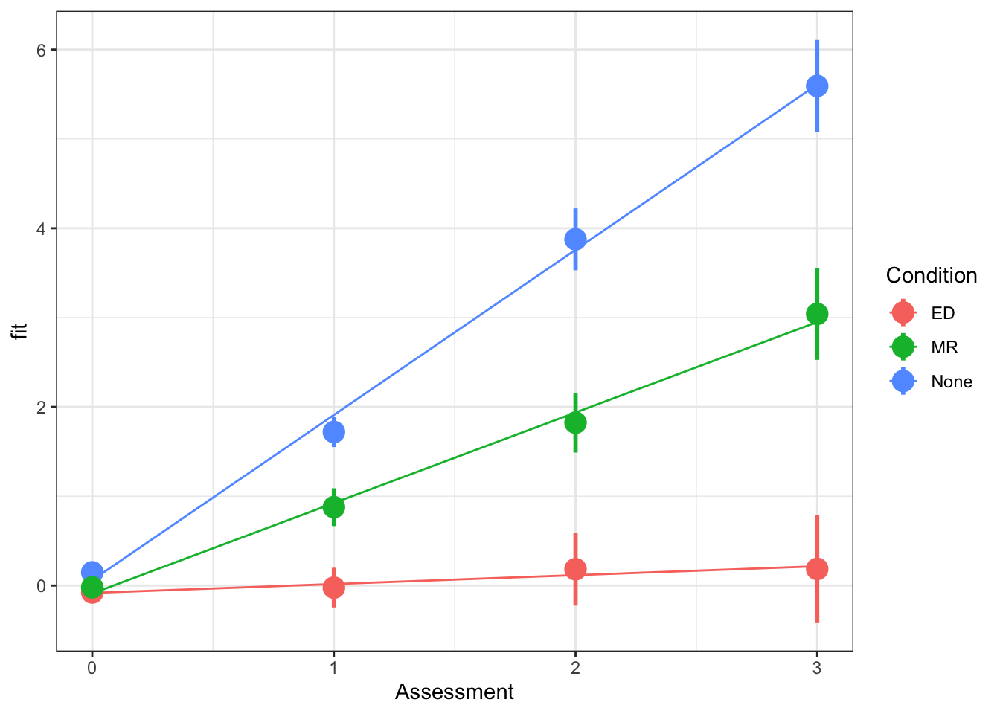

```{r setup, include=FALSE}
source('assets/setup.R')
library(tidyverse)
library(patchwork)
source("https://uoepsy.github.io/msmr/functions/code_poly.R")
```

:::blue
**Preliminaries**  
 
Create a new R Script or RMarkdown document (whichever you prefer working with) and give it a title for this week. 

**Some extra background reading**  

+ [Curran et al., 2010](https://doi.org/10.1080/15248371003699969)  
+ [Winter & Wieling, 2016](https://doi.org/10.1093/jole/lzv003)  

:::

We have already seen in the last couple of weeks that we can use MLM to study something 'over the course of X'. Last week's weight change data was measured over the course of several assessments (Figure \@ref(fig:weightlin), and in the novel word learning experiment from our analysis was interested in change over the course of the experimental blocks. 
 
```{r weightlin, echo=FALSE,out.width="300px", fig.cap="Weight Maintain Model fitted values, from [Week 2 exercises](https://uoepsy.github.io/msmr/labs/02_lmm_log.html)"}

```

We've talked about how **"longitudinal"** is the term commonly used to refer to any data in which repeated measurements are taken over a continuous domain. This opens up the potential for observations to be unevenly spaced, or missing at certain points. It also, as will be the focus of this week, opens the door to thinking about how many effects of interest are likely to display **non-linear patterns**. These exercises focus on including higher-order polynomials in the multi-level model to capture non-linearity. 
  
# Linear vs Non-Linear

```{r include=F}
res <- MASS::mcycle %>%
  rename(y=accel,x=times) %>% filter(x>20) %>% lm(y~x,.) %>% broom::tidy() %>% mutate(across(estimate:statistic,~round(.,2)))
```

<div style="display:inline-block;width:45%;margin:5px;vertical-align:middle">
Suppose we had collected the data in Figure \@ref(fig:mcycle), and we wanted to fit a model to predict $y$ based on the values of $x$.  

A model? [Easy, peasy, lemon squeezy!](https://youtu.be/7mAFiPVs3tM) Let's use our old friend linear regression, $y = \beta_0 + \beta_1(x) + \varepsilon$.  

We'll get out some estimated coefficients, some standard errors, and some p-values:  

- The intercept:  
  $\beta_0$ = `r res[1,2]`, SE = `r res[1,3]`, p < .001  
- The estimated coefficient of x:  
  $\beta_1$ = `r res[2,2]`, SE = `r res[2,3]`, p < .001   

Job done? Clearly not - we need only overlay model upon raw data (Figure \@ref(fig:mcycle3)) to see we are missing some key parts of the pattern.  
</div>
<div style="display:inline-block;width:45%;margin:5px;vertical-align:middle">
```{r mcycle, echo=FALSE, fig.cap = "A clearly non-linear pattern"}
MASS::mcycle %>%
  rename(y=accel,x=times) %>% filter(x>20) %>%
  ggplot(.,aes(x=x,y=y))+
  geom_point(size=2)
```
```{r mcycle3, echo=FALSE, fig.asp=.7,fig.cap="Uh-oh... "}
MASS::mcycle %>%
  rename(y=accel,x=times) %>% filter(x>20) %>% 
  lm(y~x,.) %>%
  sjPlot::plot_model(type="pred", show.data = TRUE) -> p0
p0$x
```

</div>  

:::statbox
**Thoughts about Model + Error**  

All our work here is in aim of making models of the world.  

1. Models are just models. They are simplifications, and so they don't perfectly fit to the observed world (indeed, how well a model fits to the world is often our metric for comparing models).  
2. $y - \hat y$. Our observed data minus our model predicted values (i.e. in linear regression our "residuals") reflect everything that we don't account for in our model
3. In an ideal world, our model accounts for all the systematic relationships, and what is left over (our residuals) is just randomness. If our model is mis-specified, or misses out something systematic, then our residuals will reflect this. 
4. We check for this by examining how much like randomness the residuals appear to be (zero mean, normally distributed, constant variance, i.i.d ("independent and identically distributed") - i.e., what gets referred to as the "assumptions"). 
5. We will **never** know whether our residuals contain only randomness, because we can never observe *everything*. 

<h/>

Let's just do a quick `plot(model)` for some diagnostic plots of my linear model:
```{r echo=FALSE}
par(mfrow=c(2,2))
MASS::mcycle %>%
  rename(y=accel,x=times) %>% filter(x>20) %>%
lm(y~x,.) %>% plot()
par(mfrow=c(1,1))
```

Does it look like the residuals are independently distributed? Not really. 
We need to find some way of incorporating the non-linear relationship between y and x into our model. 

:::


# What is a polynomial?  

:::statbox
Polynomials are mathematical expressions which involve a sum of powers. For instance:

$y = x^2 + 4$  
$y = 4x^3 + 2x^2 + 9x$  
$y = x^6$  

:::

For our purposes, extending our model to include higher-order terms can fit non-linear relationships between two variables, for instance, fitting models with linear and quadratic terms ($\color{red}{y_i} = \color{blue}{\beta_0 + \beta_1 x_{i} \ + \beta_2 x^2_i} + \varepsilon_i$) and extending these to cubic ($\color{red}{y_i} = \color{blue}{\beta_0 + \beta_1 x_{i} \ + \beta_2 x^2_i + \beta_3 x^3_i} + \varepsilon_i$) and beyond.  

```{r echo=FALSE}
MASS::mcycle %>%
  rename(y=accel,x=times) %>% filter(x>20) %>% 
  lm(y~x+I(x^2),.) %>%
  sjPlot::plot_model(type="pred",show.data=TRUE) -> p

MASS::mcycle %>%
  rename(y=accel,x=times) %>% filter(x>20) %>% 
  lm(y~x+I(x^2)+I(x^3),.) %>% 
  sjPlot::plot_model(type="pred",show.data=TRUE) -> p1

p0$x + labs(title="",subtitle="y ~ x + e") +
p$x + labs(title="",subtitle="y ~ x + x^2 + e") +
p1$x + labs(title="",subtitle="y ~ x + x^2 + x^3 + e") & theme_bw(base_size=12)
```

:::statbox
**What are we interested in here?**  

As the order of polynomials increases, we tend to be less interested in these terms in our model. Linear change is the easiest to think about: are things going up over the course of $x$, or down? (or neither?). Quadratic change is the next most interesting, and it may help to think of this as the "rate of change". For instance, in the plot below, it is the quadratic term which differs between the two groups trajectories. 

```{r echo=FALSE}
x=1:10
tibble(
  y=c(x*3, (x*1.1+(x^2)*.2)),
  xx=rep(x,2),
  g = rep(letters[1:2],each=10)
) %>% ggplot(.,aes(x=xx,y=y,col=g))+geom_line()+
  labs(x="x")
```

`r optbegin("Positive and negative quadratic terms",olabel=FALSE,toggle=params$TOGGLE)`
```{r quadfig, echo=FALSE}
tibble(
  x = -10:10,
  y = x^2,
  y1 = -x^2
) %>% pivot_longer(y:y1) %>%
  mutate(name = ifelse(name=="y","quadratic term is positive \n Y = X^2", "quadratic term is negative \n Y = -X^2")) %>%
  ggplot(.,aes(x=x,y=value,col=name)) +
  geom_line()+
  guides(col=FALSE)+
  facet_wrap(~name, scales="free_y")
```

<!-- `r optbegin("Code to create plot", olabel=FALSE, toggle=params$TOGGLE)` -->
<!-- ```{r eval=FALSE} -->
<!-- tibble( -->
<!--   x = -10:10, -->
<!--   y = x^2, -->
<!--   y1 = -x^2 -->
<!-- ) %>% pivot_longer(y:y1) %>% -->
<!--   mutate(name = ifelse(name=="y","quadratic term is positive \n Y = X^2", "quadratic term is negative \n Y = -X^2")) %>% -->
<!--   ggplot(.,aes(x=x,y=value,col=name)) + -->
<!--   geom_line()+ -->
<!--   guides(col=FALSE)+ -->
<!--   facet_wrap(~name, scales="free_y") -->
<!-- ``` -->
<!-- `r optend()` -->

`r optend()`
:::


## Raw Polynomials

<div style="display:inline-block; width: 60%; vertical-align: top">
There are two types of polynomial we can construct. "Raw" (or "Natural") polynomials are the straightforward ones you might be expecting the table to the right to be filled with.  

These are simply the original values of the x variable to the power of 2, 3 and so on.  
  
We can quickly get these in R using the `poly()` function, with `raw = TRUE`. 
</div>
<div style="display:inline-block; width: 30%;">
<center>
```{r echo=FALSE}
MASS::mcycle %>%
  rename(y=accel,x=times) %>% filter(x>20) -> df
cbind(x=1:5,`x^2`=rep("?",5),`x^3`=rep("?",5)) %>% rbind("...") %>% pander::pander()
```
</center>
</div>

```{r}
poly(1:10, degree = 3, raw=TRUE)
```

:::statbox
__Raw polynomials are correlated__  

With raw (or "natural") polynomials, the terms `poly1`, `poly2` and `poly3` are correlated.  
Think think about why this might be - by definition, as $x^1$ increases, so will $x^2$, and so will $x^3$ and so on.  

We can visualise them: 
```{r}
matplot(poly(1:10, 3, raw=T), type="l")
```
And measure the correlation coefficients:
```{r}
cor(poly(1:10, 3, raw=T)) %>% round(2)
```

Why might this be a problem?  
Well, this multicollinearity can lead to estimation problems, and means that our parameter estimates may change considerably depending upon what terms we include in our model, and it becomes more difficult to determine which ones are important, and what the effect sizes are.  
Table \@ref(tab:rawpolytab) below shows the coefficients for models fitted to a randomly generated dataset, with `poly1`, `poly1+poly2`, and `poly1+poly2+poly3` as predictors (where `poly1`-`poly3` are **natural** polynomials). Notice that they change with the addition of each term.
```{r echo=FALSE}
set.seed(754)
df<-tibble(
  x = 1:10,
  y = x + 
  rnorm(1, mean = 100) * (x) +
  rnorm(1, mean = 0, sd = .01) * (x) ^ 2 +
  rnorm(1, mean = -1) * (x) ^ 3 + 
  rnorm(10)
)
df <- code_poly(df = df, predictor = 'x', poly.order = 3, orthogonal = FALSE, draw.poly = FALSE)
full_join(
  broom::tidy(lm(y~poly1, df))[,1:2] %>% 
    #mutate(estimate = paste(round(estimate,2), c("*","**"))) %>% 
    rename(`y~poly1` = estimate),
  broom::tidy(lm(y~poly1+poly2, df))[,1:2] %>% 
    #mutate(estimate = paste(round(estimate,2), c("*","***","***"))) %>% 
    rename(`y~poly1+poly2` = estimate)
) %>% full_join(.,
  broom::tidy(lm(y~poly1+poly2+poly3, df))[,1:2] %>% 
    #mutate(estimate = paste(round(estimate,2), c("","***","","***"))) %>% 
    rename(`y~poly1+poly2+poly3` = estimate)
) %>% mutate_if(is.numeric,~round(.,2)) %>% 
  mutate_all(~ifelse(is.na(.), "-", .)) %>% pander::pander(.,caption="(\\#tab:rawpolytab) Incremental addition of raw polynomial terms")

```

:::

## Orthogonal Polynomials  

"Orthogonal" polynomials are uncorrelated (hence the name). 
We can get these for $x = 1,2,...,9,10$ using the following code:
```{r}
poly(1:10, 3, raw = FALSE)
```
Notice that the first order term has been scaled, so instead of the values 1 to 10, we have values ranging from -0.5 to +0.5, centered on 0. 
Think about what this means for $x^2$. It will be uncorrelated with $x$ (because $-0.5^2 = 0.5^2$)!  
```{r}
matplot(poly(1:10, 3, raw=F), type="l")
```
The correlations are zero!
```{r}
cor(poly(1:10, 3, raw=F)) %>% round(2)
```

We can then fit the same models `y~poly1`, `y~poly1+poly2`, and `y~poly1+poly2+poly3` as predictors (where `poly1`-`poly3` are now **orthogonal** polynomials), and see that estimated coefficients do not change between models: 
```{r echo=FALSE}
df <- code_poly(df = df, predictor = 'x', poly.order = 3, orthogonal = TRUE, draw.poly = FALSE)
full_join(
  broom::tidy(lm(y~poly1, df))[,1:2] %>% 
    #mutate(estimate = paste(round(estimate,2), c("","**"))) %>% 
    rename(`y~poly1` = estimate),
  broom::tidy(lm(y~poly1+poly2, df))[,1:2] %>% 
    #mutate(estimate = paste(round(estimate,2), c("***","***","***"))) %>% 
    rename(`y~poly1+poly2` = estimate)
) %>% full_join(.,
  broom::tidy(lm(y~poly1+poly2+poly3, df))[,1:2] %>% 
    #mutate(estimate = paste(round(estimate,2), c("***","***","***","***"))) %>% 
    rename(`y~poly1+poly2+poly3` = estimate)
) %>% mutate_if(is.numeric,~round(.,2)) %>% 
  mutate_all(~ifelse(is.na(.), "-", .)) %>% pander::pander(.,caption="(\\#tab:orthpolytab) Incremental addition of orthogonal polynomial terms")
```


:::statbox
**Remember what zero is!** 

With orthogonal polynomials, you need to be careful about interpreting coefficients. For raw polynomials the intercept remains the y-intercept (i.e., where the line hits the y-axis). The higher order terms can then be thought of from that starting point - e.g., "where $x$ is 2, $\hat y$ is $\beta_0 + \beta_1 \cdot 2 + \beta_2 \cdot 2^2 + \beta_3 \cdot 2^3 ...$".  
<br>
For orthogonal polynomials, the interpretation becomes more tricky. The intercept is the overall average of y, the linear predictor is the linear change pivoting around the mean of $x$ (rather than $x = 0$), the quadratic term corresponds to the steepness of the quadratic curvature ("how curvy is it?"), the cubic term to the steepness at the inflection points ("how wiggly is it?"), and so on. 

::: 

## Some useful code from Dan

:::rtip

It's possible to use `poly()` internally in fitting our linear model, if we want:  
```{r eval=FALSE}
lm(y ~ poly(x, 3, raw = T), data = df)
```
<br>
Unfortunately, the coefficients will end up having long messy names `poly(x, 3, raw = T)[1]`, `poly(x, 3, raw = T)[2]` etc.   
<br>
It is probably nicer if we add the polynomials to our data itself. As it happens, Dan has provided a nice little function which attaches these as columns to our data, naming them `poly1`, `poly2`, etc. 
```{r include=FALSE}
set.seed(754)
mydata<-tibble(
  x = 1:10,
  y = x + 
  rnorm(1, mean = 100) * (x) +
  rnorm(1, mean = 0, sd = .01) * (x) ^ 2 +
  rnorm(1, mean = -1) * (x) ^ 3 + 
  rnorm(10)
) %>% rename(time=x)
```
```{r}
# source Dan's code
source("https://uoepsy.github.io/msmr/functions/code_poly.R")
mydata <- code_poly(df = mydata, predictor = 'time', poly.order = 3, orthogonal = FALSE, draw.poly = FALSE)
head(mydata)
```

Both will produce the same model output (but Dan's method produces these nice neat names for the coefficients!), and we can just put the terms into our model directly as `lm(y ~ poly1 + poly2 + poly3, data = mydata)`.  

`r optbegin("Demonstration", olabel=F,toggle=params$TOGGLE)`
```{r echo=FALSE}
set.seed(4)
df<-tibble(
  x = 1:10,
  y = x + 
  rnorm(1, mean = 100) * (x) +
  rnorm(1, mean = 0, sd = .01) * (x) ^ 2 +
  rnorm(1, mean = -1) * (x) ^ 3 + 
  rnorm(10)
)
```
Our data:  
```{r}
head(df)
```

A messy model:  
```{r}
m.messy <- lm(y ~ poly(x, 3, raw=T), data = df)
```
```{r echo=FALSE}
broom::tidy(m.messy) %>% pander::pander()
```

Dan's code, and a neat model:  
```{r}
df <- code_poly(df = df, predictor = 'x', poly.order = 3, orthogonal = FALSE, draw.poly = FALSE)
mDan <- lm(y ~ poly1 + poly2 + poly3, data = df)
```
```{r}
broom::tidy(mDan) %>% pander::pander()
```
`r optend()`
:::


# Exercises: Cognitive performance

:::imp

__STOP AND THINK: Are you using R effectively?__  
  
There are lots of different ways to organise your file system/your life in R. You might be creating a new project each week, or a new folder, or just a new .Rmd. There's no *best* way to organise this - it is personal preference.  
  
However, one thing which is common across most approaches is that having a lot of irrelevant stuff in your environment (top right pane) can get confusing and messy.  

We encourage you now to clear your environment for this week, and *then* load in the data.  

If you are worried that you are going to lose some of the objects in your environment, then this may be a sign that you are not using R to its full potential. The idea is that we can recreate all of our analyses by just running the relevant code in our script! 

:::yellow

Alongside **lme4** and **tidyverse** and possibly **broom.mixed**, we're going to be using some of Dan's useful functions for getting p-values and coding polynomials.  

The `source()` function basically takes in R code and evaluates it. You can download an R script with Dan's code [here](https://uoepsy.github.io/msmr/functions/code_poly.R).   

But you can also source this script directly from the URL, which runs the R code and creates the functions in your environment. Typically, we want these at the top of our document, because it's similar to loading a package:  

```{r warning=FALSE,message=FALSE}
library(tidyverse)
library(lme4)
library(broom.mixed)
source("https://uoepsy.github.io/msmr/functions/code_poly.R")
```

:::

:::
 
:::frame
__Az.rda Data__  
  
30 Participants with probably Alzheimer's Disease completed 3 tasks over 10 time points: A memory task, and two scales investigating ability to undertake complex activities of daily living (cADL) and simple activities of daily living (sADL). Performance on all of tasks was calculated as a percentage of total possible score, thereby ranging from 0 to 100. 

The data is available at [https://uoepsy.github.io/data/Az.rda](https://uoepsy.github.io/data/Az.rda).  

```{r echo=FALSE}
load(url("https://uoepsy.github.io/data/Az.rda"))
tibble(
  variable = names(Az),
  description = c("Unique Subject Identifier","Time point of the study (0 to 10)","Task type (Memory, cADL, sADL)","Score on test")
) %>% pander::pander()
```
:::

`r qbegin("A1")`
Load in the data and examine it.  
`r qend()`
`r solbegin(show=params$SHOW_SOLS, toggle=params$TOGGLE)`
```{r}
load(url("https://uoepsy.github.io/data/Az.rda"))
summary(Az)
```
`r solend()`

`r qbegin("A2")`
No modelling just yet.  
Plot the performance over time for each type of task.  

Try using `stat_summary` so that you are plotting the means (and standard errors) of each task, rather than every single data point. Why? Because this way you can get a shape of the overall trajectories of performance over time in each task.  
`r qend()` 
`r solbegin(show=params$SHOW_SOLS, toggle=params$TOGGLE)`
```{r}
ggplot(Az, aes(Time, Performance, color=Task, fill=Task)) + 
  stat_summary(fun.data=mean_se, geom="ribbon", color=NA, alpha=0.5) +
  stat_summary(fun=mean, geom="line")
```
`r solend()`
`r qbegin("A3")`
Why do you think *raw/natural* polynomials might be more useful than *orthogonal* polynomials for these data?  
`r qend()` 
`r solbegin(show=params$SHOW_SOLS, toggle=params$TOGGLE)`
Because we're likely to be interested in whether there are task differences at the starting baseline point
`r solend()`

`r qbegin("A4")`
Okay! Let's do some modeling! 

First steps:  

1. Add 1st and 2nd order raw polynomials to the data using the `code_poly()` function. 
2. Create a "baseline model", in which performance varies over time (with both linear and quadratic change), but no differences in Task are estimated. 

We need to think about our random effect structure. We'll talk you through this bit because it's getting a bit more complicated now.  

`r optbegin("1. What are the observations grouped by?", olabel=F,toggle=params$TOGGLE)`
We have multiple observations for each participant. We can see this easily if we plot performance over time, and make a separate facet for each subject:
```{r}
ggplot(Az, aes(x=Time,y=Performance))+
  geom_point()+
  facet_wrap(~Subject)
```

We also have multiple observations for each task, and multiple observations for each time point (1 to 10). This is true, but importantly, these things (e.g. effects of time, differences between tasks) are things that we are specifically interested in estimating. The subjects, on the other hand, are simply a random sample of people in the study. We want to account for subject-level variation, but we're not interested in estimating specific differences between specific subjects. This lends itself perfectly to being a grouping variable in a multi-level model. 
`r optend()`
`r optbegin("2. Are observations nested?",olabel=F,toggle=params$TOGGLE)`
There's another grouping _within_ each subjects' data, and that is the task they are measured on:
```{r}
ggplot(Az, aes(x=Time,y=Performance,col=Task))+
  geom_point()+
  facet_wrap(~Subject)
```
`r optend()`
`r optbegin("3. What effects can vary by-groups?",olabel=F,toggle=params$TOGGLE)`
For a given subject, on a given task, we can see that there is "an effect of time". 
So we can conceivably think of the effect of time on performance as varying by subject and tasks within subjects.  
```{r}
Az %>% filter(Subject == 4) %>%
ggplot(., aes(x=Time,y=Performance,col=Task))+
  geom_point()+
  facet_wrap(~Task)+
  ylim(0,80)
```
`r optend()`
`r optbegin("4. What should our random effect structure be?",olabel=F,toggle=params$TOGGLE)`
So we know that we want to account for subject-level variation, and we also know that within each subjects' data there are different tasks.  
Previously we have just been modelling one-level of grouping. This would be something like `(1 + ... | Subject)`. 

We can extend this to model variation by-tasks-within-subjects, by using `(1 + ... | Subject/Task)`. This can also be written as: `(1 + ... | Subject) + (1 + ... | Subject:Task)` (which allows us to include different predictors as random effects in each grouping).  


- `(1 | Subject/Task)` = Allow subjects to vary in their intercepts, and within each subject, allow the tasks to vary in their intercepts. 

We also know that the trajectories of performance over time could be different for each subject, and it could also be different for each task for each subject. 
So we can allow our effects that encode time (`poly1`, `poly2`) to vary by-subject/task:  

- `(1 + poly1 + poly2 | Subject/Task)` = Allow subjects to vary in their intercepts and trajectories over time, and within each subject, allow the tasks to vary in their intercepts and trajectories over time. 
`r optend()`

`r qend()`
`r solbegin(show=params$SHOW_SOLS, toggle=params$TOGGLE)`
```{r}
# prep for analysis
Az <- code_poly(Az, predictor="Time", poly.order=2, orthogonal=F, draw.poly = F)

# fit the base model
m.base <- lmer(Performance ~ (poly1 + poly2) + 
                 (poly1 + poly2 | Subject/Task),
               data=Az, REML=F, control=lmerControl(optimizer="bobyqa"))
summary(m.base)
```
`r solend()`

`r qbegin("A5")`
Hopefully, you fitted a model like this (or thereabouts)
```{r eval=F}
m.base <- lmer(Performance ~ (poly1 + poly2) + 
                 (1 + poly1 + poly2 | Subject/Task),
               data=Az, REML=F, control=lmerControl(optimizer="bobyqa"))
```

Remember what we learned last week about "singular fits"? It looks like this model might be a too complex for the data to sustain. 

What random effect term might we consider removing? (there isn't necessarily a "right" answer here - many may be defensible, so we've made the solutions available immediately).  
`r qend()`
`r solbegin(show=params$SHOW_SOLS, toggle=params$TOGGLE)`
I would be inclined to remove the `poly2` term from either subjects, or tasks within subjects. I probably wouldn't try removing it from both straight away, so we'll need to split the random effect terms from `(1 + poly1 + poly2| Subject/Task)` to `(1 + poly1 | Subject) + (1 + poly1 + poly2 | Subject:Task)`.  

- Removing `poly2 | Subject:Task` will mean that within each subject, the linear trend will still vary by task, but quadratic trend will not. For a given subject, the model will think that the performance might go up on some tasks and down on others, but the curvature will be the same.  
- Removing `poly2 | Subject` will mean that the linear trend will still vary by subjects, but the quadratic trend will not. The model will assume all Subjects have the same curvature to their trajectories. 

```{r echo=FALSE, fig.cap="Model fits for 6 subjects when excluding different random effect terms"}
m.base1 <- lmer(Performance ~ (poly1 + poly2) + 
                 (1 + poly1 | Subject) + (1 + poly1 + poly2 | Subject:Task),
               data=Az, REML=F, control=lmerControl(optimizer="bobyqa"))
m.base2 <- lmer(Performance ~ (poly1 + poly2) + 
                 (1 + poly1 + poly2 | Subject) + (1 + poly1 | Subject:Task),
               data=Az, REML=F, control=lmerControl(optimizer="bobyqa"))
broom.mixed::augment(m.base1) %>%
  filter(Subject %in% as.character(1:6)) %>% 
  ggplot(.,aes(x=poly1,y=.fitted))+
  geom_line(aes(col=Task))+
  facet_wrap(~Subject)+
  labs(title="removing poly2 | Subject")+
  theme(legend.position="none")-> p1
broom.mixed::augment(m.base2) %>%
  filter(Subject %in% as.character(1:6)) %>% 
  ggplot(.,aes(x=poly1,y=.fitted))+
  geom_line(aes(col=Task)) +
  facet_wrap(~Subject)+
  labs(title="removing poly2 | Subject:Task") -> p2
p1 + p2 & theme_bw(base_size=11)

```

Personally I'm more tempted to remove `poly2 | Subject`, in part because there is far less estimated variance in this term (see below):
```{r}
# show the random effects
VarCorr(m.base)
```

```{r}
m.base <- lmer(Performance ~ (poly1 + poly2) + 
                 (1 + poly1 | Subject) + (1 + poly1 + poly2 | Subject:Task),
               data=Az, REML=F, control=lmerControl(optimizer="bobyqa"))
summary(m.base)
```
`r solend()`

`r qbegin("A6")`
Let's start adding in our effects of interest.  

1. Create a new model with a fixed effect of Task
2. Create a new model in which performance varies linearly over time between Task type.
3. Create a new model in which linear _and_ quadratic performance over time varies between Task type.
4. Run model comparisons.  

`r qend()` 
`r solbegin(show=params$SHOW_SOLS, toggle=params$TOGGLE)`
```{r}
m.0 <- lmer(Performance ~ (poly1 + poly2) + Task +
              (1 + poly1 | Subject) + (1 + poly1 + poly2 | Subject:Task),
            data=Az, REML=F, control=lmerControl(optimizer="bobyqa"))
m.1 <- lmer(Performance ~ poly1*Task + poly2 +
              (1 + poly1 | Subject) + (1 + poly1 + poly2 | Subject:Task),
            data=Az, REML=F, control=lmerControl(optimizer="bobyqa"))
m.Az.full <- lmer(Performance ~ (poly1 + poly2)*Task + 
                  (1 + poly1 | Subject) + (1 + poly1 + poly2 | Subject:Task),
                data=Az, REML=F, control=lmerControl(optimizer="bobyqa"))
anova(m.base, m.0, m.1, m.Az.full)
```
`r solend()`

:::frame

We'd like to do some inferential tests of our coefficients values. We could consider computing some confidence intervals with `confint(m.Az.full, method="boot")`, but this may take quite a long time with such a complex model (if we bootstrap, we're essentially fitting thousands of models!).  

For now, let's refit the full model and obtain p-values for our coefficients by using the Satterthwaite approximations for the denominator degrees of freedom.  
The code below does this for us  

:::rtip
By using `lmerTest::lmer()` we don't have to load the package `library(lmerTest)`, and so it is just this single model that's get fitted this way. 
:::

```{r}
m.full_satter <- lmerTest::lmer(Performance ~ (poly1 + poly2) + Task +
              (1 + poly1 | Subject) + (1 + poly1 + poly2 | Subject:Task),
            data=Az, REML=F, control=lmerControl(optimizer="bobyqa"))
tidy(m.full_satter) %>% filter(effect=="fixed")
```

`r optbegin("Optional: Quick refresher of scientific notation", olabel=F,toggle=params$TOGGLE)`
5.4e-3 = 0.0054  
5.4e-2 = 0.054  
5.4e-1 = 0.54  
5.4e-0 = 5.4  
5.4e+1 = 54  
5.4e+2 = 540  
`r optend()`

:::

`r qbegin("A7")`
```{r echo=FALSE}
tidy(m.full_satter) %>% filter(effect=="fixed") %>% mutate_if(is.numeric,~round(.,3)) %>%
  mutate(p.value = ifelse(p.value == 0, "<.001 ***", as.character(gsub("0","",p.value)))) %>%
  mutate_if(is.numeric,~round(.,2)) %>% select(-effect,-group) %>% 
  knitr::kable()
```


a) For the cADL Task, what is the estimated average performance where x = 0?  
b) For the sADL and Memory Tasks, is the estimated average where x = 0 different to the cADL Task? 
c) For the cADL Task, how does performance change for every increasing time point? (what is the estimated linear slope?)
    - Note, the quadratic term `poly2` is non-significant, so we'll ignore it here  
d) For the sADL Task, how is the change in performance over time different from the cADL Task? 
e) The answer to c) + the answer to d) will give you the estimated slope for the sADL Task.
f) For the Memory Task, how is the change in performance over time different from the cADL Task? 
    - This is more difficult. The quadratic term is significant. 
    - Recall the direction of the quadratic term (positive/negative) and how this relates to the visual curvature (see back in ["What's a polynomial?"](#whats-a-polynomial)). 
    
`r qend()`
`r solbegin(show=params$SHOW_SOLS, toggle=params$TOGGLE)`

a) For the cADL Task, what is the estimated average performance where x = 0?  
    - __`r fixef(m.Az.full)[1] %>% round(.,2)`__
b) For the sADL and Memory Tasks, is the estimated average where x = 0 different to the cADL Task? 
    - __Nope. Neither of the intercept differences are significant.__  
c) For the cADL Task, how does performance change for every increasing time point? (what is the estimated linear slope?)
    - __Note, the quadratic term `poly2` is non-significant, so we'll ignore it here__  
    - __For every increase in one timepoint, cADL performance changes by `r fixef(m.Az.full)[2] %>% round(.,2)`.__ 
d) For the sADL Task, how is the change in performance over time different from the cADL Task? 
    - __For every increase in one timepoint sADL performance change is `r fixef(m.Az.full)[6] %>% round(.,2)` different from change in cADL__
e) The answer to c) + the answer to d) will give you the estimated slope for the sADL Task.
    - __`r fixef(m.Az.full)[2] %>% round(.,2)` + `r fixef(m.Az.full)[6] %>% round(.,2)` = `r fixef(m.Az.full)[2] + fixef(m.Az.full)[6] %>% round(.,2)`__
    - __For every increase in one timepoint, sADL performance changes by `r (fixef(m.Az.full)[2] + fixef(m.Az.full)[6]) %>% round(.,2)`__
f) For the Memory Task, how is the change in performance over time different from the cADL Task? 
    - __Memory performance declines even more steeply than cADL, with linear change of `r fixef(m.Az.full)[2] %>% round(.,2)` + `r fixef(m.Az.full)[7] %>% round(.,2)` = `r fixef(m.Az.full)[2] + fixef(m.Az.full)[7] %>% round(.,2)`, but it also has a quadratic effect of `r fixef(m.Az.full)[9] %>% round(.,2)`. This is positive, which means it is $\cup$-shaped (rather than $\cap$-shaped).___ 
    
`r solend()`

`r qbegin("A8")`
  
Based on your answers above, can you sketch out (on paper) the model fit?

Then provide a written description.  
  
`r qend()`
`r solbegin(show=params$SHOW_SOLS, toggle=params$TOGGLE)`

:::int
Performance in all tasks starts out the same [thanks, natural polynomials!]. Linear change over time is different depending on task type: compared to complex ADL tasks, decline in simple ADL tasks is slower and decline in Memory is faster. Decline in cADL and sADL tasks is approximately linear, whereas decline in Memory has more curvature (reaching floor?)
:::


`r solend()`

`r qbegin("A9")`
To what extent do model comparisons (Question A6) and the parameter-specific p-values (Question A7) yield the same results? 
`r qend()` 
`r solbegin(show=params$SHOW_SOLS, toggle=params$TOGGLE)`
Model comparisons suggest:  

+ Linear slopes are different: $\chi^2(2)=30.41, p < .0001$ (comparison `m.0` and `m.1` above).  
+ Quadratic term is different: $\chi^2(2)=171.53, p < .0001$ (comparison `m.1` and `m.Az.full` above).  

*Note:* We can't investigate the intercept difference via the model comparisons above. Comparison between `m.base` and `m.0` indicates difference holding polynomial terms constant (not the conditional effect where poly1 and poly2 are 0).

`r solend()`

`r qbegin("A10")`
Plot the model fitted values. This might be pretty similar to the plot you created in Question A2, and (hopefully) similar to the one you drew on paper for Question A8.
`r qend()` 
`r solbegin(show=params$SHOW_SOLS, toggle=params$TOGGLE)`
```{r fig.width=6, fig.height=4}
ggplot(Az, aes(Time, Performance, color=Task)) + 
  stat_summary(fun.data=mean_se, geom="pointrange") + 
  stat_summary(fun=mean, geom="line", aes(y=fitted(m.Az.full)))
```
`r solend()`

:::frame
Two quotes

"all models are wrong. some are useful." [(George Box, 1976)](https://www.tandfonline.com/doi/abs/10.1080/01621459.1976.10480949).  

"...it does not seem helpful just to say that all models are wrong. The very word model implies simplification and idealization. The idea that complex physical, biological or sociological systems can be exactly described by a few formulae is patently absurd. The construction of idealized representations that capture important stable aspects of such systems is, however, a vital part of general scientific analysis and statistical models, especially substantive ones, do not seem essentially different from other kinds of model."[(Sir David Cox, 1995)](https://twitter.com/richarddmorey/status/1111270300241588225).  

:::


`r optbegin("Optional: TIMTOWTDI",olabel=F,toggle=params$TOGGLE)`
**TIMTOWTDI** *(There is more than one way to do it)*  

The approach we are learning about in this course is only one of many approaches to studying non-linearity. 
Some alternatives, which you may come across in future work, are listed below.

**Piecewise linear regression:** fit a linear model with cut point(s) along x (determine cut points by greatest reduction in mean squared error $\sigma$)
```{r echo=FALSE, out.width="350px"}
MASS::mcycle %>%
  rename(y=accel,x=times) %>% filter(x>20) -> df
breaks <- df$x[which(df$x >= 20 & df$x <= 40)]
mse <- numeric(length(breaks))
for(i in 1:length(breaks)){
 piecewise1 <- lm(y ~ x*(x < breaks[i]) + x*(x>=breaks[i]),df)
 mse[i] <- summary(piecewise1)[6]
}
mse <- as.numeric(mse)
#breaks[which(mse==min(mse))]
piecewise2 <- lm(y ~ x*(x <= 33) + x*(x > 33), df)
df %>% mutate(
  pred = predict(piecewise2),
  se = predict(piecewise2,se.fit = T)$se
) %>% 
  ggplot(.,aes(x=x,y=pred))+
  geom_line(aes(group=x>33),lwd=1)+
  #geom_ribbon(aes(ymin=pred-(1.96*se),ymax=pred+(1.96*se),group=x>33),alpha=.2)+
  geom_point(aes(y=y))+labs(y="y",title="Predicted values of y", subtitle="y ~ x*(x < 33) + x*(x > 33)")
```

**Piecewise polynomial** fit the model $y ~ x + x^2 + x^3$ to equal chunks of x.  

```{r echo=FALSE, out.width="350px"}
mod<-function(ddf){lm(y~poly(x,3), data=ddf)}

df %>% mutate(pieces = cut(x,3)) %>% 
  group_by(pieces) %>%
  nest_legacy() %>%
  mutate(
    model = map(data, mod),
    fit = map(model, ~fitted(.))
  ) %>%
  unnest_legacy(data,fit) %>%
  ggplot(., aes(x=x))+
  geom_point(aes(y=y))+
  geom_line(aes(y=fit, col=pieces),lwd=1)+
  theme_minimal() + guides(col=FALSE)+
  labs(title="Predicted values of y",subtitle="y~ x + x^2 + x^3 for 3 cuts of x")
```


**Splines, penalised splines & GAMS** 

This begins to open a huge can of worms, but if you foresee yourself needing these sort of tools, then Simon Wood, author of the **mgcv** R package for fitting generalised additive models (GAMS), is now in the maths department at Edinburgh. He has plenty of materials on [his webpage](https://www.maths.ed.ac.uk/~swood34/talks/snw-Koln.pdf) (Warning, these are fairly technical). There are also a reasonable number of tutorials [online which are really good](https://www.google.com/search?hl=&site=&q=gam+in+r+tutorial).  
```{r echo=FALSE, out.width="350px"}
library(mgcv)
gam(y~s(x,bs="cr"),df, family="gaussian") -> m
df %>% mutate(
  pred = predict(m),
  se = predict(m,se.fit = T)$se
) %>% 
  ggplot(.,aes(x=x,y=pred))+
  geom_line(lwd=1)+
  geom_ribbon(aes(ymin=pred-(1.96*se),ymax=pred+(1.96*se)),alpha=.2)+
  geom_point(aes(y=y))+labs(y="y",title="Predicted values of y", subtitle="mgcv::gam(y ~ s(x, b = 'cr'))")
```


`r optend()`


<div class="tocify-extend-page" data-unique="tocify-extend-page" style="height: 0;"></div>


