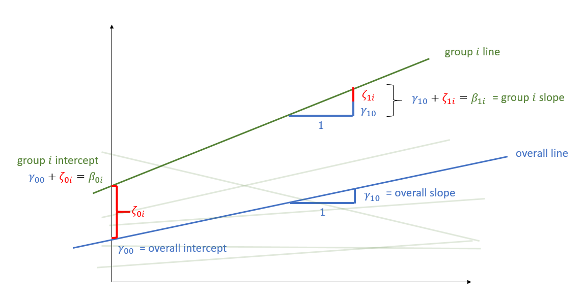
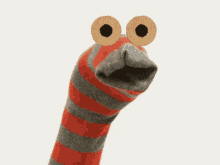

```{r setup, include=FALSE}
source('assets/setup.R')
library(tidyverse)
library(patchwork)
library(effects)
library(knitr)
library(kableExtra)
library(broom.mixed)
library(sjPlot)
library(lme4)
```

:::blue
**Preliminaries**  
 
Create a new R Script or RMarkdown document (whichever you prefer working with) and give it a title for this week. 

**Some extra background reading**  

+ [Baayen et al., 2008](https://doi.org/10.1016/j.jml.2007.12.005)  
+ [Barr et al., 2013](https://doi.org/10.1016/j.jml.2012.11.001)  
+ [Matuschek et al., 2017](https://doi.org/10.1016/j.jml.2017.01.001)

:::

:::imp
Now that we've had a few weeks to get used to the syntax of __lme4__, we're going to hide the solutions again until the end of the week. 
:::


# Random effects

## What are "Random Effects"?  

A frequent cause of confusion when learning about multilevel models is the use of the term "random effect". Does it refer to the the grouping variable, or to the effects that we allow to vary by-groups? The answer is really both. For example, in the model `lmer(R_AGE ~ 1 + hrs_week + (1 + hrs_week | toy_type), data = toys_read)`, the "random effects" refers to the `(1 + hrs_week | toy_type)`. We are specifying by-toy type random intercepts and by-toy type effects of hrs_week.

:::statbox
__Should I fit a fixed effect: `y ~ ... + group` or random effect: `y ~ ... + (1 | group)`?__

When specifying a random effects model, think about the data you have and how they fit in the following table:

| Criterion: | Repetition: <br> _If the experiment were repeated:_ | Desired inference: <br> _The conclusions refer to:_                   |
|----------------|--------------------------------------------------|--------------------------------------------------------------------|
| Fixed effects  | Same levels would be used                        | The levels used                                                    |
| Random effects | Different levels would be used                   | A population from which the levels used are just a (random) sample |

`r optbegin("Examples", olabel=FALSE,toggle=params$TOGGLE)`

For example, applying the criteria to the following questions:

- Do dogs learn faster with higher rewards? 

  FIXED: reward
  
  RANDOM: dog

- Do students read faster at higher temperatures?

  FIXED: temperature
  
  RANDOM: student

- Do people speaking one language speak faster than another?

  FIXED: the language
  
  RANDOM: the people speaking that language

`r optend()`
<br>

Sometimes, after simplifying the model, you find that there isn't much variability in a specific random effect and, if it still leads to singular fits or convergence warnings, it is common to just model that variable as a fixed effect. 

Other times, you don't have sufficient data or levels to estimate the random effect variance, and you are forced to model it as a fixed effect.
This is similar to trying to find the "best-fit" line passing through a single point... You can't because you need two points!

:::

## Nested & Crossed Structures

Most of the examples we have seen up to now have had only one level of clustering in the data (e.g. participants). But what happens if we have multiple different clusters? The same principle we have seen for one level of clustering can be extended to clustering at different levels, but we have to be considerate of how those levels of clustering are related.  

:::frame
__Nested Structures__  

Take an example where we have observations for each student in every class within a number of schools:  

```{r echo=FALSE, out.width="1200px"}
knitr::include_graphics("images/structure_id.png")
```

**Question:** Is "Class 1" in "School 1" the same as "Class 1" in "School 2"?  
  
No.  
The classes in one school are distinct from the classes in another **even though they are named the same**.  
  
The classes-within-schools example is a good case of **nested random effects** - one factor level (one group in a grouping varible) appears *only within* a particular level of another grouping variable.  
  
In R, we can specify this using:  
  
`(1 | school) + (1 | class:school)`  
  
or, more succinctly:  
  
`(1 | school/class)`  

`r optbegin("The labels matter!",olabel=F,toggle=params$TOGGLE)`
Had we changed data such that the classes had unique IDs (e.g., see below), then we could also use `(1 | school) + (1 | class)`.  

```{r echo=FALSE, out.width="1200px"}
knitr::include_graphics("images/structure_nested.png")
```

| Are the lower cluster labels unique? | equivalent structures |
|-------------:|-----:|
| Yes  | `(1 | school/class)`<br>`(1 | school) + (1 | class:school)`<br>`(1 | school) + (1 | class)`
| No   | `(1 | school/class)`<br>`(1 | school) + (1 | class:school)` | 

`r optend()`
:::
:::frame
__Crossed Structures__  

Consider another example, where we administer the same set of tasks at multiple time-points for every participant.  
  
**Question:** Are tasks nested within participants?  
  
No.  
Tasks are seen by multiple participants (and participants see multiple tasks).  
  
We could visualise this as the below:  
```{r echo=FALSE, out.width="400px"}
knitr::include_graphics("images/structure_crossed.png")
```

In the sense that these are not nested, they are **crossed** random effects.  
  
In R, we can specify this using:  

`(1 | subject) + (1 | task)`  

:::

:::blue
**Nested vs Crossed**  

*Nested:* Each group belongs uniquely to a higher-level group.   

*Crossed:* Not-nested. 

:::


## Random Effects in lme4

:::rtip
__Fitting Random effects in lme4__  
  
Below are a selection of different formulas for specifying different random effect structures, taken from the [lme4 vignette](https://cran.r-project.org/web/packages/lme4/vignettes/lmer.pdf). This might look like a lot, but over time and repeated use of multilevel models you will get used to reading these in a similar way to getting used to reading the formula structure of `y ~ x1 + x2` in all our linear models. 
<br>

|  Formula|  Alternative|  Meaning|
|--------:|------------:|--------:|
|  $\text{(1 | g)}$|  $\text{1 + (1 | g)}$|  Random intercept with fixed mean|
|  $\text{0 + offset(o) + (1 | g)}$|  $\text{-1 + offset(o) + (1 | g)}$|  Random intercept with *a priori* means|
|  $\text{(1 | g1/g2)}$|  $\text{(1 | g1) + (1 | g1:g2)}$|  Intercept varying among $g1$ and $g2$ within $g1$|
|  $\text{(1 | g1) + (1 | g2)}$|  $\text{1 + (1 | g1) + (1 | g2)}$|  Intercept varying among $g1$ and $g2$|
|  $\text{x + (x | g)}$|  $\text{1 + x + (1 + x | g)}$|  Correlated random intercept and slope|
|  $\text{x + (x || g)}$|  $\text{1 + x + (x | g) + (0 + x | g)}$|  Uncorrelated random intercept and slope|
**Table 1:** Examples of the right-hand-sides of mixed effects model formulas. $g$, $g1$, $g2$ are grouping factors, covariates and *a priori* known offsets are $x$ and $o$.

:::

:::rtip
__Extracting random effects with lme4__  

In models fitted with __lme4__, there are some key functions to keep in mind for extracting different parts of the model.  

- `fixef()` gives us the fixed effects (in Figure \@ref(fig:mlmfrc) this is the intercept and slope of the blue line).  
- `ranef()` gives us the group-level deviations from the fixed effects (in Figure \@ref(fig:mlmfrc), this is the differences from each of the green lines to the blue line, and these are denoted by $\zeta_{0i}$ and $\zeta_{1i}$).  
- `coef()` gives us the intercepts and slopes of the group-level effects (in Figure \@ref(fig:mlmfrc), these are the intercepts and slopes of the green lines). We can also get to these because `fixef() + ranef() = coef()`.  
- `VarCorr()` will give us the estimated variance and standard deviation of the random effects (what we get from `ranef()`). 


```{r mlmfrc, echo=FALSE,fig.cap="multilevel model with group i highlighted"}

```

:::

`r optbegin("Some quick examples", olabel=F,toggle=params$TOGGLE)`
```{r}
toys_read <- read_csv("https://uoepsy.github.io/data/toyexample.csv")
rs_model <- lmer(R_AGE ~ 1 + hrs_week + (1 + hrs_week | toy_type), data = toys_read)
```

__Q:__ Which toy type shows the least improvement in reading age as practice increases, and which shows the greatest improvement?  
```{r}
ranef(rs_model)
```
__A:__ It looks like the Farm Animals have the least improvement, and Scooby Doo shows the most improvement

<hr>

__Q:__ What is the estimated reading age for sock puppets with zero hours of practice per week, and what is their estimated change in reading age for every hour per week increase in practice? 
```{r}
coef(rs_model)
```
__A:__ Sock puppets with zero practice are estimated to have a reading age of 1.2, which increases by 0.81 for every hour of practice per week. 
```{r echo=FALSE, out.width="100px",fig.align="center"}

```

`r optend()`

# Model Checks

## A Note on Convergence warnings  

:::rtip
When we start to move to more complex random effect structures, issues of "singular fits" and "non-convergence" become ever more relevant. We've already talked about singular fits (see the [Week 2 exercises](02_lmm_log.html)), but we haven't said much about how to deal with non-convergence.  
It may help to look back on [Week 1's section on estimation](01_intromlm.html#estimation).  

Issues of non-convergence can be caused by many things. If you're model doesn't converge, it does *not necessarily* mean the fit is incorrect, however it is **is cause for concern**, and should be addressed, else you may end up reporting inferences which do not hold.

There are lots of different things which you could do which *might* help your model to converge. A select few are detailed below:  

- double-check the model specification and the data  

- adjust stopping (convergence) tolerances for the nonlinear optimizer, using the optCtrl argument to [g]lmerControl. (see `?convergence` for convergence controls). 
    - What is "tolerance"? Remember that our optimizer is the the method by which the computer finds the best fitting model, by iteratively assessing and trying to maximise the likelihood (or minimise the loss). 
    ```{r echo=FALSE, fig.cap="An optimizer will stop after a certain number of iterations, or when it meets a tolerance threshold",fig.asp=.7}
    knitr::include_graphics("images/tolerance.png")
    ```

- center and scale continuous predictor variables (e.g. with `scale`)  

- Change the optimization method (for example, here we change it to `bobyqa`):
    `lmer(..., control = lmerControl(optimizer="bobyqa"))`  
    `glmer(..., control = glmerControl(optimizer="bobyqa"))`  

- Increase the number of optimization steps:
    `lmer(..., control = lmerControl(optimizer="bobyqa", optCtrl=list(maxfun=50000))`  
    `glmer(..., control = glmerControl(optimizer="bobyqa", optCtrl=list(maxfun=50000))`  

- Use `allFit()` to try the fit with all available optimizers. This will of course be slow, but is considered 'the gold standard'; *"if all optimizers converge to values that are practically equivalent, then we would consider the convergence warnings to be false positives."*  

- Consider simplifying your model, for example by removing random effects with the smallest variance (but be careful to not simplify more than necessary, and ensure that your write up details these changes)

:::


## Assumptions

:::statbox

Hopefully by now you are getting comfortable with the idea that all our models are simplifications, and so there is always going to be some difference between a model and real-life. This difference - the _residual_ - will hopefully just be randomness, and we assess this by checking for systematic patterns in the residual term.  

Not much is different in the multilevel model - we simply now have "residuals" on multiple levels. We are assuming that our group-level differences represent one level of randomness, and that our observations represent another level. We can see these two levels in Figure \@ref(fig:lmmfigres), with the group-level deviations from the fixed effects ($\zeta_{0i}$ and $\zeta_{1i}$) along with the observation-level deviations from that groups line ($\varepsilon_{ij}$).  

```{r lmmfigres, echo=FALSE, fig.cap="Multilevel model with group i highlighted"}
knitr::include_graphics("images/lmmwdot.png")
```

:::

`r optbegin("Examining Residuals (Level 1)", olabel=FALSE, toggle=params$TOGGLE)`
```{r}
toys_read <- read_csv("https://uoepsy.github.io/data/toyexample.csv")
rs_model <- lmer(R_AGE ~ 1 + hrs_week + (1 + hrs_week | toy_type), data = toys_read)
```

We can get the level 1 (observation-level) residuals the same way we used to do for `lm()` - by just using `resid()` or `residuals()`.   Additionally, there are a few useful techniques for plotting these which we have listed below:  

- We can plot the residuals vs fitted model, and assess the extend to which the assumption holds that the residuals are zero mean.  
_(we want the blue smoothed line to be fairly close to zero across the plot)_  
    ```{r}
    plot(rs_model, type=c("p","smooth"))
    ```
- We can construct a scale-location plot. This is where the square-root of the absolute value of the standardised residuals is plotted against the fitted values, and allows you to more easily assess the assumption of constant variance.  
_(we want the blue smoothed line to be close to horizontal across the plot)_  
    ```{r}
    plot(rs_model,
         form = sqrt(abs(resid(.))) ~ fitted(.),
         type = c("p","smooth"))
    ```
- We can also examine the normality the level 1 residuals:  
_(we want the datapoints to follow close to the diagonal line)_  
    ```{r}
    qqnorm(resid(rs_model)); qqline(resid(rs_model))
    ```

`r optend()`
`r optbegin("Examining Residuals (Level 2+)", olabel=FALSE, toggle=params$TOGGLE)`
```{r}
toys_read <- read_csv("https://uoepsy.github.io/data/toyexample.csv")
rs_model <- lmer(R_AGE ~ 1 + hrs_week + (1 + hrs_week | toy_type), data = toys_read)
```

To get out the level 2 residuals (the random effects) we need to do a bit of indexing. `ranef(rs_model)` will give us a list with an item for each grouping. In each item we have a set of columns, one for each thing which is varying by that grouping. 

```{r}
qqnorm(ranef(rs_model)$toy_type[,1]); qqline(ranef(rs_model)$toy_type[,1])
qqnorm(ranef(rs_model)$toy_type[,2]); qqline(ranef(rs_model)$toy_type[,2])
```

`r optend()`

:::frame
__What can we do if we're worried about assumptions__  


- Model mis-specification
  - Is the model appropriate (e.g. is the assumed conditional distribution of y appropriate for your outcome (the `family = ??? (link = ???))` bit).  
  - Might we be missing important theoretical predictors, or missing possible interactions? 
- Could/Should you transform your outcome variable?  
  - There are many different transformations we can apply to our outcome variable to enable us to fit a model in which the residuals are more close to being normally distributed (`log(y)`, `1/y`, `sqrt(y)`, `forecast::BoxCox(y, lambda="auto")`). However, this comes at the expense of interpretation, because we are now getting coefficients of "change in transformed y", and it is not always possible to turn that into a meaningful quantity. 
- What about Bootstrapping?  
  - The basic idea of bootstrapping is to fit your model structure to lots and lots of samples, in order to obtain a distribution of the parameter estimate of interest (and then compute a confidence interval for that estimate). 
  - There are different approaches to how we create the "lots and lots of samples", and these allow us to relax certain assumptions on our modelling. 
  - Re-sampling with replacement from our original data allows us to have minimal assumptions, but needs careful consideration about which levels to re-sample at. 
    ```{r eval=FALSE}
    library(lmeresampler)
    # the resample argument is whether we want to resample each level
    # (from highest to lowest)
    bootstrap(model, .f = fixef, type="case", resample=c(TRUE,FALSE))
    ```
  
  - Bootstrapping is not a panacea for all models that cause you worry.  
  

:::

## Influence

:::statbox

Just like having residuals are multiple levels, we can also consider the influence of data at different levels on our model. For instance, we might have a specific datapoint being highly influential, but we might be just as interested in thinking about specific clusters as exerting influence on our results.  
A very useful package for assessing influence in multilevel models is __HLMdiag__.  

```{r echo=FALSE,fig.cap="Influence in MLM"}
infdat <- read_csv("https://uoepsy.github.io/data/toyexample.csv") %>%
    rename(g=toy_type,x=hrs_week,y=R_AGE)
infdat$y[which.max(infdat$y)]<- 0

inf_model <- lmer(y ~ 1 + x + (1+x|g), data = infdat)
broom::augment(inf_model) %>%
    ggplot(.,aes(x=x))+
    geom_line(aes(y=.fitted,group=g))+
    geom_point(data = broom::augment(inf_model) %>% filter(g=="Scooby Doo"), aes(y=y),size=3,alpha=.5)+
    geom_segment(data = broom::augment(inf_model) %>% filter(g=="Scooby Doo"), aes(x=x,xend=x,y=y,yend=.fitted),lty="dashed",col="red")+
    geom_point(data = broom::augment(inf_model) %>% filter(g=="Scooby Doo",y==0), aes(y=y),size=3,col="red")+
    labs(title="An influential datapoint") -> inf1plot


set.seed(85321)
N = 200                                  # total sample size
n_groups = 20                          # number of groups
g = rep(1:n_groups, e = N/n_groups)      # the group identifier
x = rnorm(N)                             # an observation level continuous variable
sd_g = .4     # standard deviation for the random effect
sigma = .5     # standard deviation for the observation
sd_x = .3
re0 = rnorm(n_groups, sd = sd_g)  # random effects
re  = re0[g]
rex = rnorm(n_groups, sd = sd_x)  # random effects
rex[which.max(rex)]<-(-1.6)
re_x  = rex[g]
lp = (0 + re) + (.5 + re_x)*x
y = rnorm(N, mean = lp, sd = sigma)               # create a continuous target variable
d = tibble(x, y,g = factor(g))
mod <- lmer(y~x+(x|g),d)
broom.mixed::augment(mod) %>%
    ggplot(.,aes(x=x))+
    geom_line(aes(y=.fitted,group=g))+
    geom_point(data=broom.mixed::augment(mod) %>% filter(g=="9"),aes(y=y),size=3,col="red")+
    geom_segment(data = broom::augment(mod) %>% filter(g=="9"), aes(x=x,xend=x,y=y,yend=.fitted),lty="dashed",col="red")+labs(title="An influential cluster") -> inf2plot

inf1plot + inf2plot

```

:::


`r optbegin("Examining Influence (Level 1)",olabel=FALSE,toggle=params$TOGGLE)`

Which toy in the dataset has the greatest influence on our model?  

**Hint:** as well as `hlm_influence()` in the __HLMdiag__ package there is another nice function, `hlm_augment()`

:::imp
We can often end up in confusion because the $i^{th}$ observation inputted to our model (and therefore the $i^{th}$ observation of `hlm_influence()` output) **might not be** the $i^{th}$ observation in our original dataset - there may be missing data! 
:::

(Luckily, we have no missing data in the Toy dataset). 

```{r}
library(HLMdiag)
l1_inf <- hlm_influence(rs_model,level=1)
dotplot_diag(l1_inf$cooksd, cutoff="internal")+
  ylim(0,.15)
hlm_augment(rs_model, level=1) %>% arrange(desc(cooksd))
```
Greatest influence:
```{r echo=FALSE, out.width="100px",fig.align="center"}

```

For which toy is the model fit the worst (i.e., who has the highest residual?)

```{r}
hlm_augment(rs_model, level=1) %>% arrange(desc(abs(.resid)))
toys_read[93, ]
```
```{r echo=FALSE, out.width="100px",fig.align="center"}

```

`r optend()`
`r optbegin("Examining Influence (Level 2+)", olabel=FALSE, toggle=params$TOGGLE)`
Which _type_ of toy has the greatest influence on our model?

Either this way:
```{r}
hlm_augment(rs_model, level="toy_type") %>% arrange(desc(cooksd))
```
Or the plot. Note, the __only__ reason we using the `cutoff = .15` is to make the labels appear.
```{r}
inftoytype <- hlm_influence(rs_model,level="toy_type")
dotplot_diag(inftoytype$cooksd, index=inftoytype$toy_type, cutoff=.15) +
  ylim(0,.2)
```
`r optend()`


# Exercises: Three-level nesting

:::frame
__Data: Treatment Effects__
  
Synthetic data from a RCT treatment study: 5 therapists randomly assigned participants to control or treatment group and monitored the participants' performance over time. There was a baseline test, then 6 weeks of treatment, with test sessions every week (7 total sessions).

The following code will load in your R session an object already called `tx` with the data:  

```{r}
load(url("https://uoepsy.github.io/msmr/data/tx.Rdata"))
```

You can find a data dictionary below:
```{r, echo=FALSE}
tibble(
  variable = names(tx),
  description = c("Whether the participant is in the Treatment or Control group","Session number (1-7)","Therapist Identifier (A, B, C, D or E", "Score on test (Mean = 0.63, SD = 0.15)","Participant Identifier. Labels take the form <Therapist>_<Group>_<Participant number>. For instance, if Therapist A's 6th Participant is in the Treatment group, then their label is A_treatment_6")
) %>% knitr::kable()
```

:::

`r qbegin("A1")`
Load and visualise the data. Does it look like the treatment had an effect on the performance score?
`r qend()` 
`r solbegin(show=params$SHOW_SOLS, toggle=params$TOGGLE)`
```{r message=FALSE}
ggplot(tx, aes(session, Score, color=group)) +
  stat_summary(fun.data = mean_se, geom="pointrange") +
  stat_smooth() +
  theme_classic()
```

Just for fun, let's add on the individual participant scores, and also make a plot for each therapist. 
```{r message=FALSE}
ggplot(tx, aes(session, Score, color=group)) +
  stat_summary(fun = mean_se, geom = "pointrange") +
  stat_smooth() +
  theme_classic() +
  geom_line(aes(group = PID), alpha = .2) + 
  facet_wrap(~ therapist)
```
`r solend()` 

`r qbegin("A2")`
Test whether the treatment had an effect using multilevel modelling.  
Try to fit the **maximal** model.  
Does it converge? Is it singular?  

Consider these questions when you're designing your model(s) and use your answers to motivate your model design and interpretation of results:  

- What have we randomly sampled here? 
  - We have randomly sampled some therapists, and within them have random sampled some participants. Each participant then has a sample of observations.   
- What are the levels of nesting? How should that be reflected in the random effect structure?  
  - Each participant is associated with just one therapist. Participants are nested within therapists.  
- What is the shape of change over time? Do you need polynomials to model this shape? If yes, what order polynomials? 
  - Looks like linear change, don't need polynomials. Good to know that there is no difference at baseline, so no need for orthogonal time.  
  
- We are wanting to examine how time (`session`) varies between treatment groups (`group`), so we want an interaction `session * group` in the model. Participants have multiple sessions, but belong to only one group. Therapists have multiple sessions _and_ participants in different groups. 
- Do we want to allow the same effects to vary by participants and by therapists?  
  - If so, we can specify `(1 + .... | therapist/PID)`. 
  - If not, and we want to have some effects vary by therapist but _not_ by participant (or vice versa), then we will need to specify these separately.  
- Do the participants have labels that uniquely associate them with one higher up group (i.e., one therapist?).     
  - If so, we can have `(1..... | PID) + (1.... | therapist)`. 
  - If not, then we need to tell the model that patients are nested in therapists, and have `(1..... | therapist:PID) + (1.... | therapist)`.  

`r qend()` 
`r solbegin(show=params$SHOW_SOLS, toggle=params$TOGGLE)`
```{r}
library(lme4)

# start with maximal model
m1 <- lmer(Score ~ session * group + 
             (1 + session | PID) + 
             (1 + session * group | therapist),
           data=tx,
           control = lmerControl(optimizer="bobyqa"))

isSingular(m1)
```

`r solend()` 


`r qbegin("A3")`
Try adjusting your model by removing random effects or correlations, examine the model again, and so on..  
`r qend()` 
`r solbegin(show=params$SHOW_SOLS, toggle=params$TOGGLE)`
```{r}
VarCorr(m1)
```
There's a correlation of exactly -1 between the random intercepts and slopes for therapists, and the standard deviation estimate for `session|therapist` is pretty small. Let's remove it. 
```{r}
m2 <- lmer(Score ~ session * group + 
             (1 + session | PID) + 
             (1 + group | therapist),
           data=tx,
           control = lmerControl(optimizer="bobyqa"))
VarCorr(m2)
m2a <- lmer(Score ~ session * group + 
             (1 + session | PID) + 
             (1 | therapist),
           data=tx,
           control = lmerControl(optimizer="bobyqa"))
VarCorr(m2a)
```
It now looks like estimates for random intercepts for therapists is now 0. If we remove this, our model finally is non-singular:
```{r}
m3 <- lmer(Score ~ session * group + 
             (1 + session | PID),
           data=tx,
           control = lmerControl(optimizer="bobyqa"))

summary(m3)
```
Lastly, it's then a good idea to check that the parameter estimates and SE are not radically different across these models (they are virtually identical)
```{r}
# extract and column bind the fixed effect estimates
cbind(
  summary(m1)$coefficients[,1],
  summary(m2)$coefficients[,1],
  summary(m2a)$coefficients[,1],
  summary(m3)$coefficients[,1]
)
# extract and column bind the fixed effect SEs
cbind(
  summary(m1)$coefficients[,2],
  summary(m2)$coefficients[,2],
  summary(m2a)$coefficients[,2],
  summary(m3)$coefficients[,2]
)
```
`r solend()` 


`r qbegin('A4: Optional')`

Try the code below to use the `allFit()` function to fit your final model with all the available optimizers.^[If you have an older version of `lme4`, then `allFit()` might not be directly available, and you will need to run the following: `source(system.file("utils", "allFit.R", package="lme4"))`.]  
  
+ You might need to install the `dfoptim` package to get one of the optimizers  


```{r eval=FALSE}
sumfits <- allFit(yourmodel)
summary(sumfits)
```
`r qend()` 


# Exercises: Crossed random effects

:::frame
__Data: Test-enhanced learning__  

An experiment was run to conceptually replicate "test-enhanced learning" (Roediger & Karpicke, 2006): two groups of 25 participants were presented with material to learn. One group studied the material twice (`StudyStudy`), the other group studied the material once then did a test (`StudyTest`). Recall was tested immediately (one minute) after the learning session and one week later. The recall tests were composed of 175 items identified by a keyword (`Test_word`). One of the researchers' questions concerned how test-enhanced learning influences time-to-recall. 

The critical (replication) prediction is that the `StudyStudy` group should perform somewhat better on the immediate recall test, but the `StudyTest` group will retain the material better and thus perform better on the 1-week follow-up test.

The following code loads the data into your R environment by creating a variable called `tel`:
```{r eval=F}
load(url("https://uoepsy.github.io/data/testenhancedlearning.RData"))
```
```{r echo=FALSE} 
load(url("https://uoepsy.github.io/data/testenhancedlearning.RData"))
tibble(
  variable=names(tel),
  description=c("Unique Participant Identifier", "Group denoting whether the participant studied the material twice (StudyStudy), or studied it once then did a test (StudyTest)","Time of recall test ('min' = Immediate, 'week' = One week later)","Word being recalled (175 different test words)","Whether or not the word was correctly recalled","Time to recall word (milliseconds)")
) %>% knitr::kable()
```

:::


`r qbegin("B1")`
Load and plot the data. Does it look like the effect was replicated?
`r qend()` 
`r solbegin(show=params$SHOW_SOLS, toggle=params$TOGGLE)`
You can make use of `stat_summary()` again!
```{r, eval=FALSE}
ggplot(tel, aes(Delay, Rtime, col=Group)) + 
  stat_summary(fun.data=mean_se, geom="pointrange")+
  theme_light()
```
It's more work, but some people might rather calculate the numbers and then plot them directly. It does just the same thing: 
```{r}
tel %>% 
  group_by(Delay, Group) %>%
  summarise(
    mean = mean(Rtime),
    se = sd(Rtime)/sqrt(n())
  ) %>%
  ggplot(., aes(x=Delay, col = Group)) +
  geom_pointrange(aes(y=mean, ymin=mean-se, ymax=mean+se))+
  theme_light() +
  labs(y = "Response Time (ms)")
```
  
That looks like test-enhanced learning to me!  
`r solend()` 


`r qbegin("B2")`
Test the critical hypothesis using a mixed-effects model. Fit the maximal random effect structure supported by the experimental design.  

Some questions to consider:  
  
+ Item accuracy is a binary variable. What kind of model will you use?  
+ We can expect variability across subjects (some people are better at learning than others) and across items (some of the recall items are harder than others). How should this be represented in the random effects?

+ If a model takes ages to fit, you might want to cancel it by pressing the escape key. It is normal for complex models to take time, but for the purposes of this task, give up after a couple of minutes, and try simplifying your model.  

`r qend()` 
`r solbegin(show=params$SHOW_SOLS, toggle=params$TOGGLE)`
This one will probably take a little bit of time:
```{r}
m <- lmer(Rtime ~ Delay*Group +
             (1 + Delay | Subject_ID) +
             (1 + Delay * Group | Test_word),
           data=tel, control=lmerControl(optimizer = "bobyqa"))
```
`r solend()` 

`r qbegin("B3")`
The model with maximal random effects will probably not converge, or will obtain a singular fit. Simplify the model until you achieve convergence.  
<br>
What we're aiming to do here is to follow [Barr et al.'s](https://doi.org/10.1016/j.jml.2012.11.001) advice of defining our maximal model and then removing only the terms to allow a non-singular fit.  
<br>
**Note:** This strategy - starting with the maximal random effects structure and removing terms until obtaining model convergence, is just *one* approach, and there are drawbacks (see [Matuschek et al., 2017](https://doi.org/10.1016/j.jml.2017.01.001)). There is no consensus on what approach is best (see `?isSingular`).  
<br>
<br>
*Tip:* you can look at the variance estimates and correlations easily by using the `VarCorr()` function. What jumps out?  
`r qend()` 
`r solbegin(show=params$SHOW_SOLS, toggle=params$TOGGLE)`
There's a correlation of .999 for some of the random effects by-item!
```{r}
VarCorr(m)
```

lets remove the interaction in the by-word random effects:
```{r}
m1 <- lmer(Rtime ~ Delay*Group +
             (1 + Delay | Subject_ID) +
             (1 + Delay + Group | Test_word),
           data=tel, control=lmerControl(optimizer = "bobyqa"))
VarCorr(m1)
isSingular(m1)
```
We still have a singular fit here, and the correlation is just slightly different (0.998). Thinking about the study, if we are going to remove __one__ of the by-testword random effects (`Delay` or `Group`), which one do we consider to be more theoretically justified? Is the effect of Delay likely to vary by test-words? More so than the effect of group is likely to vary by test-words? Quite possibly - there's no obvious reason for _certain_ words to be more memorable for people in one group vs another. But there is reason for words to vary in the effect that delay of one week has - how familiar a word is will likely influence the amount to which a week's delay has on recall.   

Let's remove the by-testword random effect of group. 
```{r}
m2 <- lmer(Rtime ~ Delay*Group +
             (1 + Delay | Subject_ID) +
             (1 + Delay | Test_word),
           data=tel, control=lmerControl(optimizer = "bobyqa"))
isSingular(m2)
VarCorr(m2)
```
Hooray, the model converged! 
```{r}
summary(m2)
```
`r solend()` 

`r qbegin("B4")`
Load the **effects** package, and try running this code:
```{r}
library(effects)
ef <- as.data.frame(effect("Delay:Group", m2))
```

What is `ef`? and how can you use it to plot the model-estimated condition means and variability?

`r qend()`
`r solbegin(show=params$SHOW_SOLS, toggle=params$TOGGLE)`

```{r}
ggplot(ef, aes(Delay, fit, color=Group)) + 
  geom_pointrange(aes(ymax=upper, ymin=lower), position=position_dodge(width = 0.2))+
  theme_classic() # just for a change :)
```

`r solend()`

`r qbegin("B5")`
Can we get a similar plot using `plot_model()` from the __sjPlot__ package? 
`r qend()`
`r solbegin(show=params$SHOW_SOLS, toggle=params$TOGGLE)`
```{r}
library(sjPlot)
plot_model(m2, type="int")
```

`r solend()`
 

`r qbegin("B6")`
What should we do with this information? How can we apply test-enhanced learning to learning R and statistics?
`r qend()` 
`r solbegin(show=params$SHOW_SOLS, toggle=params$TOGGLE)`
You'll get the benefits of test-enhanced learning if you try yourself before looking at the solutions! If you don't test yourself, you're more likely to forget it in the long run. 
`r solend()` 


# Exercises: Boston Naming Test

:::frame
__Data: Naming__ 

72 children from 10 schools were administered the full Boston Naming Test (BNT-60) on a yearly basis for 5 years to examine development of word retrieval. Five of the schools taught lessons in a bilingual setting with English as one of the languages, and the remaining five schools taught in monolingual English.  

The data is available at [https://uoepsy.github.io/data/bntmono.csv](https://uoepsy.github.io/data/bntmono.csv).  

```{r echo=FALSE}
bnt <- read_csv("../../data/bntmono.csv")
tibble(variable = names(bnt),
       description = c("unique child identifier","unique school identifier","score on the Boston Naming Test-60. Scores range from 0 to 60","Year of school","Mono/Bi-lingual School. 0 = Bilingual, 1 = Monolingual")
) %>% pander::pander()
```

:::

`r qbegin("C1")`
Fit a model examining the interaction between the effects of school year and mono/bilingual teaching on word retrieval, with random intercepts only for children and schools.  
**tip:** make sure your variables are of the right type first - e.g. numeric, factor etc  
<br>
Examine the fit and consider your model assumptions, and assess what might be done to improve the model in order to make better statistical inferences. 
`r qend()`
`r solbegin(show=params$SHOW_SOLS, toggle=params$TOGGLE)`
```{r}
bnt <- bnt %>% mutate(across(c(mlhome, school_id, child_id), factor))
bntm0 <- lmer(BNT60 ~ schoolyear * mlhome + (1 | school_id/child_id), data = bnt)
```

Residuals don't look zero mean:
```{r}
plot(bntm0, type=c("p","smooth"))
```

It looks a little like, compared to our model (black lines below) the children's scores (coloured lines) are more closely clustered together when they start school, and then they are more spread out by the end of the study. 
The fact that we're fitting the same slope for each child is restricting us here, so we should try fitting random effects of schoolyear. 
```{r}
augment(bntm0) %>%
  ggplot(aes(x=schoolyear, col=child_id)) + 
  geom_point(aes(y = BNT60))+
  geom_path(aes(y = BNT60))+
  geom_path(aes(y = .fitted), col="black", alpha=.3)+
  guides(col="none")+
  facet_wrap(~school_id)
```


```{r}
bntm1 <- lmer(BNT60 ~ schoolyear * mlhome + (1 + schoolyear | school_id/child_id), data = bnt)
plot(bntm1, type=c("p","smooth"))
```
Much better!  

Let's do some quick diagnostic checks for influence:
```{r}
inf1 <- hlm_influence(bntm1, level=1)
dotplot_diag(inf1$cooksd, cutoff = "internal")
```

If you check in the help for `dotplot_diag()`, it tells you that

a) we can add an index for the labels, and 
b) the coordinates (x,y) are flipped. We're telling R to change the limits of the y axis, but actually it is the x axis. This is just because we want to see the label for that point out to the right. 

```{r}
infchild <- hlm_influence(bntm1, level="child_id:school_id")
dotplot_diag(infchild$cooksd, cutoff = "internal", index = infchild$`child_id:school_id`) + 
  scale_y_continuous(limits=c(0,.05))
```
And then we can examine the effects to the fixed effects and our standard errors when we remove this child:
```{r}
del94 <- case_delete(bntm1, level="child_id:school_id", delete = "ID94:SC9")
cbind(del94$fixef.original, del94$fixef.delete)
```


`r optbegin("Optional: Case deletion influence on standard errors", olabel=F)`

We can examine the influence that deleting a case has on the standard errors.
The standard errors are the square-root of the diagonal of the model-implied variance-covariance matrix:

```{r}
cbind( 
  sqrt(diag(del94$vcov.original)),
  sqrt(diag(del94$vcov.delete))
)
```
`r optend()`

```{r}
infschool <- hlm_influence(bntm1, level="school_id")
dotplot_diag(infschool$cooksd, cutoff = "internal", index = infschool$school_id)
```
`r solend()`

`r qbegin("C2")`
Using a method of your choosing, conduct inferences from your model and write up the results. 
`r qend()`
`r solbegin(show=params$SHOW_SOLS, toggle=params$TOGGLE)`
```{r}
bnt_null <- lmer(BNT60 ~ 1 +  (1 | school_id/child_id), data = bnt)
as.data.frame(VarCorr(bnt_null)) %>%
    select(grp, vcov) %>%
    mutate(
        icc = cumsum(vcov)/sum(vcov)*100
    )
```

We're going to construct some case-based bootstrapped confidence intervals around our fixed effects here.  
This took quite a while to run: 
```{r eval=F}
library(lmeresampler)
bntm1BS <- bootstrap(bntm1, .f=fixef, type = "case", B = 2000, resample = c(FALSE,TRUE,FALSE))
confint(bntm1BS, type = "perc")
```
```{r echo=FALSE}
library(lmeresampler)
load("data/bntbs.rdata")
confint(bntm1BS, type = "perc")
```

```{r include=F}
res <- confint(bntm1BS, type = "perc")
res[,2:4]<-round(res[,2:4],2)
res
```

:::int

Multilevel level linear regression was used to investigate childrens' development of word retrieval over 5 years of school, and whether development was dependent upon the school teaching classes monolingually or bilingually. 
Initial evaluation of the intercept-only model indicated that the clustering of multiple observations from children within schools accounted for 39.7% of the variance in scores on the Boston Naming Task (BNT60, range 0 to 60).
BNT60 scores were modelled with fixed effects of school year (1-5) and monolingual teaching (monolingual vs bilingual, treatment coded with monolingual as the reference level). Random intercepts and slopes of school year were included for schools and for children nested within schools. The model was fitting with maximum likelihood estimation using the default optimiser from the **lme4** package (Bates et al., 2015).  
95% Confidence for fixed effect estimates were constructed by case-based bootstrapping with 2000 bootstraps in which children, (but neither observations within children nor the schools within which children were nested) were resampled. 
Results indicated that children's scores on the BNT60 increased over the 5 years in which they were studied, with children from bilingual schools increasing in scores by `r res[2,2]` ([`r paste(unlist(res[2,3:4]),collapse=" -- ")`]) every school year. There was a significant interaction between mono/bilingual schools and the changes over school year, with children from monolingual schools increasing `r res[4,2]` ([`r paste(unlist(res[4,3:4]),collapse=" -- ")`]) less than those from bilingual schools for every additional year of school. Full model results can be found in Table 1. 

:::

Table 1
```{r echo=FALSE, results="asis"}
predlab <- c("Intercept","School Year","MonolingualSchool [1]","School Year:MonolingualSchool [1]")
names(predlab) <- names(fixef(bntm1))
mytab <- tab_model(bntm1,show.p = F, string.ci="95% CI<br>bootstrap",
                   pred.labels = predlab)
bsci <- confint(bntm1BS, type = "perc")
replacewiththis <- paste0(round(bsci$lower,2), "&nbsp;&ndash;&nbsp;", round(bsci$upper,2))
mytab$page.content <- gsub("4.22\\&nbsp\\;\\&ndash\\;\\&nbsp\\;8.31", replacewiththis[1], mytab$page.content)
mytab$page.content <- gsub("4.86\\&nbsp\\;\\&ndash\\;\\&nbsp\\;7.88", replacewiththis[2], mytab$page.content)
mytab$page.content <- gsub("-2.74\\&nbsp\\;\\&ndash\\;\\&nbsp\\;3.02", replacewiththis[3], mytab$page.content)
mytab$page.content <- gsub("-4.74\\&nbsp\\;\\&ndash\\;\\&nbsp\\;-0.47", replacewiththis[4], mytab$page.content)
cat(mytab$page.content)
```


`r solend()`


<div class="tocify-extend-page" data-unique="tocify-extend-page" style="height: 0;"></div>


