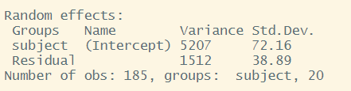

```{r setup, include=FALSE}
source('assets/setup.R')
library(tidyverse)
library(patchwork)
library(effects)
library(knitr)
library(kableExtra)
library(broom.mixed)
library(sjPlot)
library(lme4)
```

# Flashcards: `lm` to `lmer`

```{r echo=FALSE}
require(patchwork)
source("plottingmixedmods.R")
random_intercept_model = mod2
random_slopes_model = mod3
b1 <- fixef(mod3) %>% round(3)
u1 <- ranef(mod3)$subject %>% round(3)
su <- as.data.frame(VarCorr(mod3))[, 5] %>% round(3)
s <- sigma(mod3) %>% round(3)
```


In a simple linear regression, there is only considered to be one source of random variability: any variability left unexplained by a set of predictors (which are modelled as fixed estimates) is captured in the model residuals.  
  
Multi-level (or 'mixed-effects') approaches involve modelling more than one source of random variability - as well as variance resulting from taking a random sample of observations, we can identify random variability across different groups of observations. For example, if we are studying a patient population in a hospital, we would expect there to be variability across the our sample of patients, but also across the doctors who treat them.  
  
We can account for this variability by allowing the outcome to be lower/higher for each group (a random intercept) and by allowing the estimated effect of a predictor vary across groups (random slopes).  
  
:::blue
Before you expand each of the boxes below, think about how comfortable you feel with each concept.  
This content is very cumulative, which means often going back to try to isolate the place which we need to focus efforts in learning. 
:::

`r optbegin("Simple Linear Regression", olabel=FALSE,toggle=params$TOGGLE)`

:::frame
**Formula:**  
  
+ $y_i = \beta_0 + \beta_1 x_i + \epsilon_i$  
  
**R command:**  
  
+ `lm(outcome ~ predictor, data = dataframe)`  
  
*Note:* this is the same as `lm(outcome ~ 1 + predictor, data = dataframe)`. The `1 +` is always there unless we specify otherwise (e.g., by using `0 +`).

:::


```{r echo=FALSE}
plot_data + plot_lm
```

`r optend()`

`r optbegin("Clustered (multi-level) data", olabel=FALSE,toggle=params$TOGGLE)`
When our data is clustered (or 'grouped') such that datapoints are no longer independent, but belong to some grouping such as that of multiple observations from the same subject, we have multiple sources of random variability. A simple regression does not capture this.  

If we separate out our data to show an individual plot for each subject, we can see how the fitted regression line from `lm()` is assumed to be the same for each subject.  
  
```{r echo=FALSE, fig.height=10}
plot_lm_fac
```

`r optend()`

`r optbegin("Random intercepts", olabel=FALSE,toggle=params$TOGGLE)`
By including a random-intercept term, we are letting our model estimate random variability around an average parameter (represented by the fixed effects) for the clusters.

:::frame 

**Formula:**  
Level 1:  
  
+ $y_{ij} = \beta_{0i} + \beta_{1i} x_{ij} + \epsilon_{ij}$  
  
Level 2:  
  
+ $\beta_{0i} = \gamma_{00} + \zeta_{0i}$   

Where the expected values of $\zeta_{0}$, and $\epsilon$ are 0, and their variances are $\sigma_{0}^2$ and $\sigma_\epsilon^2$ respectively. We will further assume that these are normally distributed.

We can now see that the intercept estimate $\beta_{0i}$ for a particular group $i$ is represented by the combination of a mean estimate for the parameter ($\gamma_{00}$) and a random effect for that group ($\zeta_{0i}$).

**R command:**  
  
+ `lmer(outcome ~ predictor + (1 | grouping), data = dataframe)`  
  
:::

Notice how the fitted line of the random intercept model has an adjustment for each subject.  
Each subject's line has been moved up or down accordingly. 

```{r echo=FALSE, fig.height=8, fig.width=12}
plot_lm_fac + plot_ri_fac
```

`r optend()`

`r optbegin("Shrinkage", olabel=FALSE,toggle=params$TOGGLE)`

If you think about it, we might have done a similar thing with the tools we already had at our disposal, by using `lm(y~x+subject)`.
This would give us a coefficient for the difference between each subject and the reference level intercept, or we could extend this to `lm(y~x*subject)` to give us an adjustment to the slope for each subject.  
  
However, the estimate of these models will be slightly different:  

```{r echo=FALSE}
plot_shrinkage
```

**Why?** One of the benefits of multi-level models is that our cluster-level estimates are shrunk towards the average depending on a) the level of across-cluster variation and b) the number of datapoints in clusters. 

`r optend()`

`r optbegin("Random slopes", olabel=FALSE,toggle=params$TOGGLE)`

:::frame 

**Formula:**  
Level 1:  
  
+ $y_{ij} = \beta_{0i} + \beta_{1i} x_{ij} + \epsilon_{ij}$  
  
Level 2:  
  
+ $\beta_{0i} = \gamma_{00} + \zeta_{0i}$  
+ $\beta_{1i} = \gamma_{10} + \zeta_{1i}$  

Where the expected values of $\zeta_0$, $\zeta_1$, and $\epsilon$ are 0, and their variances are $\sigma_{0}^2$, $\sigma_{1}^2$, $\sigma_\epsilon^2$ respectively. We will further assume that these are normally distributed.

As with the intercept $\beta_{0i}$, the slope of the predictor $\beta_{1i}$ is now modelled by a mean $\gamma_{10}$ and a random effect for each group ($\zeta_{1i}$). 


**R command:** 
  
+ `lmer(outcome ~ predictor + (1 + predictor | grouping), data = dataframe)`  
  
*Note:* this is the same as `lmer(outcome ~ predictor + (predictor | grouping), data = dataframe)` . Like in the fixed-effects part, the `1 +` is assumed in the random-effects part.

:::

```{r echo=FALSE, fig.height=8, fig.width=12}
plot_ri_fac + plot_rs_fac
```

`r optend()`


`r optbegin("Fixed effects", olabel=FALSE, toggle=params$TOGGLE)`
We can extract the *fixed effects* using the `fixef()` function:

These are the overall intercept and slope. 
```{r}
fixef(random_slopes_model)
```
`r optend()` 

`r optbegin("Random effects", olabel=FALSE, toggle=params$TOGGLE)`  
The plots below show the fitted values for each subject from each model that we have gone through in these expandable boxes (simple linear regression, random intercept, and random intercept & slope): 

```{r echo=FALSE, fig.width=12}
plotdata2<-
  ggplot(dat, aes(x=x1,y=outcome, col=subject))+
  geom_point(alpha=0.5)+geom_path(alpha=0.5)+
  theme_classic()+
  theme(plot.title = element_text(hjust = 0.5), legend.position = "none")+
  scale_y_continuous(breaks=NULL)+scale_x_continuous(breaks=NULL)+
  labs(title="- The data (by subject) - ", y="y", x="x")+
  NULL

#(plot_data + plotdata2 ) / (plot_lm2 + plot_ri + plot_rs)
plot_lm2 + plot_ri + plot_rs
```

In the random-intercept model (center panel), the differences from each of the subjects' intercepts to the fixed intercept (thick green line) have mean 0 and standard deviation $\sigma_0$.  The standard deviation (and variance, which is $\sigma_0^2$) is what we see in the random effects part of our model summary (or using the `VarCorr()` function).  

```{r echo=FALSE, out.width="400px"}

```

In the random-slope model (right panel), the same is true for the differences from each subjects' slope to the fixed slope. 
We can extract the deviations for each group from the fixed effect estimates using the `ranef()` function.  
  
These are the deviations from the overall intercept ($\widehat \gamma_{00} = `r b1[1]`$) and slope ($\widehat \gamma_{10} = `r b1[2]`$) for each subject $i$.  
```{r}
ranef(random_slopes_model)
```
`r optend()` 

`r optbegin("Group-level coefficients", olabel=FALSE, toggle=params$TOGGLE)`
We can also see the actual intercept and slope for each subject $i$ directly, using the `coef()` function.  

```{r}
coef(random_slopes_model)
```

Notice that the above are the fixed effects + random effects estimates, i.e. the overall intercept and slope + deviations for each subject.

```{r}
coef(random_intercept_model)
```
`r optend()` 

`r optbegin("Visualising Model Fitted values",olabel=FALSE,toggle=params$TOGGLE)`
TODO
`r optend()`

`r optbegin("Visualising Fixed Effects",olabel=FALSE,toggle=params$TOGGLE)`
TODO
`r optend()`


`r optbegin("Plotting random effects", olabel=FALSE, toggle=params$TOGGLE)`
The quick and easy way to plot your random effects is to use the `dotplot.ranef.mer()` function in `lme4`. 

```{r}
randoms <- ranef(random_slopes_model, condVar=TRUE)
dotplot.ranef.mer(randoms)
```

`r optbegin("Completely optional - extracting them for plotting in ggplot", olabel=FALSE, toggle=params$TOGGLE)`
Sometimes, however, we might want to have a bit more control over our plotting, we can extract the estimates and correlations for each subject:  
```{r}
#we can get the random effects:
#(note that we use $subject because there might be other groupings, and the ranef() function will give us a list, with one element for each grouping variable)
randoms <-
  ranef(random_slopes_model)$subject %>%
  mutate(subject = row.names(.)) %>%  # the subject IDs are stored in the rownames, so lets add them as a variable
  pivot_longer(cols=1:2, names_to="term",values_to="estimate") # finally, let's reshape it for plotting

#and the same for the standard errors (from the arm package):
randoms_se <-
  arm::se.ranef(random_slopes_model)$subject %>%
  as.data.frame() %>%
  mutate(subject = row.names(.)) %>%
  pivot_longer(cols=1:2, names_to="term",values_to="se")

# join them together:
ranefs_plotting <- left_join(randoms, randoms_se)

# it's easier for plotting if we
ggplot(ranefs_plotting, aes(y=subject, x=estimate))+
  geom_errorbarh(aes(xmin=estimate-2*se, xmax=estimate+2*se))+
  facet_wrap(~term, scales="free_x")

```

`r optend()`

`r optend()` 

`r optbegin("Polynomials!", olabel=FALSE, toggle=params$TOGGLE)`

Sometimes, data have a clear non-linear pattern, such as a curvilinear trend. In such case, it is reasonable to try modelling the outcome _not_ as a linear function of the variable, but as a curvilinear function of it.

The following plots show data (as black dots) where the outcome $y$ has a nonlinear and decreasing dependence on $x$. That is, as $x$ varies from 1 to 10, the outcome $y$ decreases in a non-linear fashion.
Superimposed to the same data, you can see a linear fit (red line) and a cubic fit (blue).

```{r echo=FALSE, out.widt='100%', fig.heigth = 4, fig.width = 8}
set.seed(5)

u = seq(1, 10, by = 0.5)
v = -(0.2 * u)^3 + rnorm(length(u), sd = 0.2)

pm1 = lm(v ~ u)
pm2 = lm(v ~ 1 + u + I(u^2) + I(u^3))

par(mfrow = c(1,2))
plot(u, v, pch = 16, frame.plot = FALSE, xlab = 'x', ylab = 'y')
curve(cbind(1, x) %*% coef(pm1), col = 'red', add = TRUE)

plot(u, v, pch = 16, frame.plot = FALSE, xlab = 'x', ylab = 'y')
curve(cbind(1, x, x^2, x^3) %*% coef(pm2), col = 'dodgerblue', add = TRUE)
```

The residuals corresponding to each fit are:
```{r echo=FALSE, out.widt='100%', fig.heigth = 4, fig.width = 8}
par(mfrow = c(1,2))

plot(fitted(pm1), resid(pm1), col = 'red', pch = 16, frame.plot = FALSE)
abline(h = 0, col = 'darkgray', xlab = 'Fitted', y = 'Residuals')

plot(fitted(pm2), resid(pm2), col = 'dodgerblue', pch = 16, frame.plot = FALSE)
abline(h = 0, col = 'darkgray', xlab = 'Fitted', y = 'Residuals')
```

Clearly, a linear fit doesn't capture the real trend in the data, and any leftover systematic pattern that the model doesn't explicity account for always ends up in the residuals as the red points show.

On the other hand, once we account for the nonlinear trend, that systematic pattern in the residuals disappears.


The secret is to use instead of $x$ as a predictor, the corresponding polynomial up to a specific order:

$$
y = \beta_0 + \beta_1 x + \beta_2 x^2 + \beta_3 x^3 + \epsilon
$$

Consider the following example data. You can add polynomials up to order 3, for example, of a predictor "time" by saying:

```{r echo=FALSE}
df <- tibble(subject = 1, reaction = rexp(5, 3), time = 1:5)
df
```

```{r}
source("https://uoepsy.github.io/msmr/functions/code_poly.R")

code_poly(df, predictor = 'time', poly.order = 3, draw.poly = FALSE)
```

and use those terms when specifying your linear model. We can, depending on how time is measured (e.g. if we have subjects over time) also include some (or all) of these terms as random effects, for example:

```
lmer(reaction ~ poly1 + poly2 + poly3 + (1 + poly1 | subject))
```

`r optend()`

`r optbegin("Nested and Crossed structures",olabel=FALSE,toggle=params$TOGGLE)`

The same principle we have seen for one level of clustering can be extended to clustering at different levels (for instance, observations are clustered within subjects, which are in turn clustered within groups). 

Consider the example where we have observations for each student in every class within a number of schools:  

```{r echo=FALSE, out.width="1200px"}
knitr::include_graphics("images/structure_id.png")
```

**Question:** Is "Class 1" in "School 1" the same as "Class 1" in "School 2"?  
  
No.  
The classes in one school are distinct from the classes in another **even though they are named the same**.  
  
The classes-within-schools example is a good case of **nested random effects** - one factor level (one group in a grouping varible) appears *only within* a particular level of another grouping variable.  
  
In R, we can specify this using:  
  
`(1 | school) + (1 | class:school)`  
  
or, more succinctly:  
  
`(1 | school/class)`  

Consider another example, where we administer the same set of tasks at multiple time-points for every participant.  
  
**Question:** Are tasks nested within participants?  
  
No.  
Tasks are seen by multiple participants (and participants see multiple tasks).  
  
We could visualise this as the below:  
```{r echo=FALSE, out.width="400px"}
knitr::include_graphics("images/structure_crossed.png")
```

In the sense that these are not nested, they are **crossed** random effects.  
  
In R, we can specify this using:  

`(1 | subject) + (1 | task)`  

:::blue
**Nested vs Crossed**  

*Nested:* Each group belongs uniquely to a higher-level group.   

*Crossed:* Not-nested. 

:::

Note that in the schools and classes example, had we changed data such that the classes had unique IDs (e.g., see below), then the structures `(1 | school) + (1 | class)` and `(1 | school/class)` would give the same results.  
```{r echo=FALSE, out.width="1200px"}
knitr::include_graphics("images/structure_nested.png")
```

`r optend()`

`r optbegin("Inference for multilevel models",olabel=FALSE,toggle=params$TOGGLE)`
TODO
`r optend()`


# Exercises: ??? name


:::frame
__Data: 11 Domain Tests__

44 participants across 4 groups A, B, C, & W (between-subjects) were tested 5 times (waves) in 11 domains. 
In each wave, participants received a score (on a 20-point scale) for each domain and a set of questions which they answered either correctly or incorrectly.  

The data can be accessed using the following code, and a description of the variables in the data can be found in the table below:  
```{r}
load(url("https://uoepsy.github.io/data/msmr_lab5.RData"))
```

```{r echo=FALSE}
tibble(
  variable = names(dat5),
  description = c("Participant Identifier", "?? (not sure but it's not relevant for these questions!)","Study wave (timepoint), ranging from 1 to 5","Domain tested (one of 11 domains studied, including things such as animals (ANI), objects (OBJ), toys (TOY), vehicles (VEH)","Number of questions answered correctly","Number of questions answered incorrectly","Group (between-participants), A, B, C, or W","Score")
) %>% knitr::kable()
```


:::

`r qbegin("B1")`
> Did the groups differ in overall performance?
  
There are different ways to test this: use the 20-point score or the accuracy? Keep the domains separate or calculate an aggregate across all domains? Which way makes the most sense to you?  

Make a plot that corresponds to the research question. Does it look like there's a difference?
`r qend()` 
`r solbegin(show=params$SHOW, toggle=params$TOGGLE)`
Lots of options for this one, here is one that shows Group and Domain differences:

```{r}
ggplot(dat5, aes(Domain, Score, color=Group)) +
  stat_summary(fun.data=mean_se, geom="pointrange") +
  coord_flip()
```
And another:
```{r}
library(ggridges)
ggplot(dat5, aes(x=Score,y=Domain,fill=Domain)) +
  geom_density_ridges()+
  facet_wrap(~Group)+
  viridis::scale_fill_viridis(discrete=T,option = "plasma")
```
Looks like there are group differences and domain differences, but not much in the way of group-by-domain differences.
`r solend()` 

`r qbegin("B2")`
> Did the groups differ in overall performance?

Use a mixed-effects model to test the difference.  
  
+ Will you use a linear or logistic model?
+ What should the fixed(s) effect be? 
+ What should the random effect(s) be? We have observations clustered by subjects and by domains - are they nested?  
  
  
*Tip:* For now, we can forget about the longitudinal aspect to the data, because the research question is only concerned with overall performance.
`r qend()` 
`r solbegin(show=params$SHOW, toggle=params$TOGGLE)`
We're interested in the amount to which Groups vary in their overall performance, so we want a fixed effect of Group. Subjects and Domains are not nested - each subject sees different domains, and each domain is seen by multiple subjects.  

```{r}
# maximal model doesn't converge, removed random Group slopes for Domain
mod_grp <- lmer(Score ~ Group + 
                   (1 | Anonymous_Subject_ID) + 
                   (1 | Domain), 
                 data=dat5, REML=FALSE)
summary(mod_grp)
```

Yes, substantial Group differences: overall, group A does the best, groups C and B next, and group W does the worst. 
`r solend()` 


`r qbegin("B3")`
> Did performance change over time (across waves)? Did the groups differ in pattern of change?


Make a plot that corresponds to the research question. Does it look like there was a change? A group difference?
`r qend()` 
`r solbegin(show=params$SHOW, toggle=params$TOGGLE)`

```{r, fig.width=5, fig.height=4}
ggplot(dat5, aes(Wave, Score, color=Group, fill=Group)) +
  stat_summary(fun.data=mean_se, geom="ribbon", alpha=0.3, color=NA) +
  stat_summary(fun.y=mean, geom="line")
```

Yes, looks like groups A, C, and W are improving, but it looks like group B is getting worse.
`r solend()` 


`r qbegin("B4")`
> Did performance change over time (across waves)? Did the groups differ in pattern of change?

Use mixed-effects model(s) to test this.  
<br>
*Hint:* Fit a baseline model in which scores change over time (wave), then assess improvement in model fit due to inclusion of overall group effect and finally the interaction of group with time.  
`r qend()` 
`r solbegin(show=params$SHOW, toggle=params$TOGGLE)`
_Remember:_ If we're using a likelihood ratio test to compare models (like we are here), then the models should be fitted with ML, not REML. `anova(model1,model2)` will re-fit them automatically for us, but we specify it specifically for each model here anyway:  
```{r}
mod_wv <- lmer(Score ~ Wave + 
                   (1 + Wave | Anonymous_Subject_ID) + 
                   (1 + Wave | Domain), 
                 data=dat5, REML=FALSE,
                 lmerControl(optimizer = "bobyqa"))

mod_wv_grp <- lmer(Score ~ Wave+Group + 
                   (1 + Wave | Anonymous_Subject_ID) + 
                   (1 + Wave | Domain), 
                 data=dat5, REML=FALSE,
                 lmerControl(optimizer = "bobyqa"))

mod_wv_x_grp <- lmer(Score ~ Wave*Group + 
                   (1 + Wave | Anonymous_Subject_ID) + 
                   (1 + Wave | Domain), 
                 data=dat5, REML=FALSE,
                 lmerControl(optimizer = "bobyqa"))

anova(mod_wv, mod_wv_grp, mod_wv_x_grp)
summary(mod_wv_x_grp)
```
`r solend()` 

`r qbegin("B5")`
Using `broom.mixed::augment()` for the model with a Wave*Group interaction, plot the average (`stat_summary()` perhaps?) model fitted values for each group across Waves. Add in the observed data too.  
`r qend()` 
`r solbegin(show=TRUE, toggle=params$TOGGLE)`
```{r}
broom.mixed::augment(mod_wv_x_grp) %>%
  ggplot(., aes(Wave, Score, color=Group)) +
  stat_summary(fun.data=mean_se, geom="pointrange") +
  stat_summary(aes(y=.fitted), fun=mean, geom="line")
```

*We fit a linear model, but the model fit lines are not straight lines. Why is that?*  
`r solend()` 


`r qbegin("B6")`
Create individual subject plots for the data and the model's fitted values. Will these show straight lines?  
<br>
*Hint:* make use of `facet_wrap()` to create a different panel for each level of a grouping variable.  
`r qend()` 
`r solbegin(show=params$SHOW, toggle=params$TOGGLE)`
```{r}
broom.mixed::augment(mod_wv_x_grp) %>%
  ggplot(., aes(Wave, Score, color=Group)) +
  facet_wrap(~ Anonymous_Subject_ID) +
  stat_summary(fun.data=mean_se, geom="pointrange") +
  stat_summary(aes(y=.fitted), fun.y=mean, geom="line")
```

The individual subject plots show linear fits, which is a better match to the model. But now we see the missing data -- some participants only completed the first few waves.  
`r solend()` 


`r qbegin("B7")`
Make a plot of the actual (linear) model prediction.  
<br>
*Hint:* Use the `effect()` function from the `effects` package.  
`r qend()` 
`r solbegin(show=params$SHOW, toggle=params$TOGGLE)`

```{r}
library(effects)
ef <- as.data.frame(effect("Wave:Group", mod_wv_x_grp))
ggplot(ef, aes(Wave, fit, color=Group, fill=Group)) +
  geom_ribbon(aes(ymax=fit+se, ymin=fit-se), color=NA, alpha=0.1) +
  geom_line()
```

`r solend()` 

`r qbegin("B8")`
What important things are different between the plot from question B7 and that from question B5? (You can see the plots we created for these questions below). 

```{r echo=FALSE}
library(patchwork)
broom.mixed::augment(mod_wv_x_grp) %>%
  ggplot(., aes(Wave, Score, color=Group)) +
  stat_summary(fun.data=mean_se, geom="pointrange") +
  stat_summary(aes(y=.fitted), fun=mean, geom="line")+
  labs(title="mean .fitted values")+
ggplot(ef, aes(Wave, fit, color=Group, fill=Group)) +
  geom_ribbon(aes(ymax=fit+se, ymin=fit-se), color=NA, alpha=0.1) +
  geom_line() +
  labs(title="model prediction")
```

Why do you think these two plots differ? 
`r optbegin("Hint",olabel=F,toggle=params$TOGGLE)`
The reason is visible here:
```{r echo=FALSE}
broom.mixed::augment(mod_wv_x_grp) %>%
  ggplot(., aes(Wave, Score, color=Group)) +
  facet_wrap(~ Anonymous_Subject_ID) +
  stat_summary(fun.data=mean_se, geom="pointrange") +
  stat_summary(aes(y=.fitted), fun.y=mean, geom="line")+
         theme(strip.text.x = element_text(size=8, margin = margin(0,0,0,0, "cm")))
```
 
`r optend()`


`r qend()` 
`r solbegin(show=params$SHOW, toggle=params$TOGGLE)`
*Group B was not actually getting worse. The appearance that it was getting worse is an artifact of selective drop-out: there's only a few people in this group and the better-performing ones only did the first few waves so they are not represented in the later waves, but the worse-performing ones are contributing to the later waves. The model estimates how the better-performing ones would have done in later waves based on their early-wave performance and the pattern of performance of other participants in the study.*  

```{r echo=FALSE}
cfs <- coef(summary(mod_wv_x_grp))
```

```{r}
summary(mod_wv_x_grp)$coefficients
```

Note that the Group A slope (coefficient for `Wave`) is `r round(cfs[2, 1], 3)` and, relative to that slope, the Group B slope is `r round(cfs[6, 1], 3)` (coefficient for `Wave:GroupB`). This means that the model-estimated slope for Group B is `r round(cfs[2, 1] + cfs[6, 1], 3)`, which is very slightly positive, not strongly negative as appeared in the initial plots.

One of the valuable things about mixed-effects (aka multilevel) modeling is that individual-level and group-level trajectories are estimated. This helps the model overcome missing data in a sensible way. In fact, MLM/MLR models are sometimes used for imputing missing data. However, one has to think carefully about *why* data are missing. Group B is small and it might just be a coincidence that the better-performing participants dropped out after the first few waves, which would make it easier to generalize the patterns to them. On the other hand, it might be the case that there is something about the study that makes better-performing members of Group B drop out, which should make us suspicious of generalizing to them.
`r solend()` 


`r qbegin("B9")`
Create a plot of the subject and domain random effects. 
Notice the pattern between the random intercept and random slope estimates for the 11 domains - what in our model is this pattern representing?  
`r qend()` 
`r solbegin(show=params$SHOW, toggle=params$TOGGLE)`
```{r}
randoms <- ranef(mod_wv_x_grp, condVar=TRUE)
dotplot.ranef.mer(randoms)
```

Notice that the domains with the lower relative intercept tend to have a higher relative slope (and vice versa). This is the negative correlation between random intercepts and slopes for domain in our model: 
```{r}
VarCorr(mod_wv_x_grp)
```

Try removing the correlation (hint: use the `||`) to see what happens. Does it make sense that these would be correlated? (Answer: we don't really know enough about the study, but it's something to think about!)
`r solend()` 
<!-- Formatting -->


# Less Guided Exercise

:::frame  

Instead of step-by-step questions, this exercise is designed to get you thinking more, giving you practice for the report and for your future research. If it helps, you can find a (sort of) checklist for multilevel models [here](LINKTODO) (but please be aware that there is no 'one-size-fits-all' approach - this checklist may not always be appropriate for every research question with multi-level data)

:::
`r qbegin()`
> How does aggressive behaviour change over adolescence? How is this change dependent upon whether or not a child has siblings?  

:::frame
__Data: Aggressive Behaviour in Adolescence__

Data was collected from 30 secondary schools across Scotland. A cohort of students were followed up every year from the age of 12 to 19. Each year, they completed the Aggressive Behaviour Scale (ABS). Data was also captured on the number of siblings each child had.  
The data can be accessed from [https://uoepsy.github.io/data/schoolsabs.csv](https://uoepsy.github.io/data/schoolsabs.csv) . A description of the variables can be found in the table below.  

```{r echo=FALSE}
absdat <- read_csv("../../data/schoolsabs.csv")
tibble(
  variable = names(absdat),
  description = c("School Identifier","Score on the Aggressive Behaviour Scale (Z-scored)","Age (in years) of child at observation","Within-School Child Identifier","Sibling status (No/Yes)")
) %>% knitr::kable()
```
:::

`r qend()`
`r solbegin(show=params$SHOW_SOLS, toggle=params$TOGGLE)`

Let's start by just exploring the data a bit more. 

```{r echo=FALSE}
absdat %>% select(schoolid) %>% n_distinct()
absdat %>% select(schoolid,childid) %>% n_distinct()
```

We have 500 students from 30 different schools. Schools tend to have data from about 17 children. Some schools have data from as few as 13 children, some have data from as many as 20.  

```{r eval=F}
absdat %>% 
  group_by(schoolid) %>% 
  summarise(
    nchildren = n_distinct(childid)
  ) %>% summary
```

Note that the `childid` variable does __not__ uniquely identify each child. We need to also know which school child "1" comes from.  
```{r eval=F}
absdat %>% count(schoolid,childid) %>% select(n) %>% table
```
We can see that for some children we have fewer than the 7 observations: some have 6, 5, 4, or 3.

There are lots of different ways we can cut up the data
```{r}
ggplot(absdat, aes(x = year, y = ABS,col=siblings)) +
  stat_summary(geom="pointrange",aes(group=siblings),alpha=.5)+
  stat_summary(geom="line",aes(group=siblings),alpha=.5)+
  labs(title="Average ABS scores over age by number of siblings", x = "Age", y = "Aggressive Behaviour Score")

ggplot(absdat, aes(x = year, y = ABS,col=siblings)) +
  stat_summary(geom="pointrange",aes(group=schoolid),alpha=.2)+
  stat_summary(geom="line",aes(group=schoolid),alpha=.2)+
  labs(title="School level mean ABS scores", x = "Age", y = "Aggressive Behaviour Score")

ggplot(absdat, aes(x = year, y = ABS,col=siblings)) +
  stat_summary(geom="line",aes(group=interaction(schoolid,childid)),alpha=.2)+
  facet_wrap(~siblings, labeller = label_both) +
  labs(title="Children's trajectories of ABS scores",x = "Age", y = "Aggressive Behaviour Score")
```

Now let's think a bit about the various considerations that go into fitting a multi-level model.  

- We can group our data by whether or not they have siblings, by school, and by child.  
- We're specifically interested in differences between the levels of the `siblings` variable, so that is going to be in our fixed effects. 
- We're not interested in drawing inferences about specific schools or specific children. The schools and children in our dataset in this case are just a random sample of the wider population of schools and children. They will account for some variability in the outcome (e.g. some children are more aggressive than others, maybe some schools tend to have more aggressive children in them than others). So our model wants to account for this, but we don't want to specifically estimate differences. These will be our random effects. 
- Schools and children is one of the most obvious cases of _nested_ random effects. Each child belongs to one, and only one school. This means we are going to want to model the structure `(1 | School / Child)`. 
- The `childid` variable does __not__ uniquely identify a single child. It just says "1","2", etc. But child 1 from school 1 is a different child from child 1 in school 2. We need to remember this, and if we want to separate out our random effects of school and child, then we'll need `(1 | School) + (1 | Child:School)`.  
  Alternatively, we could make a new child identifier variable that _does_ uniquely identify each child. 
- Along with being interested in differences between having/not-having siblings, we're also interested in change over time. From our initial plotting, we see there is some curvature present, and this is most apparent in the group of children with siblings. Are we interested in differences between sibling groups at the first timepoint (age 12?). Possibly? This depends a lot on the research field.   
- We know that effects of time can vary by child, and so also by school. Children don't change in whether or not they have siblings (well, they might, not often), so we can't really think of "the effect of having siblings on aggressive behaviours for child $i$" because child $i$ always has the same number of siblings.  However, within a school, some children have siblings, some don't, so it might be that this effect can vary by-school. 


```{r}
source("https://uoepsy.github.io/msmr/functions/code_poly.R")
absdat <- code_poly(absdat, "year", poly.order = 2, orthogonal = T, draw.poly = F)

basemod <- 
  lmer(ABS ~ poly1 + poly2 + (1 + poly1 + poly2 | schoolid/childid), 
     data = absdat,
     control = lmerControl(optimizer = "bobyqa"))
isSingular(basemod)
basemod <- 
  lmer(ABS ~ poly1 + poly2 + (1 + poly1 | schoolid) +
         (1 + poly1 + poly2 | childid:schoolid), 
     data = absdat,
     control = lmerControl(optimizer = "bobyqa"))

summary(basemod)
broom.mixed::augment(basemod) %>%
  ggplot(.,aes(x=poly1,y=.fitted))+
  geom_line(aes(group=interaction(schoolid,childid)), alpha=.1)+
  stat_summary(geom="pointrange")+stat_summary(geom="line")

linmod <- 
  lmer(ABS ~ siblings*poly1 + poly2 + (1 + poly1 | schoolid) +
         (1 + poly1 + poly2 | childid:schoolid), 
     data = absdat,
     control = lmerControl(optimizer = "bobyqa"))
quadmod <- 
  lmer(ABS ~ siblings*(poly1 + poly2) + (1 + poly1 | schoolid) +
         (1 + poly1 + poly2 | childid:schoolid), 
     data = absdat,
     control = lmerControl(optimizer = "bobyqa"))
anova(basemod,linmod,quadmod)
```


`r solend()`


<div class="tocify-extend-page" data-unique="tocify-extend-page" style="height: 0;"></div>
