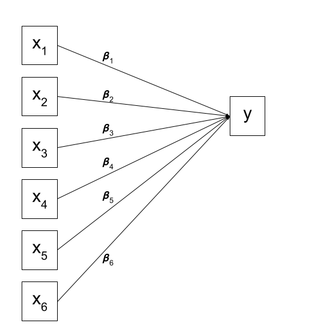
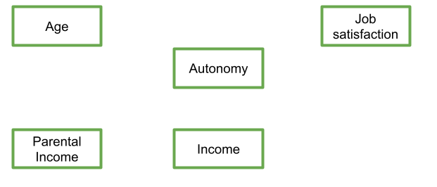
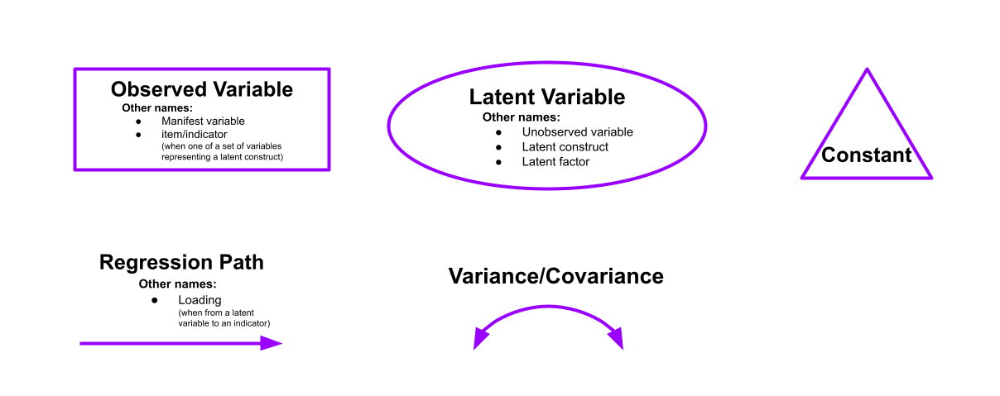
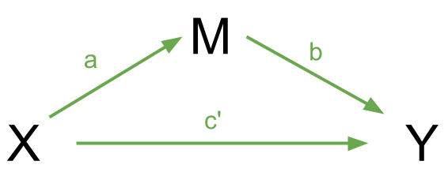
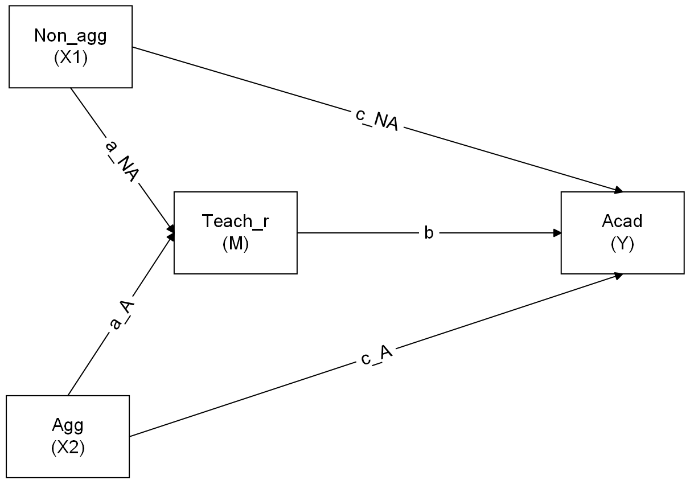

```{r setup, include=FALSE}
library(tidyverse)
library(lavaan)
library(semPlot)
library(tidySEM)

source('assets/setup.R')
options(digits=3)
library(pander)
panderOptions('round', 3)
panderOptions('keep.trailing.zeros', TRUE)
```

:::lo

This week we are temporarily putting aside the idea of latent variables, and looking in more depth at the framework for fitting and testing models as a system of variables connected by arrows (or "paths").  

Next week, we bring this technique together with what we have learned about latent variable modelling (i.e., the idea of a latent "factor"), to enable us to build some really quite sophisticated models.

:::


# Motivating Path Analysis

<!-- :::frame -->

<!-- **Mountains cannot be surmounted except by winding paths** -->

<!-- ::: -->

Over the course of USMR and the first block of this course, you have hopefully become pretty comfortable with the regression world, and can see how it is extended to lots of different types of outcome and data structures. So far in MSMR our discussion of regressions have all focused on how this can be extended to multiple levels. This has brought so many more potential study designs that we can now consider modelling - pretty much any study where we are interested in explaining some outcome variable, and where we have sampled clusters of observations (or clusters of clusters of clusters of ... etc.).  

But we are still restricted to thinking, similar to how we thought in USMR, about one single outcome variable. In fact, if we think about the structure of the fixed effects part of a model (i.e., the bit we're _specifically interested in_), then we're still limited to thinking of the world in terms of "this is my outcome variable, everything else predicts it". 

:::statbox
__Regression as a path diagram__    

1. Imagine writing the names of all your variables on a whiteboard
2. Specify which one is your dependent (or "outcome" or "response") variable. 
3. Sit back and relax, you're done!

In terms of a _theoretical_ model of the world, there's not really much to it. We have few choices in the model we construct beyond specifying which is our outcome variable.  
We can visualise our multiple regression model like this: 
```{r mregfig, out.width="250px", echo=FALSE,fig.cap="In multiple regression, we decide which variable is our outcome variable, and then everything else is done for us"}

```

Of course, there are a few other things that are included (an intercept term, the residual error, and the fact that our predictors can be correlated with one another), but the idea remains pretty much the same:

```{r mregfig2, out.width="250px", echo=FALSE,fig.cap="Multiple regression with intercept, error, predictor covariances"}
knitr::include_graphics("images/path/mregpath2.png")
```
:::
<br>

## Theories and Models

What if I my theoretical model of the world doesn't fit this structure?  

Let's suppose I have 5 variables: Age, Parental Income, Income, Autonomy, and Job Satisfaction. I draw them up on my whiteboard:
```{r path1nopath, out.width="350px", echo=FALSE,fig.cap="My variables"}

```

My theoretical understanding of how these things fit together leads me to link my variables to end up with something like that in Figure \@ref(fig:path1path). 
```{r path1path, out.width="350px", echo=FALSE,fig.cap="My theory about my system of variables"}
knitr::include_graphics("images/path/paths1paths.png")
```
In this diagram, a persons income is influenced by their age, their parental income, and their level of autonomy, and in turn their income predicts their job satisfaction. Job satisfaction is also predicted by a persons age directly, and by their level of autonomy, which is also predicted by age. It's complicated to look at, but in isolation each bit of this makes theoretical sense. 

Take each arrow in turn and think about what it represents:
```{r path1pathdesc, out.width="550px", echo=FALSE}
knitr::include_graphics("images/path/paths1desc.png")
```

If we think about trying to fit this "model" with the tools that we have, then we might end up wanting to fit three separate regression models, which between them specify all the different arrows in the diagram:

$$
\begin{align}
\textrm{Job Satisfaction} & = \beta_0 + \beta_1(\textrm{Age}) + \beta_2(\textrm{Autonomy}) + \beta_3(\textrm{Income}) + \varepsilon \\
\textrm{Income} & = \beta_0 + \beta_1(\textrm{Age}) + \beta_2(\textrm{Autonomy}) + \beta_3(\textrm{Parental Income}) + \varepsilon \\
\textrm{Autonomy} & = \beta_0 + \beta_1(\textrm{Age}) + \varepsilon \\
\end{align}
$$

In this case, our theoretical model involves having multiple __endogenous__ (think "outcome") variables. So what do we do if we want to talk about how well the entire model (Figure \@ref(fig:path1path)) fits the data we observed? This is where path analysis techniques come in handy.   

:::statbox
**New terminology!**

- **Exogenous variables** are a bit like what we have been describing with words like "independent variable" or "predictor". In a SEM diagram, they have no paths coming from other variables in the system, but have paths *going to* other variables.
- **Endogenous variables** are more like the "outcome"/"dependent"/"response" variables we are used to. They have some path coming from another variable in the system (and may also - but not necessarily - have paths going out from them).

:::

# Introducing Path Analysis

It might help to think of the starting point of path analysis as drawing the variables on a whiteboard and drawing arrows to reflect your theory about the system of variables that you observed (much like in Figure \@ref(fig:path1nopath) and \@ref(fig:path1path) above). 
  
As it happens, we have already seen the conventions for how to depict variables and parameters in these type of diagrams in last week's lab: by using rectangles (observed variables), ovals (latent variables), single headed arrows (regression paths) and double headed arrows (covariances), we can draw various model structures (as mentioned at the top of this page, we are temporarily putting aside the latent variables today).   
  
We _could_ try to fit some of these more complex models by just using `lm()` many times over and fitting various regression models. Path analysis is a bit like this, but all in one. It involves fitting a set of regression equations simultaneously. One obvious benefit of this is that it can allow us to talk about "model fit" (in the way we discussed in last week's lab) in relation to our entire _theory_, rather than to individual regressions that make up only part of the theoretical model.  


:::lo
__Refresher on path diagrams__  

- **Observed variables** are represented by squares or rectangles. These are the named variables of interest which exist in our dataset - i.e. the ones which we have measured directly.  
- **Latent variables** are represented as ovals/ellipses or circles.    
- **Covariances** are represented by double-headed arrows. In many diagrams these are curved.   
- **Regressions** are shown by single headed arrows (e.g., an arrow from $x$ to $y$ for the path $y \sim x$).   **Factor loadings** are also regression paths.     
Recall that specifying a factor structure is simply to say that some measured variables $y_i$ are each regressed onto some unmeasured factor(s) - $y = \lambda \cdot F + u$ looks an awful lot like $y = \beta \cdot x + \epsilon$!!).  

```{r echo=FALSE, out.width = "95%"}

```
:::


<!-- ## How does it work? -->

<!-- For Path Diagrams that meet a certain set of pre-requisites, we can use a cool technique called Path Tracing to estimate the different paths (i.e., the coefficients) from just the covariance matrix of the dataset.  -->
<!-- For us to be able to do this, a Path Diagram must meet these criteria: -->

<!-- - All our exogenous variables are correlated (unless we specifically assume that their correlation is zero) -->
<!-- - All models are 'recursive' (no two-way causal relations, no feedback loops) -->
<!-- - Residuals are uncorrelated with exogenous variables -->
<!-- - Endogenous variables are not connected by correlations (we would use correlations between residuals here, because the residuals are not endogenous) -->
<!-- - All 'causal' relations are linear and additive -->
<!-- - 'causes' are unitary (if A -> B and A -> C, then it is presumed that this is the same aspect of A resulting in a change in both B and C, and not two distinct aspects of A, which would be better represented by two correlated variables A1 and A2).  -->

<!-- :::statbox -->
<!-- **Causal??** -->

<!-- It is a slippery slope to start using the word 'cause', and personally I am not that comfortable using it here. However, you will likely hear it a lot in resources about path analysis, so it is best to be warned.   -->

<!-- Please keep in mind that we are using a very broad definition of 'causal', simply to reflect the one way nature of the relationship we are modeling. In Figure \@ref(fig:causes), a change in the variable **X1** is associated with a change in **Y**, but not vice versa.   -->
<!-- __These are still just *associations*.__   -->

<!-- ```{r causes, echo=FALSE, fig.cap="Paths are still just regressions."} -->
<!-- knitr::include_graphics("images/path/causes.png") -->
<!-- ``` -->
<!-- ::: -->

<!-- __Tracing Rules__   -->

<!-- Thanks to [Sewal Wright](https://www.jstor.org/stable/pdf/2527551.pdf?casa_token=3QF0ad2ZoBcAAAAA:MbEkDNNdoLZr1SXE4LrnK--qrhhsTXLgsRtcWre1UvWxiQiGNUl5vWytGp34XIxhAYMZJe-MbIcBnEwXSfX6MAONevz04-sMXpEDI3IaYKk6mMX46QvX), we can express the correlation between any two variables in the system as the sum of all *compound paths* between the two variables.  -->

<!-- *compound paths* are any paths you can trace between A and B for which there are:  -->

<!-- - no loops -->
<!-- - no going forward then backward -->
<!-- - maximum of one curved arrow per path -->

<!-- :::frame -->
<!-- __An example__   -->

<!-- Let's consider the example below, for which the paths are all labelled with lower case letters $a, b, c, \text{and } d$.  -->

<!-- ```{r patheq1, echo=FALSE, fig.cap="A multiple regression model as a path diagram"} -->
<!-- knitr::include_graphics("images/path/patheq1.png") -->
<!-- ``` -->

<!-- According to Wright's tracing rules above, write out the equations corresponding to the 3 correlations between our observed variables (remember that $r_{a,b} = r_{b,a}$, so it doesn't matter at which variable we start the paths).  -->

<!-- - $r_{x1,x2} =  c$   -->
<!-- - $r_{x1,y} = a + bc$   -->
<!-- - $r_{x2,y} =  b + ac$   -->

<!-- ```{r echo=F} -->
<!-- egdat <- read_csv("../../data/patheg.csv") -->
<!-- ``` -->

<!-- Now let's suppose we observed the following correlation matrix: -->
<!-- ```{r} -->
<!-- egdat <- read_csv("https://uoepsy.github.io/data/patheg.csv") -->
<!-- round(cor(egdat),2) -->
<!-- ``` -->
<!-- We can plug these into our system of equations: -->

<!-- - $r_{x1,x2} = c = 0.36$   -->
<!-- - $r_{x1,y} = a + bc = 0.75$    -->
<!-- - $r_{x2,y} = b + ac = 0.60$ -->

<!-- And with some substituting and rearranging, we can work out the values of $a$, $b$ and $c$.  -->

<!-- `r optbegin("Click for answers", olabel=FALSE, toggle=params$TOGGLE)` -->
<!-- This is what I get: -->

<!-- a = 0.61   -->
<!-- b = 0.38   -->
<!-- c = 0.36   -->

<!-- `r optend()` -->
<!-- <br> -->
<!-- We can even work out what the path labeled $d$ (the residual variance) is.   -->
<!-- First we sum up all the equations for the paths from Y to Y itself.   -->
<!-- These are: -->

<!-- - $a^2$ (from Y to X1 and back)   -->
<!-- - $b^2$ (from Y to X2 and back)   -->
<!-- - $acb$ (from Y to X1 to X2 to Y) -->
<!-- - $bca$ (from Y to X2 to X1 to Y) -->

<!-- Summing them all up and solving gives us:   -->
<!-- $$ -->
<!-- \begin{align} -->
<!--  r_{y \cdot x1, x2} & = a^2 + b^2 + acb + bca\\ -->
<!--  & = 0.61^2 + 0.38^2 + 2 \times(0.61 \times 0.38 \times 0.36)\\ -->
<!--  & = 0.68 \\ -->
<!-- \end{align} -->
<!-- $$ -->
<!-- We can think of this as the portion of the correlation of Y with itself that occurs *via the predictors*. Put another way, this is the amount of variance in Y explained jointly by X1 and X2, which sounds an awful lot like an $R^2$!   -->
<!-- The path labelled $d$ is simply all that is left in Y after taking out the variance explained by X1 and X2, meaning that the path $d = \sqrt{1 - R^2}$ (i.e., the residual variance!).   -->

<!-- Hooray! We've just worked out regression coefficients when all we had was the correlation matrix of the variables! It's important to note that we have been using the correlation matrix, so, somewhat unsurprisingly, our estimates are *standardised* coefficients.  -->

<!-- Because we have the data itself, let's quickly find them with `lm()` -->
<!-- ```{r} -->
<!-- # quickly scale all the columns in the data -->
<!-- egdat <- egdat %>% mutate_all(~scale(.)[,1]) -->
<!-- # extract the coefs -->
<!-- coef(lm(y~x1+x2, egdat)) %>% round(.,2) -->
<!-- # extract the r^2 -->
<!-- summary(lm(y~x1+x2, egdat))$r.squared -->
<!-- ``` -->
<!-- ::: -->

# Mediation

Another benefit is that we are no longer limited to studying only simple relationships between x and y, we can now study how x might change z which _in turn_ might change y.  
  
As an example, let's imagine we are interested in peoples' intention to get vaccinated, and we observe the following variables: 

- Intention to vaccinate (scored on a range of 0-100)  
- Health Locus of Control (HLC) score (average score on a set of items relating to perceived control over ones own health)  
- Religiosity (average score on a set of items relating to an individual's religiosity). 

We are assuming here that we do not have the individual items, but only the scale scores (if we had the individual items we might be inclined to model religiosity and HLC as latent variables!).   
If we draw out our variables, and think about this in the form of a standard regression model with "Intention to vaccinate" as our outcome variable, then all the lines are filled in for us (see Figure \@ref(fig:mregpath))

```{r mregpath, echo=FALSE, fig.cap="Multiple regression: choose your outcome, sit back and relax"}
knitr::include_graphics("images/path/path1.png")
```

But what if our theory suggests that some other model might be of more relevance? For instance, what if we believe that participants' religiosity has an effect on their Health Locus of Control score, which in turn affects the intention to vaccinate (see Figure \@ref(fig:medpath1))?   
  
In this case, the HLC variable is thought of as a **mediator**, because is mediates the effect of religiosity on intention to vaccinate. We are specifying presence of a distinct type of effect: **direct** and **indirect**. 

:::lo
**Direct vs Indirect**  

In path diagrams:

- Direct effect = one single-headed arrow between the two variables concerned  
- Indirect effect = An effect transmitted via some other variables   

If we have a variable $X$ that we take to 'cause' variable $Y$, then our path diagram will look like so:
```{r echo=FALSE}
knitr::include_graphics("images/path/MED1.png")
```
In this diagram, path $c$ is the __total effect__. This is the _unmediated_ effect of $X$ on $Y$.  
  
However, while the effect of $X$ on $Y$ could in part be explained by the process of being mediated by some variable $M$, the variable $X$ could still affect $Y$ directly.  
Our mediating model is shown below:

```{r echo=FALSE}

```

In this case, path $c'$ is the __direct effect__, and paths $a$ and $b$ make up the __indirect effect__.  

You will find in some areas people talk about the ideas of __"complete"__ vs __"partial"__ mediation. "Complete mediation" is when $X$ _no longer_ affects $Y$ after $M$ has been controlled (so path $c'$ is not significantly different from zero), and "partial mediation" is when the path from $X$ to $Y$ is _reduced in magnitude_ when the mediator $M$ is introduced, _but still different from zero._  

:::

```{r medpath1, echo=FALSE, fig.cap="Mediation as a path model. If you're interested, you can find the inspiration for this data from the paper [here](https://www.ncbi.nlm.nih.gov/pmc/articles/PMC7596314/). I haven't properly read it though!"}
knitr::include_graphics("images/path/path2.png")
```


Now that we've seen how path analysis works, we can use that same logic to investigate models which have quite different structures, such as those including mediating variables. So if we can't fit our theoretical model into a regression framework, let's just fit it into a framework which is lots of regressions smushed together!  
  
Luckily, we can just get the **lavaan** package to do all of this for us. So let's look at fitting the model in Figure \@ref(fig:medpath1). 

First we read in our data: 
```{r}
vax <- read_csv("https://uoepsy.github.io/data/vaxdat.csv")
summary(vax)
```
Then we specify the relevant paths:
```{r}
med_model <- " 
    intention ~ religiosity
    intention ~ hlc
    hlc ~ religiosity
"
```

If we fit this model as it is, we won't actually be testing the indirect effect, we will simply be fitting a couple of regressions.  

To do that, we need to explicitly define the indirect effect in the model, by first creating a label for each of its sub-component paths, and then defining the indirect effect itself as the __product__ of these ([click here for a lovely pdf explainer from Aja](https://uoepsy.github.io/msmr/2223/indirect_effects.pdf) on _why_ the indirect effect is calculated as the product).   

In lavaan, we use a new operator, `:=`, to create this estimate. 

```{r}
med_model <- " 
    intention ~ religiosity
    intention ~ b*hlc
    hlc ~ a*religiosity
    
    indirect := a*b
"
```


:::lo
**:=** 

_This operator 'defines' new parameters which take on values that are an arbitrary function of the original model parameters. The function, however, must be specified in terms of the parameter labels that are explicitly mentioned in the model syntax._
  
([the lavaan project](https://lavaan.ugent.be/))

Note. The labels we use are completely up to us. This would be equivalent:
```{r eval=FALSE}
med_model <- " 
    intention ~ religiosity
    intention ~ peppapig * hlc
    hlc ~ kermit * religiosity
    
    indirect := kermit * peppapig
"
```

:::

Finally, we estimate our model.  
It is common to estimate the indirect effect using bootstrapping (a method of resampling the data with replacement, thousands of times, in order to empirically generate a sampling distribution). We can do this easily in lavaan, using the `sem()` function:  

```{r}
mm1.est <- sem(med_model, data=vax, se = "bootstrap") 
```
  
And we can get out estimates for all our parameters, including the one we created called "indirect".  
```{r}
summary(mm1.est, ci = TRUE)
```

# Mediation Exercises 

:::frame
This week's lab focuses on the technique of path analysis using the same context as previous weeks: conduct problems in adolescence. In this week's example, a researcher has collected data on n=557 adolescents and would like to know whether there are associations between conduct problems (both aggressive and non-aggressive) and academic performance and whether the relations are mediated by the quality of relationships with teachers.  

The data is available at https://uoepsy.github.io/data/cp_teachacad.csv  
:::

`r qbegin("A1")`
First, read in the dataset.  
`r qend()` 
`r solbegin(show=params$SHOW_SOLS, toggle=params$TOGGLE)`
```{r message=FALSE}
cp_teach<-read_csv("https://uoepsy.github.io/data/cp_teachacad.csv")
summary(cp_teach)
```
`r solend()`

`r qbegin("A2")`
Use the `sem()` function in lavaan to specify and estimate a straightforward linear regression model to test whether aggressive and non-aggressive conduct problems significantly predict academic performance.  

How do your results compare to those you obtain using the `lm()` function?
`r qend()` 
`r solbegin(show=params$SHOW_SOLS, toggle=params$TOGGLE)`
``` {r simple regression in lavaan}
# we can fit the model in lavaan as follows:
# first we specify the model using lavaan syntax
sr_lavaan<-'Acad ~ Non_agg+Agg'

# next we can estimate the model using the sem() function
sr_lavaan.est<-sem(sr_lavaan, data=cp_teach)

# we can inspect the results using the summary() function
summary(sr_lavaan.est)

# the same model can be fit using lm():
sr_lm<-lm(Acad~Non_agg+Agg, data=cp_teach)
summary(sr_lm)
```

We can see that both non-aggressive and aggressive conduct problems significantly predict academic performance. We can also see that we get the same results when we use the `sem()` function as we do when we use the `lm()` function. Lavaan will give essentially the same results as `lm()` for simple  and multiple regression problems. However, if we have multiple outcome variables in our model it is advantageous to do this using path mediation model with lavaan. This allows us to include all the regressions in a single model.
`r solend()`

`r qbegin("A3")`
Now specify a model in which non-aggressive conduct problems have both a direct and indirect effect (via teacher relationships) on academic performance.

Sketch the path diagram using the website suggested in the lecture, https://www.diagrams.net/. To export the diagram to PNG, click File -> Export As -> PNG.
`r qend()` 

`r solbegin(show=params$SHOW_SOLS, toggle=params$TOGGLE)`

```{r echo=FALSE, out.width="85%"}
knitr::include_graphics("images/path/msmr-w8-a.png")
```

```{r path analysis for non-aggressive conduct problems}
model1<-'
    #we regress academic performance on non-aggressive conduct problems (the direct effect)
    Acad ~ Non_agg
    
    #we regress academic peformance on teacher relationship quality
    Acad ~ Teach_r
    
    #we regress teacher relationship quality on non-aggressive conduct problems
    Teach_r ~ Non_agg 
'
```
`r solend()`

`r qbegin("A4")`
Now define the indirect effect in order to test the hypothesis that non-aggressive conduct problems have both a direct and an indirect effect (via teacher relationships) on academic performance. 

Fit the model and examine the 95% CI.
`r qend()` 
`r solbegin(show=params$SHOW_SOLS, toggle=params$TOGGLE)`

```{r path analysis for non-aggressive conduct problems with constraints}
#model specification
model1 <- '
    Acad ~ Non_agg
    #we label the two parameters that comprise the indirect effect b and a
    Acad ~ b*Teach_r    
    Teach_r ~ a*Non_agg  
    
    # the indirect effect is the product of a and b. We create a new parameter (ind) to estimate the indirect effect
    ind := a*b   
'

#model estimation
model1.est <- sem(model1, data=cp_teach, se='bootstrap') 

# we request bootstrapped standard errors to assess the significance of the indirect effect
summary(model1.est, ci=T)
```

::: red
__Note__

The confidence intervals computed using bootstrapping may be slightly different for you. This is normal, as bootstrap is based on random sampling!
:::

We can see that the 95% bootstrapped confidence interval for the indirect effect of non-aggressive conduct problems on academic performance ('ind') does not include zero. We can conclude that the indirect effect is significant at $\alpha = .05$. The direct effect is also statistically significant.
`r solend()`

`r qbegin("A5")`
Specify a new parameter which is the total (direct+indirect) effect of non-aggressive conduct problems on academic performance
`r qend()` 
`r solbegin(show=params$SHOW_SOLS, toggle=params$TOGGLE)`
We can create a new parameter that is the sum of the direct and indirect effect to evaluate the total effect of non-aggressive conduct problems on academic performance.

```{r path analyis total}
#model specification
model1 <- '
    # we now also label the direct effect of non-aggressive conduct problems on academic performance
    Acad ~ c*Non_agg    
    Acad ~ b*Teach_r    
    Teach_r ~ a*Non_agg  
    
    ind := a*b
    
    #the total effect is the indirect effect plus the direct effect
    total := c + a*b 
'

#model estimation
model1.est <- sem(model1, data=cp_teach, se='bootstrap') 

# we request bootstrapped standard errors to assess the significance of the indirect effect
summary(model1.est, ci=T)
```
`r solend()`


`r qbegin("A6")`
Now visualise the estimated model and its parameters using the `semPaths()` function from the `semPlot` package.  
`r qend()` 
`r solbegin(show=params$SHOW_SOLS, toggle=params$TOGGLE)`
```{r visualise the model}
#to include the parameter estimates we set what='est'
semPaths(model1.est, what='est')

#to change label size, add edge.label.cex = 1.5
#you can adjust 1.5 to other values
```

`r solend()`

## A more complex model

`r qbegin("B1")`
Using the website website suggested in the lecture, https://www.diagrams.net/, sketch the path diagram for a model in which both aggressive and non-aggressive conduct problems have both direct and indirect effects (via teacher relationships) on academic performance. To export the diagram to PNG, click File -> Export As -> PNG.

Now specify the model in R, taking care to also define the parameters for the indirect effects.
`r qend()` 
`r solbegin(show=params$SHOW_SOLS, toggle=params$TOGGLE)`

There are many ways in which you could position the variables in your diagram, so the two path diagrams below are equivalent:

## {- .tabset}

### Option A
```{r echo=FALSE, out.width="85%"}

```

### Option B

```{r echo=FALSE, out.width="85%"}
knitr::include_graphics("images/path/msmr-w8-b2.png")
```

## {-}

We now have two predictors, one mediator and one outcome (and two indirect effects, one for each predictor). We can represent this in two lines: one where we specify academic performance as the outcome variable and one where we specify teacher relationships (the mediator) as the outcome variable. 

```{r two predictors}
model2 <- '
    Acad ~ Agg + Non_agg + b*Teach_r
    Teach_r ~ a_A*Agg + a_NA*Non_agg
   
    ind_A  := a_A*b  #indirect effect for aggressive conduct problems
    ind_NA := a_NA*b #indirect effect for non-aggressive conduct problems
'
```

`r solend()`

`r qbegin("B2")`
Now estimate the model and test the significance of the indirect effects
`r qend()` 
`r solbegin(show=params$SHOW_SOLS, toggle=params$TOGGLE)`

```{r estimate two predictor model}
model2.est<-sem(model2,  data=cp_teach,se='bootstrap') 
summary(model2.est, ci=T)
```

We can see that the 95% confidence intervals for both indirect effects do not include zero, therefore, we can conclude that they are significant at the $\alpha = .05$ level. 
`r solend()`

`r qbegin("B3")`
Write a brief paragraph reporting on the results of the model estimates in Question B2. Include a Figure or Table to display the parameter estimates.
`r qend()` 
`r solbegin(show=params$SHOW_SOLS, toggle=params$TOGGLE)`

:::int 

A path mediation model was used to test the direct and indirect effects (via teacher relationship quality) of aggressive and non-aggressive conduct problems on academic performance. In the model, academic performance was regressed on teacher relationship quality, non-aggressive conduct problems and aggressive conduct problems while teacher relationship quality (the mediator) was regressed on aggressive and non-aggressive conduct problems. The indirect effects were tested using the product of the coefficient for the regression of outcome on mediator and the coefficient for the regression of mediator on predictor. The statistical significance of the indirect effects were evaluated using bootstrapped 95% confidence intervals with 1000 bootstrap samples.

Unstandardised parameter estimates are provided in Figure \@ref(fig:pathcp). Solid lines indicate that a parameter is significant at the 5% significance level, while dashed lines represent non-significant paths.The indirect effects of both non-aggressive  ($b = 0.09$, 95% CI=0.05-0.14) and aggressive ($b = 0.15$, 95% CI=0.08-0.22) conduct problems on academic performance were statistically significant. 

```{r pathcp, echo=FALSE, out.width="1200px", fig.cap="Effect of conduct problems on academic performance mediated by quality of teacher relationship."}
knitr::include_graphics("images/path/pathanaly.png")
```
:::

`r solend()`

`r optbegin("Optional: Mediation the more manual way: back to lm()", olabel=FALSE, toggle=params$TOGGLE)`  

Following [Baron & Kenny 1986](http://citeseerx.ist.psu.edu/viewdoc/download?doi=10.1.1.917.2326&rep=rep1&type=pdf), we can conduct mediation analysis by using three separate regression models.  

1. $y \sim x$
2. $m \sim x$
3. $y \sim x + m$

Step 1. Determine the presence of `y ~ x`:  
*if x predicts y, then there is possibility to detect mediation*  
```{r}
vax <- read_csv("https://uoepsy.github.io/data/vaxdat.csv")

mod1 <- lm(intention ~ religiosity, data = vax)
summary(mod1)$coefficients
```

Step 2. Determine the presence of `m ~ x`:
*if x predicts m, then there is possibility to detect mediation*
```{r}
mod2 <- lm(hlc ~ religiosity, data = vax)
summary(mod2)$coefficients
```
Step 3. Examine the effect of `y ~ x + m`:  
*If the x no longer predicts y after partialling out effects due to m, then there is __full__ mediation. If the effect of x on y is smaller, then there is __partial__ mediation.* 
```{r}
mod3 <- lm(intention ~ religiosity + hlc, data = vax)
summary(mod3)$coefficients
```
Step 4. Test for the mediation.  
There are various ways to do this, but the simplest is probably:
```{r}
library(mediation)
summary(mediate(mod2, mod3, treat='religiosity', mediator='hlc', boot=TRUE, sims=500))
```

ACME: Average Causal Mediation Effects  
ADE: Average Direct Effects  
Total Effect: sum of the mediation (indirect) effect and the direct effect.   

`r optend()`


<!-- Formatting -->

<div class="tocify-extend-page" data-unique="tocify-extend-page" style="height: 0;"></div>

