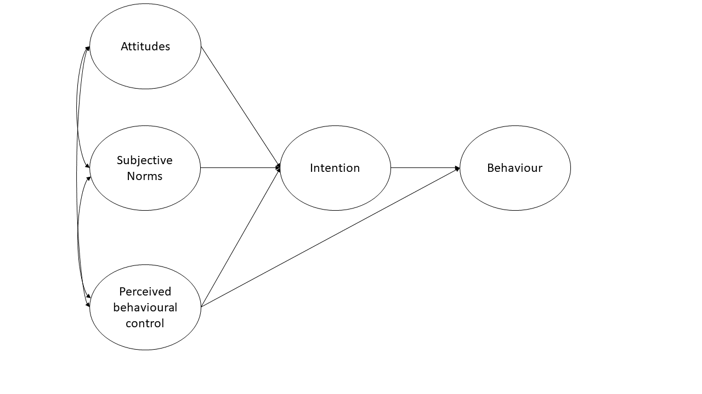

```{r setup, include=FALSE}
library(tidyverse)
library(lavaan)
source('assets/setup.R')
options(digits=3)
library(pander)
panderOptions('round', 3)
panderOptions('keep.trailing.zeros', TRUE)
```


# Measurement Error and the need for SEM

We've been mentioning Structural Equation Modelling (SEM) for a few weeks now, but we haven't been very clear on what exactly it is. Is it CFA? Is it Path Analysis? In fact it is both - it is the overarching framework of which CFA and Path Analysis are just parts. 

The beauty comes in when we put these two approaches together.  
Path analysis, as we saw last week, offers a way of specifying and evaluating a *structural* model, in which variables relate to one another in various ways, via different (sometimes indirect) paths. Common models like our old friend multiple regression can be expressed in a Path Analysis framework.  
Factor Analysis, on the other hand, brings something absolutely crucial to the table - it allows us to mitigate some of the problems which are associated with measurement error by specifying the existence of some latent variable. 

Combine them and we can reap the rewards of having both a *structural model* and a *measurement model*. The measurement model is our specification between the items we directly observed, and the latent variables of which we consider these items to be manifestations. The structural model is our specified model of the relationships between the latent variables.  

## Scale Scores

You will often find research that foregoes the measurement model by taking a scale score (i.e., the sum or mean of a set of likert-type questions). 
This is what we did in the example in last week's exercises, e.g.:  

<div style="border-left: 4px solid #a41ae4;font-size: 1em;">
  
- Intention to vaccinate (scored on a range of 0-100.
- Health Locus of Control (HLC) score (**average score on a set of items** relating to perceived control over ones own health).
- Religiosity (**average score on a set of items** relating to an individual's religiosity). 
  
```{r echo=FALSE}
knitr::include_graphics("images/path/path2.png")
```
</div>


In doing so, we make the assumption that these variables provide measurements of the underlying latent construct **without error**. Furthermore, when taking the *average* score, we also make the assumption that each item is equally representative of our construct. 

If you think about it, taking the mean of a set of items still has the sense of being a 'factor structure' in that we think of the items as being , but it constrains all our item variances to be equal, and all our factor loadings to be equal. So it doesn't really have the benefits of a factor model. 

Let's demonstrate this, using a dataset from the CFA week exercises. 
It doesn't matter what it is for this example, so I'm just going to keep the first 4 items (it will save me typing out all the others!)  
```{r}
df <- read_csv("https://uoepsy.github.io/data/conduct_problems_2.csv")[,1:4]
head(df)
```
Now suppose that we are just going to take the mean of each persons score on the items, and use that as our measure of "conduct problems".  
We can achieve this easily with `rowMeans()`
```{r}
# column bind the data with a column of the row means. 
# only print the head of the data for now
cbind(df, mean = rowMeans(df)) %>% head
```
Expressed as a factor model, what we are specifying is the below. Notice how we make it so that certain paths are identical by using a label i (for all factor loadings) and j (for all item variances). 
```{r}
mean_model <- '
    CP =~ i*item1 + i*item2 + i*item3 + i*item4
    item1 ~~ j*item1
    item2 ~~ j*item2
    item3 ~~ j*item3
    item4 ~~ j*item4
'
fitmean <- sem(mean_model, data = df)
```
We can obtain our factor scores using `predict()`. Let's put them side-by-side with our `rowMeans()`, and we need to standardise them to get them in the same units:
```{r}
factor_scores = scale(predict(fitmean))
rowmeans = scale(rowMeans(df))
cbind(factor_scores, rowmeans) %>% head
```

An alternative option would be to conduct a factor analysis where we allow our loadings to be estimated freely (without the equality constraint that is created by using a row-mean or a row-sum). We could then extract the factor scores, and then conduct a path analysis with those scores. This avoids the problem of equally weighting of items to construct, but does not solve our issue of the fact that these variables are *imperfect* measures  of the latent construct. 

## Reliability

The accuracy and inconsistency with which an observed variable reflects the underlying construct that we consider it to be measuring is termed the *reliability*.  

:::frame
**A silly example** 

Suppose I'm trying to weigh [my dog](images/dug.jpg). I have a set of scales, and I put him on the scales. He weighs in at 13.53kg. 
I immediately do it again, and the scales this time say 13.41kg. I do it again. 13.51kg, and again, 13.60kg. 
What is happening? Is Dougal's weight (Dougal is the dog, by the way) randomly fluctuating by 100g? Or are my scales just a bit inconsistent, and my observations contain measurement error?  

```{r echo=FALSE}
tibble(
    measurement =1:4,
    dougal = c(13.53,13.41,13.51,13.6)
) %>% 
    ggplot(.,aes(x=measurement,y=dougal))+
    geom_point()+
    geom_hline(yintercept=13.483,lty="dashed")+
    geom_text(x=3,y=13.484,label="Dougal's true weight (unknown to us)",
              vjust=-.5)+
    labs(y="Dougal's Weight")
```

I take him to the vets, where they have a much better set of weighing scales, and I do the same thing (measure him 4 times). The weights are 13.47, 13.49, 13.48, 13.48.  
The scales at the vets are clearly *more __reliable__*. We still don't know Dougal's *true* weight, but we are better informed to estimate it if we go on the measurements from the scales at the vet.^[Of course this all assuming that the scales aren't completely miscalibrated] 

```{r echo=FALSE}
tibble(
    scales = rep(c("mine","vets"),each=4),
    measurement = c(1:4,1:4),
    dougal = c(13.53,13.41,13.51,13.6, 13.47, 13.49, 13.48, 13.48)
) %>% 
    ggplot(.,aes(x=measurement,y=dougal, col=scales))+
    geom_point()+
    geom_path()+
    geom_hline(yintercept=13.483,lty="dashed")+
    geom_text(inherit.aes=F, x=3,y=13.484,label="Dougal's true weight (unknown to us)",vjust=-.5)+
    labs(y="Dougal's Weight")
```
:::

Another way to think about reliability is to take the view that $\text{"observations = truth + error"}$, and more error = less reliable.  

There are different types of reliability:  

- **test re-test reliability:** correlation between values over repeated measurements. 
- **alternate-form reliability:** correlation between scores on different forms/versions of a test (we might want different versions to avoid practice effects). 
- **Inter-rater reliability:** correlation between values obtained from different raters. 

The form of reliability we are going to be most concerned with here is known as **Internal Consistency**. This is the extent to which items within a scale are correlated with one another. There are two main measures of this:

:::yellow
**alpha and omega**

$$
\begin{align}
& \text{Cronbach's }\alpha = \frac{n \cdot \overline{cov(ij)}}{\overline{\sigma^2_i} + (n-1) \cdot \overline{cov(ij)}} & \\
& \text{Where:}  \\
& n = \text{number of items} \\
& \overline{cov(ij)} = \text{average covariance between item-pairs}  \\
& \overline{\sigma^2_i} = \text{average item variance}  \\
\end{align}
$$
Ranges from 0 to 1 (higher is better).  
You can get this using the `alpha()` function from the **psych** package. You just give it your items, and it will give you a value. In doing so, it just assumes that all items are of equal importance.  


**McDonald's Omega $\omega$** is substantially more complicated, but avoids the limitation that Cronbach's alpha which assumes that all items are equally related to the construct. You can get it using the `omega()` function from the **psych** package. If you want more info about it then the help docs (`?omega()`) are a good place to start. 

:::


# (Re)introducing SEM

After spending much of our time in the regression framework, the move to SEM can feel mind-boggling. 
Give two researchers the same whiteboard on which your variables are drawn, and they may connect them in completely different ways. This flexibility can at first make SEM feel like a free-for-all (i.e., just do whatever you like, get a p-value out of it, and off we go!). However, to some people this is one of the main benefits: it forces you to be explicit in specifying your theory, and allows you to test your theory and examine how well it fits with the data you observed.  
  
We have actually already go to grips with the starting point of how structural equation models work in the previous weeks.  

1. begin with an **observed covariance matrix**
2. specify our our theoretical model
3. fit our model to the data, with our estimation method (e.g. maximum likelihood) providing us with the set of parameter estimates for our model which best reproduce the observed covariance matrix. 
4. The estimated parameters for our model will not *perfectly* reproduce the covariance matrix, but they will give us a **model implied covariance matrix**. We can compare this to the observed covariance matrix in order to assess the **fit** of our theoretical model.  


SEM allows us to account for measurement error by directly including it as part of the model - the residual variances of our indicator variables (the bits we have been labelling $u$ our diagrams such as Figure \@ref(fig:semmdiag)) represent the measurement error (and other stray causes) associated with each observed variable. 
If we had a latent variable which we considered to be measured _without error_ by a number of items, then we would expect the covariances between the items measuring the latent variable to be exactly 1. However, we always have measurement error, meaning our correlations between items are attenuated (i.e, closer to zero). Modelling this attenuation of between-item correlations as error in measuring some underlying latent variable, allows us to estimate associations between latent variables (which aren't directly measured, and so do not have measurement error associated with them).  

Perhaps the easiest way to think of SEM is as a combination of the CFA approach (latent variables giving rise to our observed variables), and path analysis (where we test a model defined as a collection of paths between variables). In SEM we typically have two somewhat distinct parts: a __measurement model__ (the CFA-like bits from latent variables to their indicators), and the __structural model__ (the paths we are interested in, often between the latent variables). You can see an example below:  

```{r semmdiag, echo=FALSE, fig.cap="SEM diagram. Measurement model in orange, Structural model in purple"}
knitr::include_graphics("images/semdiag.png")
```

:::frame
__You can't test the structural model if the measurement model is bad__  

If you test the relationships between a set of latent factors, and they are not reliably measured by the observed items, then this error propagates up to influence the fit of the structural model.  
To test the measurement model, it is typical to *saturate* the structural model (i.e., allow all the latent variables to correlate with one another). This way any misfit is due to the measurement model only.  

:::


# Fit Indices

:::blue
**Chi-Square - $\chi^2$**  

For structural equation models, a chi-square value can be obtained which reflects the discrepancy between the model-implied covariance matrix and the observed covariance matrix. We can then calculate a p-value for this chi-square statistic by using the chi-square distribution with the degrees of freedom equivalent to that of the model. 

If we denote the population covariance matrix as $\Sigma$ and the model-implied covariance matrix as $\Sigma(\Theta)$, then we can think of the null hypothesis here as $H_0: \Sigma - \Sigma(\Theta) = 0$. In this way our null hypothesis is that our theoretical model is correct (and can therefore perfectly reproduce the covariance matrix).  

It is very sensitive to departures from normality, as well as sample size (for models with $n>400$, the $\chi^2$ is almost always significant), and can often lead to rejecting otherwise adequate models.  

:::


:::frame
__Absolute fit indices__  

"Absolute" measures of fit are based on comparing our model to a (hypothetical) _perfectly fitted model._ So we get an indication of "how far from perfect fit" our model is. Bigger values on these measures tend to indicate worse fit.  

:::blue 

**Standardised Root Mean Square Residual - SRMR**  

Standardised root mean square residual (SRMR) summarises the average covariance residuals (discrepancies between observed and model-implied covariance matrices). Smaller SRMR equates to better fit. 

Common cut-offs for __SRMR:__    

- $<0.08$ : Good fit   

:::

:::blue

**Root Mean Square Error of Approximation - RMSEA**     

The RMSEA is another measure of absolute fit, but it penalises for the complexity of the model. Based on the $\chi^2/df$ ratio, this measure of fit is intended to take into account for the fact the model might hold *approximately* (rather than exactly) in the population. 

Typical cut-offs for **RMSEA**:  

- $<0.05$ : Close fit   
- $>0.1$ : Poor fit  

:::

:::

:::frame
__Incremental fit__  

"Incremental" fit indices are more similar to how we think about $R^2$. A value of 0 is the worst possible fitting model, and values of 1 is the best possible fitting model. These fit indices compare the fit of the model to the that of a baseline model. In most cases, this is the *null model*, in which there are no relationships between latent variables (i.e., covariances among latent variables are all assumed to be zero).  


:::blue  
**Tucker Lewis Index (TLI)** and **Comparative Fit Index (CFI)**  

Both of these (TLI & CFI) are somewhat sensitive to the average size of correlations in the data. If the average correlation between variables is low, then these indices will not be very high.  
Apparently (not sure where this comes from), TLI and CFI shouldn't be considered if the RMSEA for the null model is $<.158$ (you can quickly get the RMSEA for the null model by using `nullRMSEA(my_fitted_model)` from the __semTools__ package).  


Common cut-offs for __TLI:__    

- $<0.9$ : Poor fit  
- $1$ : Very good fit  
- $>1$ : Possible overfitting  

Common cut-offs for __CFI:__    

- $\sim 1$ : Good fit  

:::
:::

:::frame
__To compare multiple models__  


:::blue

**Akaike Information Criterion - AIC**  
**Baysian Information Criterion - BIC**   
**Sample Size Adjusted BIC - SSBIC**   

We have already been introduced to AIC and BIC in the regression world, but we now add to that the *sample size adjusted BIC* (SSBIC). These indices are only meaningful when making comparisons, meaning that two different models must be estimated. Lower values indicate better fit. comparing mode
The AIC is a comparative measure of fit and so it is meaningful only when two different models are estimated.  Lower values indicate a better fit and so the model with the lowest AIC is the best fitting model.  There are somewhat different formulas given for the AIC in the literature, but those differences are not really meaningful as it is the difference in AIC that really matters:

:::

:::

## Local Fit (Modification Indices)    

In addition to the overall fit of our model, we can look at specific parameters, the inclusion of which may improve model fit. These are known as **modification indices**, and you can get them from passing a SEM object to `modindices()` or `modificationindices()`. They provide the estimated value for each additional parameter, and the improvement in the $\chi^2$ value that would be obtained with its addition to the model. Note that it will be tempting to look at modification indices and start adding to your model to improve fit, but this should be strongly guided by whether the additional paths make theoretical sense. Additionally, once a path is added, and modification indices are computed on the new model, you may find some completely different paths are suggested as possibly modification indices! 
    
# Exercises

A researcher wants to apply the theory of planned behaviour to understand engagement in physical activity. The theory of planned behaviour is summarised in Figure \@ref(fig:tpb) (only the latent variables and not the items are shown). Attitudes refer to the extent to which a person had a favourable view of exercising; subjective norms refer to whether they believe others whose opinions they care about believe exercise to be a good thing; and perceived behavioural control refers to the extent to which they believe exercising is under their control. Intentions refer to whether a person intends to exercise and 'behaviour' is a measure of the extent to which they exercised. Each construct is measured using four items. 

```{r tpb, echo=FALSE, fig.cap="Theory of planned behaviour (latent variables only)"}

```

The data is available either:  

+ as a .RData file: https://uoepsy.github.io/data/TPB_data.Rdata
+ as a .txt file: https://uoepsy.github.io/data/TPB_data.txt 


`r qbegin("A1")`
Did you do the final exercise (writing up your results) from last week? Our example write-up is now visible (see [last week](https://uoepsy.github.io/msmr/labs/08_path.html#A_more_complex_model)) against which you can compare yours.

__Please note:__ Writing-up is an important skill, and attempting these questions yourself (rather than simply reading through the example write-ups) will help _a lot_ when it comes to writing your assessment.

`r qend()` 

`r qbegin("A2")`
Read in the data using the appropriate function. We've given you **.csv** files for a long time now, but it's good to be prepared to encounter all sorts of weird filetypes. 

Can you successfully read in from both types of data?  
`r qend()` 
`r solbegin(show=params$SHOW_SOLS, toggle=params$TOGGLE)`
Either one or the other of:
```{r read in data}
load(url("https://uoepsy.github.io/data/TPB_data.Rdata"))

TPB_data <- read.table("https://uoepsy.github.io/data/TPB_data.txt", header = TRUE, sep = "\t")
```
`r solend()`

`r qbegin("A3")`
Test separate one-factor models for each construct.  
Are the measurement models satisfactory? *(check their fit measures)*. 
`r qend()` 
`r solbegin(show=params$SHOW_SOLS, toggle=params$TOGGLE)`
```{r fit CFA models}
# specify one factor CFA model for attitudes
attitude_model <- 'att =~ attitude1 + attitude2 + attitude3 + attitude4'
# estimate the model
attitude_model.est <- cfa(attitude_model, data=TPB_data)
# inspect the output
summary(attitude_model.est, fit.measures=T, standardized=T)
#check the model fit and that RMSEA<.05, SRMR<.05, TLI>0.95 and CFI>.95 and that all loadings are significant and >|.30|
modificationindices(attitude_model.est)
#check the largest modification indices to see if the expected parameter changes are large enough to justify any additional parameters in the  model
```

The above code shows you the steps you should run through for the attitudes construct. You should repeat these steps for each of:  

+ attitudes  
+ subjective norms  
+ perceived behavioural control  
+ intentions  
+ behaviour  

`r solend()`

`r qbegin("A4")`
Using lavaan syntax, specify a structural equation model that corresponds to the model in Figure \@ref(fig:tpb). For each construct use a latent variable measured by the corresponding items in the dataset. 
`r qend()` 
`r solbegin(show=params$SHOW_SOLS, toggle=params$TOGGLE)`
```{r specify TPB model}
TPB_model<-'
#measurement models for attitudes, subjective norms and perceived behavioural control
  
  att =~ attitude1 + attitude2 + attitude3 + attitude4
  SN =~ SN1 + SN2 + SN3 + SN4
  PBC =~ PBC1 + PBC2 + PBC3 + PBC4
  intent =~ int1 + int2 + int3 + int4
  beh =~ beh1 + beh2 + beh3 + beh4

#regressions  

  beh ~ intent + PBC
  intent ~ att + SN + PBC

#covariances between attitudes, subjective norms and perceived behavioural control
  
  att ~~ SN    
  att ~~ PBC
  SN ~~ PBC
'

```
`r solend()`

`r qbegin("A5")`
Estimate the model from Question A4 and evaluate the model  

+ Does the model fit well?  
+ Are the hypothesised paths significant?  

`r qend()` 
`r solbegin(show=params$SHOW_SOLS, toggle=params$TOGGLE)`

We can estimate the model using the `sem()` function.  
By default the `sem()` function will scale the latent variables by fixing the loading of the first item for each latent variable to 1 but we can override this by setting `std.lv=T` if we wanted to. By default, maximum likelihood estimation will be used.

```{r estimate TPB_model}
TPB_model.est<-sem(TPB_model, data=TPB_data, std.lv=T)

summary(TPB_model.est, fit.measures=T, standardized=T)
```

We can see that the model fits well according to RMSEA, SRMR, TLI and CFI. All of the hypothesised paths in the theory of planned behaviour are statistically significant.
`r solend()`

`r qbegin("A6")`
Examine the modification indices and expected parameter changes - are there any additional parameters you would consider including?  
`r qend()` 
`r solbegin(show=params$SHOW_SOLS, toggle=params$TOGGLE)`

```{r modindices}
modindices(TPB_model.est)
```

In this case, none of the expected parameter changes are large enough that we would consider including any additional parameters
`r solend()`

`r qbegin("A7")`
Test the indirect effect of attitudes, subjective norms, and perceived behavioural control on behaviour via intentions.  

Remember, when you fit the model with `sem()`, use `se='bootstrap'` to get boostrapped standard errors (it may take a few minutes). When you inspect the model using `summary()`, get the 95% confidence intervals for parameters with `ci = TRUE`. 
`r qend()` 
`r solbegin(show=params$SHOW_SOLS, toggle=params$TOGGLE)`
To test these indirect effects we create new a parameter for each indirect effect:

```{r indirect effects}
TPB_model2<-'
#measurement models for attitudes, subjective norms and perceived behavioural control
  
  att =~ attitude1 + attitude2 + attitude3 + attitude4
  SN =~ SN1 + SN2 + SN3 + SN4
  PBC =~ PBC1 + PBC2 + PBC3 + PBC4
  intent =~ int1 + int2 + int3 + int4
  beh =~ beh1 + beh2 + beh3 + beh4

#regressions  

  beh ~ b*intent + PBC
  intent ~ a1*att + a2*SN + a3*PBC

##covariances between attitudes, subjective norms and perceived behavioural control
  att ~~ SN    
  att ~~ PBC
  SN ~~ PBC

ind1:= a1*b  #indirect effect of attitudes via intentions
ind2:= a2*b  #indirect effect of subjective norms via intentions
ind3:= a3*b  #indirect effect of perceived behavioural control via intentions
'

```

When we estimate the model, we request boostrapped standard errors: 

```{r estimate model 2}
TPB_model2.est<-sem(TPB_model2, se='bootstrap', data=TPB_data)
```

When we inspect the model, we request the 95% confidence intervals for parameters: 

```{r summarise model 2}
summary(TPB_model2.est, fit.measures=T, standardized=T, ci=T)

```

We can see that all of the indirect effects are statistically significant at p<.05 as none of the 95% confidence intervals for the coefficients include zero.
`r solend()`

`r qbegin("A8")`
Write up your analysis as if you were presenting the work in academic paper, with brief separate 'Method' and 'Results' sections
`r qend()` 
`r solbegin(show=params$SHOW_SOLS, toggle=params$TOGGLE)`
An example write up would be as follows:

:::int

**Method**

We tested a theory of planned behaviour model of physical activity by fitting a structural equation model in which attitudes, subjective norms, perceived behavioural control, intentions and behaviour were latent variables defined by four items. We first tested the measurement models for each construct by fitting a one-factor CFA model.  Latent variable scaling was by fixing the loading of the first item for each construct to 1. Models were judged to fit well if $CFI$ and $TLI$ were $>.95$ and $RMSEA$ and $SRMR$ were $<.05$. 

Within the SEM, behaviour was regressed on intentions and perceived behavioural control and intentions were regressed on attitudes, subjective norms, and perceived behavioiural control. In addition, attitudes, subjective norms, and perceived behavioural control were allowed to covary. The indirect effects of attitudes, subjective norms and perceived behavioural control on behaviour were calculated as the product of the effect of the relevant predictor on the mediator (intentions) and the effect of the mediator on the outcome. The statistical significance of the indirect effects were evaluated using bootstrapped 95% confidence intervals with 1000 resamples.

In all cases models were fit using maximum likelihood estimation and model fit was judged to be good if CFI and TLI were $>.95$ and RMSEA and SRMR were $<.05$. Modification indices and expected parameter changes were inspected to identify any areas of local mis-fit but model modifications were only made if they could be justified on substantive grounds.

**Results**

All measurement models fit well ($CFI$ and $TLI >.95$ and $RMSEA$ and $SRMR <.05$). The full structural equation model also fit well ($CFI = 1.00$, $TLI = 1.00$, $RMSEA <.001$, $SRMR = 0.023$). Unstandardised parameter estimates are provided in Table  1. All of the hypothesised paths  were statistically significant at $p<.05$. The significant indirect effects suggested that intentions mediate the effects of attitudes, subjective norms, and  perceived behavioural control on behaviour whilst perceived behavioural control also has a direct effect on behaviour. Results thus provide support for a theory of planned behaviour model of physical activity. 

```{r tabsem, echo=FALSE, fig.cap='Unstandardised parameter estimates for structural equation model for a theory of planned behaviour model of physical activity.'}

```

:::

`r solend()`


<!-- Formatting -->

<div class="tocify-extend-page" data-unique="tocify-extend-page" style="height: 0;"></div>
