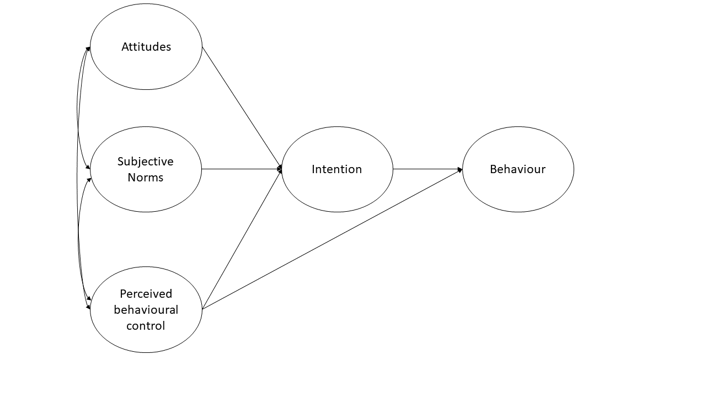
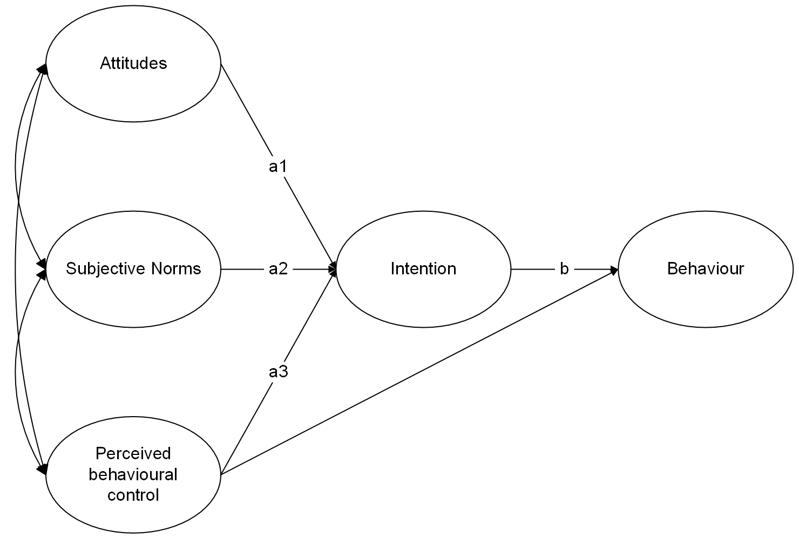

```{r}
#| label: setup
#| include: false
source('assets/setup.R')
library(xaringanExtra)
library(tidyverse)
library(patchwork)
xaringanExtra::use_panelset()
qcounter <- function(){
  if(!exists("qcounter_i")){
    qcounter_i <<- 1
  }else{
    qcounter_i <<- qcounter_i + 1
  }
  qcounter_i
}
library(psych)
library(semPlot)
library(lavaan)
```


# Exercising Exercises

```{r}
#| include: false
set.seed(235)
m = "
att =~ 0.689*attitude1+0.726*attitude2+0.689*attitude3+0.719*attitude4
SN =~ 0.661*SN1+0.651*SN2+0.616*SN3+0.638*SN4
PBC =~ 0.799*PBC1+0.772*PBC2+0.756*PBC3+0.773*PBC4
intent =~ 0.584*int1+0.646*int2+0.625*int3+0.597*int4+0.6*int5
beh =~ 0.649*beh1+0.599*beh2+0.588*beh3+-0.605*beh4

int2~~.4*int4
int1~~.14*int3
SN3~~.12*SN4
PBC1~~.1*PBC2
beh2~~.1*beh3

beh ~ 0.506*intent + 0.185*PBC
intent ~ 0.359*att + 0.196*SN + 0.49*PBC

att~~0.32*SN
att~~0.253*PBC
SN~~0.196*PBC
"
df = simulateData(m, sample.nobs = 890)
df = as.data.frame(apply(df, 2, function(x) as.numeric(cut(x,7,labels=1:7))))
TPB_data<-df
# write.table(df, file = "../../data/tpb2.txt",sep = "\t")
# save(TPB_data, file="../../data/tpb2.Rdata")
```


:::frame
__Dataset: tpb2__  

The "Theory of Planned Behaviour" is a theory about why people engage in certain behaviours. It has been applied in many contexts, and here we are testing the theory as a model of why people exercise.  

The theory is represented in the diagram in @fig-tpb (only the latent variables and not the measured items are shown). **Attitudes** refer to the extent to which a person has a favourable view of exercising; **subjective norms** refer to whether they believe others whose opinions they care about believe exercise to be a good thing; and **perceived behavioural control** refers to the extent to which they believe exercising is under their control. **Intentions** refer to whether a person intends to exercise and **behaviour** is a measure of the extent to which they exercised. Each construct is measured using four items apart from intentions which has five. 

```{r}
#| label: fig-tpb
#| fig-cap: "Theory of planned behaviour (latent variables only)"
#| echo: false

```

The data are available either:  

+ as a .RData file: [https://uoepsy.github.io/data/tpb2.Rdata](https://uoepsy.github.io/data/tpb2.Rdata){target="_blank"}
+ as a .txt file: [https://uoepsy.github.io/data/tpb2.txt](https://uoepsy.github.io/data/tpb2.txt){target="_blank"} 

```{r}
#| label: tbl-tpbdict
#| tbl-cap: "Data Dictionary for TPB data"
#| echo: false
read_csv("data/tpbdictionary.csv") |>
  gt::gt()
```


:::

`r qbegin(qcounter())`
Load in the various packages you will probably need (tidyverse, lavaan), and read in the data using the appropriate function.  

We've given you **.csv** files for a long time now, but it's good to be prepared to encounter all sorts of weird filetypes. Can you successfully read in from both types of data?  
`r qend()` 
`r solbegin(show=params$SHOW_SOLS, toggle=params$TOGGLE)`
Either one or the other of:
```{r read in data}
library(tidyverse)
library(lavaan)
load(url("https://uoepsy.github.io/data/tpb2.Rdata"))

TPB_data <- read.table("https://uoepsy.github.io/data/tpb2.txt", header = TRUE, sep = "\t")
```
`r solend()`


`r qbegin(qcounter())`
Before we test the theory of planned behaviour, we want to think about the measurement models for each of the constructs we are trying to capture.  

Test separate one-factor models for each construct.  
Are the measurement models satisfactory? *(check their fit measures)*. 

::: {.callout-tip collapse="true"}
#### Hints

This isn't anything new - this is just back to `cfa()`! So all the same as in [the CFA reading](https://uoepsy.github.io/lv/04_cfa.html){target="_blank"}, only we need to do it 5 times over.. 

:::

`r qend()` 
`r solbegin("Attitudes",slabel=FALSE, show=params$SHOW_SOLS, toggle=params$TOGGLE)`
Here we specify our one factor CFA model for attitudes:
```{r}
att_mod <- "
  att =~ attitude1 + attitude2 + attitude3 + attitude4
  "
```
And we estimate the model using `cfa()`
```{r}
att_mod.est <- cfa(att_mod, data=TPB_data, std.lv = TRUE)
```
Let's first inspect the fit measures:  
```{r}
fitmeasures(att_mod.est)[c("rmsea","srmr","tli","cfi")]
```
Our fit is good: RMSEA<.05, SRMR<.05, TLI>0.95 and CFI>.95.  
We should also check that all loadings are significant and $>|.30|$.  
To save space I am going to not show the entire summary output here, but just pull out the parameter estimates:  
```{r}
parameterestimates(att_mod.est)
```
They all look good!  
`r solend()`
`r solbegin("Subjective Norms",slabel=FALSE, show=params$SHOW_SOLS, toggle=params$TOGGLE)`

Following the same logic as for the Attitudes, let's fit the CFA for Subjective norms. 
Again, all fit measures are very good, and loadings are all significant at greater than 0.3.  

```{r}
sn_mod <- "
  SubjN =~ SN1 + SN2 + SN3 + SN4
  "

sn_mod.est <- cfa(sn_mod, data=TPB_data, std.lv = TRUE)

fitmeasures(sn_mod.est)[c("rmsea","srmr","tli","cfi")]

parameterestimates(sn_mod.est)
```


`r solend()`
`r solbegin("Perceived Behavioural Control",slabel=FALSE, show=params$SHOW_SOLS, toggle=params$TOGGLE)`

All good with Perceived Behavioural Control!  
Almost _too_ good (TLI>1, and RMSEA is coming out at exactly 0!), but this is most probably because of this being fake data.  
When data is simulated based on a specific model, then fitting that same model structure to the data will obviously fit extremely well!  s
```{r}
pbc_mod <- "
  PBC =~ PBC1 + PBC2 + PBC3 + PBC4
  "

pbc_mod.est <- cfa(pbc_mod, data=TPB_data, std.lv = TRUE)

fitmeasures(pbc_mod.est)[c("rmsea","srmr","tli","cfi")]

parameterestimates(pbc_mod.est)
```


`r solend()`
`r solbegin("Intentions",slabel=FALSE, show=params$SHOW_SOLS, toggle=params$TOGGLE)`

Uh-oh, it's looking less good with Intentions.  
The loadings all look okay, but the fit indices aren't great
```{r}
int_mod <- "
  intent =~ int1 + int2 + int3 + int4 + int5
  "

int_mod.est <- cfa(int_mod, data=TPB_data, std.lv = TRUE)

fitmeasures(int_mod.est)[c("rmsea","srmr","tli","cfi")]

parameterestimates(int_mod.est)
```

Let's examine the modification indices:
```{r}
modindices(int_mod.est, sort = TRUE)
```

It looks like correlating the residuals for items `int2` and `int4` would improve our model. The expected correlation is 0.757, which is fairly large (remember correlations are between -1 and 1).  

Note that the items have a possible theoretical link too, beyond just "intention to exercise". It looks like both `int2` and `int4` are specifically about intentions in the _next three months_. It might make sense that responses to these two items are related more than just representing general 'intention'.  

When we include this covariance, our model fit looks much better!  
```{r}
int_mod <- "
  intent =~ int1 + int2 + int3 + int4 + int5
  int2 ~~ int4
  "

int_mod.est <- cfa(int_mod, data=TPB_data, std.lv = TRUE)

fitmeasures(int_mod.est)[c("rmsea","srmr","tli","cfi")]

parameterestimates(int_mod.est)
```

`r solend()`
`r solbegin("Behaviour",slabel=FALSE, show=params$SHOW_SOLS, toggle=params$TOGGLE)`

Finally, the behaviour model looks absolutely fine.  
Note that `bey4` has a negative loading, which is perfectly okay. In fact, if you look at the items, you'll notice that this is the only item that is reversed (higher scores on the item reflect _less_ exercising)
```{r}
beh_mod <- "
  behav =~ beh1 + beh2 + beh3 + beh4
  "

beh_mod.est <- cfa(beh_mod, data=TPB_data, std.lv = TRUE)

fitmeasures(beh_mod.est)[c("rmsea","srmr","tli","cfi")]

parameterestimates(beh_mod.est)
```


`r solend()`

`r qbegin(qcounter())`
Using lavaan syntax, specify the full structural equation model that corresponds to the model in @fig-tpb. For each construct use the measurement models from the previous question.  

Estimate and evaluate the model  

+ Does the model fit well?  
+ Are the hypothesised paths significant?  

::: {.callout-tip collapse="true"}
#### Hints

This involves specifying the measurement models for all the latent variables, and then also specifying the relationships between those latent variables. All in the same model!  
:::


`r qend()` 
`r solbegin(show=params$SHOW_SOLS, toggle=params$TOGGLE)`
```{r specify TPB model}
TPB_model<-'
  # measurement models  
  att =~ attitude1 + attitude2 + attitude3 + attitude4
  SN =~ SN1 + SN2 + SN3 + SN4
  PBC =~ PBC1 + PBC2 + PBC3 + PBC4
  intent =~ int1 + int2 + int3 + int4 + int5
  beh =~ beh1 + beh2 + beh3 + beh4
  
  # covariances between items
  int2 ~~ int4

  # regressions  
  beh ~ intent + PBC
  intent ~ att + SN + PBC

  # covariances between attitudes, SN, and PBC
  att ~~ SN    
  att ~~ PBC
  SN ~~ PBC
'

```

We can estimate the model using the `sem()` function.  
As with `cfa()`, by default the `sem()` function will scale the latent variables by fixing the loading of the first item for each latent variable to 1.  

```{r estimate TPB_model}
TPB_model.est<-sem(TPB_model, data=TPB_data, std.lv=TRUE)

fitmeasures(TPB_model.est)[c("rmsea","srmr","tli","cfi")]
```

We can see that the model fits well according to RMSEA, SRMR, TLI and CFI.  
From the output below, all of the hypothesised paths in the theory of planned behaviour are statistically significant.  

```{r}
summary(TPB_model.est, standardized=TRUE)
```

`r solend()`

`r qbegin(qcounter())`
Examine the modification indices and expected parameter changes - are there any additional parameters you would consider including?  
`r qend()` 
`r solbegin(show=params$SHOW_SOLS, toggle=params$TOGGLE)`

Making adjustments our theoretical model in order to better represent _this_ sample, we are risking a) over-fitting to the specifics of this sample, and b) testing a theory that we didn't really have _a priori_ (i.e. we didn't have this theoretical model before seeing this data).  

However, it can still be worth looking at modindices in order to assess any places of local misfit in the model. These can provide useful discussion points and make us pause for thought, even if we are happy with our current model fit. 

In this case, none of the expected parameter changes are very large.  

```{r modindices}
modindices(TPB_model.est, sort = TRUE) |> head()
```


`r solend()`

`r qbegin(qcounter())`
Test the indirect effect of attitudes, subjective norms, and perceived behavioural control on behaviour via intentions.  

Remember, when you fit the model with `sem()`, use `se='bootstrap'` to get boostrapped standard errors (it may take a few minutes). When you inspect the model using `summary()`, get the 95% confidence intervals for parameters with `ci = TRUE`. 
`r qend()` 
`r solbegin(show=params$SHOW_SOLS, toggle=params$TOGGLE)`
First, let's name the paths in the structural equation model:

```{r echo=FALSE, out.width="85%"}

```

To test these indirect effects we create new a parameter for each indirect effect:

```{r indirect effects}
TPB_model2 <- '
  # measurement models  
  att =~ attitude1 + attitude2 + attitude3 + attitude4
  SN =~ SN1 + SN2 + SN3 + SN4
  PBC =~ PBC1 + PBC2 + PBC3 + PBC4
  intent =~ int1 + int2 + int3 + int4 + int5
  beh =~ beh1 + beh2 + beh3 + beh4
  
  # covariances between items
  int2 ~~ int4

  # regressions  
  beh ~ b*intent + PBC
  intent ~ a1*att + a2*SN + a3*PBC

  # covariances between attitudes, SN, and PBC
  att ~~ SN    
  att ~~ PBC
  SN ~~ PBC

  # indirect effects:  
  ind1 := a1*b  #indirect effect of attitudes via intentions
  ind2 := a2*b  #indirect effect of SN via intentions
  ind3 := a3*b  #indirect effect of PBC via intentions
'
```

When we estimate the model, we request bootstrapped standard errors: 
```{r}
#| echo: false
# TPB_model2.est<-sem(TPB_model2, std.lv=TRUE, se='bootstrap', data=TPB_data)
# save(TPB_model2.est, file="data/tpb_sem.Rdata")
load("data/tpb_sem.Rdata")
```
```{r estimate model 2}
#| eval: false
TPB_model2.est<-sem(TPB_model2, std.lv=TRUE, se='bootstrap', data=TPB_data)
```

When we inspect the model, we request the 95% confidence intervals for parameters: 

```{r summarise model 2}
summary(TPB_model2.est, ci=TRUE)
```

We can see that all of the indirect effects are statistically significant at p<.05 as none of the 95% confidence intervals for the coefficients include zero.
`r solend()`

`r qbegin(qcounter())`
Write up your analysis as if you were presenting the work in academic paper, with brief separate 'Method' and 'Results' sections
`r qend()` 
`r solbegin(show=params$SHOW_SOLS, toggle=params$TOGGLE)`

**Method**

We tested a theory of planned behaviour model of physical activity by fitting a structural equation model in which attitudes, subjective norms, perceived behavioural control, intentions and behaviour were latent variables defined by four items. We first tested the measurement models for each construct by fitting a one-factor CFA model.  Latent variable scaling was by fixing the loading of the first item for each construct to 1. 

Within the SEM, behaviour was regressed on intentions and perceived behavioural control and intentions were regressed on attitudes, subjective norms, and perceived behavioiural control. In addition, attitudes, subjective norms, and perceived behavioural control were allowed to covary. The indirect effects of attitudes, subjective norms and perceived behavioural control on behaviour were calculated as the product of the effect of the relevant predictor on the mediator (intentions) and the effect of the mediator on the outcome. The statistical significance of the indirect effects were evaluated using bootstrapped 95% confidence intervals with 1000 resamples.

In all cases models were fit using maximum likelihood estimation and model fit was judged to be good if CFI and TLI were $>.95$ and RMSEA and SRMR were $<.05$. Modification indices and expected parameter changes were inspected to identify any areas of local mis-fit but model modifications were only made if they could be justified on substantive grounds.

**Results**

All measurement models fit well (CFI and TLI $>.95$ and RMSEA and SRMR $<.05$) with the exception of the measurement model for intentions. Modification indices suggested the inclusion of residual covariance between two items on the intentions scale (int2 and int4) that both made specific reference to short term intentions. The addition of this parameter resulted in a good fit. 
The full structural equation model (with the residual covariance between int2 and int4 included) fit well (CFI = `r round(fitmeasures(TPB_model2.est)["cfi"],2)`, TLI = `r round(fitmeasures(TPB_model2.est)["tli"],2)`, RMSEA = `r round(fitmeasures(TPB_model2.est)["rmsea"],2)`, SRMR = `r round(fitmeasures(TPB_model2.est)["srmr"],2)`). Unstandardised parameter estimates are provided in @tbl-tabsem. All of the hypothesised paths  were statistically significant at $p<.05$. Significant indirect effects suggested that intentions mediate the effects of attitudes, subjective norms, and  perceived behavioural control on behaviour whilst perceived behavioural control also has a direct effect on behaviour. Results thus provide support for a theory of planned behaviour model of physical activity. 

```{r}
#| echo: false
#| label: tbl-tabsem
#| tbl-cap: "Unstandardised parameter estimates for structural equation model for a theory of planned behaviour model of physical activity. Note: PBC = Perceived Behavioural Control, CI = Confidence Interval"
library(gt)
parameterestimates(TPB_model2.est) |>
  mutate(
    lhs = case_when(
      lhs == "att" ~ "Attitudes",
      lhs == "SN" ~ "Subjective Norms",
      lhs == "intent" ~ "Intentions",
      lhs == "beh" ~ "Behaviours",
      TRUE ~ lhs
    ),
    rhs = case_when(
      rhs == "att" ~ "Attitudes",
      rhs == "SN" ~ "Subjective Norms",
      rhs == "intent" ~ "Intentions",
      rhs == "beh" ~ "Behaviours",
      TRUE ~ rhs
    ),
    Parameter = case_when(
      op == "=~" ~ rhs,
      op == "~~" ~ paste0(lhs," with ",rhs),
      op == "~" ~ paste0(lhs," on ",rhs),
      rhs == "a1*b" ~ "Attitudes via Intentions",
      rhs == "a2*b" ~ "Subjective Norms via Intentions",
      rhs == "a3*b" ~ "PBC via Intentions",
      TRUE ~ ""
    ),
    LV = case_when(
      op == "=~" & rhs == "attitude1" ~ "Attitudes",
      op == "=~" & rhs == "SN1" ~ "Subjective Norms",
      op == "=~" & rhs == "PBC1" ~ "PBC",
      op == "=~" & rhs == "int1" ~ "Intentions",
      op == "=~" & rhs == "beh1" ~ "Behaviours",
      TRUE ~ ""
    ),
    what = case_when(
      op == "=~" ~ "Loadings",
      op == "~~" ~ "Covariances",
      op == "~" ~ "Regressions",
      op == ":=" ~ "Indirect effects",
      TRUE ~ ""
    )
) |>
  filter(!(op=="~~" & (lhs==rhs))) |>
  transmute(
    what, ` `=LV, Parameter,
    Estimate = round(est,2),
    SE = round(se,2),
    z = round(z,2),
    p = format.pval(pvalue,eps=.001,digits=3),
    `95% CI` = paste0("[",round(ci.lower,2),", ",round(ci.upper,2),"]")
  ) |> group_by(what) |> gt() |>
  tab_style(
    style = cell_fill(color = "gray85"),
    locations = cells_row_groups()
  ) |> 
  opt_stylize(style = 6, color = 'gray')
```


`r solend()`


# Models of pro-environmental behaviour  

:::imp
__Warning:__ ambiguity incoming!!  

In some fields, theories are built on top of immutable laws and well defined measures of physical quantities. In much of the behavioural and social sciences, theories can feel a bit more like a "free-for-all", working with broad, overlapping concepts that are hard to define, let alone measure. It's not bad, just very difficult! 

This next set of exercises are loosely inspired by [Kaiser et al., 2006](https://onlinelibrary.wiley.com/doi/epdf/10.1111/j.1559-1816.2005.tb02213.x?saml_referrer=) :*Contrasting the Theory of Planned Behavior With the Value-Belief-Norm Model in Explaining Conservation Behavior*, and provide an example of how confusing it is to work in this sort of area.  


:::


```{r}
#| include: false
eseed = round(runif(1,1,1e3))
eseed = 782
set.seed(eseed)

dgp <- paste0(
  "Att =~", paste0(runif(5,.5,.9),paste0("*att",1:5),collapse="+"),"\n",
  "SN =~ ", paste0(runif(5,.3,.75),paste0("*sn",1:5),collapse="+"),"\n",
  "PBC =~" , paste0(runif(5,.4,.9),paste0("*pbc",1:5),collapse="+"),"\n",
  "Int =~" , paste0(runif(5,.3,.8),paste0("*int",1:5),collapse="+"),"\n",
  
  "EWV =~", paste0(runif(5,.5,.9),paste0("*nep",1:5),collapse="+"),"\n",
  "Aware =~" , paste0(runif(5,.4,.9),paste0("*awar",1:5),collapse="+"),"\n",
  "Resp =~" , paste0(runif(5,.3,.8),paste0("*resp",1:5),collapse="+"),"\n",
  "PN =~" , paste0(runif(5,.3,.8),paste0("*pn",1:5),collapse="+"),"\n",
  "CB =~" , paste0(runif(8,.3,.8),paste0("*cb",1:8),collapse="+"),"\n",
  
  "SN ~~ .1*PN\n
   
   Att ~~ .95*PN\n
   
   Att ~~ 1*Att\n
   PN ~~ 1*PN\n
   
   Att ~~.42*SN\n
   Att ~~ .2*PBC\n
   SN ~~ .2*PBC \n
   
   Int ~ .3*Att + .25*PN + .58*SN + .41*PBC\n
   
   Aware ~ .46*EWV\n
   Resp ~ .68*Aware + .2*EWV\n
   PN ~ .54*Resp + .2*Aware\n
  
   CB ~ .5*Int + .3*PN + .2*PBC + .15*SN + .2*EWV
   
   # 
   # Att ~~ 1*Att
   # PN ~~ 1*PN
   # SN ~~ 1*SN
   # PBC ~~ 1*PBC
   # Int ~~ 1*Int
   # Resp ~~ 1*Resp
   # Aware ~~ 1*Aware
   # EWV ~~ 1*EWV
   # CB ~~ 1*CB
   
   
   
   
   pn2 ~~ .4*pn4
   sn1 ~~ .5*sn5
   pbc1 ~~ .4*pbc5
   awar1 ~~ .3*awar4
   resp1 ~~ .2*resp2
   ewv2 ~~ .3*ewv5
   #att3 ~~ .2*att4
   cb4 ~~ .3*cb5
   cb4 ~~ .2*cb7
   cb5 ~~ .2*cb7
   
  ")

df <- simulateData(dgp, sample.nobs = 200) |> apply(2,\(x) cut(x,5,labels=FALSE)) |> as.data.frame()
df$sn5 <- cut(rnorm(200,df$sn5,.7),5,labels=F)


write_csv(df |> select(-ewv2,-ewv5), file = "../../data/consvmodels.csv")
```


:::frame
__Dataset: consvmodels.csv__  


The "theory of planned behaviour" (TPB) is a broad psycho-social theory of 'why people do things', that you can find applied in all sorts of contexts, from health psychology to business/organisation psychology, to environmental psychology. Broadly speaking, the theory suggests that we do things because they are beneficial, socially acceptable, and do-able.  

A contrasting theory, specifically for why people take pro-environmental actions, suggests that we do things because our values inform an 'environmental worldview' (a set of beliefs about the state of the world), and this in turn results in taking more pro-environmental actions because it encourages us to consider the consequences of our actions and thus our responsibility and our "Personal Norms" (i.e., our personal moral obligation toward the environment). This theory --- the "Value-Belief-Norm (VBN) theory" --- contrasts with the TPB idea in that it views behavior as a _moral response_ rather than a _rational choice_. Essentially, the TPB suggests a decision is made by asking 'is this action good for me and my social standing?', where the VBN equivalent question would be 'is this action the right thing to do based on my duty to the planet?'  


We're going to compare these two theories in terms of how well they predict pro-environmental actions.  

We have data from 500 people, all of whom filled out a questionnaire that contained 48 items, measuring each of the constructs involved in both TBP and VBN. 

__TPB constructs__  

- *Attitudes* - 5 items: `r paste0(paste0("att",1:5),collapse=", ")`
- *Pro-environmental Social Norms* - 5 items: `r paste0(paste0("sn",1:5),collapse=", ")`
- *Perceived Behavioural Control* - 5 items: `r paste0(paste0("pbc",1:5),collapse=", ")`
- *Pro-environmental Intentions* - 5 items: `r paste0(paste0("int",1:5),collapse=", ")`

__VBN constructs__  

- *Environmental Worldview ('New Ecological Paradigm' questions)* - 5 items: `r paste0(paste0("nep",1:5),collapse=", ")`
- *Awareness of Consequences* - 5 items: `r paste0(paste0("awar",1:5),collapse=", ")`
- *Environmental Responsibility* - 5 items: `r paste0(paste0("resp",1:5),collapse=", ")`
- *Personal Norms* - 5 items: `r paste0(paste0("pn",1:5),collapse=", ")`

__Outcome (for both TPB and VBN)__  

- *Conservationist Behaviours* - 8 items: `r paste0(paste0("cb",1:8),collapse=", ")`

The data can be found at [https://uoepsy.github.io/data/consvmodels.csv](https://uoepsy.github.io/data/consvmodels.csv)  


::: {.callout-note collapse="true"}
#### Item Wordings

```{r}
#| echo: false
#| tbl-cap: "Data Dictionary: consvmodels.csv"
#| label: tbl-consvmodelsdict
att <- c(
"Protecting the environment is beneficial and advantageous for society.",
"Taking action to help the environment feels satisfying and rewarding to me.",
"I believe acting in an environmentally friendly way is a sensible and effective thing to do.",
"Environmental conservation is a wise and productive use of my time.",
"Overall, I have a highly positive and favorable view of being 'green'.")

sn <- c(
"I feel social pressure to be more environmentally conscious in my daily life.",
"People expect each other to protect the environment.",
"People whose opinions I value would approve of people making 'green' choices.",
"Many people I look up to take active steps to help the environment.",
"Most people who are important to me think I should act environmentally friendly."
)

pbc <- c(
"I am confident that I can perform pro-environmental behaviors if I want to.",
"I have the resources and opportunities I need to protect the environment.",
"For me, living an environmentally friendly lifestyle is easy.",
"Whether or not I act environmentally friendly is entirely up to me.",
"I have complete control over how much I contribute to environmental protection.")

int <- c(
"I intend to take action to protect the environment in the next month.",
"I plan to reduce my environmental footprint significantly.",
"I will make a conscious effort to engage in pro-environmental behaviors.",
"I am determined to choose 'green' alternatives whenever possible.",
"I expect to increase my level of environmental conservation in the near future.")


nep <- c(
"The balance of nature is very delicate and easily upset by human activities.",
"Humans are severely abusing the environment.",
"Plants and animals have as much right as humans to exist.",
"The earth is like a spaceship with very limited room and resources.",
"Humans must live in harmony with nature in order to survive.")

awar <- c(
  "If we don't act now, the damage to our ecosystem will be irreversible.",
"Climate change will have dangerous consequences for my health and safety.",
"I believe that environmental problems have a direct impact on my community.",
"Environmental protection will help ensure a better life for future generations.",
"Environmental pollution is a major threat to all living things on Earth."
)

resp <- c(
"I feel personally responsible for the environmental problems caused by my lifestyle.",
"My individual actions can make a meaningful difference in the environment.",
"Every person is responsible for the protection of the natural world.",
"I believe I have a duty to help solve the environmental issues we face today.",
"I feel a sense of ownership over the environmental impact of my household.")

# pn <- c(
# "I feel a moral obligation to protect the environment.",
# "I would feel guilty if I did not act in an environmentally friendly way.",
# "Regardless of what others do, I feel I should act to save the planet.",
# "My conscience would bother me if I ignored environmental issues.",
# "I feel that being 'green' is a core part of my personal values.")

pn <- c(
"Protecting the environment is a duty I owe to society and/or the planet.",
"I would feel guilty and at fault if I did not take action to help the environment.",
"I believe acting in an environmentally friendly way is a morally right and necessary thing to do.",
"My conscience would bother me if I ignored environmental issues.",
"Overall, I feel that being 'green' is a core requirement of my personal values.")


cb <- c(
  
"Consumer Choice: I chose to buy products with less packaging or products made from recycled materials.",
"Waste Management: I made a conscious effort to sort and recycle my household waste (paper, plastic, glass).",
"Resource Conservation: I reduced my water consumption by taking shorter showers or turning off the tap while brushing teeth.",
"Sustainable Shopping: I brought my own reusable bags or containers when shopping to avoid using plastic bags.",
"Energy Efficiency: I turned off lights and electronic devices in rooms that were not being used to save electricity.",
"Transportation: I opted for public transport, cycling, or walking instead of driving a private car for short trips.",
"Chemical Reduction: I used eco-friendly cleaning products or avoided using harsh chemicals in my home/garden.",
"Temperature Control: I kept the heating/cooling in my home at a lower/higher setting than usual to save energy."
)
dict <- tibble(
  variable =
    c(paste0("att",1:5),paste0("sn",1:5),
      paste0("pbc",1:5),paste0("int",1:5),
      paste0("nep",1:5),paste0("awar",1:5),
      paste0("resp",1:5),paste0("pn",1:5),
      paste0("cb",1:8)),
  wording = c(att,sn,pbc,int,nep,awar,resp,pn,cb)
)
gt::gt(dict)
```

:::

:::


`r qbegin(qcounter())`
Read in the data. It's all nice and cleaned and ready to go.  

Get some quick plots of item distributions to check things look normal, and get a nice table of descriptive stats for all the variables - stuff like skew and kurtosis.  

::: {.callout-tip collapse="true"}
#### Hints

the functions (both from the **psych** package) like `multi.hist()` and `describe()` are designed for exactly this purpose - quick explorations of lots and lots of variables.  

:::

`r qend()` 
`r solbegin(show=TRUE, toggle=params$TOGGLE)`
```{r}
condat <- read_csv("https://uoepsy.github.io/data/consvmodels.csv")
```


Here are all the distributions of the variables. They look pretty good --- fairly normally distributed (as close as one can get with Likert data) --- and we've got all 5 responses options being used
```{r}
library(psych)
multi.hist(condat)
```
And we're not seeing any problems with skew or kurtosis
```{r}
describe(condat)
```

`r solend()`

`r qbegin(qcounter())`
In order to compare how well these two theories predict the pro-environmental behaviour, we're going to want to specify and fit two models, one for the TPB and the other for the VBN theory, but with the same outcome.  

Note that in our diagram, that last bit of the two models is the same, going from Intentions->Behaviours.  

Before you get started with modelling, check your measurement models for the different constructs, and make any modifications that you deem to be justifiable in order to achieve good fit.  

::: {.callout-tip collapse="true"}
#### Hints

It's a pain having to write these all out, so if you want to save time you can copy-paste these:  

```
Attitudes =~ att1 + att2 + att3 + att4 + att5

SNorms =~ sn1 + sn2 + sn3 + sn4 + sn5

PBControl =~ pbc1 + pbc2 + pbc3 + pbc4 + pbc5

Intentions =~ int1 + int2 + int3 + int4 + int5

EWV =~ nep1 + nep2 + nep3 + nep4 + nep5

Aware =~ awar1 + awar2 + awar3 + awar4 + awar5

Resp =~ resp1 + resp2 + resp3 + resp4 + resp5

PNorms =~ pn1 + pn2 + pn3 + pn4 + pn5

Conserv_Beh =~ cb1 + cb2 + cb3 + cb4 + cb5 + cb6 + cb7 + cb8
```


:::

`r qend()` 
`r solbegin(show=TRUE, toggle=params$TOGGLE)`
Here's the various fit metrics we get, along with the suggested modifications for the three models that don't fit great.  
```{r}
#| echo: false
tibble(
  model = rep(c("Attitudes","Social Norms","Planned Behavioural Control",
                "Intentions","Environmental Worldview","Awareness of Consequences",
                "Responsibility","Personal Norms\n(Environmental Conscientiousness)","Conservationist Behaviours"),e=4),
  metric = rep(c("srmr","rmsea","cfi","tli"),9),
  fit = c(
    fitmeasures(cfa(paste0("Att =~", paste0(paste0("att",1:5),collapse="+")), df))[c("srmr","rmsea","cfi","tli")],
    fitmeasures(cfa(paste0("SN =~ ", paste0(paste0("sn",1:5),collapse="+")), df))[c("srmr","rmsea","cfi","tli")],
    fitmeasures(cfa(paste0("PBC =~" , paste0(paste0("pbc",1:5),collapse="+")), df))[c("srmr","rmsea","cfi","tli")],
    fitmeasures(cfa(paste0("Int =~" , paste0(paste0("int",1:5),collapse="+")), df))[c("srmr","rmsea","cfi","tli")],
    fitmeasures(cfa(paste0("EWV =~", paste0(paste0("nep",1:5),collapse="+")), df))[c("srmr","rmsea","cfi","tli")],
    fitmeasures(cfa(paste0("Aware =~" , paste0(paste0("awar",1:5),collapse="+")), df))[c("srmr","rmsea","cfi","tli")],
    fitmeasures(cfa(paste0("Resp =~" , paste0(paste0("resp",1:5),collapse="+")), df))[c("srmr","rmsea","cfi","tli")],
    fitmeasures(cfa(paste0("PN =~" , paste0(paste0("pn",1:5),collapse="+")), df))[c("srmr","rmsea","cfi","tli")],
    fitmeasures(cfa(paste0("CB =~" , paste0(paste0("cb",1:8),collapse="+")), df))[c("srmr","rmsea","cfi","tli")]
  )
) |> 
  mutate(fit = round(fit,3)) |>
  pivot_wider(names_from=metric,values_from=fit) |>
  arrange(rmsea) |>
  mutate(
    suggested_adj = case_when(
      grepl("Planned",model) ~ 
        paste0(modindices(cfa(paste0("PBC =~" , paste0(paste0("pbc",1:5),collapse="+")), df), sort = TRUE)[1,1:3],collapse=""),
      grepl("Personal",model) ~ 
        paste0(modindices(cfa(paste0("PN =~" , paste0(paste0("pn",1:5),collapse="+")), df), sort = TRUE)[1,1:3],collapse=""),
      grepl("Social",model) ~
        paste0(modindices(cfa(paste0("SN =~ ", paste0(paste0("sn",1:5),collapse="+")), df), sort = TRUE)[1,1:3],collapse=""),
      grepl("Aware",model) ~ 
        paste0(modindices(cfa(paste0("Aware =~ ", paste0(paste0("awar",1:5),collapse="+")), df), sort = TRUE)[1,1:3],collapse=""),
      # grepl("Conservationist",model) ~ 
      #   paste0(modindices(cfa(paste0("CB =~ ", paste0(paste0("cb",1:5),collapse="+")), df), sort = TRUE)[1,1:3],collapse=""),
      TRUE ~ ""
    )
  ) |>
  gt::gt()
```

All important - we shouldn't just shove these adjustments in without considering if they make theoretical sense.  

```{r}
#| echo: false
dict |> 
  filter(variable %in% c("pbc4","pbc5","pn2","pn4","awar1","awar4","sn1","sn5"))
```

The question we are asking ourselves here is if there is reason that these pairs of variables might be related _beyond_ their relations to the overall constructs.  

My go-to example for this idea is to imagine a measurement of "love of biscuits" where we rate how much we like lots different types of biscuits. If our scale contains ratings for 7 biscuits, 2 of which are chocolate flavoured, then we can justifiably see a reason why those two ratings will be related beyond their representation of 'love of biscuits' - they will be more related because they specifically represent 'love of chocolate'!  
A residual correlation here is kind of just like a suggestion of some other latent factor. We don't need to explicitly model it, because this factor would be underidentified (a factor needs 3 indicators remember):  


In this example, I can sort of see that while `pn2` and `pn4` both capture "Personal Norms" - they both capture personal expectations of behaviours - but they are both _specifically_ about feelings of guilt.  
Similarly, `pbc1` and `pbc5` are specifically about _complete_ freedom/control over environmental actions. 

It's slightly harder to see the link between `awar1` and `awar4` - they're both possibly a bit more 'long-term'-focused than the other `awar-` items? The `sn1` and `sn5` link could be that they are both specifically about perceived pressure from friends and family, rather than social norms in general.  

(I find this part makes me feel a little ¯\\_(ツ)_/¯ - it feels like I could probably persuade myself of a link between almost any pair of sentences!) 

Here are the fit measures after we make these modifications:   

```{r}
#| echo: false
tibble(
  model = rep(c("Planned Behavioural Control - adj",
                "Social Norms - adj",
                "Awareness of Consequences - adj",
                "Personal Norms - adj"),e=4),
  metric = rep(c("srmr","rmsea","cfi","tli"),4),
  fit = c(
    fitmeasures(cfa(paste0("PBC =~" , paste0(paste0("pbc",1:5),collapse="+"),"\n pbc1 ~~ pbc5"), df))[c("srmr","rmsea","cfi","tli")],
    fitmeasures(cfa(paste0("SN =~" , paste0(paste0("sn",1:5),collapse="+"),"\n sn1 ~~ sn5"), df))[c("srmr","rmsea","cfi","tli")],
    fitmeasures(cfa(paste0("Aware =~" , paste0(paste0("awar",1:5),collapse="+"),"\n awar1 ~~ awar4"), df))[c("srmr","rmsea","cfi","tli")],
    fitmeasures(cfa(paste0("PN =~" , paste0(paste0("pn",1:5),collapse="+"),"\n pn2 ~~ pn4"), df))[c("srmr","rmsea","cfi","tli")]
  )) |>
  mutate(fit = round(fit,3)) |>
  pivot_wider(names_from=metric,values_from=fit) |>
  arrange(rmsea) |>
  gt::gt()

```


`r solend()`

`r qbegin(qcounter())`
Okay, let's now move to specifying and fitting models that reflect our two theories - TPB and VBN.
Do they fit well? are all of the hypothesised paths are significant?  

`r qend()` 
`r solbegin(show=TRUE, toggle=params$TOGGLE)`
Here are the two models: 
```{r}
mod_tpb <- "
  # measurement models
  Attitudes =~ att1 + att2 + att3 + att4 + att5
  SNorms =~ sn1 + sn2 + sn3 + sn4 + sn5
  PBControl =~ pbc1 + pbc2 + pbc3 + pbc4 + pbc5
  Intentions =~ int1 + int2 + int3 + int4 + int5
  Conserv_Beh =~ cb1 + cb2 + cb3 + cb4 + cb5 + cb6 + cb7 + cb8
  
  # residual covars
  sn1 ~~ sn5
  pbc4 ~~ pbc5
  
  # structural model
  Attitudes ~~ SNorms
  Attitudes ~~ PBControl
  SNorms ~~ PBControl
  
  Intentions ~ Attitudes + SNorms + PBControl
  Conserv_Beh ~ Intentions
"
  
mod_vbn <- "
  # measurement models
  EWV =~ nep1 + nep2 + nep3 + nep4 + nep5
  Aware =~ awar1 + awar2 + awar3 + awar4 + awar5
  Resp =~ resp1 + resp2 + resp3 + resp4 + resp5
  PNorms =~ pn1 + pn2 + pn3 + pn4 + pn5
  Intentions =~ int1 + int2 + int3 + int4 + int5
  Conserv_Beh =~ cb1 + cb2 + cb3 + cb4 + cb5 + cb6 + cb7 + cb8
  
  # residual covars
  awar1 ~~ awar4
  pn2 ~~ pn4
  
  # structural model
  Aware ~ EWV
  Resp ~ Aware
  PNorms ~ Resp
  Intentions ~ PNorms
  Conserv_Beh ~ Intentions
"
```

Let's estimate them and examine the fit:  
```{r}
tpb.est <- sem(mod_tpb, condat)
vbn.est <- sem(mod_vbn, condat)

fitmeasures(tpb.est)[c("srmr","rmsea","cfi","tli")]
fitmeasures(vbn.est)[c("srmr","rmsea","cfi","tli")]
```

They do fit okay.. ish.. Let's be a bit more lenient here - these thresholds are just arbitrary, after all!)

If we take a look at the `summary()` of each, we'll see that all the relevant paths are significant.


`r solend()`

`r qbegin(qcounter())`
Our question is about how well these two theories predict conservationist behaviours.  

We're using the same outcome - conservationist behaviours - so what we would like to know is how much variance in the outcome is explained in each of our models.  

We can do that! 
```{r}
#| eval: false
inspect(model, what = "rsquare")
```

Which theory explains more variability in how people engage in pro-environmental behaviours?  
`r qend()` 
`r solbegin("1 - Variance explained in conservationist behaviours?",slabel=FALSE,show=TRUE, toggle=params$TOGGLE)`

```{r}
inspect(tpb.est, what = "rsquare")['Conserv_Beh']
inspect(vbn.est, what = "rsquare")['Conserv_Beh']
```

TPB explains more, but only just... only ~`r abs(round((inspect(vbn.est,"rsquare")[c('Conserv_Beh')] - inspect(tpb.est,"rsquare")[c('Conserv_Beh')])*100,2))`% more variability in behaviours is explained by TPB compared to VBN

`r solend()`
`r solbegin("2 - Variance explained in intentions?",slabel=FALSE,show=TRUE, toggle=params$TOGGLE)`
Because both models have **Intentions** as the direct proximal (nearest) cause of **Conservationist Behaviours**, of course they're going to explain similar amounts..  

What may be a better thing to look at is how well we are predicting **Intentions**? 

Here we see a slightly different picture - in explaining intentions, the TPB is doing a much better job - explaining almost 5 times as much variability in how much people _intend_ to act in pro-environmental ways. 

```{r}
inspect(tpb.est, what = "rsquare")['Intentions']
inspect(vbn.est, what = "rsquare")['Intentions']
```

`r solend()`

`r qbegin(qcounter())`
Let's take stock of where we are now. We've got two competing theories about why people act in environmentally friendly ways. Both theories provide overall good fit to the data. 
They explain a similar amount of variance in our final outcome measure of conservationist behaviours, but the TPB provides a better prediction of peoples _intentions_.  

To do some more thorough work, we might want to think a bit more about how exactly these two theories differ. If we take a step back a bit, both of these theories are just saying "Something-->Intentions-->Actions", and they differ in terms of what they say explains why people have different intentions. TPB says our intentions are driven by 3 things (Attitudes, Social Pressure, and amount of control we think we have over our actions), and VBN says they are driven by a chain of things that results in a Personal sense of moral obligation ("Personal Norms").   

So one way we could start to think about assessing these theories, is to ask if the addition of the "Personal Norms" part of VBN provides explanatory power beyond the other parts of the TPB, i.e.:  


Fit the model presented in the diagram above. What do you conclude (if anything?)  


`r qend()` 
`r solbegin(show=TRUE, toggle=params$TOGGLE)`
All we need to do is add in the Personal Norms to our TPB model:  
```{r}
mod_tpb2 <- "
  # measurement models
  Attitudes =~ att1 + att2 + att3 + att4 + att5
  SNorms =~ sn1 + sn2 + sn3 + sn4 + sn5
  PBControl =~ pbc1 + pbc2 + pbc3 + pbc4 + pbc5
  
  PNorms =~ pn1 + pn2 + pn3 + pn4 + pn5
  
  Intentions =~ int1 + int2 + int3 + int4 + int5
  
  Conserv_Beh =~ cb1 + cb2 + cb3 + cb4 + cb5 + cb6 + cb7 + cb8
  
  # residual covars
  sn1 ~~ sn5
  pbc4 ~~ pbc5 
  pn2 ~~ pn4
  
  # Combined
  Intentions ~ Attitudes + SNorms + PBControl + PNorms
  Conserv_Beh ~ Intentions
"

tpb.est2 <- sem(mod_tpb2, condat)
```

It fits well:  
```{r}
fitmeasures(tpb.est2)[c("srmr","rmsea","cfi","tli")]
```

And we're explaining a little bit more variability in peoples' intentions and in behaviours:  
```{r}
inspect(tpb.est2,"rsquare")[c('Intentions','Conserv_Beh')]
```

However, the most interesting part for me here is the estimated paths of the model. 
Let's look at the paths between the latent variables:  

```{r}
# this just gets the std estimates, and filters to any regressions and covariances
standardizedsolution(tpb.est2) |>
  filter(op %in% c("~","~~"), lhs!=rhs)
```

Note that the paths from both Attitudes and PNorms to Intentions are not significant, and --- interestingly --- Attitudes and PNorms have a correlation of 0.8!  

So what's going on? One likely possibility is that there's **a lot** of overlap between all these constructs we're talking about. 
For all intents and purposes, the problem here is that "Attitudes" and "Personal Norms" look like pretty much _the same thing!_  

So really, this is all coming down to unclear measurement! If we think about just the `Intentions ~ Attitudes + PNorms` bit of our model, we're kind of in this situation, where the overlap is so great that we're unable to see the unique contributions of either one.  

```{r}
#| echo: false
#| label: fig-overlap
#| fig-cap: "conceptual illustration of the problem. overlap between circles represents covariance"
```


And examination of the item wordings themselves shows how we might have been able to spot this problem beforehand.
It's likely that people aren't really discerning between the subtleties of these questions.  

::::{.columns}
:::{.column width="48%"}
**Attitudes**
```{r}
#| echo: false
dict |> filter(grepl("att",variable)) |>
  gt::gt()
```
:::
:::{.column width="4%"}
:::
:::{.column width="48%"}
**Personal Norms**
```{r}
#| echo: false
dict |> filter(grepl("pn",variable)) |>
  gt::gt()
```
:::
::::

So what's the take-home from all this? In some respects, it's that measurement underpins everything we do, and it's especially pertinent when our theories and research questions are devised at a high level of ambiguous concepts.  

So what can we do? Well, the short answer here is "not much". But that's because we're a little too late. We should ideally be thinking about this stuff all _prior to_ collecting data. If we can identify these issues early then we can better define and so measure the constructs involved in our theories.  

`r solend()`


