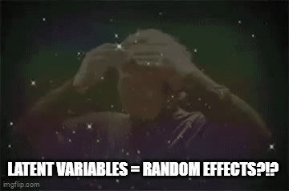
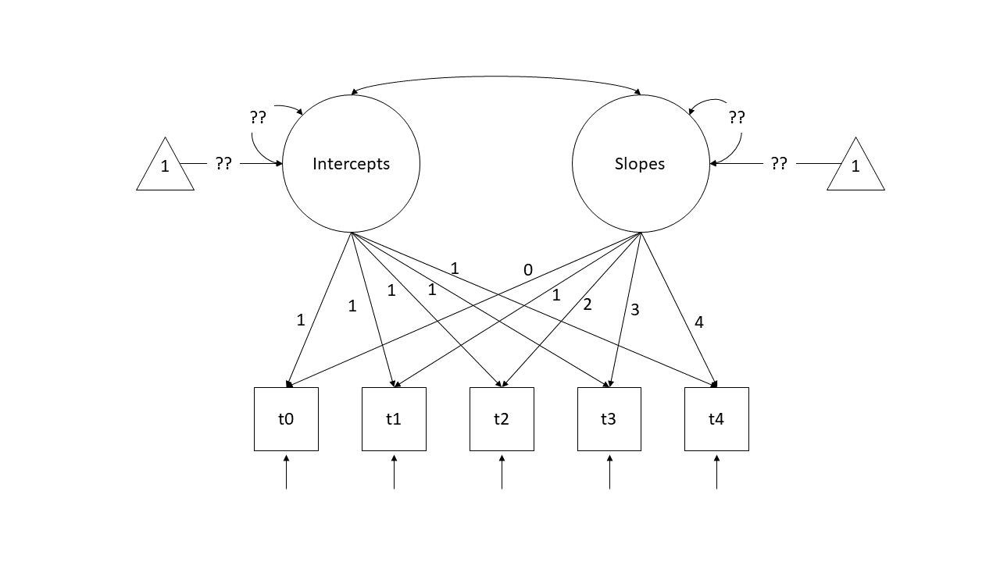

```{r}
#| label: setup
#| include: false
source('assets/setup.R')
library(xaringanExtra)
library(tidyverse)
library(patchwork)
xaringanExtra::use_panelset()
qcounter <- function(){
  if(!exists("qcounter_i")){
    qcounter_i <<- 1
  }else{
    qcounter_i <<- qcounter_i + 1
  }
  qcounter_i
}
library(psych)
library(semPlot)
library(lavaan)
library(kableExtra)
```

## PSS & IQ


:::frame
__Prenatal Stress & IQ data__  

A researcher is interested in the effects of prenatal stress on child cognitive outcomes. 
She has a 5-item measure of prenatal stress and a 5 subtest measure of child cognitive ability, collected for 500 mother-infant dyads. 

+ The data is available as a .csv file here: [https://uoepsy.github.io/data/stressIQ.csv](https://uoepsy.github.io/data/stressIQ.csv)

```{r}
#| echo: false
tibble(
  variable = names(read_csv("https://uoepsy.github.io/data/stressIQ.csv")),
  description = c("Participant ID",
                  "acute stress",
                  "chronic stress",
                  "environmental stress",
                  "psychological stress",
                  "physiological stress",
                  "verbal ability",
                  "verbal memory",
                  "inductive reasoning",
                  "spatial orientiation",
                  "perceptual speed")
) |> gt::gt()
```


:::

`r qbegin(qcounter())`
Before we do anything with the data, grab some paper and sketch out the full model that you plan to fit to address the researcher's question.   

Tip: everything you need is in the description! Start by drawing the specific path(s) of interest. Are these between latent variables? If so, add in the paths to the indicators for each latent variable.  
`r qend()`
`r solbegin(show=params$SHOW_SOLS, toggle=params$TOGGLE)`
The main parameter of interest here is "the effects of prenatal stress on child cognitive outcomes". So we have an arrow going from Stress to IQ.  
  
Each of these are latent variables, for which we have observed 5 indicator variables, so we have an arrow going from "IQ" to each of the 5 IQ items, and from "Stress" to the 5 stress items. 
```{r echo=FALSE}
diagmod <- '
#IQ measurement model
IQ=~IQ1+IQ2+IQ3+IQ4+IQ5 
#stress measurement model 
Stress=~stress1+stress2+stress3+stress4+stress5 
#structural part of model
IQ~Stress'
semPlot::semPaths(lavaanify(diagmod),rotation=2)
```


`r solend()`

`r qbegin(qcounter())`
Read in the data and explore it. Look at the individual distributions of each variable to get a sense of univariate normality, as well as the number of response options each item has.  


::: {.callout-tip collapse="true"}
#### Hints

The **psych** package has the useful functionality here. Specifically things like `multi.hist()` and `describe()` will be handy.  

If necessary, you can set `multi.hist(data, global = FALSE)` to let each histogram's x-axis be on a different scale.

:::


`r qend()`
`r solbegin(show=params$SHOW_SOLS, toggle=params$TOGGLE)`

```{r message=FALSE}
library(tidyverse)
library(psych)

stress_IQ_data <- read_csv("https://uoepsy.github.io/data/stressIQ.csv")
```

This gives us a whole load of descriptives, means, standard deviations, and other things like skew and kurtosis.  

We can see that a lot of the IQ variables are quite highly skewed (values >1). It also looks like the min and max for the stress items are all 1-3.  
```{r}
describe(stress_IQ_data)
```

Let's plot! Here we can see the distribution of each variable. As already noted, the IQ items are quite positively skewed (we can see this matches with the skew metrics above). And the stress items are only measured on 3 response options..  
```{r}
multi.hist(stress_IQ_data, global = FALSE)
```


`r solend()`

`r qbegin(qcounter())`
As always, we want to assess the measurement models of each construct. 

Let's start with IQ. Fit a one factor CFA for the IQ items, and examine the fit. If it doesn't fit very well, consider checking for areas of local misfit (i.e., check your `modindices()`), and adjust your model accordingly.  

Be sure to use an appropriate estimation method, given the distributions of the indicator variables!  

::: {.callout-tip collapse="true"}
#### Hints

See the section on non-normality in [Chapter 8#SEM-non-normality](https://uoepsy.github.io/lv/08_sem.html#non-normality){target="_blank"}.  

:::

`r qend()` 

`r solbegin(show=params$SHOW_SOLS, toggle=params$TOGGLE)`


Because our variables seem to be non-normal, therefore, we should use a robust estimator such as MLR for our CFA

```{r robust estimator}
model_IQ <- 'IQ =~ IQ1 + IQ2 + IQ3 + IQ4 + IQ5'

model_IQ.est <- cfa(model_IQ, data=stress_IQ_data, estimator='MLR')
```

We also get out robust fit measures, so we should ask for them:
```{r}
fitmeasures(model_IQ.est)[c("rmsea.robust","srmr","cfi.robust","tli.robust")]
```

The model doesn't fit very well so we could check the modification indices for local mis-specifications

```{r check mods}
modindices(model_IQ.est, sort=T) |> head()
```

It looks like we might need to include residual covariances between the items IQ1 and IQ2 and maybe also between items IQ4 and IQ5. 
As always, we need to double check this makes substantive sense. Items IQ1 and IQ2 measure verbal comprehension and verbal memory - people might be likely to score low/high on both of these due to their verbal ability. IQ4 and IQ5 might be both related due to both being tests requiring visual perception, but it's less obvious. We'd probably want to know more about the specific tests undertaken. 

```{r make modifications}
model2_IQ <- '
    IQ=~IQ1+IQ2+IQ3+IQ4+IQ5
    IQ1~~IQ2
'
model2_IQ.est <- cfa(model2_IQ, data=stress_IQ_data, estimator='MLR')

fitmeasures(model2_IQ.est)[c("rmsea.robust","srmr","cfi.robust","tli.robust")]
```


The fit of the model is now much improved! The RMSEA is still in that grey area between 0.05 and 0.08, so we would probably want to flag this when writing up. We could keep trying to add stuff in order to get it below 0.05, but that means a high risk of overfitting.  
Note also, that our loadings are all significant and $>|0.3|$. 
```{r}
standardizedsolution(model2_IQ.est)
```

`r solend()`


`r qbegin(qcounter())`
Now do the same for a one-factor confirmatory factor analysis for the latent factor of Stress. Note that the items are measured on a 3-point scale!  

::: {.callout-tip collapse="true"}
#### Hints

See the section on categorical variables in the reading: [Chapter 8#SEM-endogenous-categorical](https://uoepsy.github.io/lv/08_sem.html#endogenous-categorical-variables){target="_blank"}.  

When you inspect your summary model output, notice that we have a couple of additional things - we have 'scaled' and 'robust' values for the fit statistics (we have a second column for all the fit indices but using a scaled version of the $\chi^2$ statistic, and then we also have some extra rows of 'robust' measures), and we have the estimated 'thresholds' in our output (there are two thresholds per item in this example because we have a three-point response scale). The estimates themselves are not of great interest to us.  

:::


`r qend()`
`r solbegin(show=params$SHOW_SOLS, toggle=params$TOGGLE)`


```{r categorical estimation}
# specify the model
model_stress <- 'Stress =~ stress1 + stress2 + stress3 + stress4 + stress5'

# estimate the model - cfa will automatically switch to a categorical estimator if we mention that our five variables are ordered-categorical, using the 'ordered' function
model_stress.est <- 
  cfa(model_stress, data=stress_IQ_data, ordered=TRUE)

```


```{r}
# inspect the output
fitmeasures(model_stress.est)[c("rmsea.robust","srmr","cfi.robust","tli.robust")]
summary(model_stress.est, standardized=TRUE)
```
`r solend()`


`r qbegin(qcounter())`
Now its time to build the full SEM.   
Estimate the effect of prenatal stress on IQ.  

::: {.callout-tip collapse="true"}
#### Hints

**Remember:** We know that IQ indicators are non-normal, so we would like to use a robust estimator (e.g. MLR). And the Stress indicators are only on a 3-point scale, so we want to make sure we specify that too. However, as lavaan will tell you if you try using `estimator="MLR"` at the same time as `ordered = c(....)`, the MLR estimator is not supported for ordered data. It suggests instead using the WLSMV (weighted least square mean and variance adjusted) estimator.  

As it happens, the WLSMV estimator is just the "DWLS" one we use for categorical variables, but with a correction to return robust standard errors. If you specify `estimator="WLSMV"` then your standard errors *will* be corrected, but don't be misled by the fact that the summary here will still say that the estimator is DWLS.   

:::

`r qend()` 
`r solbegin(show=params$SHOW_SOLS, toggle=params$TOGGLE)`
```{r full SEM}
SEM_model <- '
    #IQ measurement model
    IQ =~ IQ1 + IQ2 + IQ3 + IQ4 + IQ5 
    IQ1 ~~ IQ2

    #stress measurement model 
    Stress =~ stress1 + stress2 + stress3 + stress4 + stress5 

    #structural part of model
    IQ ~ Stress
'
```


```{r}
SEM_model.est <- sem(SEM_model, data=stress_IQ_data,
                     ordered=c('stress1','stress2','stress3','stress4','stress5'),
                     estimator="WLSMV")
```

Let's print out the full summary.  
Note that when we have a mix of ordered categoricals _and_ continuous variables, then we can't get the robust estimates of the fit indices. These are now NA. We do still get the scaled versions though, and everything seems to fit fairly well.  
```{r}
summary(SEM_model.est, fit.measures=T, standardized=T)
```
```{r}
#| echo: false
d <- standardizedsolution(SEM_model.est)
```


We can see that the effect of prenatal stress on offspring IQ is $\beta$ = `r round(d |> filter(lhs=="IQ",rhs=="Stress") |> pull(est.std), 3)` and is statistically significant ($p<.05$).

`r solend()`

`r qbegin(paste0("Extra ", qcounter()))`
Returning to our full SEM, adjust your model so that instead of `IQ ~ Stress` we are fitting `Stress ~ IQ` (i.e. child cognitive ability $\rightarrow$ prenatal stress).  

Take a guess: will this model fit better or worse than our first one?  

`r qend()`
`r solbegin(show=TRUE, toggle=params$TOGGLE)`

Here's our first model:  
```{r}
fitmeasures(SEM_model.est)[c("rmsea.scaled","srmr","tli.scaled","cfi.scaled")]
```

And here's the model with the direction reversed:  
```{r}
SEM_model2 <- '
    #IQ measurement model
    IQ =~ IQ1 + IQ2 + IQ3 + IQ4 + IQ5 
    IQ1 ~~ IQ2
    
    #stress measurement model 
    Stress =~ stress1 + stress2 + stress3 + stress4 + stress5 
    
    #structural part of model
    Stress ~ IQ
'

SEM_model.est2 <- sem(SEM_model2, data=stress_IQ_data,
                    ordered = c('stress1', 'stress2', 'stress3', 'stress4', 'stress5'),
                    estimator="WLSMV")

fitmeasures(SEM_model.est2)[c("rmsea.scaled","srmr","tli.scaled","cfi.scaled")]
```


The fit is exactly the same!!  

One of the strengths of SEM is that we are fitting quantitative models that very closely correspond to theoretical models. In fact, researchers may often start with two slightly different theoretical models, and SEM will allow them to make a formal comparison of the two, because they will lead to differences in model fit. 

However, it is important to be aware that for every structural equation model, there are always equivalent representations of the model structure that leads to _precisely_ the same model fit. These are essentially re-parameterisations of our model - they contain the same information, and lead to the exact same model-implied covariance matrix, but they involve different theoretical assumptions. Many of these we can rule out on conceptual grounds (i.e. a child's cognitive ability cannot influence their mothers' pre-natal stress levels), but others we cannot.  

`r solend()`

## A Replication

`r qbegin(qcounter())`
In order to try and replicate the IQ CFA, our researcher collects a **new** sample of size $n=500$. However, she has some missing data (specifically, those who scored poorly on the first few tests tended to feel discouraged and chose not to complete further tests).  
  
Read in the new dataset, plot and numerically summarise the univariate distributions of the measured variables, and then conduct a CFA using the new data, taking account of the missingness (don't forget to also use an appropriate estimator to account for any non-normality). Does the model fit well?    
  
+ The data can be found at [https://uoepsy.github.io/data/IQdatam.csv](https://uoepsy.github.io/data/IQdatam.csv)  

::: {.callout-tip collapse="true"}
#### Hints

We can fit the model setting `missing='FIML'`. If data are missing at random (MAR) - i.e., missingness is related to the measured variables but not the unobserved missing values - then this gives us unbiased parameter estimates. Unfortunately we can never know whether data are MAR for sure as this would require knowledge of the missing values. See [Chapter 8#SEM-missing-data](https://uoepsy.github.io/lv/08_sem.html#missing-data){target="_blank"}.  


:::


 
`r qend()` 
`r solbegin(show=params$SHOW_SOLS, toggle=params$TOGGLE)`

Here's the data. As before, the distributions of items look quite skewed. 
```{r message=FALSE}
IQ_data_new <- read_csv("https://uoepsy.github.io/data/IQdatam.csv")

multi.hist(IQ_data_new, global = FALSE)

IQ_data_new |> select(contains("IQ")) |> 
    describe() |> 
    as.data.frame() |>
    rownames_to_column(var = "variable") |> 
    select(variable,mean,sd,skew,kurtosis) |>
    kable(digits = 2) |>
    kable_styling(full_width = FALSE)
```

```{r missingness}
IQ_model_missing <- '
  IQ=~IQ1+IQ2+IQ3+IQ4+IQ5
  IQ1~~IQ2
'

IQ_model_missing.est <- cfa(IQ_model_missing, 
                            data=IQ_data_new, 
                            missing='FIML', estimator="MLR")

summary(IQ_model_missing.est, fit.measures=T, standardized=T)
```

Our fit indices all look very good!  
`r solend()`


`r qbegin(paste0("Extra - Question ",qcounter()), qlabel = FALSE)`
Note that the summary of the model output when we used FIML also told us that there are 3 patterns of missingness.  

Can you find out a) what the patterns are, and b) how many people are in each pattern?  

::: {.callout-tip collapse="true"}
#### Hints

`is.na()` will help a lot here, as will `distinct()` and `count()`.  

:::

`r qend()`
`r solbegin(show=params$SHOW_SOLS, toggle=params$TOGGLE)`


This will turn all the NAs into TRUE, and everything else into FALSE:  
```{r}
#| eval: false
is.na(IQ_data_new)
```

If we turn this back to a dataframe, and then pass it to `distinct()`, we get out the different patterns!  
```{r}
is.na(IQ_data_new) |>
  as.data.frame() |>
  distinct()
```

Getting the counts is more difficult, but one way would be to do it with `count()`, but we have to give it all of the variables, to get all the different combinations:  
```{r}
is.na(IQ_data_new) |>
  as.data.frame() |>
  count(ID,IQ1,IQ2,IQ3,IQ4,IQ5)
```


`r solend()`


# Opportunities for growth?   

:::frame
__development of pro-social behaviours in children: psb_traj.csv__   

We are interested in the development of pro-social behaviours over childhood. We recruited 50 children at age 4, and they completed a battery of assessments that aimed to measure how much they displayed sharing, cooperation, perspective-taking etc. These tasks altogether resulted in a score of pro-social behaviour --- `PSB` in our data.  
The data are available at [https://uoepsy.github.io/data/PSBtraj.csv](https://uoepsy.github.io/data/PSBtraj.csv){target="_blank"}  


```{r}
#| echo: false
#| eval: false
library(tidyverse)
newnam <- unique(randomNames::randomNames(100,which.names="first"))
N = 500
n_groups = 50
g = rep(1:n_groups, e = N/n_groups)
x = rep(1:(N/n_groups), n_groups)-1
Gcov = Matrix::nearPD(matrix(c(4,-2,-2,3),nrow=2))$mat
res = MASS::mvrnorm(n_groups, mu=c(0,0), Sigma=Gcov)
re  = res[,1][g] # random intercepts
re_x  = res[,2][g] # random slopes
lp = (0 + re) + (1 + re_x)*x
y = rnorm(N, mean = lp, sd = 1) # continuous target
df <- data.frame(x, g=g, y)
df |> 
  filter(x<=4) |> 
  transmute(timepoint=x,child=g,PSB=round(scale(y)[,1]*7.3+18)) -> df
df$PSB <- pmax(0,df$PSB)
library(lme4)
mm <- lmer(PSB ~ 1 + timepoint + (1 + timepoint | child), REML = FALSE, df)
summary(mm)
# write_csv(df, file="../../data/PSBtraj.csv")

```

:::


`r qbegin(qcounter())`
Forget about SEM and latent variables for a minute. We want to study the development of pro-social behaviours over childhood, and we have captured a measure of this (`PSB`) in ~50 children over 5 years.  

We're going back to `lmer()`!!  

Fit a multi-level/mixed effects model to estimate the trajectory of PSB over childhood.  
For now, please set `REML = FALSE` (this is just because we're going to compare this model with something else fitted with standard ML).   

`r qend()`
`r solbegin(show=TRUE, toggle=params$TOGGLE)`

We'll want something like this 
```{r}
library(lme4)

psbtraj <- read.csv("https://uoepsy.github.io/data/PSBtraj.csv")

lmm1 <- lmer(PSB ~ 1 + timepoint + (1 + timepoint | child), 
             data = psbtraj, 
             REML = FALSE)

summary(lmm1)
```

`r solend()`

`r qbegin(qcounter())`
The model that we just fitted contains "random intercepts" and "random slopes". We've talked about these as the group-level variability around the fixed intercept and fixed slope.  

Think carefully about the following explanation of our random effects: 

> our random intercepts and random slopes are **normally distributed variables that are not directly observed**, that reflect "where childrens' PSB starts" and "how childrens' PSB changes". 

The quite subtle link that I am trying to make here is that we can think of those random effects in a similar way to how we think about latent variables!   



And we can actually fit the exact same model in the latent variable modelling framework of **lavaan**!!   

We have 5 time points, so let's pivot things wider and consider our data in this format:  
```{r}
psbwide <- 
  psbtraj |> 
  pivot_wider(names_from = timepoint, values_from = PSB,
              names_prefix = "t")

head(psbwide)
```

In this setup, we can start to think of each column containing scores as an indicator of a child's underlying latent level of PSB (i.e., a child who scores high on all those observed variables (`t0` to `t4`) is high on the unobserved latent construct of 'pro-social behaviour' and one who scores lower is estimated to be lower). 
With a little bit of trickery, we can encode the time-ordered structure of these indicators and split this up into an latent 'intercept' and a latent 'slope'. To do so, we specify a model like the diagram below. 



Note that we are fixing all the factor loadings to specific values. The "Intercepts" latent variable loads equally onto all timepoints scores, and the "Slopes" latent variable loads 0 on the first time point, 1 on the second, and so on..  
So a child who is higher on latent PSB will score 1 higher at all time points. But additional to this, if a child has more of the latent "Slope of PSB" factor, will score 1 bit higher at time 2, 2 bits higher at time 3, 3 bits higher at time 4, and so on (where "bits" is yet to be estimated).  
Think about what this implies for a child who has a latent intercept value of 10, and a latent slope value of 2:   

```{r}
#| echo: false
tribble(
  ~"timepoint",~"estimate", ~"expectation", 
  0,"(1 x intercept) +(0 x slope)     ","(1 x 10) + (0 x 2) = 10",
  1,"(1 x intercept) +(1 x slope)    ","(1 x 10) + (1 x 2) = 12",
  2,"(1 x intercept) +(2 x slope)     ","(1 x 10) + (2 x 2) = 14",
  3,"(1 x intercept) +(3 x slope)     ","(1 x 10) + (3 x 2) = 16",
  4,"(1 x intercept) +(4 x slope)     ","(1 x 10) + (4 x 2) = 18",
) |> gt::gt()
```

What we are then interested in estimating is the variances and the means of the two latent variables (Intercepts and Slopes). In previous models we've been mostly concerned with modelling _covariance_ (i.e., how variables change with one another), but we can also include the estimation of means (the average of each variable). In a diagram, these sometimes get drawn as the paths from a triangles with a 1 in it (this is just like an intercept in regression $y = b_1\cdot1 + b2\cdot x$ - it is the $b_1$ we are estimating, and the 1 in the triangle is just to indicate that it is a constant).  

Try fitting the model below. 

Note, for the demonstration here I have had to add some extra constraints. This is because our `lmer` model assumes that the residual variance is the same across time. Our version in **lavaan** does not, so here we've used the label "rvar" to indicate that the residual variance is equal at each indicator `t0` to `t4`.  

```{r}
lgc1 <- "
  ints =~ 1*t0 + 1*t1 + 1*t2 + 1*t3 + 1*t4
  slopes  =~ 0*t0 + 1*t1 + 2*t2 + 3*t3 + 4*t4

  t0 ~~ r*t0
  t1 ~~ r*t1
  t2 ~~ r*t2
  t3 ~~ r*t3
  t4 ~~ r*t4
"

lgc.est1 <- growth(lgc1, data = psbwide)
```

Examining the `parameterestimates()` for the **lavaan** model, and the `summary()` output for the **lme4** model, compare and contrast.. What things are the same, what things are different?  

`r qend()`
`r solbegin(show=TRUE, toggle=params$TOGGLE)`

For our **lme4** model, here are the fixed effects and the variance in our random effects:
```{r}
# fixed effects
fixef(lmm1)
# random effect variances
as.data.frame( VarCorr(lmm1) )
```

And for our **lavaan** model, here are our parameter estimates: 
```{r}
parameterestimates(lgc.est1)
```


We can see that these parts of the model are all identical!  

1. the fixed intercept in the lmer is the same as the `ints ~ 1` estimate in lavaan. If you look at `summary(lcg.est1)`, this comes under a section headed "Intercepts" which we haven't seen before, but is essentially capturing the mean of the latent variable.  
2. The fixed slope in the lmer is the same as the `slopes ~ 1` part of the lavaan model.  
3. The random intercept variability in lmer is capturing "how much do children vary in their intercepts?". In the lavaan model, this is captured by the variance of the latent "ints" variable (in `parameterestimates(lgc.est1)` this is the `ints ~~ ints` bit)
4. The random slope variability in lmer is "how much do children vary in the slopes of PSB~time?". In our lavaan model, this is the variance of the latent "slopes" variable (`slopes ~~ slopes`).  
5. The correlation between random intercepts and random slopes in lmer is equivalent to the correlation between the two latent variables (`ints ~~ slopes`). In lavaan this is shown as the covariance, whereas in lmer we also see it standardised as a correlation.
6. The residual variability in the lmer is equivalent to the residual variance in lavaan for every observed variable `t0` to `t4` (remember we fixed these to all be the same as each other)

Here's the quick plot with the estimates:  
```{r}
library(semPlot)
semPaths(lgc.est1, whatLabels = "est")
```


Bonus! Remember in **lme4** we could extract the model predictions for each specific group in our sample, with functions like `ranef()` and `coef()`?^[whereas the variance of random effects was "how do groups _in general_ vary?", these are "where does [specific group X in our data] fall?"].   

The equivalent in the **lavaan** model is to ask where each person falls on the latent variables of "ints" and "slopes".  

And these are identical!  
```{r}
# each child's predicted intercept and slope from the lmer:
lmer_pred <- coef(lmm1)$child

# each child's predicted standing on the latent variables from lavaan:
lav_pred <- lavPredict(lgc.est1)

# bind them together and plot: 
cbind(lmer_pred, lav_pred) |> plot()
```


These kind of models are known as "Latent Growth Curve" models, and are really just the same thing as the mixed effects model we have already seen, but from the SEM perspective. We can even start playing with non-linear trajectories by changing the slope parameters to e.g., 1,2,4,9,16.  
The downside is that the timepoints are need to be consistent -- time is not treated continuously meaning that it becomes difficult if we have child 1 measured at "48 months, 64 months, 74 months" and child 2 at "50 months, 62 months, 76 months" - we end up collapsing them into "time1", "time2" and "time3", and therefore lose information. In addition, it's harder to include more complex grouping structures in the SEM approach. The benefits, however, is that it can be extended to more complex sorts models that the mixed model might struggle with (like modelling trajectories of two outcomes simultaneously, or using the slope factor as a predictor of some other outcome).  


`r solend()`


