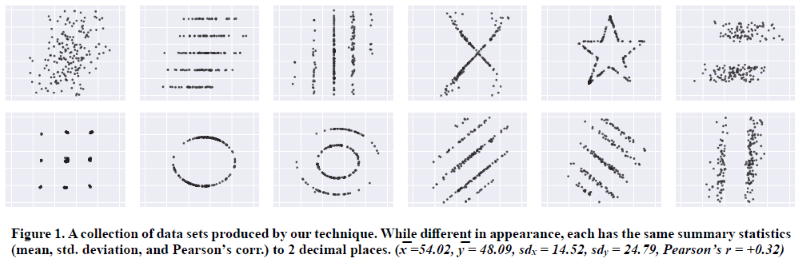
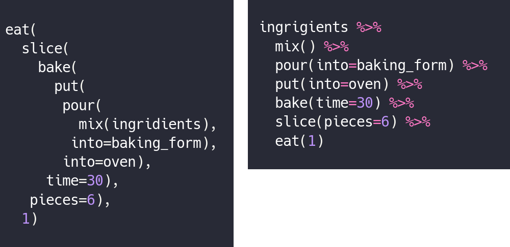
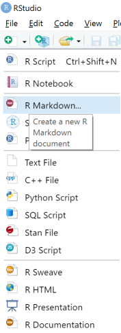
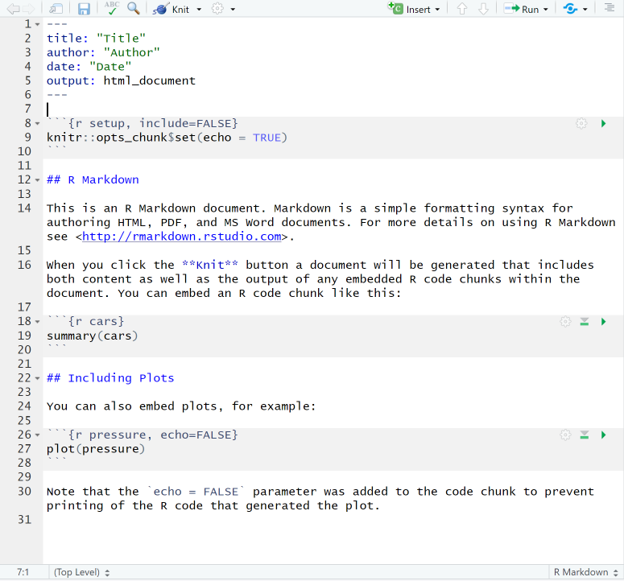
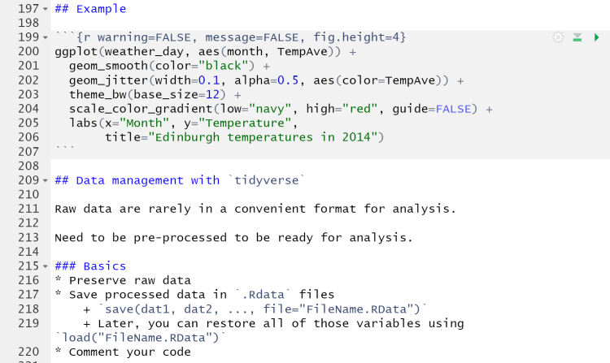

```{r setup, include=FALSE}
options(htmltools.dir.version = FALSE)
```

```{r xaringan-themer, include = FALSE}
library(xaringanthemer)
style_mono_accent(
  # base_color = "#0F4C81", # DAPR1
  # base_color = "#BF1932", # DAPR2
  # base_color = "#88B04B", # DAPR3 
  # base_color = "#FCBB06", # USMR
  base_color = "#a41ae4", # MSMR
  header_color = "#000000",
  header_font_google = google_font("Source Sans Pro"),
  header_font_weight = 400,
  text_font_google = google_font("Source Sans Pro", "400", "400i", "600", "600i"),
  code_font_google = google_font("Source Code Pro"),
  extra_css = list(".scroll-output" = list("height"="90%","overflow-y"="scroll"))
)
```

# Data Visualization

Important in *science*, business, journalism, etc.

Two key roles:

1. Communication
2. Analysis

Summary statistics never give the full *picture*:



---

# `ggplot`: Grammar of Graphics

Many graphing programs treat data visualization like painting picture: red circle at $x_1,y_1$, blue square at $x_2,y_2$, etc.

This is inefficient and very easy to make mistakes.

---

# `ggplot`: Grammar of Graphics

Many graphing programs treat data visualization like painting picture: red circle at $x_1,y_1$, blue square at $x_2,y_2$, etc.

This is inefficient and very easy to make mistakes.

### The `ggplot` way: a graph has 3 core elements

1. A data set
2. A set of mappings between variables in the data set and properties (*aesthetics*) of the graph
3. Layers of *geoms* to instantiate those mappings

---

# A simple example

A basic line plot:
```{r fig.height=4}
library(ggplot2)
ggplot(Orange, aes(x=age, y=circumference, color=Tree)) + 
  geom_line()
```

---

# A simple example

```{r fig.height=4}
ggplot(Orange, aes(x=age, y=circumference, color=Tree)) + 
  geom_line() + geom_point() # Add points
```

Notice that the lines and points have matching colors, but you only need to specify the color mapping once. 

All geoms will "inherit" the same aesthetic mappings unless otherwise specified. *This helps maintain consistency.*

---

# Compute summaries on the fly

```{r fig.height=4}
ggplot(Orange, aes(age, circumference)) + 
  geom_point() + stat_summary(fun=mean, geom="line")
```

Do not need to have different data sets for all data and summarized data. Just use one data set and visualize it in different ways (all observations, grouped by participants, grouped by conditions, etc., etc., ...)

*This makes exploratory visualization much easier.*

--- 

# Exclude cases on the fly

```{r fig.height=4}
ggplot(subset(Orange, Tree != "5"), aes(age, circumference)) +
  geom_point() +
  stat_summary(fun=mean, geom="line")
```

This also helps exploratory visualization.

---

# Small multiples, aka facets

Very important for visualizing complex data sets. The individual facets are properly sized and aligned, and inherit aesthetics to make comparisons easy.

```{r fig.width=8, fig.height=4}
ggplot(Orange, aes(age, circumference)) + 
  facet_wrap(~ Tree, nrow=1) + 
  geom_line()
```

---

# Multi-panel plots

For combining different plots, use `patchwork`

```{r, message=FALSE, fig.width=10, fig.height=3.5}
library(patchwork)
p1 <- ggplot(esoph, aes(agegp, ncases/ncontrols, color=alcgp)) +
  stat_smooth(aes(group=alcgp), se=FALSE) +
  scale_color_brewer(palette = "Set1")
p2 <- ggplot(esoph, aes(agegp, ncases/ncontrols, color=tobgp)) + 
  stat_smooth(aes(group=tobgp), se=FALSE) +
  scale_color_brewer(palette = "Set1")
p1 + p2
```

---

# Showing variability: Weather data

```{r warning=FALSE, fig.height=4}
load("./data/Weather_2014.RData")
summary(weather_day)
```

---

# Showing variability: Errorbars

```{r warning=FALSE, fig.height=4}
ggplot(weather_day, aes(month, TempAve)) +
  stat_summary(fun=mean, geom="line") + 
  stat_summary(fun.data=mean_se, geom="errorbar")
```

---

# Showing variability: Jittered points

```{r warning=FALSE, fig.height=4}
ggplot(weather_day, aes(month, TempAve)) +
  geom_jitter(width=0.2)
```

---

# Showing variability: Boxplots

```{r warning=FALSE, fig.height=4}
ggplot(weather_day, aes(as.factor(month), TempAve)) +
  geom_boxplot()
```

---

# Showing variability: Violin plots

```{r warning=FALSE, fig.height=4}
ggplot(weather_day, aes(as.factor(month), TempAve)) +
  geom_violin()
```

---

# Showing variability: Combinations

```{r warning=FALSE, message=FALSE, fig.height=4}
ggplot(weather_day, aes(as.factor(month), TempAve)) +
  geom_violin() +
  geom_jitter(width=0.1, alpha=0.25) + 
  geom_smooth(aes(x=month))
```

---

# Refining figures

* Scales
    + Colours
    + Point shapes
    + Legends/guides
    + Etc.
* Themes
    + Axes, grid lines, tick marks and labels
    + Legend position
    + Font sizes
* Annotations: geoms that are not data

---

# Example

```{r warning=FALSE, message=FALSE, fig.height=4}
ggplot(weather_day, aes(month, TempAve)) +
  geom_smooth(color="black") +
  geom_jitter(width=0.1, alpha=0.5, aes(color=TempAve)) +
  theme_bw(base_size=12) + 
  scale_color_gradient(low="navy", high="red", guide=FALSE) +
  labs(x="Month", y="Temperature", 
       title="Edinburgh temperatures in 2014")
```

# Data management with `tidyverse`

Raw data are rarely in a convenient format for analysis.

Need to be pre-processed to be ready for analysis.

Approx. 80% of analysis time is spent on getting data ready for analysis.

### Basics
* Preserve raw data
* Save processed data in `.Rdata` files
    + `save(dat1, dat2, ..., file="FileName.RData")`
    + Later, you can restore all of those variables using `load("FileName.RData")`
* Comment your code

---

# Data Transformation: `dplyr`

* `filter` rows (observations)
* `select` columns (variables)
* `arrange` rows
* `mutate` create new variables
* `summarize` create summaries
* `group_by` create grouped summaries (and mutations and filters)

* `merge` data sets (base R)
* `join` data sets (`dplyr`)

---

# Data Transformation: `tidyr`

Tidy data

> "Happy families are all alike; every unhappy family is unhappy in its own way."
- Leo Tolstoy

> "Tidy datasets are all alike, but every messy dataset is messy in its own way."
- Hadley Wickham


---

# Data Transformation: `tidyr`

Tidy data

* `pivot_longer`
* `pivot_wider`

---

# Pipes


Easy way to do a series of operations:

`g(f(x, y), z)` is the same as `x %>% f(y) %>% g(z)`

But easier to read and write: "Take `x` then do `f(y)` then do `g(z)`"

---

# Pipes


(source: https://twitter.com/dmi3k/status/1191824875842879489)

---

# Example: Public Health England data on mental health

A few interesting and "robust" indicators:

* 848 = overall depression prevalence
* 90646 = overall depression incidence
* 90275 = enough physical activity
* 41001 = suicide rate per 100,000

```{r warning=FALSE, message=FALSE}
library(tidyverse)
```

---

# Example: Public Health England data on mental health

```{r}
load("./data/PHE_MentalHealth.Rdata")
summary(mh_phe)
```

---

# Example: Public Health England data on mental health

```{r}
str(mh_phe)
```

---

# Table: Health Indicators by Region
```{r eval=FALSE}
mh_phe %>% group_by(IndicatorName, Region) %>% #<<
  summarize(Value = mean(Value, na.rm = TRUE)) %>%
  pivot_wider(names_from = IndicatorName, values_from = Value) 
```

---

# Table: Health Indicators by Region
```{r eval=FALSE}
mh_phe %>% group_by(IndicatorName, Region) %>%
  summarize(Value = mean(Value, na.rm = TRUE)) %>% #<<
  pivot_wider(names_from = IndicatorName, values_from = Value) 
```

---

# Table: Health Indicators by Region
```{r}
mh_phe %>% group_by(IndicatorName, Region) %>%
  summarize(Value = mean(Value, na.rm = TRUE)) %>%
  pivot_wider(names_from = IndicatorName, values_from = Value) #<<
```

---

# Table: Health Indicators by Region
.scroll-output[
```{r}
mh_phe %>% group_by(IndicatorName, Region) %>%
  summarize(Value = mean(Value, na.rm = TRUE)) %>%
  pivot_wider(names_from = IndicatorName, values_from = Value) %>% 
  knitr::kable(digits = 2, format = 'html') #<<
```
]

---

# Table: Health Indicators by Year

.scroll-output[
```{r eval=FALSE}
mh_phe %>% group_by(IndicatorName, Year) %>% #<<
  summarize(Value = mean(Value, na.rm = TRUE)) %>%
  pivot_wider(names_from = IndicatorName, values_from = Value) %>%
  arrange(Year) %>% 
  knitr::kable(digits = 2, format = 'html')
```
]

---

# Table: Health Indicators by Year

.scroll-output[
```{r}
mh_phe %>% group_by(IndicatorName, Year) %>% 
  summarize(Value = mean(Value, na.rm = TRUE)) %>%
  pivot_wider(names_from = IndicatorName, values_from = Value) %>%
  arrange(Year) %>% #<<
  knitr::kable(digits = 2, format = 'html') 
```
]

# Reproducible Research

* Scientific findings have to be _replicable_. Reproducibility is a pre-requisite for replicability: if I can't reproduce what you did, then I can't check whether it replicates.
* Makes your work easier and more efficient
    + Avoid errors because each step is documented and checkable.
    + Easier to collaborate because full analysis path is easily shareable.
    + Easier to update in response to feedback, reviews, etc.
    + Higher impact: can share your methods as well as your results. _Nature_ journals are moving toward requiring code sharing to increase reproducibility and transparency (e.g., Eglen et al., 2017)

---

# Workflow 

1. Collect data
2. Read in raw data: `read.table`, `haven::read_sav`, `readxl::read_excel`, `load(url(...))`, etc.
3. Check the data, make exploratory plots: `ggplot`
4. Pre-process the raw data to get it ready for analysis: `filter`, `group_by`, `mutate`, `pivot_longer`, `pivot_wider`, etc.
5. Check the data, make exploratory plots: `ggplot`
6. Analyze the data: `t.test`, `lm`, `lmer`, `sem`, etc.
7. Make final publication-quality figures: `ggplot`
8. Write the report

Use R Markdown for steps 2-7 to produce a fully reproducible analysis report.

(Can also do step 8 and generate a final PDF or Word document of the full report)

---

# R Markdown

```{r, out.width = "800px", echo=FALSE}
knitr::include_graphics("./figs/rmarkdown_wizards.png")
```

---

# R Markdown: Getting Started

.pull-left[**Prerequisites**

* You'll need the `rmarkdown` and `knitr` packages
* Help is readily available:
    + RStudio --> Help --> Markdown Quick Reference
    + RStudio --> Help --> Cheatsheets --> R Markdown Cheat Sheet
    + RStudio --> Help --> Cheatsheets --> R Markdown Reference Guide
]

.pull-right[
**Create a markdown file**

```{r, out.height = "485px", out.width = "177px", echo=FALSE}

```
]
---

# R Markdown: Template



---

# R Markdown: Example

Excerpt from the R Markdown file for lecture slides:


