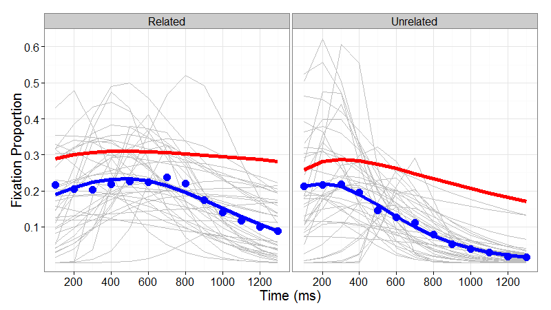
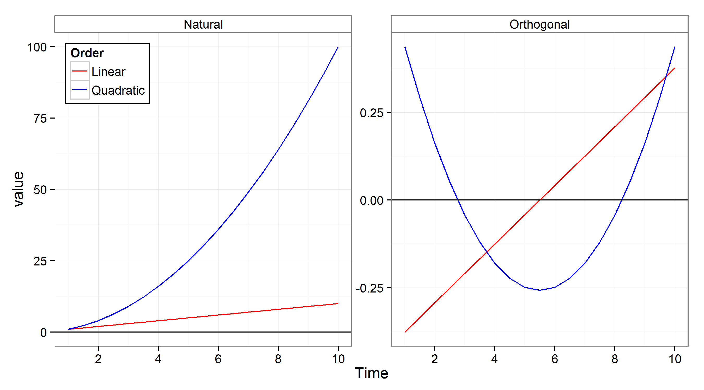
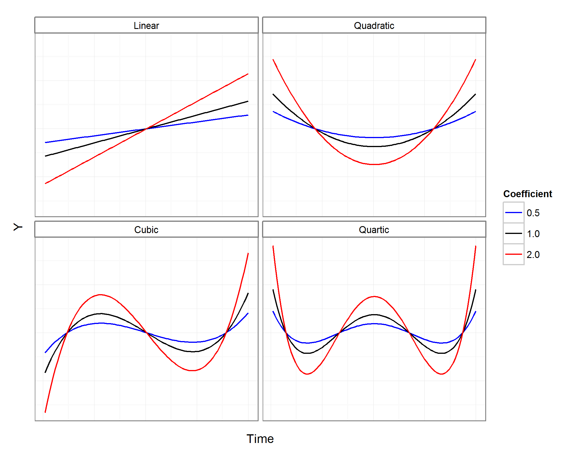
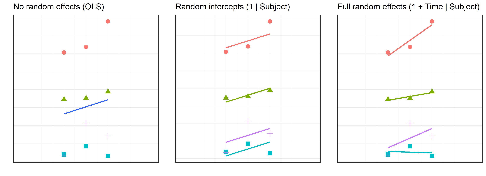

```{r setup, include=FALSE, message=FALSE}
options(htmltools.dir.version = FALSE)
options(digits = 4)
library(knitr)
library(kableExtra)
library(patchwork)

library(tidyverse)
library(broom)
library(lme4)
library(lmerTest)
```

```{r xaringan-themer, include = FALSE}
library(xaringanthemer)
style_mono_accent(
  # base_color = "#0F4C81", # DAPR1
  # base_color = "#BF1932", # DAPR2
  # base_color = "#88B04B", # DAPR3 
  # base_color = "#FCBB06", # USMR
  base_color = "#a41ae4", # MSMR
  header_color = "#000000",
  header_font_google = google_font("Source Sans Pro"),
  header_font_weight = 400,
  text_font_google = google_font("Source Sans Pro", "400", "400i", "600", "600i"),
  code_font_google = google_font("Source Code Pro"),
  extra_css = list(".scroll-output" = list("height"="90%","overflow-y"="scroll"))
) 
```

# Longitudinal data are a natural application domain for MLM

* Longitudinal measurements are *nested* within subjects (by definition)
* Longitudinal measurements are related by a continuous variable, spacing can be uneven across participants, and data can be missing
    + These are problems rmANOVA
* **Trajectories of longitudinal change can be nonlinear** 

--

This application of MLM is sometimes called "Growth Curve Analysis" (GCA)

---
# Example: Target fixation during spoken word-to-picture matching (VWP)

```{r fig.height=3.5, fig.width=5}
load("./data/TargetFix.rda")
ggplot(TargetFix, aes(Time, meanFix, color=Condition, fill=Condition)) +
  stat_summary(fun=mean, geom="line") +
  stat_summary(fun.data=mean_se, geom="ribbon", color=NA, alpha=0.3) +
  theme_bw() + expand_limits(y=c(0,1)) +
  labs(y="Fixation Proportion", x="Time since word onset (ms)")
```

Challenges:

* Non-linear change over time
* Within-subject `Condition`

---
# Modeling non-linear change over time

* Choosing a functional form
   * Function must be adequate to data
   * Dynamic consistency
   * Prediction

--

**Higher-order polynomials**

*Orthogonal polynomials*

---
# Function must be adequate to data
```{r echo=FALSE, message=FALSE, fig.width=8, fig.height=5}
dat <- data.frame(Time = seq(-2, 1.5, length.out=25), 
                  Y = dnorm(seq(-2, 1.5, length.out=25)) + runif(25, -0.02, 0.02))
# left panel: example fits
f2 <- ggplot(dat, aes(Time, Y)) + geom_point() + 
  stat_smooth(method=lm, se=F, color="black") + 
  stat_smooth(method=lm, formula = y ~ poly(x,2), se=F, color="blue") +
  stat_smooth(method=lm, formula = y ~ dnorm(x), se=F, color="red") + 
  theme_bw(base_size=10) + scale_y_continuous(breaks=NULL) +
  scale_x_continuous(breaks=NULL)
# fitted-resid plot
m.1 <- lm(Y ~ Time, data=dat)
dat$Time2 <- dat$Time^2
m.2 <- lm(Y ~ Time + Time2, data=dat)
m.3 <- lm(Y ~ dnorm(Time), data=dat)
g <- ggplot(fortify(m.1, dat), aes(.fitted, .resid)) +
  geom_point() + geom_point(aes(y=m.3$resid), color="red") + 
  labs(x="Fitted value", y="Residual error") + 
  geom_hline(yintercept=0) + theme_bw() + 
  scale_y_continuous(breaks=0) + scale_x_continuous(breaks=NULL)
#grid.arrange(f2, g, nrow=1)
f2 + g
```

--

Use `broom::augment()` to make a quick plot of residuals vs. fitted: 

```{r eval=FALSE}
ggplot(augment(m), aes(.fitted, .resid)) + geom_point()
```

For multilevel models use `broom.mixed::augment()`

---
# Two kinds of non-linearity

1. Non-linear in **variables** (Time): $Y_{ij} = \beta_{0i} + \beta_{1i} \cdot Time_{j} +  \beta_{2i} \cdot Time^2_{j} + \epsilon_{ij}$
2. Non-linear in **parameters** (s): $Y = \frac{p-b}{1+exp(4 \cdot \frac{s}{p-b} \cdot (c-t))} + b$

--

* Dynamic Consistency: The model of the average is equal to the average of the individual models
   * Recall: random effects must have a mean of 0
   * Average of individual deviations is 0 
   * So, the average of the individual models will have 0 deviation from the model of the average

--

**Not true of some tempting functional forms**

---
# Example of lack of dynamic consistency
<!-- Logistic power peak function (Scheepers, Keller, & Lapata, 2008) fit to semantic competition data (Mirman & Magnuson, 2009). -->



--

* Standard statistical inference assumes that the group average represents central tendency of individuals
* For dynamically inconsistent models this is not true

--

**Can't make inferences about central tendencies without dynamic consistency**

---
# Prediction: Two kinds
.pull-left[
  **Fits: Statistical models**
  
  * Example: Mean and SD
  * Describe the observed data
  * No new predictions
  * Not falsifiable
]

--

.pull-right[
  **Forecasts: Theoretical models**
  
  * Example: Interactive Activation
  * Match the observed data
  * Makes new predictions
  * Falsifiable
]

---
# Using higher-order polynomials
* <span style="color:blue">Can model any curve shape</span>
* <span style="color:blue">Dynamically consistent</span>
* <span style="color:red">Bad at capturing asymptotic behaviour</span>
    * Try to avoid long flat sections
    * Don't extrapolate

--

**How to choose polynomial order?**

* Curve shape
* Statistical: include only terms that statistically improve model fit
* Theoretical: include only terms that are predicted to matter

---
# Natural vs. Orthogonal polynomials

* Natural Polynomials: Correlated time terms
* Orthogonal Polynomials: Uncorrelated time terms
    + Need to specify range and order



---
# Interpreting orthogonal polynomial terms

Intercept ( $\beta_0$ ): Overall average


---
# Interpreting orthogonal polynomial terms

.pull-left[
* Intercept ( $\beta_0$ ): Overall average
* Linear ( $\beta_1$ ): Overall slope
* Quadratic ( $\beta_2$ ): Centered rise and fall rate
* Cubic, Quartic, ... ( $\beta_3, \beta_4, ...$ ): Inflection steepness
]

.pull-right[

]

---
# Random effects


--

**Keep it maximal**: A full or maximal random effect structure is when all of the factors that could hypothetically vary across individual observational units are allowed to do so.

* Incomplete random effects can inflate false alarms
* Full random effects can produce convergence problems (we'll come back to this issue in a little while)

---
# Let's return to our example

Target fixation during spoken word-to-picure matching (VWP)

```{r fig.height=4, fig.width=5, echo=FALSE}
ggplot(TargetFix, aes(Time, meanFix, color=Condition, fill=Condition)) +
  stat_summary(fun=mean, geom="line") +
  stat_summary(fun.data=mean_se, geom="ribbon", color=NA, alpha=0.3) +
  theme_bw() + expand_limits(y=c(0,1)) +
  labs(y="Fixation Proportion", x="Time since word onset (ms)")
summary(TargetFix)
```

---
# Prep for analysis

Create a 3rd-order orthogonal polynomial

```{r fig.height=4, fig.width=6, message=FALSE}
source("code_poly.R")
TargetFix.gca <- code_poly(TargetFix, predictor="Time", poly.order=3)
```

---
# Prep for analysis

```{r}
str(TargetFix.gca)
```

---
# Fit full GCA model
```{r}
m.full <- lmer(meanFix ~ (poly1+poly2+poly3)*Condition + #fixed effects
                 (poly1+poly2+poly3 | Subject) + #random effects of Subject
                 (poly1+poly2+poly3 | Subject:Condition), #random effects of Subj by Cond
               data=TargetFix.gca, REML=F)
#summary(m.full)
coef(summary(m.full))
```

---
# Plot model fit
```{r fig.height=4, fig.width=6}
ggplot(TargetFix.gca, aes(Time, meanFix, color=Condition)) +
  stat_summary(fun.data=mean_se, geom="pointrange") +
  stat_summary(aes(y=fitted(m.full)), fun=mean, geom="line") +
  theme_bw() + expand_limits(y=c(0,1)) +
  labs(y="Fixation Proportion", x="Time since word onset (ms)")
```


---
# The random effects
.pull-left[
```{r}
head(ranef(m.full)$"Subject")
```
]

.pull-right[
```{r}
head(ranef(m.full)$"Subject:Condition")
```
]

---
# The random effects
```{r}
VarCorr(m.full)
```

What is being estimated?

* Random variance and covariance
* Unit-level random effects (but constrained to have mean = 0)

--

**This is why df for parameter estimates are poorly defined in MLM**

---
# Alternative random effects structure
```{r}
m.left <- lmer(meanFix ~ (poly1+poly2+poly3)*Condition + #fixed effects
                ((poly1+poly2+poly3)*Condition | Subject), #random effects
              data=TargetFix.gca, REML=F)
coef(summary(m.left))
```

---
# Alternative random effects structure
```{r echo=FALSE}
width.ori <- getOption("width")
options(width=150)
```
```{r}
# str(ranef(m.left))
# head(ranef(m.left)$"Subject")
VarCorr(m.left)
```
```{r echo=FALSE}
options(width=width.ori)
```

This random effect structure makes fewer assumptions: 

* Allows unequal variances across conditions
* Allows more flexible covariance structure between random effect terms

---
# Alternative random effects structure requires more parameters


---
# Convergence problems
<span style="color:red">`Model failed to converge with max|grad| = 0.00930636 (tol = 0.002, component 1)`</span>

--

## Consider simplifying random effects

**Remove random effects of higher-order terms**
```{r eval=FALSE}
Outcome ~ (poly1+poly2+poly3)*Condition + (poly1+poly2+poly3 | Subject)
Outcome ~ (poly1+poly2+poly3)*Condition + (poly1+poly2 | Subject)
```

--

**Remove correlation between random effects**
```{r eval=FALSE}
Outcome ~ (poly1+poly2+poly3)*Condition + (1 | Subject) + 
  (0+poly1 | Subject) + (0+poly2 | Subject) + (0+poly3 | Subject)
```

Alternatively: double-pipe
```{r eval=FALSE}
Outcome ~ (poly1+poly2+poly3)*Condition + (poly1+poly2+poly3 || Subject)
```

---
# Participants as fixed vs. random effects
**In general**, participants should be treated as random effects.

This captures the typical assumption of random sampling from some population to which we wish to generalise.

**Pooling**


http://tjmahr.github.io/plotting-partial-pooling-in-mixed-effects-models/

---
# Participants as fixed vs. random effects
**In general**, participants should be treated as random effects.

This captures the typical assumption of random sampling from some population to which we wish to generalise.

**Shrinkage**


http://tjmahr.github.io/plotting-partial-pooling-in-mixed-effects-models/

Another explanation of shrinkage: https://m-clark.github.io/posts/2019-05-14-shrinkage-in-mixed-models/

---
# Participants as fixed vs. random effects
**In general**, participants should be treated as random effects.

This captures the typical assumption of random sampling from some population to which we wish to generalise.

**Exceptions are possible**: e.g., neurological/neuropsychological case studies where the goal is to characterise the pattern of performance for each participant, not generalise to a population.

---
# Key points

.pull-left[
**Modeling non-linear change over time**

* Choose an adequate functional form
    + Polynomials are mathematically nice, but be careful with interpretation and extrapolation
* Random effect structure
    + Keep it maximal, but be ready to deal with convergence problems
    + For within-subject variables: "left" side of pipe (random slopes) is more flexible, but requires more data to estimate; "right" side of pipe (nested) is a good alternative
* Participants as random effects
    + Supports most inferences
    + Partial pooling (aka shrinkage)
    + Some exceptions (e.g., case studies)
]

.pull-right[

]