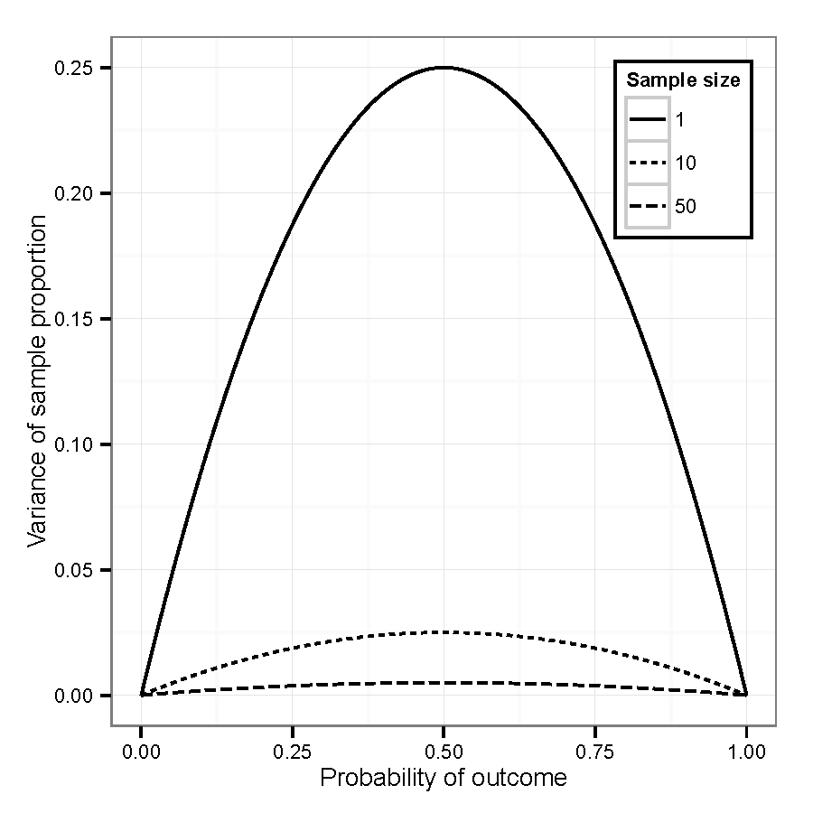
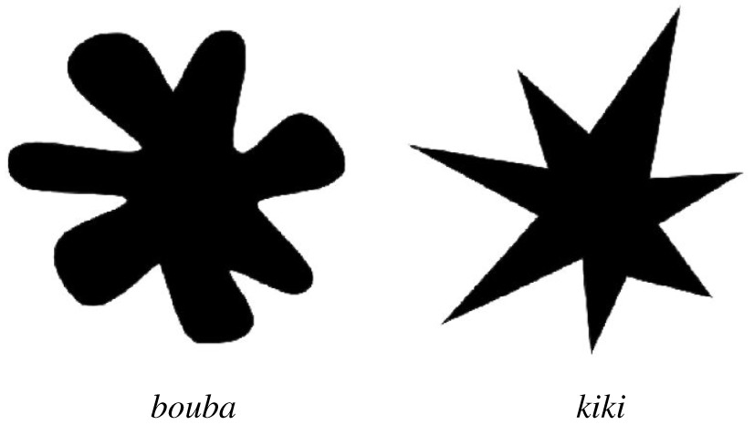

```{r setup, include=FALSE}
options(htmltools.dir.version = FALSE)
```

```{r xaringan-themer, include = FALSE}
library(xaringanthemer)
style_mono_accent(
  # base_color = "#0F4C81", # DAPR1
  # base_color = "#BF1932", # DAPR2
  # base_color = "#88B04B", # DAPR3 
  # base_color = "#FCBB06", # USMR
  base_color = "#a41ae4", # MSMR
  header_color = "#000000",
  header_font_google = google_font("Source Sans Pro"),
  header_font_weight = 400,
  text_font_google = google_font("Source Sans Pro", "400", "400i", "600", "600i"),
  code_font_google = google_font("Source Code Pro"),
  extra_css = list(".scroll-output" = list("height"="80%","overflow-y"="scroll"))
) 
```

```{r setup2, include=FALSE, message=FALSE}
options(digits = 4)
library(tidyverse)
library(knitr)
library(kableExtra)
library(patchwork)
library(lme4)
```

# Why logistic regression? (A brief review)

Aggregated binary outcomes (e.g., accuracy, fixation proportion) can look approximately continuous, but they

* Are bounded: can only have values between 0.0 and 1.0
* Have very specific, non-uniform variance pattern



---
# Logistic regression (A brief review)
* Model the binomial process that produced binary data
* Not enough to know that accuracy was 90%, need to know whether that was 9 out of 10 trials or 90 out of 100 trials
* Can be a binary vector of single-trial 0's (failures, No's) or 1's (successes, Yes's)
* More compact version: count of the number of successes and the number of failures

Outcome is log-odds (also called "logit"): $logit(Yes, No) = \log \left(\frac{Yes}{No}\right)$

Compare to proportions: $p(Yes, No) = \frac{Yes}{Yes+No}$

Note: logit is undefined (`Inf`) when $p=0$ or $p=1$, this makes it hard to fit logistic models to data with such extreme values (e.g., fixations on objects that are very rarely fixated).

---
# Example Data
Novel word learning (`nwl`) in aphasia (based on Peñaloza et al., 2016). 

* Participants: 27 older adults (13 with aphasia, 14 control)
* Task: learn 6 new words (made-up labels for ancient farming equipment)
    + 7 blocks of training trials, each block consisted of 30 2AFC trials, feedback provided
    + Immediate recall test block (30 2AFC trials, no feedback)
    + Follow-up test block 1 week later (30 2AFC trials, no feedback)

```{r}
load("./data/nwl.RData")
summary(nwl)
```

---
# Example Data
```{r fig.height=3.5, fig.width=7}
ggplot(nwl, aes(block, PropCorrect, color=group, shape=group)) + 
  stat_summary(fun.data=mean_se, geom="pointrange") + 
  stat_summary(data=filter(nwl, block <= 7), fun=mean, geom="line") + 
  geom_hline(yintercept=0.5, linetype="dashed") + 
  geom_vline(xintercept=c(7.5, 8.5), linetype="dashed") + 
  scale_x_continuous(breaks=1:9, labels=c(1:7, "Test", "Follow-Up")) + 
  expand_limits(y=1.0) + theme_bw() + labs(x="Block", y="Proportion Correct")
```

---
# Research questions 
(just focus on test data for now)

.pull-left[
```{r echo=FALSE, fig.width=5, fig.height=3}
ggplot(filter(nwl, block > 7), aes(fct_rev(Phase), PropCorrect, fill=group)) +
  geom_boxplot() +
  geom_hline(yintercept = 0.5, linetype="dashed") +
  theme_bw() + labs(y="Proportion Correct", x="Test Phase") 
```
]

.pull-right[
* Were patients with aphasia less successful than controls were at learning these new words? (Lower test performance)
* Did recall decrease from immediate test to 1-week follow-up?
* Was retention (recall decrease) different for the two groups?
]

--

One might be tempted to test this with a 2x2 ANOVA. In what ways is that right? In what ways is that wrong?

--

* What it gets right
    + Group as a between-participant variable, Phase as a within-participant variable (MLM is a more flexible version of repeated measures ANOVA)
    + Phase-by-group interaction

--

* What it gets wrong: Accuracy is not a continuous linear variable, it is an aggregated binary variable
    
---
# Logistic MLM: Fit the model
Logistic model code is almost the same as linear model code. Three differences: 

1. `glmer()` instead of `lmer()` 
2. outcome is 1/0 or aggregated number of 1s, 0s
3. add `family=binomial`

```{r}
m.recall <- glmer(cbind(NumCorrect, NumError) ~ Phase * group + 
                    (Phase | ID), 
                   data=filter(nwl, block > 7), family="binomial")
```

--

Note: Logistic MLMs are slower to fit and are prone to convergence problems.

* May need to simplify random effect structure 
* Convergence warnings: A warning is not an error -- will need to check parameter estimates and SE
* Singular fit message: A message is not an error -- will need to assess reason for message and consider changes to the model

---
# Logistic MLM: Model summary
.scroll-output[
```{r}
summary(m.recall)
```
]

---
# Contrast coding
In `R`, the default for factors is "treatment" coding: the reference level is the baseline. This means that the parameter estimates are *simple* effects.

* `PhaseImmediate`: effect of test phase *for control group* (reference level of `group`)
* `grouppatient`: effect of group *at follow-up* (reference level for `Phase`)

--

### To estimate main effects, need to use "sum" coding

```{r message=FALSE}
m.recall_sum <- glmer(cbind(NumCorrect, NumError) ~ Phase * group + (Phase | ID), 
                      contrasts = list(Phase = "contr.sum", group = "contr.sum"),
                   data=filter(nwl, block > 7), family="binomial")
coef(summary(m.recall_sum))
```

---
# Logistic MLM: Plot model fit

The `fitted` function conveniently returns proportions from a logistic model, so plotting the model fit is easy:

```{r fig.width=6, fig.height=4}
ggplot(filter(nwl, block > 7), aes(fct_rev(Phase), PropCorrect, fill=group)) +
  geom_violin() +
  stat_summary(aes(y=fitted(m.recall_sum), shape=group), fun=mean, geom = "point", 
               size=2, position=position_dodge(width=.9)) +
  geom_hline(yintercept = 0.5, linetype="dashed") +
  theme_bw() + labs(y="Proportion Correct", x="Test Phase") 
```

---
# Simplify random effects
There is some disagreement about the *right* way to structure random effects. The core issues are:

1. For within-subject variables, omitting the random effect tends to inflate false positive rates of the corresponding fixed effect (Barr et al., 2013). So if you want to make inferences about a (within-subject) fixed effect, you should include the corresponding random effect (*Keep it maximal*).

--

2. Random effects require a lot of data to estimate, so it is easy to over-parameterize a model with random effects (you'll get convergence warnings or messages). Poor convergence can mean that there may be other fixed effect estimates that are (nearly) equally good at describing your data, which is a problem since you want to make inferences based on the fixed effect estimates.

--

### Solutions

* Start with a maximal random effect structure
* In case of convergence problems, look at the random effect variance-covariance matrix: are there terms with very low variance or unrealistic covariance (-1 or 1)? Consider removing these.
* Compare fixed effect estimates under different random effect structures: ideally, the fixed effect estimates and SE should be (approximately) the same. If they are substantially different, then your modeling approach is not robust and you should reconsider and/or be *very* cautious about interpreting the results.

---
# Live R

**Test-enhanced learning** (Roediger & Karpicke, 2006; Roediger et al., 2011; Pan & Rickard, 2018): attempting to recall information (i.e., a practice test) produces better learning than re-studying the material.

**Bouba/Kiki effect** (Cwiek, et al., 2022; Köhler, 1929; 1947; Ramachandran & Hubbard, 2001): people tend to assign the "bouba" label to the round shape and the "kiki" label to the pointy shape.

