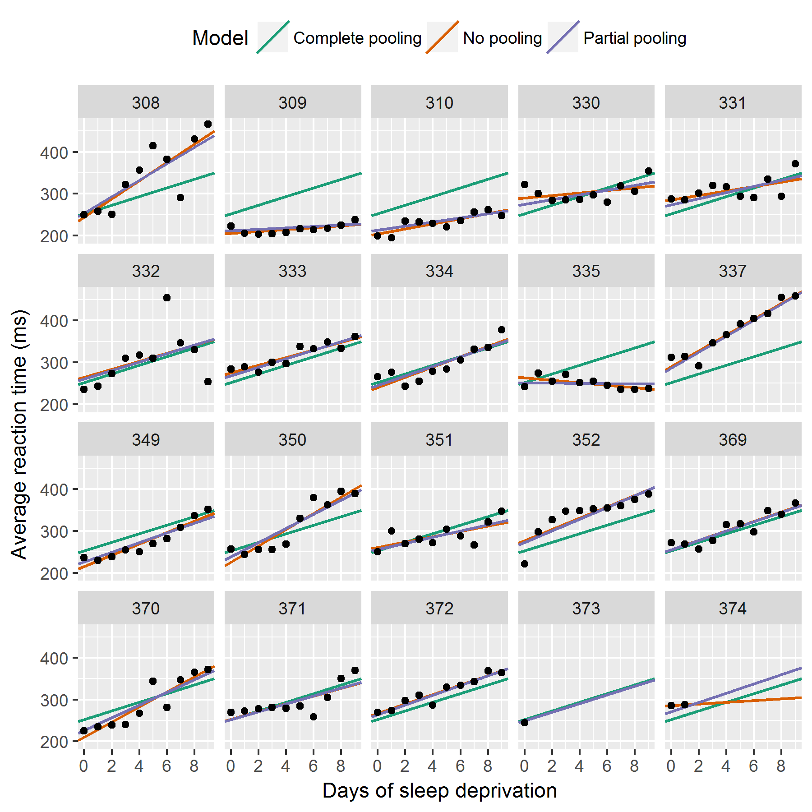
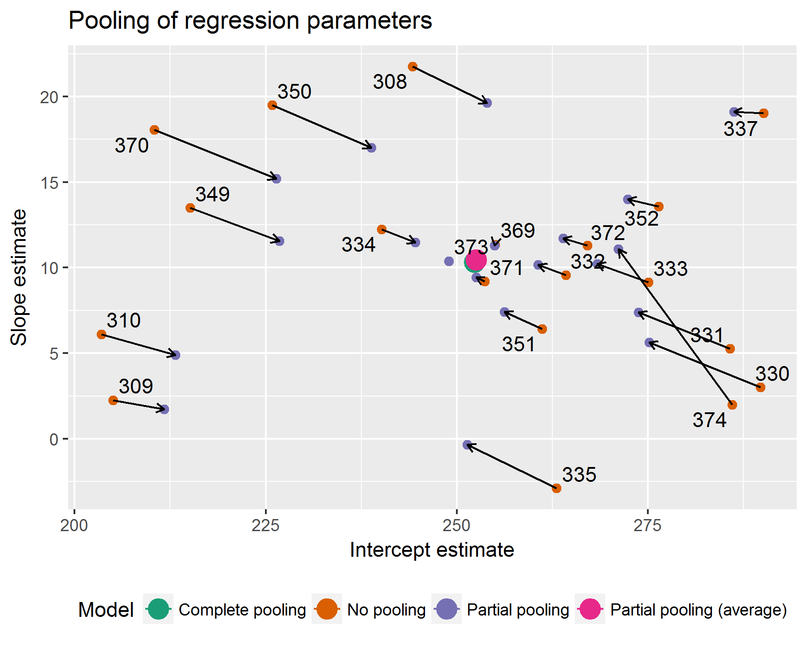

```{r setup, include=FALSE, message=FALSE}
options(htmltools.dir.version = FALSE)
options(digits = 4)
library(knitr)
library(kableExtra)
library(patchwork)
library(gt)
```

```{r xaringan-themer, include = FALSE}
library(xaringanthemer)
style_mono_accent(
  # base_color = "#0F4C81", # DAPR1
  # base_color = "#BF1932", # DAPR2
  # base_color = "#88B04B", # DAPR3 
  # base_color = "#FCBB06", # USMR
  base_color = "#a41ae4", # MSMR
  header_color = "#000000",
  header_font_google = google_font("Source Sans Pro"),
  header_font_weight = 400,
  text_font_google = google_font("Source Sans Pro", "400", "400i", "600", "600i"),
  code_font_google = google_font("Source Code Pro"),
  extra_css = list(".scroll-output" = list("height"="80%","overflow-y"="scroll"))
) 
```

# Longitudinal data are a natural application domain for MLM

* Longitudinal measurements are *nested* within subjects (by definition)
* Longitudinal measurements are related by a continuous variable, spacing can be uneven across participants, and data can be missing
    + These are problems rmANOVA
* Trajectories of longitudinal change can be nonlinear (we'll get to that next week)

--

## We've already seen some of this...

* Visual search (not longitudinal, but principles are the same)

---
# Another example

`web_cbt.rda`: Effect of a 6-week web-based CBT intervention for depression, with and without weekly 10-minute phone call (simulated data based on Farrer et al., 2011, https://doi.org/10.1371/journal.pone.0028099).

```{r message=FALSE, warning=FALSE}
library(tidyverse)
library(lme4)
library(lmerTest)
library(broom.mixed)
library(effects)
load("./data/web_cbt.rda")
#str(web_cbt)
```

* `Participant`: Participant ID
* `Wave`: Week of data collection
* `Web`: Whether participant was told to access an online CBT programme
* `Phone`: Whether participant received a weekly 10-minute phone call to address issues with web programme access or discuss environmental and lifestyle factors (no therapy or counselling was provided over the phone)
* `CES_D`: Center for Epidemiologic Studies Depression Scale, scale goes 0-60 with higher scores indicating more severe depression

---
# Inspect data

```{r fig.width=8, fig.height=5, warning=FALSE}
ggplot(web_cbt, aes(Wave, CES_D, color=Web, shape=Phone)) +
  stat_summary(fun.data=mean_se, geom="pointrange",
               position=position_dodge(width=0.2)) +
  stat_summary(fun=mean, geom="line") +
  scale_shape_manual(values=c(16, 21))
```

---
# Research questions

1. Did the randomisation work? Participants were randomly assigned to groups, so there should be no group differences at baseline, but it's always a good idea to check that the randomisation was successful.
2. Did the web-based CBT programme reduce depression?
3. Did the phone calls reduce depression?
4. Did the phone calls interact with the web-based CBT programme? That is, did getting a phone call change the efficacy of the web-based programme? (Or, equally, did the CBT programme change the effect of phone calls?)

---
# What is the baseline?

**Did the randomisation work? Were there any group differences at baseline?**

We can answer this question using the **intercept** coefficients

--

But those will be estimated at `Wave = 0`, which is 1 week *before* the baseline, which was at `Wave = 1`.

So we need to adjust the time variable so that baseline corresponds to time 0:

```{r}
web_cbt$Time <- web_cbt$Wave - 1
```

Now `Time` is a variable just like `Wave`, but going from 0 to 5 instead of 1 to 6. 

--

In this case, we made a very minor change, but the more general point is that it's important to think about intercepts. Lots of common predictor variables (calendar year, age, height, etc.) typically do not start at 0 and will produce meaningless intercept estimates (e.g., in the year Jesus was born, or for someone who is 0cm tall) unless properly adjusted or centered. 

---
# Fit the models

```{r}
# base model: just change over time
m <- lmer(CES_D ~ Time + (1 + Time | Participant), 
          data=web_cbt, REML=FALSE)
# add baseline differences 
m.int <- lmer(CES_D ~ Time + (Phone * Web) + (1 + Time | Participant), 
              data = web_cbt, REML = F)
# full model
m.full <- lmer(CES_D ~ Time*Phone*Web + (1 + Time | Participant),
          data=web_cbt, REML=FALSE)
```

---
# Compare models

```{r}
anova(m, m.int, m.full)
```

No differences at baseline ( $\chi^2(3) = 4.48, p = 0.21$ ), so randomisation worked. 

Differences in slopes ( $\chi^2(3) = 104.10, p < 0.0001$ ), so groups differed in how their depression symptoms changed over the 6 weeks of the study.

---
# Examine Fixed Effects

```{r}
gt(tidy(m.full, effects="fixed"))
```

Parameters were estimated for the "No" groups relative to the "Yes" groups, which is the reverse of how we framed our research questions. We can fix this by reversing the factor levels and re-fitting the model. 

---
# Fix factor coding and refit model
```{r}
web_cbt <- web_cbt %>% mutate(Web = fct_rev(Web), Phone = fct_rev(Phone))
m.full <- lmer(CES_D ~ Time*Phone*Web + (1 + Time | Participant), data=web_cbt, REML=F)
```

```{r echo=FALSE}
gt(tidy(m.full, effects="fixed"))
```

Now the control group (no phone, no web) is the reference level and it did show some improvement over time (`Time`: $Est = -0.92, SE = 0.13, t(140)=-7.32, p < 0.0001$). The web intervention group improved even faster (`Time:WebYes`: $Est = -1.52, SE = 0.18, t(140)=-8.51, p < 0.0001$). All other effects were not statistically significant.

---
# Visualize effects (1): model-predicted values

```{r fig.width=8, fig.height=5}
ggplot(augment(m.full), aes(Time, CES_D, color=Web, shape=Phone)) +
  stat_summary(fun.data=mean_se, geom="pointrange", position=position_dodge(width=0.1)) +
  stat_summary(aes(y=.fitted, linetype=Phone), fun=mean, geom="line") +
  scale_shape_manual(values=c(16, 21)) + 
  theme_bw() + scale_color_brewer(palette = "Set1")
```

---
# Visualize effects (2): model-based lines

```{r fig.width=8, fig.height=5}
ef <- as.data.frame(effect("Time:Phone:Web", m.full))
ggplot(ef, aes(Time, fit, color=Web, linetype=Phone)) +
  geom_line(size=2) +
  theme_bw() + scale_color_brewer(palette = "Set1")
```

---
# Random effects


--

**Keep it maximal**: A full or maximal random effect structure is when all of the factors that could hypothetically vary across individual observational units are allowed to do so.

* Incomplete random effects can inflate false alarms
* Full random effects can produce convergence problems, may need to be simplified

---
# Participants as fixed vs. random effects
**In general**, participants should be treated as random effects.

This captures the typical assumption of random sampling from some population to which we wish to generalise.

**Pooling**



http://tjmahr.github.io/plotting-partial-pooling-in-mixed-effects-models/

---
# Participants as fixed vs. random effects
**In general**, participants should be treated as random effects.

This captures the typical assumption of random sampling from some population to which we wish to generalise.

**Shrinkage**



http://tjmahr.github.io/plotting-partial-pooling-in-mixed-effects-models/

Another explanation of shrinkage: https://m-clark.github.io/posts/2019-05-14-shrinkage-in-mixed-models/

---
# Participants as fixed vs. random effects
**In general**, participants should be treated as random effects.

This captures the typical assumption of random sampling from some population to which we wish to generalise.

**Exceptions are possible**: e.g., neurological/neuropsychological case studies where the goal is to characterise the pattern of performance for each participant, not generalise to a population.

---
# Key points

.pull-left[
**Logistic MLM**

* Binary outcomes have particular distributional properties, use binomial (logistic) models to capture their generative process
* Very simple extension of `lmer` code
    + `glmer()` instead of `lmer()`
    + add `family=binomial`
    + Outcome can be binary 1s and 0s or aggregated counts, e.g., `cbind(NumCorrect, NumError)`
* Logistic MLMs are slower to fit and are prone to convergence problems
]

.pull-right[
**Longitudinal Data Analysis (linear)**

* LDA is a natural application for MLM
* Use random effects to capture within-participant (longitudinal) nesting
    + Keep it maximal, simplify as needed (more on this next week)
    + Partial pooling and shrinkage
* Don't forget about contrast coding and centering
]

---
# Live R

### Longitudinal Data Analysis (linear): Weight-loss maintenance

Following a weight-loss programme, participants were randomly assigned to one of three weight maintenance conditions: 

* None (Control)
* Use a "Meal Replacement" to replace one meal and snack per day (MR)
* A book and educational materials on purchasing and preparing foods lower in energy density, i.e., reduced fat content and/or increased water content (ED)

Weight was assessed at baseline (start of maintenance), 12 months post, 24 months post, and 36 months post.
