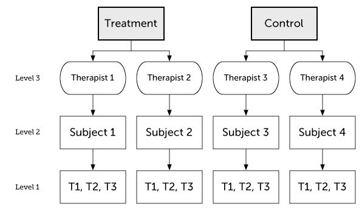
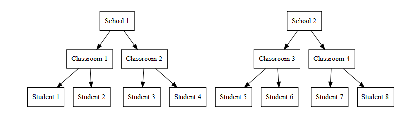
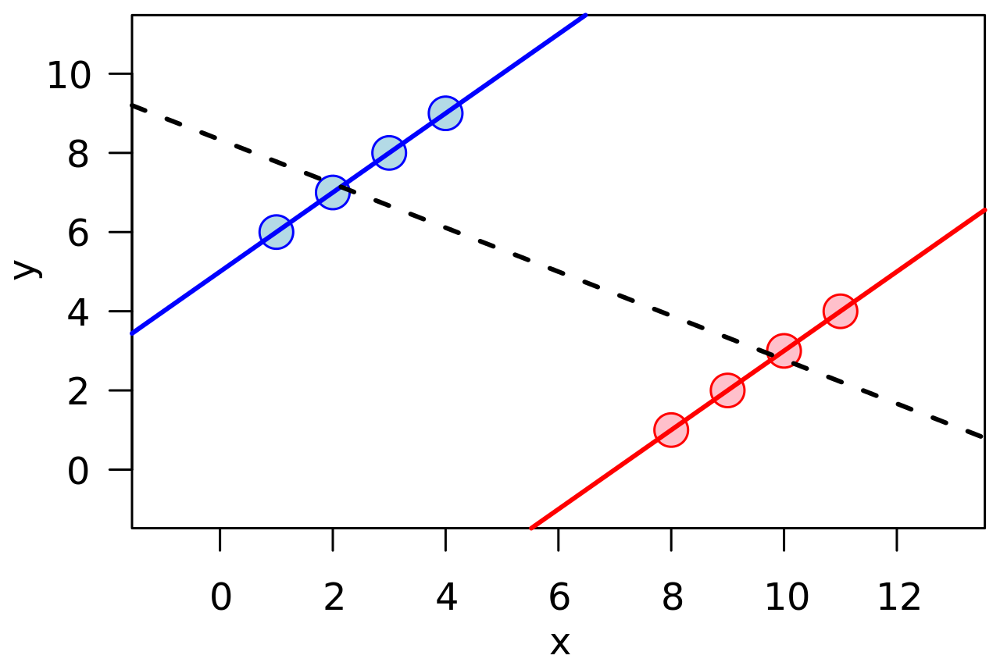

```{r setup, include=FALSE, message=FALSE}
options(htmltools.dir.version = FALSE)
options(digits = 4)
library(knitr)
library(kableExtra)
library(patchwork)

library(tidyverse)
library(broom)
library(broom.mixed)
library(gt)
library(lme4)
library(lmerTest)
```

```{r xaringan-themer, include = FALSE}
library(xaringanthemer)
style_mono_accent(
  # base_color = "#0F4C81", # DAPR1
  # base_color = "#BF1932", # DAPR2
  # base_color = "#88B04B", # DAPR3 
  # base_color = "#FCBB06", # USMR
  base_color = "#a41ae4", # MSMR
  header_color = "#000000",
  header_font_google = google_font("Source Sans Pro"),
  header_font_weight = 400,
  text_font_google = google_font("Source Sans Pro", "400", "400i", "600", "600i"),
  code_font_google = google_font("Source Code Pro"),
  extra_css = list(".scroll-output" = list("height"="90%","overflow-y"="scroll"))
) 
```

# Turtles all the way down
.pull-left[
MLM is useful for **nested data**. 

So far, we've considered two levels of nesting:

* Group level
* Individual level

It's also possible to have multiple nesting levels or other kinds of crossed nesting structures.

This is captured by the **random effect structure**.
]

.pull-right[


image credit: wikipedia
]

---
# 3-level nesting

.left-column[
**Sources of variability (random intercepts and time-slopes)**

* Therapists 
* Subjects
]

.right-column[


image credit: Kristoffer Magnusson
]

---
# Example: Math Active Learning
**Simulated example: Testing whether a new (computer based) active learning method improves math test scores.** 

* You measured students' math scores (DV) and the proportion of time (IV) they spent using the computer. 
* The program was implemented in 3 schools
* 8-12 classrooms in each school (total schools n=30)
* 12-24 students per class (total students n=570)



image credit: Alexander P. Demos

---
# Math Active Learning: Read the data

Do a little data wrangling: center some values relative to the grand mean and the school mean.

```{r}
math <- read_csv("./data/active_math_sim.csv") %>%
  mutate(Class = paste0(School, "cl", Classroom), #unique class ID
         ActiveTime.GM = scale(ActiveTime, scale=F), #grand-mean centered
         ClassSize.GM = scale(ClassSize, scale=F)) %>% #grand-mean centered
  group_by(School) %>%
  mutate(ClassSize.SM = scale(ClassSize, scale=F)) #school-mean centered
```

---
# Math Active Learning: Exploratory plot 1

```{r, fig.height=4, fig.width=8, message=FALSE}
p1a <- ggplot(math, aes(ClassSize, Math)) + geom_point() + geom_smooth(method = "lm")
p1b <- ggplot(math, aes(ActiveTime, Math)) + geom_point() + geom_smooth(method = "lm")
p1a + p1b # requires "patchwork" library
```

Looks like math scores are better in **smaller classes** and for students with a higher **active learning proportion**.

---
# Math Active Learning: Exploratory plot 2

```{r, fig.height=4, fig.width=10}
p2a <- ggplot(math, aes(Class, ClassSize, color=School)) + geom_point() + coord_flip()
p2b <- ggplot(math, aes(Class, ActiveTime, fill=School)) + geom_boxplot() + coord_flip()
p2a + p2b
```

* Classes differ in size, and this is unequal across schools
* Students differ in proportion  of time spent on active learning, but each class has a big (similar) range

---
# Math Active Learning: 2-level model

```{r, message=FALSE}
m1 <- lmer(Math ~ ActiveTime.GM * ClassSize.GM + (1 | Class),  
          data=math, REML=FALSE)
gt(tidy(m1)) # requires "broom.mixed" and "gt" packages
```

--

As we work through this example, keep an eye on the effect of class size and its interaction with active learning time.

---
# Math Active Learning: 2-level model fit(s)
```{r, fig.width=7, fig.height=3.5, message=FALSE}
ggplot(augment(m1), aes(ActiveTime.GM, Math, color=Class)) +
  geom_point() + geom_smooth(aes(y=.fitted), method = "lm") +
  xlab("Active Learning Time") + ylab("Math Score") + theme(legend.position = "none")
```

Note the parallel lines: Our model allows classrooms to differ in math scores (random intercept), but not in the effect of active learning, which is assumed to be the same in all classrooms.

--

Maybe classes differ in how strongly active learning influences math achievement? **Add random slopes**

---
# Math Active Learning: 2-level model, part 2
```{r}
m2 <- lmer(Math ~ ActiveTime.GM * ClassSize.GM + (1 + ActiveTime.GM | Class), data=math, REML=F)
```
```{r echo=FALSE}
tidy(m2) %>% filter(is.na(group) | group != "Residual") %>% 
  gt() %>% tab_style(
    style = list(cell_fill(color = "yellow")),
    locations = cells_body(rows = term == "ActiveTime.GM:ClassSize.GM") )
```

Adding `ActiveTime` random slopes substantially increased the SE and reduced estimated df for `ActiveTime` fixed effects. Interaction effect is not even marginal in this model: in the first model, omitting the random slope made the corresponding fixed effect anti-conservative.

--

Now that we have that random slope, the model can capture *random* classroom-level variation in effect of active learning instead of spuriously assigning it to class.

---
#  Math Active Learning: 2-level model, part 2 fit(s)
```{r, fig.width=7, fig.height=3.5, message=FALSE}
ggplot(augment(m2), aes(ActiveTime.GM, Math, color=Class)) +
  geom_point() + geom_smooth(aes(y=.fitted), method = "lm") +
  xlab("Active Learning Time") + ylab("Math Score") + theme(legend.position = "none")
```

Model captures random class-level variation in math scores and strength of active learning effect.

---
#  Math Active Learning: a 3-level model?

The 2-level model assumes that classrooms are independent, but this is not quite true. Classrooms are nested within schools and there may be school-level differences in math scores, effects of active learning, class size, etc.

```{r, fig.width=9, fig.height=4, message=FALSE}
ggplot(math, aes(ActiveTime.GM, Math, color=Class)) +
  facet_wrap(~ School) +
  geom_point() + geom_smooth(method = "lm", se=FALSE) +
  xlab("Active Learning Time") + ylab("Math Score") + theme(legend.position = "none")
```

---
##  School and Class Size are confounded

```{r, fig.width=8, fig.height=4}
unique(select(math, School, Class, ClassSize, ClassSize.GM, ClassSize.SM)) %>%
  pivot_longer(cols=starts_with("ClassSize"), names_to = "Type", values_to = "Size") %>%
  ggplot(aes(School, Size)) + facet_wrap(~ Type, scales="free_y") + geom_violin() + geom_jitter(width=0.1, height=0)
```

* Class sizes are different across schools, which means that these variables are confounded: can't distinguish (random, uninteresting) differences between schools from (systematic, interesting) effects of class size.
* This is true for both raw and grand-mean-centered class sizes
* School-mean-centered class sizes allow testing effect of class size while controlling for school-level differences

---
# Sidebar: Simpson's Paradox

.pull-left[

]

.pull-right[
**Famous real-world example: gender bias in PG admissions at University of California - Berkeley in 1973**

* Overall acceptance rate higher for males than females
* But individual department acceptance rates higher for females than males

This is usually because of a "lurking" (confounding) variable. In the Berkeley example there is a confound between gender differences in **application** rates and **department** differences in acceptance rates: departments with low admission rates had many more female applicants, departments with higher admission rates had many more male applicants. As a result, even though (almost) all departments had higher acceptance rates for females, the *overall* acceptance rate was higher for males.
]

--

**Lesson**: watch out for sub-group (cluster-level) differences that might be confounded with your variables of interest.

---
#  Math Active Learning: 3-level model

* Use school-mean-centered measure of class size to test effect of class size while controlling for school-level differences
* Add random effect of School (intercept and slope)

```{r, message=FALSE}
m3 <- lmer(Math ~ ActiveTime.GM * ClassSize.SM +
           (1 + ActiveTime.GM | School) +
           (1 + ActiveTime.GM | Class),  
           data=math, REML=FALSE)
```

---
#  Math Active Learning: 3-level model

```{r echo=FALSE}
gt(tidy(m3)) %>% 
  tab_style(
    style = list(cell_fill(color = "yellow")),
    locations = cells_body(rows = str_detect(term, "ClassSize")) 
  )
```

Effect of Class Size is no longer significant: it was a Simpson's paradox effect (differences between Schools, which are confounded with class size, not effects of class size)

---
#  Math Active Learning: 3-level model

.pull-left[
With only 3 schools, the school-level random effects are probably over-parameterized...
```{r}
VarCorr(m3)
```

Yes, the slope-intercept correlation is -1.00

]

--

.pull-right[
Remove the by-school slope-intercept correlation:

```{r}
m3a <- lmer(Math ~ ActiveTime.GM * ClassSize.SM +
           (1 + ActiveTime.GM || School) +
           (1 + ActiveTime.GM | Class),  
           data=math, REML=FALSE)
VarCorr(m3a)
```
]
---
#  Math Active Learning: 3-level model
```{r echo=FALSE}
gt(tidy(m3a)) %>% 
  tab_style(
    style = list(cell_fill(color = "yellow")),
    locations = cells_body(rows = str_detect(term, "ClassSize")) 
  )
```

---
# Key points

Nested structure can extend to 3 (or more) levels and this should be captured in the random effects structure of a multilevel model

This is particularly important when sub-group (cluster-level) differences might be confounded with variables of interest (Simpson's Paradox).

--

Omitting random slopes tends to make models anti-conservative (inflates rates of false positives). **Recommendation:** start with a "full" or "maximal" random effect structure and reduce as needed

--

When there are only a few observational units (e.g., 3 schools), estimating random effects is very difficult (esp. random slopes) and can produce unreliable fixed effect estimates. Over-parameterised random effect structures should be simplified.
