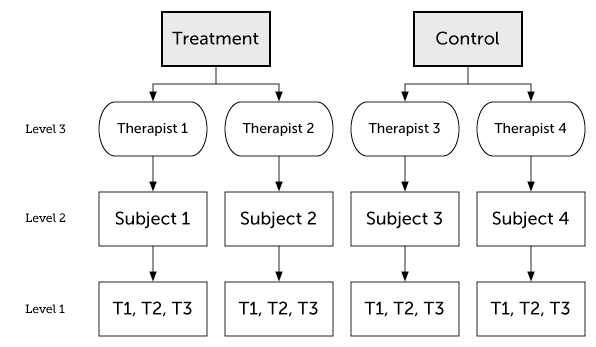
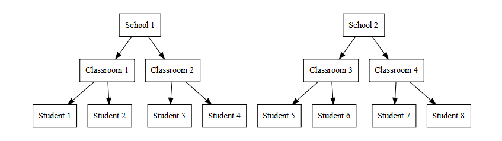

```{r setup, include=FALSE, message=FALSE}
options(htmltools.dir.version = FALSE)
options(digits = 4)
library(knitr)
library(kableExtra)
library(patchwork)

library(tidyverse)
library(broom)
library(broom.mixed)
library(gt)
library(lme4)
library(lmerTest)
```

```{r xaringan-themer, include = FALSE}
library(xaringanthemer)
style_mono_accent(
  # base_color = "#0F4C81", # DAPR1
  # base_color = "#BF1932", # DAPR2
  # base_color = "#88B04B", # DAPR3 
  # base_color = "#FCBB06", # USMR
  base_color = "#a41ae4", # MSMR
  header_color = "#000000",
  header_font_google = google_font("Source Sans Pro"),
  header_font_weight = 400,
  text_font_google = google_font("Source Sans Pro", "400", "400i", "600", "600i"),
  code_font_google = google_font("Source Code Pro"),
  extra_css = list(".scroll-output" = list("height"="80%","overflow-y"="scroll"))
) 
```

# Turtles all the way down

.pull-left[
MLM is useful for **nested data**. 

So far, we've considered two levels of nesting:

* Group level
* Individual level

It's also possible to have multiple nesting levels or crossed nesting structures.

This is captured by the **random effect structure**.
]

.pull-right[


image credit: wikipedia
]

---
# 3-level nesting

.left-column[
**Sources of variability (random intercepts and time-slopes)**

* Therapists 
* Subjects
]

.right-column[


image credit: Kristoffer Magnusson
]

---
# Example: Math Active Learning
**Simulated example: Testing whether a new (computer based) active learning method improves math test scores.** 

* You measured students' math scores (DV) and the proportion of time (IV) they spent using the computer. 
* The program was implemented in 3 schools
* 8-12 classrooms in each school (total schools n=30)
* 12-24 students per class (total students n=570)



image credit: Alexander P. Demos

---
# Math Active Learning: Read the data

Do a little data wrangling: center some values relative to the grand mean and the school mean.

```{r}
math <- read_csv("./data/active_math_sim.csv") %>%
  mutate(Class = paste0(School, "cl", Classroom), #unique class ID
         ActiveTime.GM = scale(ActiveTime, scale=F), #grand-mean centered
         ClassSize.GM = scale(ClassSize, scale=F)) %>% #grand-mean centered
  group_by(School) %>%
  mutate(ClassSize.SM = scale(ClassSize, scale=F)) #school-mean centered
```

---
# Math Active Learning: Exploratory plot 1

```{r, fig.height=4, fig.width=8, message=FALSE}
p1a <- ggplot(math, aes(ClassSize, Math)) + geom_point() + geom_smooth(method = "lm")
p1b <- ggplot(math, aes(ActiveTime, Math)) + geom_point() + geom_smooth(method = "lm")
p1a + p1b # requires "patchwork" library
```

Looks like math scores are better in **smaller classes** and for students who spend more time doing active learning (**higher active learning proportion**).

---
# Math Active Learning: Exploratory plot 2

```{r, fig.height=4, fig.width=10}
p2a <- ggplot(math, aes(Class, ClassSize, color=School)) + geom_point() + coord_flip()
p2b <- ggplot(math, aes(Class, ActiveTime, fill=School)) + geom_boxplot() + coord_flip()
p2a + p2b
```

* Classes differ in size, and this is unequal across schools
* Students differ in proportion  of time spent on active learning, but each class has a big (similar) range

---
# Math Active Learning: 2-level model

```{r, message=FALSE}
m1 <- lmer(Math ~ ActiveTime.GM * ClassSize.GM + (1 | Class),  
          data=math, REML=FALSE)
gt(tidy(m1)) # requires "broom.mixed" and "gt" packages
```

--

As we work through this example, keep an eye on the effect of class size and its interaction with active learning time.

---
# Math Active Learning: 2-level model fit(s)
```{r, fig.width=7, fig.height=3.5, message=FALSE}
ggplot(augment(m1), aes(ActiveTime.GM, Math, color=Class)) +
  geom_point() + geom_smooth(aes(y=.fitted), method = "lm") +
  xlab("Active Learning Time") + ylab("Math Score") + theme(legend.position = "none")
```

Note the parallel lines: Our model allows classrooms to differ in math scores (random intercept), but not in the effect of active learning, which is assumed to be the same in all classrooms.

--

Maybe classes differ in how strongly active learning influences math achievement? **Add random slopes**

---
# Math Active Learning: 2-level model, part 2
```{r}
m2 <- lmer(Math ~ ActiveTime.GM * ClassSize.GM + (1 + ActiveTime.GM | Class), data=math, REML=F)
```
```{r echo=FALSE}
tidy(m2) %>% filter(is.na(group) | group != "Residual") %>% 
  gt() %>% tab_style(
    style = list(cell_fill(color = "yellow")),
    locations = cells_body(rows = term == "ActiveTime.GM:ClassSize.GM") )
```

* Adding `ActiveTime` random slopes substantially increased the SE and reduced estimated df for `ActiveTime` fixed effects. 
* Interaction effect is not even marginal in this model: in the first model, omitting the random slope made the corresponding fixed effect anti-conservative.

--

Random slopes capture *random* classroom-level variation in effect of active learning instead of spuriously assigning it to class.

---
#  Math Active Learning: 2-level model, part 2 fit(s)
```{r, fig.width=7, fig.height=3.5, message=FALSE}
ggplot(augment(m2), aes(ActiveTime.GM, Math, color=Class)) +
  geom_point() + geom_smooth(aes(y=.fitted), method = "lm") +
  xlab("Active Learning Time") + ylab("Math Score") + theme(legend.position = "none")
```

Model captures random class-level variation in math scores and strength of active learning effect.

---
#  Math Active Learning: a 3-level model?

The 2-level model assumes that classrooms are independent, but this is not quite true. Classrooms are nested within schools and there may be school-level differences in math scores, effects of active learning, class size, etc.

```{r, fig.width=9, fig.height=4, message=FALSE}
ggplot(math, aes(ActiveTime.GM, Math, color=Class)) +
  facet_wrap(~ School) +
  geom_point() + geom_smooth(method = "lm", se=FALSE) +
  xlab("Active Learning Time") + ylab("Math Score") + theme(legend.position = "none")
```

---
##  School and Class Size are confounded

```{r, fig.width=8, fig.height=4}
unique(select(math, School, Class, ClassSize, ClassSize.GM, ClassSize.SM)) %>%
  pivot_longer(cols=starts_with("ClassSize"), names_to = "Type", values_to = "Size") %>%
  ggplot(aes(School, Size)) + facet_wrap(~ Type, scales="free_y") + geom_violin() + geom_jitter(width=0.1, height=0)
```

* Class sizes are different across schools, this confounds differences between schools (random, not interesting) and effects of class size (systematic, interesting)
* This is true for both raw and grand-mean-centered class sizes, but **school-mean-centered** class sizes allow testing effect of class size while controlling for school-level differences

---
# Sidebar: Simpson's Paradox

.pull-left[

]

.pull-right[
**Famous real-world example: gender bias in PG admissions at University of California - Berkeley in 1973**

* Overall acceptance rate higher for males than females
* But individual department acceptance rates higher for females than males

This is usually because of a "lurking" (confounding) variable. In the Berkeley example there is a confound between gender differences in **application** rates and **department** differences in acceptance rates: departments with low admission rates had many more female applicants, departments with higher admission rates had many more male applicants. As a result, even though (almost) all departments had higher acceptance rates for females, the *overall* acceptance rate was higher for males.
]

--

**Lesson**: watch out for sub-group (cluster-level) differences that might be confounded with your variables of interest.

---
#  Math Active Learning: 3-level model

* Use school-mean-centered measure of class size to test effect of class size while controlling for school-level differences
* Add random effect of School (intercept and slope)

```{r, message=FALSE}
m3 <- lmer(Math ~ ActiveTime.GM * ClassSize.SM +
           (1 + ActiveTime.GM | School) +
           (1 + ActiveTime.GM | Class),  
           data=math, REML=FALSE)
```

---
#  Math Active Learning: 3-level model

```{r echo=FALSE}
gt(tidy(m3)) %>% 
  tab_style(
    style = list(cell_fill(color = "yellow")),
    locations = cells_body(rows = str_detect(term, "ClassSize")) 
  )
```

Effect of Class Size is no longer significant: it was a Simpson's paradox effect (differences between Schools, which are confounded with class size, not effects of class size)

---
#  Math Active Learning: 3-level model

.pull-left[
With only 3 schools, the school-level random effects are probably over-parameterized...
```{r}
VarCorr(m3)
```

Yes, the slope-intercept correlation is -1.00

]

--

.pull-right[
Remove the by-school slope-intercept correlation:

```{r}
m3a <- lmer(Math ~ ActiveTime.GM * ClassSize.SM +
           (1 + ActiveTime.GM || School) +
           (1 + ActiveTime.GM | Class),  
           data=math, REML=FALSE)
VarCorr(m3a)
```
]
---
#  Math Active Learning: 3-level model
```{r echo=FALSE}
gt(tidy(m3a)) %>% 
  tab_style(
    style = list(cell_fill(color = "yellow")),
    locations = cells_body(rows = str_detect(term, "ClassSize")) 
  )
```

---
# Interim summary

Nested structure can extend to 3 (or more) levels and this should be captured in the random effects structure of a multilevel model

This is particularly important when sub-group (cluster-level) differences might be confounded with variables of interest (Simpson's Paradox).

--

Omitting random slopes tends to make models anti-conservative (inflates rates of false positives). 

**Recommendation:** start with a "full" or "maximal" random effect structure and reduce as needed

--

When there are only a few observational units (e.g., 3 schools), estimating random effects is very difficult (esp. random slopes) and can produce unreliable fixed effect estimates. Over-parameterised random effect structures should be simplified.

---
# Crossed random effects

In most statistical tests, we are evaluating the reliability of some effect in the context of the variability in the data. The goal is to make an inference from the sample to the population from which from that sample was drawn.

Usually, we want to make inferences about reliability/variability across **subjects**: i.e., in general, do participants tend to show this effect or is it just one or two people (or classrooms) showing it? That is, would we expect the rest of the participant population to also behave this way?

--

We might also ask about reliability/variability across **items**. This often comes up in laboratory experimental contexts where we ask participants to solve N problems, or answer N questions, or recognize N words, etc. There will be variability across those N "items" and we should test whether our effects of interest are reliable in the context of that variability. That is, would we expect the same outcome for other problems, questions, words, etc. from the same population?

--

Historically, this was done by conducting separate by-subjects ("F1") and by-items ("F2") analyses and journals sometimes even required this (a long time ago, I had a paper rejected because a key result was statistically significant by subjects but only marginal by items).

--

**Multilevel models provide a better solution to this problem.**

---
# Improving problem solving
Made-up data on an intervention to improve problem solving ability
```{r}
load("./data/problem_solving.Rdata")
summary(problem_solving)
```

* `Item`: word problem, can be *`Hard`* or *`Easy`*
* `Prob_Type`: difficulty level of word problem (16 hard problems, 14 easy problems)
* `Subject`: Participant ID (N=120)
* `Condition`: whether the participant received the `Treatment` or not
* `RT`: time to solve the problem

Note: there is some missing data because trials where the participants failed to solve the problem are excluded.

---
# A traditional analysis approach

.pull-left[
Calculate subject-by-condition means

```{r, message=FALSE}
ps_subj <- problem_solving %>%
  group_by(Subject, Condition, Prob_Type) %>%
  summarise(RT = mean(RT))
```
]

.pull-right[
```{r, fig.width=6, fig.height=4, message=FALSE, echo=FALSE}
# Plot the subject-level data
ggplot(ps_subj, aes(Condition, RT, fill=Prob_Type)) + 
  geom_boxplot()
```
]

--

* Everyone solves `Easy` problems faster than `Hard` ones
* `Treatment` group seems faster at problem solving, esp. for `Hard` problems

---
# Repeated-measures ANOVA
```{r message=FALSE}
afex::aov_ez(id = "Subject", dv = "RT",
  within = "Prob_Type", between = "Condition",
  data = ps_subj)
```

--

Looks like there is an overall problem difficulty effect, and no effect(s) of the intervention.

--

But hang on: not all word problems are the same and we're going to make inferences about solving problems **of this type**, not just about solving these particular problems.

---
# By-items analysis
Calculate item-by-condition means

```{r, fig.width=6, fig.height=4, message=FALSE}
ps_item <- problem_solving %>%
  group_by(Item, Condition, Prob_Type) %>%
  summarise(RT = mean(RT))
# plot the item-level data
ggplot(ps_item, aes(Condition, RT, fill=Prob_Type)) + geom_boxplot()
```

---
# By-items repeated-measures ANOVA
```{r, message=FALSE}
afex::aov_ez(id = "Item", dv = "RT", 
             between = "Prob_Type", within = "Condition", 
             data = ps_item)
```

All effects significant, including effect of `Condition`, which was not significant in the by-subjects analysis. **Why the difference?**

---
# By-items repeated-measures ANOVA
```{r, message=FALSE, echo=FALSE}
afex::aov_ez(id = "Item", dv = "RT", 
             between = "Prob_Type", within = "Condition", 
             data = ps_item)
```

* Problem type (difficulty) has a large effect, it is significant in both analyses
* Condition (intervention) effect and its interaction with problem type are small

--

Condition is between-subjects but within-items, so the between-subjects variability is strong in the by-subjects analysis but averaged away in the by-items analysis. 

This makes the by-items analysis look overly strong (subject variability is missing) and the by-subjects analysis look overly weak (items consistency is missing).

--

Simulation studies suggest that it is overly conservative to require that effects should be significant in separate by-items and by-subjects analyses (aka F1 and F2).

---
# A multilevel modeling approach 

Multilevel models provide a way to simultaneously model random variability at subject and item levels, as well as the group-level effects that we are interested in.

These data are nested (clustered observations that are not independent), but, unlike prior examples, they are not **hierarchical**. Items are clustered within subjects (subjects solved multiple problems); but also subjects are clustered within items (same problems were presented to multiple subjects). This can be modeled with **crossed random effects**.

```{r}
mod_ps <- lmer(RT ~ Prob_Type*Condition + 
                 (Prob_Type | Subject) + (Condition | Item), 
                 data=problem_solving, REML=FALSE)
```

Note the random slopes:

* `Prob_Type` (hard and easy problems) was manipulated within-Subject but between-Item
* `Condition` (problem-solving intervention) was manipulated between-Subject but within-Item

---
# A multilevel modeling approach 
```{r}
gt(tidy(mod_ps))
```

---
# Plotting results

Computing means and SE is a little tricky for trial-level data

Conveniently, the `effects` package will do that based on the fitted model

```{r, message=FALSE}
library(effects)
efx <- effect("Prob_Type:Condition", mod_ps) %>% as.data.frame(.)
efx
```

---
# Plotting results
```{r, fig.width=5, fig.height=4, message=FALSE}
ggplot(efx, aes(Condition, fit, color=Prob_Type)) + 
  geom_point(size=3) + 
  geom_linerange(aes(ymin=fit-se, ymax=fit+se), size=2) +
  geom_linerange(aes(ymin=lower, ymax=upper), size=1) +
  theme_bw() + labs(y="Response Time", color="Problem\nType")
```

---
# Outliers

.pull_left[
```{r fig.width=5, fig.height=4, message=FALSE, echo=FALSE}
ggplot(problem_solving, aes(Condition, RT, fill=Prob_Type)) + 
  geom_boxplot()
```
]

.pull_right[
Traditional outlier detection methods rely on means and standard deviations calculated by-subject and/or by-item. As with by-subject and by-item ANOVAs, multilevel models offer a better solution.
]

---
# Outliers

`mod_ps` was our model of trial-level performance, including subject-level and item-level variability (random intercepts and slopes). Trial-level residual errors indicate how performance on each trial deviates from this model.

```{r}
augment(mod_ps) %>% select(2:8) %>% summary(.)
```

---
# Outliers

These residual errors are expected to come from a normal distribution with mean = 0. Can define outliers as trials with residual errors that are excessively far from 0 (say, >3 SD).

.pull_left[
```{r echo=FALSE, mesage=FALSE, fig.width=5, fig.height=4}
ggplot(augment(mod_ps), aes(.resid)) + geom_histogram(bins = 100) +
  #geom_vline(xintercept = 0, linetype="dotted") +
  geom_vline(xintercept = c(3*720, -3*720), linetype="dashed")
```
]

.pull_right[

For this dataset, observations with residual error >3 SD are `r round(with(augment(mod_ps), mean(abs(.resid) > 3*sd(.resid)))*100, digits=2)`% of the data.
]

---
# Refit model excluding outliers

```{r message=FALSE}
mod_ps_excl <- lmer(RT ~ Prob_Type*Condition + 
                 (Prob_Type | Subject) + (Condition | Item), 
                 # can specify outlier exclusion directly here
                 data=subset(augment(mod_ps), abs(.resid) < 3*sd(.resid)),
               REML=FALSE)
```

```{r echo=FALSE}
gt(tidy(mod_ps_excl, effects="fixed"))
```

Not a huge change in this case: main effects became a little statistically stronger, interaction became a little weaker (now marginal).

---
# Key points: Not so different after all

Today we covered some more complex random effect structures

* 3-level nesting
* Crossed random effects

These are just kinds of MLM and the principles from other lectures also apply to these analyses

* p-value (df) estimation using Satterthwaite method; model comparisons would've been a good alternative
* use full random effect structure, where "full" is defined by study design; can simplify if model doesn't converge by removing correlations and random slopes
* be aware of how your categorical variables as coded; can conduct pairwise comparisons using a single model
* use logistic regression for binary outcomes

---
# Live R
