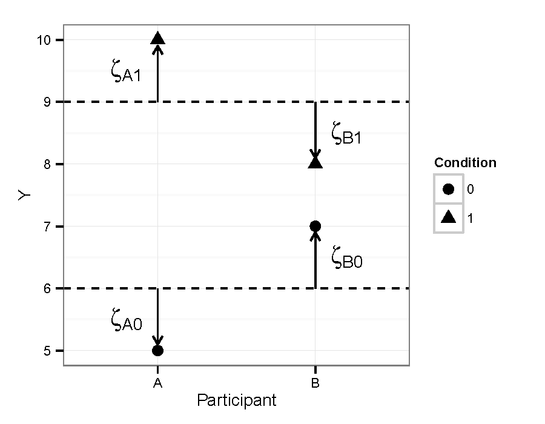

```{r setup, include=FALSE, message=FALSE}
options(htmltools.dir.version = FALSE)
options(digits = 4)
library(knitr)
library(kableExtra)
library(patchwork)

library(tidyverse)
library(broom)
library(broom.mixed)
library(gt)
library(lme4)
library(lmerTest)
```

```{r xaringan-themer, include = FALSE}
library(xaringanthemer)
style_mono_accent(
  # base_color = "#0F4C81", # DAPR1
  # base_color = "#BF1932", # DAPR2
  # base_color = "#88B04B", # DAPR3 
  # base_color = "#FCBB06", # USMR
  base_color = "#a41ae4", # MSMR
  header_color = "#000000",
  header_font_google = google_font("Source Sans Pro"),
  header_font_weight = 400,
  text_font_google = google_font("Source Sans Pro", "400", "400i", "600", "600i"),
  code_font_google = google_font("Source Code Pro"),
  extra_css = list(".scroll-output" = list("height"="90%","overflow-y"="scroll"))
) 
```

# "Internal" individual differences

* No "external" measure that can be entered as a fixed effect 
* Individual differences needed for a different analysis (e.g., LSM)

.pull-left[
### A simple example


]

.pull-right[
**Random effects provide a way to quantify individual effect sizes in the context of a model of overall group performance**:

Participant A: $\zeta_{A1} - \zeta_{A0} = 1 - (-1) = 2$

Participant B: $\zeta_{B1} - \zeta_{B0} = (-1) - 1 = -2$
]

---
# Example 
Data (Made-up): Effect of school mental health services on educational achievement (`EducMH`)

```{r}
load("./data/EducMH.RData")
summary(EducMH)
```

* `Condition` = Treatment (students who received mental health services) vs. Control (academically matched group of students who did not receive services)
* `SDQ` = Strengths and Difficulties Questionnaire: a brief behavioural screening for mental health, only available for Treatment group. Lower scores are better (Total difficulties).
* `Math` = Score on standardised math test

---

```{r fig.width=6, fig.height=3.5}
ggplot(EducMH, aes(Year, Math, color=Condition, fill=Condition)) + 
  stat_summary(fun=mean, geom="line") + 
  stat_summary(fun.data=mean_se, geom="ribbon", color=NA, alpha=0.3) + 
  labs(y="Math Achievement Score") + theme_bw(base_size=12) + 
  scale_color_manual(values=c("red", "blue")) + 
  scale_fill_manual(values=c("red", "blue"))
```

**Question 1**: Did the school mental health services improve academic achievement? That is, did the two groups differ on math achievement at baseline and over the 6 years of the study?

**Question 2**: For the treatment group, was individual-level improvement in mental health associated with improvement in math scores?

---
# Question 1

**Did the school mental health services improve academic achievement? That is, did the two groups differ on math achievement at baseline and over the 6 years of the study?**

```{r}
# adjust time variable to have a sensible intercept
EducMH$Time <- EducMH$Year - 2009
# fit the models
m.base <- lmer(Math ~ Time + (Time | ID), data=EducMH, REML=F)
m.0 <- lmer(Math ~ Time + Condition + (Time | ID), data=EducMH, REML=F)
m.1 <- lmer(Math ~ Time*Condition + (Time | ID), data=EducMH, REML=F)
```

---
# Question 1

**Did the school mental health services improve academic achievement? That is, did the two groups differ on math achievement at baseline and over the 6 years of the study?**

Compare the models

```{r}
anova(m.base, m.0, m.1)
```


There was no group difference at baseline, but there was a group difference on slope. That is, math achievement in the two groups started out the same, but increased more quickly in the Treatment group.

---
```{r}
gt(tidy(m.1))
```

---
# Question 2

**For the treatment group, was individual-level improvement in mental health associated with improvement in math scores?**

First make a plot of what we're interested in: the treatment group's change in the SDQ over time showing both group mean (black line with error bars) and individual variability (grey lines)

```{r fig.height=3.5, fig.width=5, echo=FALSE}
ggplot(subset(EducMH, Condition == "Treatment"), aes(Year, SDQ)) + 
  geom_line(aes(group=ID), color="gray") +
  stat_summary(fun=mean, geom="line") +
  stat_summary(fun.data=mean_se, geom="errorbar", width=0.3) +
  theme_bw(base_size=12)
```

Within the treatment group, there is not an overall change in mental health (SDQ), but it looks like there is lots of variability in response to the mental health services. Some people responded really well (big decreases in difficulties on SDQ), some people didn't respond well (increased difficulties according to SDQ).

--

We want to know whether this variability is associated with variability in improved math achievement.

---
# Analysis strategy

1. Build separate models for change in SDQ and change in Math scores over time
2. Use random effects to quantify individual differences in change over time for the two scores
3. Test the correlation between change in SDQ and in Math achievement (and make a scatterplot showing this).

---
# Analysis

1. Build separate models for change in SDQ and change in Math scores over time

```{r}
m.math <- lmer(Math ~ Time + (Time | ID), 
               data=subset(EducMH, Condition == "Treatment"), REML=F)
m.sdq <- lmer(SDQ ~ Time + (Time | ID), 
              data=subset(EducMH, Condition == "Treatment"), REML=F)
```

---
# Analysis

1. Build separate models for change in SDQ and change in Math scores over time
2. Use random effects to quantify individual differences in change over time for the two scores

```{r}
source("get_ranef.R") # get_ranef() will extract the named random effect and clean them up a bit
re.math <- get_ranef(m.math, "ID")
re.sdq <- get_ranef(m.sdq, "ID")
# merge() will combine those into one data frame, but needs some help because the variable names are all the same
re <- merge(re.math, re.sdq, by="ID", suffixes = c(".math", ".sdq"))
summary(re)
head(re)
```

---
# Analysis

1. Build separate models for change in SDQ and change in Math scores over time
2. Use random effects to quantify individual differences in change over time for the two scores
3. Test the correlation between change in SDQ and in Math achievement (and make a scatterplot showing this).

```{r}
cor.test(re$Time.math, re$Time.sdq)
```

Strong correlation ( $r = -0.77, p < 0.0001$ ) indicating that response to mental health intervention (decreased difficulties) was associated with larger increases in math achievement. Note that the key quantities here are **slopes**. That is, the **rate** of decreased mental health difficulties is associated with a higher **rate** of math achievement.

---
# Analysis

1. Build separate models for change in SDQ and change in Math scores over time
2. Use random effects to quantify individual differences in change over time for the two scores
3. Test the correlation between change in SDQ and in Math achievement (and **make a scatterplot showing this**).

```{r fig.height=4, fig.width=4, message=FALSE}
ggplot(re, aes(Time.math, Time.sdq)) + geom_point() + stat_smooth(method="lm") + 
  labs(x="Relative Rate of Increase in\nMath Score", 
       y="Relative Rate of Decrease in\nSDQ Total Difficulties Score") + 
  theme_bw(base_size=12)
```

---
# Why use random effects instead of individual models?

.pull-left[


http://tjmahr.github.io/plotting-partial-pooling-in-mixed-effects-models/
]

.pull-right[
An individual's performance (on the math test, on the SDQ) is their actual level plus some noise. 

Individual models (no pooling) don't make that distinction, so you have a noisy estimate of individual differences. 

Multilevel models reduce the noise component using the mean and variance of the rest of the group (partial pooling). **This produces a better estimate of true individual differences.**

See also: Efron, B. & Morris, C. (1977). Stein's Paradox in Statistics. Scientific American, 236:5, 119-127.
]

---
# Key points

* Individual differences provide additional insights into phenomena of interest. Can serve as further tests of a hypothesis
* Random effects provide a useful way to quantify individual differences in the context of a group-level model
* Partial pooling / shrinkage improves individual difference estimates