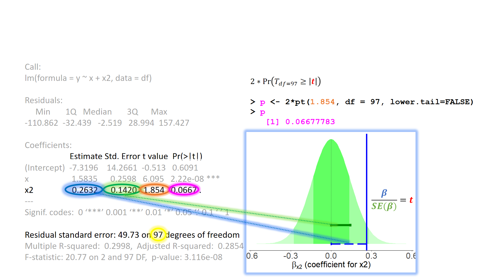
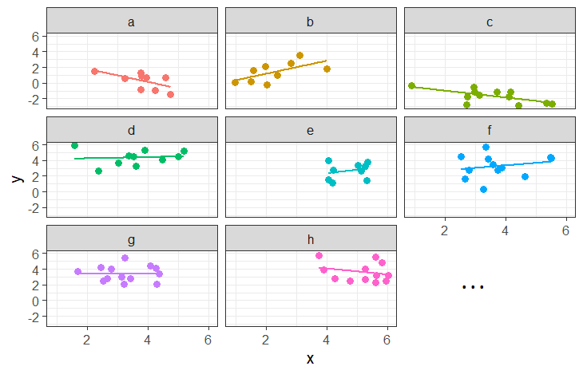
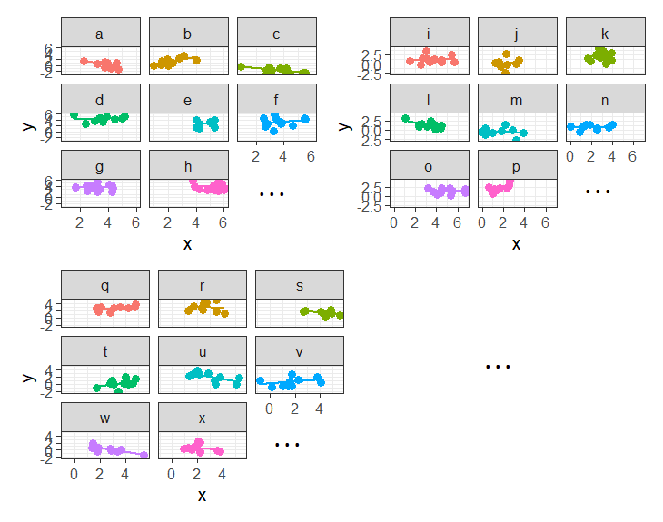

```{r}
#| label: setup
#| include: false
source('assets/setup.R')
library(xaringanExtra)
library(tidyverse)
library(patchwork)
library(ggdist)
xaringanExtra::use_panelset()
```


:::lo
This reading:  

- A refresher on the linear regression model  
- An introduction to group-structured (or 'clustered') data
- Working with group-structured data (sample sizes, ICC, visualisations)

:::


# Our Starting Point

We're going to start this course with our good old friend the linear regression model. The content we're going to cover in this block can be seen as an extension of these methods, so keep in mind that the materials from previous courses you have taken will likely be very a useful resource. 


:::sticky
__Linear Regression__

The linear regression model is a way of expressing an outcome (or "dependent") variable $y$ as the linear combination of various predictors $x_1,\ ...\ ,\ x_p$ (or "independent variables").   

We can write the linear regression model as:  
$$
\begin{align}\\
& \color{red}{y} = \color{blue}{b_0 + b_1x_1 \ + \ ... \ + \ b_px_p} \color{black}{\ + \ \varepsilon}\\ 
& \text{Where:} \\
& \varepsilon \sim N(0, \sigma) \text{ independently}
\end{align}
$$
where the $b$'s (sometimes written $\beta$) are the partial associations between each predictor and the outcome. For instance, $b_1$ represents the expected change in $y$ associated with a 1 unit change in $x_1$, while _holding constant_ other independent variables $x_2,\ ...\ ,\ x_p$.  
In this way, we can use the regression model to isolate the association between each predictor and the outcome from the other predictors in the model. 

In R, we fit these models using:
```{r eval=F}
lm(y ~ x1 + x2 + .... xp, data = mydata)  
```


::: {.callout-caution collapse="true"}
#### Rabbit Hole: Matrix Notation

If we wanted to write this more simply, we can express $x_1$ to $x_p$ as an $n \times p$ matrix (sample size $\times$ parameters), and $b_0$ to $b_p$ as a vector of coefficients:
$$
\begin{align}
& \color{red}{\mathbf{y}} = \color{blue}{\mathbf{X b}} + \boldsymbol{\varepsilon} \\
& \varepsilon \sim N(0, \sigma) \text{ independently} \\
\end{align}
$$
You can see below how we get between these two formulations. In the top line, we use an index $i$ to indicate that the model is fitted over a set of observations. In the middle we can see this expanded out to show the value for each individual observation on each $y$ and $x$. Because the $b$ coefficients are fixed - they are the same for each observation $i$, we can separate them out so that we are multiplying the $\mathbf{X}$ matrix by the vector of $\mathbf{b}$'s (i.e. the formulation we see at the bottom).  

$$
\begin{align} \color{red}{y_i} \;\;\;\; & = \;\;\;\;\; \color{blue}{b_0 \cdot{} 1 + b_1 \cdot{} x_{1i} + ... + b_p \cdot x_{pi}} & + & \;\;\;\varepsilon_i \\ \qquad \\ \color{red}{\begin{bmatrix}y_1 \\ y_2 \\ y_3 \\ y_4 \\ y_5 \\ \vdots \\ y_n \end{bmatrix}} & = \color{blue}{\begin{bmatrix} 1 & x_{11} & x_{21} & \dots & x_{p1} \\ 1 & x_{12} & x_{22} &  & x_{p2} \\ 1 & x_{13} & x_{23} &  & x_{p3} \\ 1 & x_{14} & x_{24} &  & x_{p4} \\ 1 & x_{15} & x_{25} &  & x_{p5} \\ \vdots & \vdots & \vdots & \ddots & \vdots \\ 1 & x_{1n} & x_{2n} & \dots & x_{pn} \end{bmatrix} \begin{bmatrix} b_0 \\ b_1 \\ b_2 \\ \vdots \\ b_p \end{bmatrix}} & + & \begin{bmatrix} \varepsilon_1 \\ \varepsilon_2 \\ \varepsilon_3 \\ \varepsilon_4 \\ \varepsilon_5 \\ \vdots \\ \varepsilon_n \end{bmatrix} \\ \qquad \\ \color{red}{\boldsymbol y} \;\;\;\;\; & = \qquad \qquad \;\;\; \mathbf{\color{blue}{X \qquad \qquad \qquad \;\;\;\: b}} & + & \;\;\; \boldsymbol \varepsilon \\ \end{align}
$$

:::

<!-- We have seen various ways we can extend this model to capture different processes - predictors can be continuous or categorical; we can include _interactions_ (where the effect of $x_1$ on $y$ _depends_ on the level of $x_2$); and we can even extend the same model structure to model discrete outcomes (with a little trickery of using a function to link the expected value of $\color{red}{y}$ to the linear prediction $\color{blue}{b_0 + b_1(x_1) + ... + b_p(x_p)}$).  -->

:::


When we fit linear regression models, we are fitting a line (or a regression surface, when we add in more predictors), to a cloud of datapoints. The discrepancy between the fitted model and the observed data is taken up by the residuals. 

$$
\begin{align}
\color{red}{y} &= \color{blue}{b_0 + b_1x_1 \ + \ ... \ + \ b_px_p} \color{black}{+ \varepsilon}\\ 
\color{red}{\text{observed }y} &= \color{blue}{\text{fitted }\hat y} \,\, \color{black}{+ \text{ residual }\hat \varepsilon}\\ 
\end{align}
$$

We are theorising that our model contains all the systematic relationships with our outcome variable, we assume that the residuals - the leftovers - are essentially random error. This is the $\varepsilon \sim N(0, \sigma)$ bit, which is a way of specifying our assumption that the errors are normally distributed with a mean of zero, and the variance doesn't change across the model (see @fig-slr2).   

```{r}
#| label: fig-slr2
#| echo: false
#| fig-cap: "Simple linear regression model, with the systematic part of the model in blue, and residuals in red. The distributional assumption placed on the residuals is visualised by the orange normal curves - the residuals are normally distributed with a mean of zero, and this does not change across the fitted model."
#| fig-height: 3.5
set.seed(235)
df <- tibble(
  x = rnorm(100,3,1),
  y = 0.5+.8*x + rnorm(100,0,1)
)
df$y=df$y+1
model1 <- lm(y ~ x, data = df)
betas <- coef(model1)
intercept <- betas[1]
slope <- betas[2]

dfd<-tibble(
  x = c(0:4),
  m = predict(model1,newdata=tibble(x=c(0:4))),
  s = sigma(model1)
)

broom::augment(model1) |>
ggplot(aes(x = x, y = y)) +
  stat_dist_halfeye(inherit.aes=F,data=dfd, aes(x=x,dist="norm",arg1=m,arg2=s),alpha=.15, fill="orange") + 
  geom_point(size=3,alpha=.5)+
  geom_abline(intercept = intercept, slope = slope, 
              color = 'blue', size = 1) + 
  #xlim(0,6)+ylim(0,7)+
  geom_vline(xintercept=0,lty="dashed")+
  scale_x_continuous(breaks=0:6)+
  labs(x = "X (predictor)", 
       y = "Y (outcome)")+
  geom_segment(aes(x=x, xend=x, y=y, yend=.fitted), col="red",lty="dotted", linewidth=0.7)
```

We typically want to check our model residuals (by plotting or performing statistical tests) to determine if we have reason to believe our assumptions are violated. The easiest way to do this in R is with `plot(model)`, which provides us with a series of visuals to examine for unusual patterns and conspicuous observations.  

When model assumptions appear problematic, then our inferential tools go out the window. Although the specific point estimates for our regression coefficients are our best linear estimates for the sample that we have, our standard errors rely on the distributional assumptions of the residuals^[Why is this? It's because the formula to calculate the standard error involves $\sigma^2$ - the variance of the residuals. If this standard deviation is not accurate (because the residuals are non-normally distributed, or because it changes across the fitted model), then this in turn affects the accuracy of the standard error of the coefficient]. It is our standard errors that allow us to construct test statistics and compute p-values (@fig-inf1) and construct confidence intervals. Our assumptions underpin our ability to generalise from our specific sample to make statements about the broader population.  


::: {.callout-note collapse="true"}
### Refresher: Standard Error   

Taking **samples** from a **population** involves an element of _randomness_. The mean height of 10 randomly chosen Scottish people will not be exactly equal to the mean height of the entire Scottish population. Take another sample of 10, and we get _another_ mean height (@fig-se).  

```{r}
#| echo: false
#| label: fig-se
#| fig-cap: "Estimates from random samples vary randomly around the population parameter"
set.seed(nchar("i'm going dotty"))
tibble(
  m = replicate(750, mean(rnorm(10,165,11)))
) |>
  ggplot(aes(x=m))+
  geom_vline(xintercept = 165, col="red",lty="dashed", lwd=1) +
  geom_dotplot(dotsize=.5,binwidth=.5) +
  scale_y_continuous(NULL, breaks=NULL)+
  scale_x_continuous("mean height (cm)",limits=c(150,180),breaks=seq(-10,10,5)+165) +
  theme_minimal()+
  annotate("text",
           x=170, y=.88, 
           label="Mean height of\nentire Scottish population", col="red",
           hjust=0)+
  geom_curve(aes(x=170, xend=165, y=.88, yend=.88), col="red", size=0.5, 
             curvature = 0, arrow = arrow(length = unit(0.03, "npc"))) +
  
  annotate("text",x=156, y=.57, label="the mean height of\n10 randomly selected\nScottish people", col="grey30") +
  geom_curve(aes(x=156, xend=161, y=.5, yend=.40), col="grey30", size=0.5, curvature = 0.2, arrow = arrow(length = unit(0.03, "npc"))) +
  
  annotate("text",x=173, y=.62, label="the mean height of\nanother random sample of 10", col="grey30") +
  annotate("text",x=174, y=.45, label="and another", col="grey30") +
  annotate("text",x=175, y=.25, label="and another", col="grey30") +
  geom_curve(aes(x=173, xend=167.5, y=.57, yend=.45), col="grey30", size=0.5, curvature = -0.2, arrow = arrow(length = unit(0.03, "npc")))+
  geom_curve(aes(x=174, xend=169, y=.43, yend=.35), col="grey30", size=0.5, curvature = 0, arrow = arrow(length = unit(0.03, "npc")))+
  geom_curve(aes(x=175, xend=173.9, y=.23, yend=.015), col="grey30", size=0.5, curvature = 0, arrow = arrow(length = unit(0.03, "npc")))
```

The standard error of a statistic is the standard deviation of all the statistics we _might have_ computed from samples of that size (@fig-se2). We can calculate a standard error using formulae (e.g. for a mean, the standard error is $\frac{\sigma}{\sqrt{n}}$) but we can also use more computationally intensive approaches such as "bootstrapping" to actually generate an empirical sampling distribution of statistics which we can then summarise.  

```{r}
#| echo: false
#| label: fig-se2
#| fig-cap: "The standard error is the standard deviation of the 'sampling distribution' - the distribution of sample statistics that we _could_ see."
set.seed(2394)
samplemeans <- replicate(2000, mean(rnorm(10,0,11)))
g <- ggplot(data=tibble(samplemeans),aes(x=samplemeans))+
  #geom_histogram(alpha=.3)+
  stat_function(geom="line",fun=~dnorm(.x, mean=0,sd=sd(samplemeans)),lwd=1)

ld <- layer_data(g) |> filter(x <= (11/sqrt(10)) & x >= (-11/sqrt(10)))
ld2 <- layer_data(g) |> filter(x <= 2*(11/sqrt(10)) & x >= 2*(-11/sqrt(10)))
g + geom_area(data=ld,aes(x=x,y=y),fill="grey30",alpha=.3) + 
  geom_area(data=ld2,aes(x=x,y=y),fill="grey30",alpha=.1) +
  geom_vline(xintercept = 0, col="red",lty="dashed", lwd=1) +
  annotate("text",
           x=4, y=.12, 
           label="Mean height of\nentire Scottish population", col="red",
           hjust=0)+
  geom_curve(aes(x=5, xend=0, y=.12, yend=.12), col="red", size=0.5, 
             curvature = 0, arrow = arrow(length = unit(0.03, "npc")))+
  geom_segment(x=0,xend=(-10.5/sqrt(10)),y=.06,yend=.06) +
  annotate("text",x=-9, y=.08, label="standard error = standard deviation\nof sampling distribution\n(measure of spread of mean heights\nof all samples of 10 Scottish\npeople that we *could* take)", col="grey30")+
  geom_curve(aes(x=-7, xend=-1.5, y=.055, yend=.06), col="grey30", size=0.5, curvature = 0.5, arrow = arrow(length = unit(0.03, "npc")))+

  scale_y_continuous(NULL, limits=c(0,.135),breaks=NULL)+
  labs(x="mean height (cm)") +
  theme_minimal()+
  scale_x_continuous("mean height (cm)",
                     limits=c(-15,15),
                     breaks=seq(-10,10,5),
                     labels=seq(-10,10,5)+165)

```

We use the standard error to quantify the uncertainty around our sample statistic as an estimate of the population parameter, and create a range of plausible values or compute standardised test statistics in order to perform tests against some null hypothesis.  

::::panelset
:::panel
### p-values
```{r}
#| echo: false
#| label: fig-se_p
#| fig-cap: "The standard error goes into computing a p-value. It defines sample estimates we would expect *if* some null hypothesis were true. We then ask how likely our observed sample estimate would be if that null hypothesis were true."
set.seed(7864)
samplemeans <- replicate(2000, mean(rnorm(10,0,11)))
g <- ggplot(data=tibble(samplemeans),aes(x=samplemeans))+
  #geom_histogram(alpha=.3)+
  stat_function(geom="line",fun=~dnorm(.x, mean=0,sd=sd(samplemeans)),lwd=1)

ld <- layer_data(g) |> filter(x <= (11/sqrt(10)) & x >= (-11/sqrt(10)))
ld2 <- layer_data(g) |> filter(x <= 2*(11/sqrt(10)) & x >= 2*(-11/sqrt(10)))
ld3 <- layer_data(g) |> filter(x <= -8)
ld4 <- layer_data(g) |> filter(x >= 8)

g + geom_area(data=ld,aes(x=x,y=y),fill="grey30",alpha=.3) + 
  geom_area(data=ld2,aes(x=x,y=y),fill="grey30",alpha=.1) +
  geom_area(data=ld3,aes(x=x,y=y),fill="red",alpha=.3) +
  geom_area(data=ld4,aes(x=x,y=y),fill="red",alpha=.3) +
  geom_vline(xintercept = 0, col="grey30",lty="dashed", lwd=1) +
  annotate("text",
           x=-3, y=.12, 
           label="value in population\naccording to the null hypothesis", col="grey30",
           hjust=1)+
  geom_curve(aes(x=-4, xend=0, y=.12, yend=.12), col="grey30", size=0.5, 
             curvature = 0, arrow = arrow(length = unit(0.03, "npc")))+
  geom_segment(x=0,xend=(-10.5/sqrt(10)),y=.06,yend=.06) +
  
  
  geom_curve(aes(x=10, xend=-9, y=.02, yend= 0.002), col="red", size=0.5, 
             curvature = 0, arrow = arrow(length = unit(0.03, "npc")))+
  geom_curve(aes(x=10, xend=9, y=.02, yend= 0.002), col="red", size=0.5, 
             curvature = 0, arrow = arrow(length = unit(0.03, "npc")))+
  annotate("text",
           x=10, y=.035, 
           label="p-value\nprobability of seeing statistic\n(or more extreme)\n*if* null hypothesis is true", col="red",
           hjust=0)+
  
  
  geom_vline(xintercept = 8, col="blue",lty="dashed", lwd=1) +
  annotate("text",
           x=8.3, y=.06, 
           label="observed estimate", col="blue",angle=-90,
           vjust=0)+
  
  
  
  
  
  annotate("text",x=-8.5, y=.07, label="standard error\n(standard deviation of\nsampling distribution)", col="grey30")+
  geom_curve(aes(x=-7, xend=-1.5, y=.06, yend=.06), col="grey30", size=0.5, curvature = 0.8, arrow = arrow(length = unit(0.03, "npc")))+

  scale_y_continuous(NULL, limits=c(0,.135),breaks=NULL)+
  scale_x_continuous("Sample estimate",limits=c(-15,23),labels=NULL) + 
  theme_minimal()+
  theme(axis.line.x = element_line(), 
        axis.ticks.x = element_line(linewidth=1),
        axis.ticks.length.x = unit(.25, "cm"))

```
:::
:::panel
### Confidence Intervals

```{r}
#| echo: false
#| label: fig-se_ci
#| fig-cap: "The standard error goes into computing a confidence interval (CI) - a plausible range of the true population value. People often use these also for performing a null hypothesis test and asking 'is [null hypothesis value] inside the CI?'."
g + geom_area(data=ld,aes(x=x,y=y),fill="grey30",alpha=.3) + 
  geom_area(data=ld2,aes(x=x,y=y),fill="grey30",alpha=.1) +
  geom_vline(xintercept = -8, col="grey30",lty="dashed", lwd=1) +
  annotate("text",
           x=-8.1, y=.07, 
           label="value in population\naccording to the null hypothesis", col="grey30",
           hjust=0, angle = 90)+
  
  geom_vline(xintercept = 0, col="blue",lty="dashed", lwd=1) +
  annotate("text",
           x=0.3, y=.06, 
           label="observed estimate", col="blue",angle=-90,
           vjust=0)+
  
  geom_segment(x=0,xend=(-10.5/sqrt(10)),y=.06,yend=.06) +
  annotate("text",x=8, y=.09, label="standard error\n(standard deviation of\nsampling distribution)", col="grey30")+
  geom_curve(aes(x=3.5, xend=-1.5, y=.09, yend=.06), col="grey30", size=0.5, curvature = 0.4, arrow = arrow(length = unit(0.03, "npc")))+

  
  geom_segment(x=1.96*(-10.5/sqrt(10)),xend=1.96*(-10.5/sqrt(10)),y=-.003,yend=.007,
               col="darkgreen",lwd=1) +
  geom_segment(x=1.96*(10.5/sqrt(10)),xend=1.96*(10.5/sqrt(10)),y=-.003,yend=.007,
               col="darkgreen",lwd=1)+
  geom_segment(x=1.96*(10.5/sqrt(10)),xend=-1.96*(10.5/sqrt(10)),y=.002,yend=.002,
               col="darkgreen",lwd=1)+
  
  geom_curve(aes(x=-15, xend=-1.5, y=.05, yend=.002), col="darkgreen", size=0.5, curvature = -0.2, arrow = arrow(length = unit(0.03, "npc")))+
  annotate("text",x=-16, y=.06, hjust=0.5,label="confidence interval\n(plausible range for \npopulation value)", col="darkgreen")+
  
  
  scale_y_continuous(NULL, limits=c(0,.135),breaks=NULL)+
  scale_x_continuous("Sample estimate",limits=c(-21,16),labels=NULL)+
  theme_minimal()+
  theme(axis.line.x = element_line(), 
        axis.ticks.x = element_line(linewidth=1),
        axis.ticks.length.x = unit(.25, "cm"))
```
:::
::::

:::


```{r}
#| label: fig-inf1
#| echo: false
#| fig-cap: "Inference for regression coefficients. The estimate (blue) is the best guess for the coefficient, and the standard error (green) represents the uncertainty in our estimate due to random sampling. If we imagine a 'null' universe where the true population coefficient is zero, then the big green distribution represents the range of coefficients we might see from random samples of this size. We then compare our observed coefficient to that 'null distribution'. This can be quantified as a t-statistic (orange), which measures how many standard errors our estimate sits away from zero. The p-value (pink) provides the probability of seeing a t-statistic this extreme (or more so) *if the null universe were actually real.*" 

```


In the face of plots (or tests) that appear to show violations of the distributional assumptions (i.e. our residuals appear non-normal, or their variance changes across the range of the fitted model), we should always take care to ensure our model is correctly specified (interactions or other non-linear effects, if present in the data but omitted from our model, can result in assumption violations, as can omitted variables). Following this, if we continue to have problems satisfying our assumptions, there are various options that give us more flexibility in what assumptions we have to make. If you're interested, you can read brief explanations about some of these methods [here](00_lm_assumpt.html){target="_blank"}.  

However, there is one assumption that we are unable to identify through examining diagnostic plots for patterns, and that is the assumption of __"independence"__ in "$\varepsilon \sim N(0, \sigma) \text{ independently}$". Very broadly, if our residuals are not independent from one another, this means that there are systematic differences in our outcome variable that our model is not capturing. This is not something that is easily 'corrected'^[With the exception of Generalized Least Squares (an extension of Weighted Least Squares), for which we _can_ actually specify a correlational structure of the residuals. As this course focuses on multilevel models, we will not cover GLS here. However, it can often be a useful method if our the nature of the dependency in our residuals is simply a nuisance thing (i.e. not something that has any properties which are of interest to us).] - it is something that we want to incorporate into our model structure. 

:::sticky
__Independence of errors__  

Model residuals (estimated errors) are not dependent upon one another in any way. The value of one residual is not systematically related to the value of any other residual.   

:::

One common way in which observations are dependent on one another can come when the data has a _hierarchical_ structure - some form of grouping or __'clustering'__ of observations into different groups. These groups (or 'clusters') could be simply something we observe (e.g., we collect data where each observation is a child, but we have 10 children from School A, 13 from School B, 5 from School C, and so on), or they could be the result of how we have designed our study (e.g., we have collect data where each observation is a reaction time on a task, but we get each participant in our study to do it 10 times, so we have 10 observations from participant 1, 10 from participant 2, 10 from participant 3, and so on). If we fail to capture these sort of groupings in our modelling somehow, then our residuals are no longer independent.  


<div class="divider div-transparent div-dot"></div>


# Group-Structured Data


```{r}
#| echo: false
#| eval: false
#| label: mooddata
schoolids = read_csv("data/schoolnames.csv") |> janitor::clean_names() |> 
  filter(primary_11=="Primary") |> 
  mutate(
    urb = case_when(
      grepl("Large urb",x8_fold_urban_rural_measure_1)~"urban",
      grepl("Remote rural",x8_fold_urban_rural_measure_1)~"rural",
      TRUE ~ NA
    )
  ) |> 
  filter(!is.na(urb)) |>
  select(school_name, address_3, urb)

  ss = round(runif(1,1e3,1e6))
  ss = 347164
  set.seed(ss)
  n_groups = 20
  # npgroup = round(runif(30,2,25))
  npgroup = rep(12,20)
  g = unlist(sapply(1:n_groups, function(x) rep(x,npgroup[x])))
  N = length(g)
  xd = rnorm(N)
  xm = rnorm(n_groups)[g]
  x = rep(0:5,2*n_groups)
  b = rbinom(n_groups,1,.5)
  b = b[g]
  res = MASS::mvrnorm(n=n_groups,
                     mu=c(0,0),Sigma=matrix(c(6,-1,-1,1),nrow=2))
  re0 = res[,1]
  re  = re0[g]
  rex = res[,2]
  re_x  = rex[g]
  lp = (0 + re) + (1.5 + re_x)*x + .9*b + .4*b*(x)
  y = rnorm(N, mean = lp, sd = 4)
  y_bin = rbinom(N, size = 1, prob = plogis(lp))
  df = data.frame(x = x, b, g=factor(g), y, y_bin)
  #set.seed(764)
  schoolmood = df |>
    transmute(
      outdoordays = x,
      location = factor(b,levels=0:1,labels=c("Urban","Rural")),
      g = as.numeric(g),
      mood = round(50.356 + scale(y)[,1]*13.53),
      mood = pmax(0,pmin(100,mood))
    )

fmod = lm(mood~outdoordays,schoolmood)
rimod = lmer(mood~outdoordays+(1|g),schoolmood)
rsmod = lmer(mood~outdoordays+(1+outdoordays|g),schoolmood)
rsmod2 = lmer(mood~outdoordays*location+(1+outdoordays|g),schoolmood)
sjPlot::plot_model(rsmod2,type="int",show.data=T)
VarCorr(rsmod)
# 

set.seed(66)
uu = sample(schoolids$school_name[schoolids$urb=="urban" 
                                  & schoolids$address_3%in%c("GLASGOW","EDINBURGH")],10)
set.seed(345)
rr = sample(schoolids$school_name[schoolids$urb!="urban"],10)

schoolmood |> 
  count(location, g) |>
  transmute(
    g,
    schoolid = c(uu,rr)
  ) |>
  left_join(schoolmood, y=_) |>
  select(schoolid,location,outdoordays,mood) -> schoolmood


write_csv(schoolmood,"../../data/moodphysed.csv")

```
```{r}
schoolmood <- read_csv("../../data/moodphysed.csv")
```


A common way to start thinking about group-structured data is to consider how we might go about conducting a study on school children. Suppose each observation in our sample is a different child, and they come from a set of various schools (i.e. we might get 10 children from "`r levels(schoolmood$schoolid)[10]`", 15 from "`r levels(schoolmood$schoolid)[11]`", and so on). And let's suppose we are interested in the association between the amount of time children spend outside and their general mood/positive affect.

If we ignore the fact that children 'belong to' their respective schools, we can end up reaching completely different conclusions. This can be seen in @fig-egschool. In these plots, each datapoint is a single child. If we consider them to be independent of one another (Left-Hand plot), then we might think there is a strong positive relationship between mood and time in the outdoors. Once we show (via colour) which school they belong to, we can see that the observations in the top right of the plots are all high for some other reason - because they come from the green school.  

```{r}
#| label: fig-egschool
#| echo: false
#| fig-height: 4
#| fig-cap: "Observations (children) are clustered (into schools), and their outcome (positive mood) are dependent upon which cluster they are in. Ignoring the clustering may lead to erroneous conclusions"  
set.seed(46)
n_groups = 5
npgroup = round(runif(5,5,10))
g = unlist(sapply(1:n_groups, function(x) rep(x,npgroup[x])))
N = length(g)
xm = rnorm(n_groups,3,1)
xm = xm[g]
xd = rnorm(N)
re0 = rnorm(n_groups, sd = 1)
re  = re0[g]
rex = rnorm(n_groups, sd = .1)
re_x  = rex[g]
lp = (0 + re) + 2*xm + (0 + re_x)*xd
y = rnorm(N, mean = lp, sd = 1)*8
y = round(pmax(0,pmin(100,y)))
y_bin = rbinom(N, size = 1, prob = plogis(lp))
df = data.frame(x=6+scale(xm+xd)[,1]*1.8, g=factor(g), y, y_bin)

df$x = round(df$x*60/15)/60*15
#df$x = cut(df$x,8,labels=FALSE)-1


p1 = ggplot(df,aes(x=x,y=y))+
  geom_point(size=3) +
  geom_smooth(method=lm,se=F)+
  labs(subtitle="ignoring school",
       x="outdoor time\n(hours per week)",y="positive mood")+
  ylim(0,100)

p2 = ggplot(df,aes(x=x,y=y,col=g))+
  geom_point(size=3)+
  geom_smooth(method=lm,se=F)+
  guides(col="none") +
  labs(subtitle="separate lines for each school",
       x="outdoor time\n(hours per week)",y="positive mood")+
  ylim(0,100)

p3 = df |> mutate(r=resid(lm(y~x,df)),f=fitted(lm(y~x,df))) |>
  ggplot(aes(x=f,y=r)) +
  geom_point(size=3, aes(col=g)) +
  geom_hline(yintercept=0,lty="dotted") +
  geom_segment(aes(x=f,xend=f,y=0,yend=r),
               lty="dotted",col="red")+
  guides(col="none") + 
  labs(x="Fitted Values\nlm(grade ~ motivation)",y="Residuals")
  
p4 = df |> mutate(f=fitted(lm(y~x,df))) |>
  ggplot(aes(x=x,y=y))+
  geom_point(size=3,aes(col=g)) +
  geom_segment(aes(y=y,yend=f,x=x,xend=x,col=g),
               lty="dashed")+
  geom_smooth(method=lm,se=F)+
  guides(col="none")+
  labs(title="motivation and grade",
       subtitle="ignoring school",
       x="motivation",y="grade")


(p1 + p2)

```

The issue here is that the schools have (on average) different levels of outdoor-time, meaning that when we look for differences in mood at different levels of outdoor-time, we might actually just be seeing school differences in moods. Ignoring the `school` variable can completely change our estimate of interest.  

Even in situations where we don't have this sort of issue, having groupings in our data can still cause issues with our inferences --- our standard errors, $t$ and $F$ statistics, $p$-values etc., will all be wrong. 

For example, instead of having an observed variable like "hours per week of outdoor time" as our predictor, lets suppose we were interested in the effect of holding physical education (PE) classes outdoors as opposed to having them indoors. Let's conceptualise this as a little randomised trial in which 30 children from 5 schools (6 from each), were either given 'outdoor' or 'indoor' PE classes, with mood being recorded at the end of the school year. This is plotted in @fig-egschoolhw
Although our simple linear model of `lm(mood ~ PEtype)` will correctly get at the estimate the difference in the average mood between the two groups ("outdoor" vs "indoor"), all the associated standard errors will be overly confident.  

```{r}
#| echo: false
#| label: fig-egschoolhw
#| fig-cap: "30 children from 5 schools (6 each school). Each datapoint is a different child, and the black crosses show the predictions from lm(mood ~ extra_sport) --- i.e., the averages of each group. Coloured lines show residuals."
#| fig-height: 4
set.seed(764)
df2 <- junk::sim_basicrs(b1=.2,z1=.1) |>
  filter(g %in% 1:5, x<=6) |>
  transmute(
    extra_hw = cut(x,2,labels=c("indoor","outdoor")),
    school = g,
    grade = round(scale(y)[,1]*18.3 + 55)
  ) |> group_by(extra_hw) |> 
  mutate(f = mean(grade),
         xjitter = sample(seq(-.1,.1,length.out=n()))) |> 
  ungroup() |>
  mutate(
    x = 1 + (extra_hw=="outdoor")*1 + xjitter,
    xm = 1 + (extra_hw=="outdoor")*1,
    school2 = school,
    school = case_when(
      school2 == "3" ~ "5",
      school2 == "5" ~ "3",
      TRUE ~ school2
    )
  )


p1 <- ggplot(df2,aes(x=x,y=grade))+
  geom_segment(aes(xend=x,yend=f,col=school),size=.5,lty="dashed",
               alpha=.5)+
  geom_point(aes(col=school),size=3)+
  stat_summary(aes(x = xm), 
               fun=mean,
               geom="point",shape=4,size=3,stroke=3)+
  stat_summary(aes(group=1,x=xm),geom="line",lty="dashed")+
  labs(x="PEtype",y="positive mood")+
  ylim(0,100)+
  scale_x_continuous(limits=c(.5,2.5),breaks=c(1,2),labels=c("indoor","outdoor"))+
  guides(col="none")

p1

```


The reason behind this is that our inferences rely on estimating how much the residuals vary (this goes into calculating standard errors). Using `lm(mood ~ PEtype)`, we are treating all the children as completely independent of one another. When we recognise the fact that children are grouped into schools, we can see that our linear model assumption of $\varepsilon \sim N(0,\sigma)$  $\text{ independently}$ is violated, because the residuals *are* related to one another. We can see this in @fig-egschoolhw: children from the green school are all higher than predicted (positive residuals) because they are from the green school (which has higher levels of mood on average), and children from the pink school tend to be lower than predicted (negative residuals).  


::: {.callout-caution collapse="true"}
#### Rabbit Hole: The impact of non-independence on inferences

Violations of the assumption of independence are problematic because it means we are placing more confidence in our estimates than we should. 

This is because all of our inferential tests rely on the estimated variability in the residuals $y_i - \hat y_i$. This variability is estimated by taking the mean squared error^[or "mean squares residual"]:    

$$
\text{mean squared error} = \frac{\sum{(y_i - \hat y_i)^2}}{n-k-1}
$$

The denominator bit on the bottom is our _degrees of freedom_ (where $n$ is the total sample size, $k$ is how many predictors we have in our model). This is how many **independent** pieces of information are available for estimating the parameters in our model. 
If we think we have lots and lots of independent bits of information, then this number is big, and the mean squared error is small. If we think we have fewer independent bits of information, then the denominator should be smaller (making the mean squared error bigger).  

In the scenario where we have, e.g. 30 children clustered into 5 schools, how many independent bits of information do we have to begin with? 30? 5? somewhere in between?  

```{r}
#| echo: false
#| label: fig-egschoolhwdf
#| fig-cap: "If we have 30 children from 5 schools, how much is 'free to vary'?"
p1 <- ggplot(df2,aes(x=extra_hw,y=grade))+
  geom_jitter(aes(col=school), 
              size=3,height=0,width=.1)+
  stat_summary(geom="pointrange",position=position_nudge(x=.2),
               fatten=2)+
  # stat_summary(geom="point",shape=4,size=2,
  #              stroke=2, position=position_nudge(x=.2))+
  labs(x=NULL,y="positive mood")+
  labs(subtitle="30 Individual children (datapoints) and\nthe associated uncertainty their means (pointranges)",x="PEtype")+
  ylim(0,100)+
  guides(col="none")


df2 |> group_by(school,extra_hw) |>
  summarise(grade = mean(grade)) |>
  ggplot(aes(x=extra_hw,y=grade))+
  geom_jitter(aes(col=school),
               shape=3,size=1.5,stroke=2,width=.1)+
  stat_summary(geom="pointrange",position=position_nudge(x=.2),
               fatten=2)+
  # stat_summary(geom="point",shape=4,size=2,
  #              stroke=2,position=position_nudge(x=.2))+
  labs(subtitle="5 Schools' average mood (+) and\nthe associated uncertainty in their means (pointranges)",x="PEtype",y="positive mood")+
  ylim(0,100)+
  guides(col="none") -> p2

p1 / p2
```


If we assume these children are all independent, because of how the mean squared error is calculated, our old friend `lm()` would estimate the residual variability to be smaller than it really is.^[with 30 observations and 1 predictor, this would be 30-1-1 = 28 on the bottom part of the equation for mean squared error, meaning we are dividing by a bigger number than, say, 5-1-1 = 3 if we thought we had only 5 independent groups of residuals (the schools)] This means that on average our standard errors will be too narrow, any confidence intervals too narrow, our F statistics will be too large, and our p-values too small. In essence - our inferences will all be wrong!!  

The mean squared error (MSE) goes into our $F$-statistics as they are the ratio of the mean squares associated with the model and the mean squared error 
$$
F = \frac{\text{Mean Squares Model}}{\text{Mean Squared Error}}
$$

The MSE also goes into our standard errors for our coefficients (and so any subsequent $t$-statistics or confidence intervals that we might calculate).  
$$
SE(b_p) = \sqrt{  \frac{MSE}{Var(x_p) \cdot (1-R^2_{x_p|x1,...}) }}
$$
(Where $R^2_{x_p|x1,...}$ is the $R^2$ value of the predictor of interest $x_p$ regressed onto all other predictors).  

:::


## Groups, groups, everywhere!  

The idea of collecting data where each observation is a child, and they are grouped into the different schools from which they come, is just one such example of a grouping that we might come across. Similar _hierarchical data structures_ to "children within schools" can be found in other settings, such as patients within medical practices, employees within departments, people within towns etc. These sort of groupings are higher level units of observation, for which we ideally have a random sample of (i.e. I randomly sample 20 schools, and then from each school randomly sample 30 children).  

There are also lots of cases where these sort of data structures might arise as the result of our study design. For instance, in a __Repeated Measures__ study we might collect multiple observations from each participant --- we have a random sample of participants, and for each one we have a random sample of their reaction time scores. __Longitudinal__ studies exhibit the same idea (multiple datapoints per person) but have a chronological ordering to the observations.  

In addition, we can extend this logic to think about having "groups of groups", and "groups of groups of groups"^[It's ["turtles all the way down"](https://en.wikipedia.org/wiki/Turtles_all_the_way_down){target="_blank"}]. @tbl-design shows just a few examples of different levels of observation that may arise from different types of study.  

The common thread throughout all these designs is a hierarchy. At the lowest level of our hierarchy is the individual observed thing. For some designs, individual people might be the lowest observation level, for others, people might be the clusters (i.e. we have multiple data points per person). We might also have multiple groupings at the same level of the hierarchy! For instance, if we have 50 participants each completing an experiment in which they respond to 30 items, then the individual observations (each one is "a score for a given item, from a given participant") can be grouped in two ways: we have 30 item-groups (each group containing 50 scores, one from each participant), but we also have 50 participant-groups (each group containing 30 scores, one for each item).  

```{r}
#| echo: false
#| label: tbl-design
#| tbl-cap: "Various different study designs will give rise to groupings of data." 
tribble(
  ~` `,~`Cross Sectional`,~`Repeated Measures`,~`Longitudinal`,
  "Level n","...","...","...",
  "...","...","...","...",
  "Level 3","School","...","Families",
  "Level 2","Classroom","Participants / Experimental Items / Both","People",
  "Level 1 (Observations)","Children","Scores","Scores at time 1, 2, 3, ..."
) |> gt::gt()
```


## A subtle distinction about groupings

At the fundamental level, we are using the term 'group' here to refer to __a grouping of observations.__ We'll often use the terms "clusters" and "groups" interchangeably in this context, so it's worth taking a bit of time to try and understand the _kind_ of groupings that we're talking about (and how we think about them).  

Specifically, we need to make a distinction between groups in the data for which... 

- **A.** we are interested in the specific groups that we observe. We consider the differences in the outcome between groups to be reproducible properties of the world that we would like to estimate.  
- **B.** we are not interested in the specific groups that we observe. We consider the groups to be a sample from a broader population of groups. Differences between observed groups can be viewed as variability due to random sampling.  

To make this clearer, consider two contexts below:    

::::panelset
:::panel
#### group differences as reproducible properties  

A study that looks at "how does heart rate differ between people taking placebo vs aspirin vs beta-blockers?" (@fig-clgroup). We can group observations into which drug they have received. But these groupings are the very groups of interest to us, and we are interested in comparing placebo with aspirin with beta-blockers. If we were to run the study again, we'll use the same drugs (they're not just a random sample of drugs - the x-axis of @fig-clgroup would need to be the same). 


```{r}
#| label: fig-clgroup
#| fig-height: 3.5
#| fig-cap: "Groupings of observations may be of specific interest - e.g. comparing two different drugs"  
#| echo: false
set.seed(3)
bp <- tibble(drug = rep(0:2,50),
       hr = 65 + (drug==1)*-2 + (drug==2)*-3 + rnorm(150,0,2)
) |>  mutate(
  drug = fct_recode(factor(drug),
                    placebo="0",
                    aspirin="1",
                    betablocker="2")
)

set.seed(753)
schoolmot <- 
  read_csv("https://uoepsy.github.io/data/schoolmot.csv") |> 
  mutate(schoolid = factor(schoolid))
pltd <- schoolmot |> filter(schoolid %in% sample(unique(schoolmot$schoolid),10)) |> droplevels()
levels(pltd$schoolid)[9:10] <- c("...","... ")

ggplot(bp,aes(x=drug,y=hr))+
  geom_boxplot()+
  labs(x="- Drug -", y="Resting Heart Rate (bpm)")
```
:::
:::panel
#### group variability due to random sampling  

A study that wants to estimate "what is the average grade at GCSE?". We observe lots of children, who can be grouped into different schools (@fig-clgroup2). We are not interested in all the specific differences between grades in `r levels(schoolmot$schoolid)[6]` vs `r levels(schoolmot$schoolid)[13]` etc. If we were to run our study again, we don't collect data from the same set of schools. We can view these schools as just a sample of schools. If we were to run the study again, we wouldn't need to collect data from these same specific schools (the x-axis of @fig-clgroup2 could be different). In this view, schools are a source of random variation (i.e. not systematic variation such as the effect of a drug, but variation we see just because schools are different from one another and we happen to have a random sample of schools).  

```{r}
#| label: fig-clgroup2
#| fig-height: 3.5
#| fig-cap: "Groupings of observations may be a grouping for which we have no specific interest in (e.g. school A is just a random school)"  
#| echo: false
ggplot(pltd,aes(x=schoolid,y=grade))+
  geom_boxplot()+
  scale_x_discrete(labels=abbreviate)+
  labs(x="- School -", y="Grade (%)")+
  theme(axis.text.x = element_text(angle=45))
```

:::
::::
<br>

When we have groups of data that we view as a random sample of groups, although the specific groups themselves might not be of interest to us, we may have research questions that are about features of those groups, and how they relate to things at other levels. For example, we might be interested in if the type of school funding (a school-level variable) influences the individual children's grades (a child-level variable). The focus of this course is multilevel modelling (also known as "mixed effects modelling"), which is a regression modelling technique that allows us to explore questions such as these (and many more).^[While multilevel models are great for multilevel questions, sometimes we may be interested in *only* things that occur at "level 1" (the lowest observation level). While not the focus of this course, there are also many other methods (survey weighting tools, cluster robust standard errors, or generalised estimating equations) that we may use to simply "account for the nuisance clustering".]  

:::sticky

- When we talk about "hierarchical"/"clustered"/"group-structured" data, the groups we are discussing are typically those that can be thought of as a _random sample of groups_.  
- Often the differences between specific groups are not of interest.  
- This contrasts with groups that we _are_ interested in (e.g., "I want to know if Y is different between A vs B")

:::

::: {.callout-caution collapse="true"}
#### Rabbit Hole: Why "univariate"and "multivariate"?

In "univariate" statistics there is just one source of variation we are looking at explaining, which is that "observations vary". In psychology, one unit of observation is typically "people", and we are interested in explaining the variation that occurs because people are different from one another.  

In "multivariate" statistics, there are more sources of variation. For the "children in schools" example: individual children are different from another, and schools are also different from one another. In an experiment where we repeated test each participant, then we have variation within each person (i.e., I score high the first time, less high the second, high the third, etc), and then variation between people (i.e., Elizabeth scores on average a lot higher than me). 

We also have multiple sources of variation from questionnaire scales (e.g. 9 survey questions about anxiety), because both there is variation in scores due to both a) people varying from one another and b) the 9 questions tending to elicit different responses from one another. 

:::
<!-- ::: {.callout-caution collapse="true"} -->
<!-- #### optional: "Panel data" -->

<!-- In some fields (e.g. economics), clustering sometimes gets referred to as 'panel data'. This can be a nice intuitive way of thinking about it, because we think of a plot of our data being split into different panels for each cluster:     -->

<!-- ```{r} -->
<!-- #| echo: false -->
<!-- #| label: fig-panel1 -->
<!-- #| fig-cap: "Panels of data" -->
<!--  -->
<!-- ``` -->
<!-- ```{r} -->
<!-- #| echo: false -->
<!-- #| label: fig-panel2 -->
<!-- #| fig-cap: "Panels of panels of data" -->
<!--  -->
<!-- ``` -->

<!-- ::: -->

<div class="divider div-transparent div-dot"></div>

# Working with Group-Structured Data


:::frame
__moodphysed.csv Data__  

This dataset contains information on 240 children from 20 different primary schools across Scotland. The data was collected as part of a week long study looking at whether the amount of outdoor time per week is associated with psychological wellbeing.  

All children had physical education (PE) classes every day, and children were allocated to have either 0, 1, 2, 3, 4, or all 5 of those classes outdoors. 

At the end of the week, all children completed a measure of positive mood (PANAS-C).      

The data are available at [https://uoepsy.github.io/data/moodphysed.csv](https://uoepsy.github.io/data/moodphysed.csv).  

```{r}
#| echo: false
#| label: tbl-schoolmotdict
#| tbl-cap: "moodphysed Data Dictionary. Children are clustered in Schools, with this group-identifier visible in the schoolid column"
# schoolmood <- read_csv("../../data/moodphysed.csv")
tibble(variable=names(schoolmood),
       description = c(
         "Name of School that the child attends",
         "Whether the school is categorised as an 'urban' or 'rural' school",         
         "Number of days with outdoor physical education (PE) classes",
         "Child's positive mood at the end of the week - self reported on a scale of 0 to 100")
) |> gt::gt()
```

:::

In terms of the dataframes we are going to be working with, our groupings are simply included in another column that contains a unique identifier for each group:^[Note, there's a set analytical methods called "cluster analysis", which attempts to identify clusters that **haven't** been measured/observed (or may not even 'exist' in any real sense of the word).]  
Data shaped in this way is referred to as being in **long format** - we have one row for every individual lowest observation. In this example each individual observation is a different child, and they belong to different groups (the different schools). In long format, our data has one row per child, and a variable to identify which school they go to.  

```{r}
#| echo: false
schoolmot |> slice(1,505:507,400,2) |> 
  rbind("...") |> mutate(schoolid=ifelse(is.na(schoolid),"...",
                                         as.character(schoolid))) |> as.data.frame()
```

We can, if we want, store this same information in a **wide format**, but more often than not it is preferable (for plotting, summarising, and modelling) to have it in long format. 

::: {.callout-note collapse="true"}
#### Refresher: Long and Wide Data

In this example, the individual observations are *people*, but this is not always the case. For instance, we might have multiple trials clustered within participants (in which case each individual observation is a single trial and the people are the groups).  

__Long data__  

In long format, the individual observations are separate rows in the data, and a column identifies to which group each observation belongs.  

Below, we have one row per person (we can see that Aja, Elizabeth, Josiah, Emma, Umberto are all on different rows), and we have a column `schoolid` that identifies what cluster they belong to (what school they attend).  
```{r}
#| echo: false
tribble(
  ~schoolid,~mood,
  "Balwearie High School","30",
  "Balwearie High School","45",
  "Balwearie High School","20",
  "...","...",
  "Kilsyth Academy","55",
  "Kilsyth Academy","60",
  "...","...",
) |> as.data.frame() -> dd
row.names(dd) <- c("Aja","Elizabeth","Josiah","..","Emma","Umberto","...")
dd

```

__Wide data__  

We can express the same information in a different way. Instead of having one row per person, we could have one row per cluster, and have a column for each of the people. We can see this below - Aja, Elizabeth and Josiah have moved to now be all in the 1st row (for Balwearie High School) - we can see their scores on the measure of mood (30, 45 and 20) in that row, and Emma and Umberto are in the row for Kilsyth Academy:  

```{r}
#| echo: false
tribble(
  ~"child 1",~"child 2",~"child 3",~"child 4",
  "30","45","20","...",
  "...","...","...","...",
  "55","60","...","...",
  "...","...","...","...",
) |> as.data.frame() -> dd
row.names(dd)<-c("Balwearie High School","..","Kilsyth Academy","...")
dd

```


__moving between wide and long data__  

One of the more confusing things to get to grips with is the idea of reshaping a dataframe.  
For different reasons, you might sometimes want to have data in wide, or in long format. 

```{r echo=FALSE, fig.cap="Source: https://fromthebottomoftheheap.net/2019/10/25/pivoting-tidily/"}
knitr::include_graphics("https://www.fromthebottomoftheheap.net/assets/img/posts/tidyr-longer-wider.gif")
```

When the data is wide, we can make it long using `pivot_longer()`. When we make data longer, we're essentially making lots of columns into 2 longer columns. Above, in the animation, the wide variable **x**, **y** and **z** go into a new longer column called **name** that specifies which (x/y/z) it came from, and the values get put into the **val** column.  

The animation takes a shortcut in the code it displays above, but you could also use `pivot_longer(c(x,y,z), names_to = "name", values_to = "val")`. To reverse this, and put it back to being wide, we tell R which columns to take the names and values *from*: `pivot_wider(names_from = name, values_from = val)`.  


:::


## Determining Sample Sizes

When working with hierarchical data structures, one thing we are going to want to know is our sample size. Only we now have a few more questions to keep on top of. We need to know the different sample sizes at different _levels._  
In the description of the __moodphysed.csv__ data above we are told the relevant numbers:  

```{r}
#| echo: false
tribble(
  ~` `,~`Unit`,~`Sample Size`,
  "Level 2 (Groups)","School",30,
  "Level 1 (Individual observations)","Children",900,
) |> gt::gt()
```

We can check this in our data: 
```{r}
schoolmood <- read_csv("../../data/moodphysed.csv")

# how many children? (how many rows in the data?)
nrow(schoolmood)
# how many schools? (how many distinct values in the schoolid column?)
n_distinct(schoolmood$schoolid)
```

Another important thing to examine when you first get hierarchical data is the number of observations that belong to each group - i.e., do we have 100 children from `r unique(schoolmood$schoolid)[5]` and only 10 from `r unique(schoolmood$schoolid)[10]`, or do we have the same number in each?  

We can easily count how many children are in each school by counting the number of rows for each distinct value in the school identifier column. We could then pass this to the `summary()` function to see the minimum, median, mean, maximum etc. As we can see below, in this dataset every school has data from exactly 30 children (min is the same as max):  

```{r}
schoolmood |>
  count(schoolid) |>
  summary()
```

## Calculating descriptive statistics

Just as we have to think about the sample sizes at different levels, we want to make sure that when we are providing descriptive statistics of our sample, we are performing these calculations at the appropriate level of observation.  

For instance, in our example we could either count the number of children at urban vs rural primary schools:  
```{r}
schoolmood |> count(location)
```
Or, perhaps more usefully, we can count the number of urban vs rural schools themselves: 
```{r}
schoolmood |> 
  count(schoolid, location) |>
  count(location)
```

The key here is to think of descriptive statistics not as the act of "describing your data" but more like "describing your sample". Here we have a sample of schools, and within each one we have a sample of children. So we would like to describe both --- what kind of schools do we have in our study? and what kind of children? Admittedly in this specific example we have very little information to describe either of these with, but the general principle holds. Descriptions of your sample need not be limited to only those variables that will end up in your model --- think of it as a way to describe who/what has been observed and how, such that a reader can get a sense of how your findings might generalise to other populations or contexts. 


## Quantifying group variation in the outcome (ICC)

One useful descriptive metric that comes about in grouped/clustered data is a measure of how much variation in a variable is attributable to the existence of the groupings. 
The __IntraClass Correlation Coefficient (ICC)__ is the ratio of variance between the groups to the total variance in the variable, and is often denoted by the symbol $\rho$:^[although this symbol get used for lots of other correlation-y things too!]  

$$
\begin{align}
ICC \; (\rho) &= \frac{\sigma^2_{b}}{\sigma^2_{b} + \sigma^2_e} \\
\text{Where} & \\
& \sigma^2_b: \text{between-group variance} \\
& \sigma^2_e: \text{within-group variance} \\  
\end{align}
$$

This is illustrated in the @fig-schooliccplot below, in which our continuous outcome variable (children's scores on the measure of positive mood) is on the y-axis, and we have the different groups (our set of 30 schools) across the x-axis. We can think of the "between-group variance" as the variance of the group means around the overall mean (the black dots around the horizontal black line), and the "within-group variance" as the variance of the individual observations around each group mean (each set of coloured points around their respective larger black dot):  

```{r}
#| code-fold: true
#| fig-cap: "Variance in mood scores between schools. Data from [https://uoepsy.github.io/data/moodphysed.csv](https://uoepsy.github.io/data/moodphysed.csv)"
#| label: fig-schooliccplot
ggplot(schoolmood, aes(x=schoolid, y=mood))+
  geom_point(aes(col=schoolid),alpha=.3)+
  stat_summary(geom = "pointrange")+
  geom_hline(yintercept = mean(schoolmood$mood))+
  scale_x_discrete(labels=abbreviate) + 
  theme(axis.text.x=element_text(angle=90))+
  guides(col="none")
```


There are various packages that allow us to calculate the ICC, and when we get to fitting multilevel models we will see how we can extract it from a fitted model.  

In the data on children's moods (visualised above), it's estimated that `r round(suppressWarnings(ICC::ICCbare(schoolid, mood, data = schoolmood)),2)*100`% of the variance in mood scores is due to school-related differences:  
```{r}
library(ICC)
ICCbare(x = schoolid, y = mood, data = schoolmood)
```


::: {.callout-caution collapse="true"}
### Rabbit Hole: calculating ICC manually  

We have equal group sizes here (there are 30 schools, each with 30 observations), which makes calculating ICC by hand a lot easier, but it's still a bit tricky.  

Let's take a look at the formula for ICC: 

$$
\begin{align}
ICC \; (\rho) = & \frac{\sigma^2_{b}}{\sigma^2_{b} + \sigma^2_e} \\
\qquad \\
= & \frac{\frac{MS_b - MS_e}{k}}{\frac{MS_b - MS_e}{k} + MS_e} \\
\qquad \\
= & \frac{MS_b - MS_e}{MS_b + (k-1)MS_e} \\
\qquad \\
\qquad \\
\text{Where:} & \\ 
k = & \textrm{number of observations in each group} \\
\qquad \\
MS_b = & \textrm{Mean Squares between groups} \\
 = & \frac{\text{Sums Squares between groups}}{df_\text{groups}}
= \frac{\sum\limits_{i=1}(\bar{y}_i - \bar{y})^2}{\textrm{n groups}-1}\\
\qquad \\
MS_e = & \textrm{Mean Squares within groups} \\
= & \frac{\text{Sums Squares within groups}}{df_\text{within groups}} 
= \frac{\sum\limits_{i=1}\sum\limits_{j=1}(y_{ij} - \bar{y_i})^2}{\textrm{n obs}-\textrm{n groups}}\\
\end{align}
$$

So we're going to need to calculate the grand mean of $y$, the group means of $y$, and then the various squared differences between group means and grand mean, and between observations and their respective group means.  

The code below will give us a couple of new columns. The first is the overall mean of $y$, and the second is the mean of $y$ for each group. Note that we calculate this by first using `group_by` to make the subsequent operation (the `mutate`) be applied to each group. To ensure that the grouping does not persist after this, we've passed it to `ungroup` at the end.  

```{r}
schoolmood <- 
  schoolmood |> 
  mutate(
    grand_mean = mean(mood)
  ) |>
  group_by(schoolid) |>
  mutate(
    group_mean = mean(mood)
  ) |>
  ungroup()
```

Now we need to create a column which is the squared differences between the observations $y_{ij}$ and the group means $\bar{y_i}$.  
We also want a column which is the squared differences between the group means $\bar{y_i}$ and the overall mean $\bar{y}$.  
```{r}
schoolmood <- schoolmood |> 
  mutate(
    within = (mood-group_mean)^2,
    between = (group_mean-grand_mean)^2
  )
```

And then we want to sum them:
```{r}
ssbetween = sum(schoolmood$between)
sswithin = sum(schoolmood$within)
```

Finally, we divide them by the degrees of freedom. 
Our degrees of freedom for our between group variance $30 \text{ groups} - 1 \text{ grand mean}=29$  
Our degrees of freedom for our within group variance is $900 \text{ observations} - 30 \text{ groups}=870$
```{r}
# Mean Squares between
msb = ssbetween / (30-1)
# Mean Squares within 
mse = sswithin / (900-30)
```

And calculate the ICC!!!  
The 29 here is the $k-1$ in the formula above, where $k$ is the number of observations within each group.  
```{r}
# ICC
(msb-mse) /(msb + (29*mse))
```

:::

Another way of thinking about the ICC is that it is the correlation between two randomly drawn observations from the same group. This is a bit of a tricky thing to get your head round if you try to relate it to the type of "correlation" that you are familiar with. Pearson's correlation (e.g think about a typical scatterplot) operates on *pairs of observations* (a set of values on the x-axis and their corresponding values on the y-axis), whereas ICC operates on *data which is structured in groups*. 

We can think of it as the average correlation between all possible pairs of observations from the same group. Suppose I pick a school, and within that pick 2 children and plot their mood scores against each other. I randomly pick another school, and another two children from it, and add them to the plot, and then keep doing this (@fig-icccorplot). The ICC is the correlation between such pairs. 

```{r}
#| echo: false
#| label: fig-icccorplot
#| fig-cap: "ICC is the correlation of randomly drawn pairs from the same group"
#| fig-height: 4
#| out-width: "60%"
set.seed(23456)
get_random_pair <- function(){
  my_school = sample(unique(schoolmood$schoolid), 1)
  my_obs = sample(schoolmood$mood[schoolmood$schoolid == my_school], size=2)
  my_obs
}
sims <- replicate(15, get_random_pair())
sims <- t(sims)
plot(sims, xlab="Child 1's Mood",ylab="Child 2's Mood",main="15 randomly drawn pairs of children")
```


::: {.callout-caution collapse="true"}
### Rabbit Hole: a little simulation

We can actually do the "randomly drawn pair of observations from the same group" via simulation.  
The code below creates a function for us to use. Can you figure out how it works?
```{r}
get_random_pair <- function(){
  # sample one school
  my_school = sample(unique(schoolmood$schoolid), 1)
  # from the one school, sample 2 children
  my_obs = sample(schoolmood$mood[schoolmood$schoolid == my_school], size=2)
  my_obs
}
```
Try it out, by running it several times.
```{r}
get_random_pair()
```

Now let's make our computer do it loads and loads of times:
```{r}
# replicate is a way of making R execute the same code repeatedly, n times.
sims <- replicate(10000, get_random_pair())
# t() is short for "transpose" and simple rotates the object 90 degrees (so rows become columns and columns become rows)
sims <- t(sims)
cor(sims[,1], sims[,2])
```

::: {.callout-caution collapse="true"}
### Further Down the Rabbit Hole: correlations from group-structured data

Let's suppose we had only 2 observations in each group.  
```{r echo=FALSE}
tempdat <- read_csv("../../data/iccexplainer.csv")
head(tempdat) |> rbind(x=_,rep("...", 3))
```

```{r include=F}
library(nlme)
res <- lme(y ~ 1, random = ~ 1 | cluster, data=tempdat, method="ML")
ic <- getVarCov(res)[1] / (getVarCov(res)[1] + res$sigma^2)
```

__The ICC for this data is `r round(ic,2)`.__    

Now suppose we *reshape* our data so that we have one row per group, and one column for each observation to look like this:
```{r echo=F}
tempdat_wide <- tempdat |> 
  pivot_wider(names_from=observation, values_from=y, names_prefix = "obs") 
tempdat_wide |> head() |> rbind(x=_,rep("...", 3))
```
Calculating Pearson's correlation on those two columns yields `r cor(tempdat_wide$obs1, tempdat_wide$obs2) |> round(2)`, which isn't quite right. It's close, but not quite.. 

:::imp 
The crucial thing here is that it is completely arbitrary which observations get called "obs1" and which get called "obs2".  
The data aren't paired, they're just random draws from a __group.__
:::

Essentially, there are lots of different combinations of "pairs" here. 
There are the ones we have shown above:
```{r echo=F}
head(tempdat_wide) |> rbind(x=_, rep("...",3))
```
But we might have equally chosen any of these:  

:::panelset
:::panel
#### ...
```{r echo=F}
set.seed(12)
sample_n(tempdat, n()) |> arrange(cluster) |> group_by(cluster) |> 
  mutate(observation = 1:n()) |> ungroup() |>
  pivot_wider(names_from=observation, values_from=y, names_prefix = "obs") |> head() |> rbind(x=_, rep("...",3))
```
:::
:::panel
#### ...
```{r echo=F}
sample_n(tempdat, n()) |> arrange(cluster) |> group_by(cluster) |> 
  mutate(observation = 1:n()) |> ungroup() |>
  pivot_wider(names_from=observation, values_from=y, names_prefix = "obs") |> head() |> rbind(x=_, rep("...",3))
```
:::
:::panel
#### ...
```{r echo=F}
sample_n(tempdat, n()) |> arrange(cluster) |> group_by(cluster) |> 
  mutate(observation = 1:n()) |> ungroup() |>
  pivot_wider(names_from=observation, values_from=y, names_prefix = "obs") |> head() |> rbind(x=_, rep("...",3))
```
:::
:::

If we take the correlation of all these combinations of pairings, then we get our ICC of `r round(ic, 2)`!

__ICC = the expected correlation of a *randomly drawn pair* of observations from the same group.__

:::
:::

:::sticky
__Why ICC?__  

The ICC tells us the proportion of the total variability in an outcome variable that is attributable to the differences between groups/clusters. It ranges from 0 to 1.  

If the ICC is high, it suggests that a large amount of the variability in the outcome is groups varying from one another (justifying the use of multilevel modeling to account for this structure).  

__There are no cut-offs__ - the interpretation of ICC values is inherently field-specific, as what constitutes a high or low ICC depends on the nature of the outcome variable, and the hierarchical structure within a particular research context.  

Ultimately, if we believe that groups _could_ vary then we should probably try to model it!  

:::


## Visualisations

When we're visualising data that has a hierarchical structure such as this (i.e. observations grouped into clusters), we need to be careful to think about what exactly we want to show. 
For instance, as we are interested in how the amount of outdoor PE (vs indoor) is associated with end-of-week mood, we might make a little plot of the two variables, but this could hide the association that happens _within_ a given school (see e.g. @fig-egschool from earlier).  

Some useful __ggplot__ tools here are:  

- `facet_wrap()` - make a separate little plot for each level of a grouping variable
- the `group` aesthetic - add separate geoms (shapes) for each level of a grouping variable

:::panelset

:::panel
##### facets
```{r}
ggplot(schoolmood, aes(x = outdoordays, y = mood))+
  geom_point() +
  facet_wrap(~schoolid)
```
:::
:::panel
##### group
```{r}
ggplot(schoolmood, aes(x = outdoordays, y = mood, group = schoolid))+
  geom_point(alpha=.2) +
  geom_smooth(method=lm, se=FALSE)
```
:::
:::

<div class="divider div-transparent div-dot"></div>

# Information, pooled

With our current toolset (linear regression), there are two avenues for us with respect to how we analyse grouped/clustered data. We can either ignore the groupings completely (and violate our assumptions), we can add the group-level differences in as another predictor. These reflect different ways in which we can "pool" information from across the different groups.  

:::sticky
__Complete Pooling__  

All information from different groups is pooled together estimate the relevant association (make one big line).  

```{r}
#| eval: false
lm(mood ~ outdoordays, data = schoolmood)
```
Take all the children, fit a regression line for `mood ~ outdoordays`.  

:::

:::sticky
__No Pooling__  

Information from each group contributes **only** to an estimate for that specific group.  

To do this, we can add in the grouping variable as a predictor to our linear model. In doing so, we estimate a whole bunch of differences between each group.  

We can consider two possible models here, one with and one without an interaction with the grouping: 
```{r}
#| eval: false
# additive model
lm(mood ~ schoolid + outdoordays, data = schoolmood)
# interaction model
lm(mood ~ schoolid * outdoordays, data = schoolmood)
```


The first model (additive) simply estimates the `mood ~ outdoordays` association after removing any school-specific differences.  
The second model (interaction) allows the `mood ~ outdoordays` slope to be different for each school (also estimating all the differences in between schools in these slopes).  

Key to this approach is that we are estimating a whole bunch of coefficients that represent differences between specific schools (e.g., "School A is higher than School B"). Typically these aren't really coefficients we are interested in. In addition, we are treating the schools as if they are completely _independent_ entities, rather than just a sample of a bigger population of schools. So this approach provides us with estimates that we can generalise to the specific collection of schools that we observed, but not to 'schools in general'.  

:::


Compared to the simply ignoring the groupings ('complete pooling'), including the grouping as a predictor is clearly a step in the right direction. Our assumptions are no longer violated, and we will likely be doing a better job of explaining variability in the outcome.   

A place where this approach can run in to issues is if we are interested in also estimating effects of predictors that vary **between** the groups. For example, what if we wanted to know if children's positive mood differed between schools in urban locations vs rural schools? The variable of `location` (urban v rural) varies **between** schools (i.e. School A = urban, School B = rural, etc.). When we include the `schoolid` variable as a predictor in our model, the differences between schools are completely explained by the set of coefficients for the `schoolid` predictor (coefficients tell us that the mood in School B is XX higher than in School A, School C is YY higher than School A, and so on). This means that there is no variation nothing left for the `location` predictor to explain, and so this effect cannot be estimated.^[another way to think of this is that we could figure out the the estimated `mood ~ location` difference exactly from the set of `mood ~ schoolid` coefficients.]  
If we try to estimate it, it comes out as `NA`, because it doesn't explain anything additional to what the `schoolid` variable explains:  

```{r}
#| eval: false
mod = lm(mood ~ schoolid + location, data = schoolmood)
summary(mod)
```
```
...
Coefficients: (1 not defined because of singularities)
                                    Estimate Std. Error t value Pr(>|t|)    
(Intercept)                            50.08       3.66   13.68   <2e-16 ***
schoolidChannelkirk Primary School      5.42       5.18    1.05   0.2968    
schoolidChirnsyde Primary School       -1.50       5.18   -0.29   0.7724    
schoolidCreetown School                 4.50       5.18    0.87   0.3859    
schoolidDalry Primary School           -4.08       5.18   -0.79   0.4313    
schoolidGlendale Primary School        -9.50       5.18   -1.83   0.0680 .  
...                                     ...        ...      ...   ...
...                                     ...        ...      ...   ...
schoolidSt Michael's Primary School    -1.08       5.18   -0.21   0.8345    
schoolidSt Mirin's Primary School      -6.00       5.18   -1.16   0.2479    
schoolidWigtown Primary School         -3.75       5.18   -0.72   0.4698    
locationUrban                             NA         NA      NA       NA  
---
```

A slightly more abstract issue with the "no pooling" approach is that because of how it treats schools as completely independent groups. This is something we might disagree with. Suppose we had another school - School X - for which we had only _three_ children's data, as opposed to the 30 from each of the other schools (@fig-borrowstrength). Intuitively, we don't want to trust the line for School X as much as we trust the lines from the other schools. In the no-pooling approach, it is only those three children from School X that contribute to the School X line.  Take this further, and imagine we have only one child's data from some School Y. Treating schools completely separately means that the model doesn't care about _anything_ from the other schools and cannot estimate a line for School Y.

What would be great is if we could _somehow_ use the information from the other schools to inform our estimation of what is going on in Schools X and Y, and also enable us to consider questions that exist across different levels (e.g., how do features of schools affect things for the children in them?). This is what multilevel modelling achieves, _partially_ pooling information across the groups, and this is where we'll turn to next.  
It does so by treating the groups (here schools) as if they are a random sample from a bigger population of schools, meaning that we can make guesses for schools X and Y that are based on what happens in an "average school".  

```{r}
#| echo: false
#| label: fig-borrowstrength
#| fig-cap: "Blue lines show the estimated fitted values from the no-pooling approach lm(mood ~ outdoordays * schoolid). School X's estimate is based on just the 3 datapoints from that school, and does not take into account any of the other schools in anyway."
set.seed(123)
bind_rows(
  schoolmood |> filter(schoolid %in% sort(unique(schoolmood$schoolid))[c(1:3,7)]),
  tibble(
    schoolid = "Hypothetical School X",
    outdoordays = c(-1,0,1)+3,
    mood = round(90-16*outdoordays + rnorm(3,0,5))
  )
) |> bind_rows(x=_, 
               tibble(schoolid="Hypothetical School Y",outdoordays = 3, mood = 40)
               ) -> tdf 

txt = tibble(
  schoolid = "Hypothetical School Y",
  outdoordays = 4, mood=40,text = "?"
)


tdf |> 
  ggplot(aes(x=outdoordays,y=mood))+
  geom_point()+
  geom_line(data=broom::augment(lm(mood~outdoordays*schoolid,tdf)),aes(y=.fitted),
            col="blue",lwd=.5)+
  geom_text(data=txt,aes(label=text),size=20,col="blue")+
  facet_wrap(~schoolid)+
  ylim(0,100)
 
```


